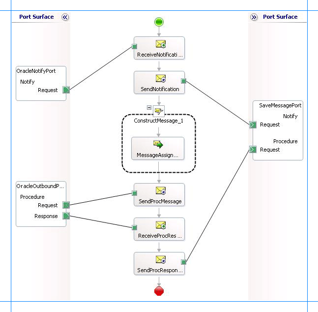

# Receive Oracle E-Business Suite change notifications incrementally using BizTalk Server
> [!IMPORTANT]
>  For the sake of brevity, this topic only describes how to receive notifications incrementally. In business scenarios, the orchestration must ideally include the logic to extract the kind of notification message received and then perform any subsequent operations. In other words, the orchestration described in this topic must be built on top of the orchestration described in [Process Notification Messages to Complete Specific Tasks in Oracle E-Business Suite](../../adapters-and-accelerators/adapter-oracle-ebs/process-notification-messages-to-complete-specific-tasks-in-oracle-ebs.md).  
  
 This topic demonstrates how to configure the [!INCLUDE[adapteroraclebusinessshort](../../includes/adapteroraclebusinessshort-md.md)] to receive incremental query notification messages from Oracle. To demonstrate incremental notifications, we consider a table, ACCOUNTACTIVITY, with a “Processed” column. When a new record is inserted to this table, the value of the “Processed” column is set to ‘n’. You can configure the adapter to receive incremental notifications by doing the following:  
  
- Register for notifications using a SELECT statement that retrieves all records that have “Processed” column as ‘n’. You can do so by specifying the SELECT statement for the **NotificationStatement** binding property.  
  
- For rows which have been notified for, update the “Processed” column to ‘y’.  
  
  This topic demonstrates how to create a BizTalk orchestration and configure a BizTalk application to achieve this.  
  
## Configuring Notifications with the Oracle E-Business Adapter Binding Properties  
 The table below summarizes the [!INCLUDE[adapteroraclebusinessshort](../../includes/adapteroraclebusinessshort-md.md)] binding properties that you use to configure receiving notifications from Oracle E-Business Suite. You must specify these binding properties while configuring the receive port in the [!INCLUDE[btsBizTalkServerNoVersion](../../includes/btsbiztalkservernoversion-md.md)] Administration console.  
  
> [!NOTE]
>  You may choose to specify these binding properties when generating the schema for the **Notification** operation, even though it is not mandatory. If you do so, the port binding file that the [!INCLUDE[consumeadapterservshort](../../includes/consumeadapterservshort-md.md)] generates as part of the metadata generation also contains the values you specify for the binding properties. You can later import this binding file in the [!INCLUDE[btsBizTalkServerNoVersion](../../includes/btsbiztalkservernoversion-md.md)] Administration console to create the WCF-custom or WCF-OracleEBS receive port with the binding properties already set. For more information about creating a receive port using the binding file, see [Configure a Physical Port Binding Using a Port Binding File to Oracle E-Business Suite](../../adapters-and-accelerators/adapter-oracle-ebs/configure-a-physical-port-binding-using-a-port-binding-file-to-oracle-ebs.md).  
  
|Binding Property|Description|  
|----------------------|-----------------|  
|**InboundOperationType**|Specifies the inbound operation that you want to perform. To receive notification messages, set this to **Notification**.|  
|**NotificationPort**|Specifies the port number that ODP.NET must open to listen for database change notification from Oracle database.|  
|**NotificationStatement**|Specifies the SELECT statement used to register for query notifications. The adapter gets a notification message only when the result set for the specified SELECT statement changes.|  
|**NotifyOnListenerStart**|Specifies whether the adapter sends a notification to the adapter clients when the listener is started.|  
  
 For a more complete description of these properties, see [Read about the BizTalk Adapter for Oracle E-Business Suite Binding Properties](../../adapters-and-accelerators/adapter-oracle-ebs/read-about-the-biztalk-adapter-for-oracle-e-business-suite-binding-properties.md). For a complete description of how to use the [!INCLUDE[adapteroraclebusinessshort](../../includes/adapteroraclebusinessshort-md.md)] to receive notifications from Oracle E-Business Suite, read further.  
  
## How This Topic Demonstrates Receiving Notification Messages  
 In this topic, to demonstrate how the [!INCLUDE[adapteroraclebusinessshort](../../includes/adapteroraclebusinessshort-md.md)] supports receiving incremental database change notification messages from Oracle E-Business Suite, we will configure the adapter to receive notifications for changes to the ACCOUNTACTIVTY table. Let us assume that the ACCOUNTACTIVITY table has columns “TID”, “Account”, and “Processed”. Whenever a new record is added, the value of the “Processed” column is set to ‘n’. So, to get incremental notifications you will have to do the following tasks as part of the BizTalk orchestration:  
  
- Get notification for all records where “Processed” is ‘n’. You can do this by specifying a SELECT statement as a notification statement.  
  
- After the notification is received for a certain record, set “Processed” to ‘y’. You can do this by executing a stored procedure, PROCESS_RECORDS, which updates the “Processed” column.  
  
  To demonstrate receiving incremental notifications, we do the following:  
  
- Generate schema for the **Notification** (inbound operation), and **PROCESS_RECORDS** (outbound operation) on the ACCOUNTACTIVITY table.  
  
- Create an orchestration that has the following:  
  
  -   A receive location to receive notification messages. You can configure for notification by specifying the SELECT statement as:  
  
      ```  
      SELECT TID,ACCOUNT,PROCESSED FROM SCOTT.ACCOUNTACTIVITY WHERE PROCESSED = ‘n’  
      ```  
  
      > [!NOTE]
      >  You must specify the table name along with the schema name. For example, `SCOTT.ACCOUNTACTIVITY`.  
  
  -   A send port to update the rows for which notification has already been sent. You will execute the PROCESS_RECORDS stored procedure on this port to set the value of “Processed” column to ‘y’ for the records for which notification is received.  
  
       Note that this operation must be executed after receiving the notification messages so that the processed rows are updated. To do away with the overhead of waiting to get the notification response and then manually dropping a request message to execute the PROCESS_RECORDS procedure, you will generate the request message for PROCESS_RECORDS procedure within the orchestration itself. You can do so by using the **Construct Message** shape within an orchestration.  
  
## How to Receive Notification Messages from Oracle E-Business Suite  
 Performing an operation on Oracle E-Business Suite using [!INCLUDE[adapteroraclebusinessshort](../../includes/adapteroraclebusinessshort-md.md)] with [!INCLUDE[btsBizTalkServerNoVersion](../../includes/btsbiztalkservernoversion-md.md)] involves the procedural tasks described in [Building Blocks to create Oracle E-Business Suite Applications](../../adapters-and-accelerators/adapter-oracle-ebs/building-blocks-to-create-oracle-e-business-suite-applications.md). To configure the adapter to receive notification messages, these tasks are:  
  
1. Create a BizTalk project, and then generate schema for the **Notification** (inbound operation) and **PROCESS_RECORDS** procedure (outbound operation) on the ACCOUNTACTIVITY table. Optionally, you can specify values for the **InboundOperationType**, **NotificationPort**, and **NotificationStatement** binding properties.  
  
2. Create a message in the BizTalk project for receiving notification from Oracle E-Business Suite.  
  
3. Create messages in the BizTalk project for executing the PROCESS_RECORDS stored procedure and receiving response messages.  
  
4. Create an orchestration that does the following:  
  
   -   Receives notification message from Oracle E-Business Suite.  
  
   -   Creates a message to execute the PROCESS_RECORDS procedure.  
  
   -   Sends this message to Oracle E-Business Suite to select and update the records and receive a response.  
  
5. Build and deploy the BizTalk project.  
  
6. Configure the BizTalk application by creating physical send and receive ports.  
  
   > [!NOTE]
   >  For inbound operations, like receiving notification messages, you must only configure a one-way WCF-Custom or WCF-OracleEBS receive port. Two-way receive ports are not supported for inbound operations.  
  
7. Start the BizTalk application.  
  
   This topic provides instructions to perform these tasks.  
  
## Generating Schema  
 You must generate the schema for the **Notification** operation and **PROCESS_RECORDS** procedure. See [Retrieving Metadata for Oracle E-Business Suite Operations in Visual Studio](../../adapters-and-accelerators/adapter-oracle-ebs/get-metadata-for-oracle-e-business-suite-operations-in-visual-studio.md) for more information about how to generate the schema. Perform the following tasks when generating the schema. Skip the first step if you do not want to specify the binding properties at design-time.  
  
1.  Specify a value for **InboundOperationType**, **NotificationPort**, and **NotificationStatement** binding properties while generating the schema. For more information about this binding property, see [Read about the BizTalk Adapter for Oracle E-Business Suite Binding Properties](../../adapters-and-accelerators/adapter-oracle-ebs/read-about-the-biztalk-adapter-for-oracle-e-business-suite-binding-properties.md). For instructions on how to specify binding properties, see [Configure the Binding Properties for Oracle E-Business Suite](../../adapters-and-accelerators/adapter-oracle-ebs/configure-the-binding-properties-for-oracle-e-business-suite.md).  
  
2.  Select the contract type as **Service (Inbound operations)**.  
  
3.  Generate schema for the **Notification** operation.  
  
4.  Select the contract type as **Client (Outbound operations)**.  
  
5.  Generate schema for the **PROCESS_RECORDS** procedure. This procedure is available under the **ACCOUNT_PKG** package.  
  
## Defining Messages and Message Types  
 The schema that you generated earlier describes the "types" required for the messages in the orchestration. A message is typically a variable, the type for which is defined by the corresponding schema. Once the schema is generated, you must link it to the messages from the Orchestration view of the BizTalk project.  
  
 For this topic, you must create three messages—one to receive notifications from the Oracle E-Business Suite, one to execute the PROCESS_RECORDS procedure, and one to receive the response for the procedure.  
  
 Perform the following steps to create messages and link them to schema.  
  
#### To create messages and link to schema  
  
1.  Add an orchestration to the BizTalk project. From the Solution Explorer, right-click the BizTalk project name, point to **Add**, and then click **New Item**. Type a name for the BizTalk orchestration and then click **Add**.  
  
2.  Open the orchestration view window of the BizTalk project, if it is not already open. Click **View**, point to **Other Windows**, and then click **Orchestration View**.  
  
3.  In the **Orchestration View**, right-click **Messages**, and then click **New Message**.  
  
4.  Right-click the newly created message, and then select **Properties Window**.  
  
5.  In the **Properties** pane for **Message_1**, do the following:  
  
    |Use this|To do this|  
    |--------------|----------------|  
    |Identifier|Type `NotifyReceive`.|  
    |Message Type|From the drop-down list, expand **Schemas**, and select *OracleNotifyIncremental.OracleEBSBinding.Notification*, where *OracleNotifyIncremental* is the name of your BizTalk project. *OracleEBSBinding* is the schema generated for the **Notification** operation.|  
  
6.  Repeat step 3 to create two new messages. In the **Properties** pane for the new message, do the following:  
  
    |Set Identifier to|Set Message Type to|  
    |-----------------------|-------------------------|  
    |Procedure|*OracleNotifyIncremental.OracleEBSBinding1.PROCESS_RECORDS*, where  *OracleEBSBinding1* is the schema generated for the **PROCESS_RECORDS** procedure.|  
    |ProcedureResponse|*OracleNotifyIncremental.OracleEBSBinding1.PROCESS_RECORDSResponse*|  
  
## Setting up the Orchestration  
 You must create a BizTalk orchestration to use [!INCLUDE[btsBizTalkServerNoVersion](../../includes/btsbiztalkservernoversion-md.md)] for receiving notification messages from Oracle E-Business Suite and then updating the rows for which notification was received. In this orchestration, the adapter receives the notification message based on the SELECT statement specified for the **NotificationStatement** binding property. The notification message is received at a FILE location. Once the response is received, the orchestration constructs a message to invoke the PROCESS_RECORDS procedure, which updates the rows for which notification is received. The response for this message is also received at the same FILE location.  
  
 So, your orchestration must contain the following:  
  
- A one-way WCF-Custom or WCF-OracleEBS receive port to receive notification messages.  
  
- A two-way WCF-Custom or WCF-OracleEBS send port to send messages to execute the PROCESS_RECORDS procedure.  
  
- A **Construct Message** shape to construct messages, to execute PROCESS_RECORDS procedure, within the orchestration.  
  
- A FILE send port to save the notification message and the response for the PROCESS_RECORDS procedure.  
  
- Receive and send shapes.  
  
  A sample orchestration resembles the following.  
  
    
  
### Adding Message Shapes  
 Make sure you specify the following properties for each of the message shapes. The names listed in the Shape column are the names of the message shapes as displayed in the just-mentioned orchestration.  
  
|Shape|Shape Type|Properties|  
|-----------|----------------|----------------|  
|ReceiveNotification|Receive|- Set **Name** to *ReceiveNotification*<br /><br /> - Set **Activate** to *True*|  
|SaveNotification|Send|- Set **Name** to *SaveNotification*|  
|SendProcMessage|Send|- Set **Name** to *SendProcMessage*|  
|ReceiveProcResponse|Receive|- Set **Name** to *ReceiveProcResponse*|  
|SaveProcResponse|Send|- Set **Name** to *SaveProcResponse*|  
  
### Adding Construct Message Shape  
 You can use the **Construct Message** shape to generate a request message within the orchestration to execute the PROCESS_RECORDS procedure. To do so, you must add a **Construct Message** shape and within that a **Message Assignment** shape to your orchestration. For this example, the **Message Assignment** shape invokes code that generates a message that is sent to Oracle E-Business Suite to execute the procedure. The **Message Assignment** shape also sets the action for the message to be sent to Oracle E-Business Suite.  
  
 For the construct message shape, set the **Message Constructed** property to **Procedure**.  
  
 The code to generate the response could be part of the same Visual Studio solution as your BizTalk project. A sample code for generating a response message looks like this.  
  
```  
namespace MessageCreator  
{  
    public class MessageCreator  
    {  
        private static XmlDocument Message;  
        private static string XmlFileLocation;  
        private static string ResponseDoc;  
  
        public static XmlDocument XMLMessageCreator()  
        {  
            XmlFileLocation = "C:\\TestLocation\\MessageIn";  
            try  
            {  
                ResponseDoc = (Directory.GetFiles(XmlFileLocation, "*.xml", SearchOption.TopDirectoryOnly))[0];  
            }  
            catch (Exception ex)  
            {  
                Console.WriteLine("Trying to get XML from: " + XmlFileLocation);  
                Console.WriteLine("EXCEPTION: " + ex.ToString());  
                throw ex;  
            }  
            //Create Message From XML  
            Message = new XmlDocument();  
            Message.PreserveWhitespace = true;  
            Message.Load(ResponseDoc);  
            return Message;  
        }   
    }  
}  
```  
  
 For the above code excerpt to be able to generate a request message, you must have an XML request message (for the PROCESS_RECORDS procedure) in the location specified for the `XmlFileLocation` variable.  
  
> [!NOTE]
>  After you build the project, MessageCreator.dll will be created in the project directory. You must add this DLL to the global assembly cache (GAC). Also, you must add the MessageCreator.dll as a reference in the BizTalk project.  
  
 Add the following expression to invoke this code from the **Message Assignment** shape and to set the action for message. To add an expression, double-click the **Message Assignment** shape to open the Expression Editor.  
  
```  
Procedure = MessageCreator.MessageCreator.XMLMessageCreator();  
Procedure(WCF.Action) = "PackageApis/SCOTT/ACCOUNT_PKG/PROCESS_RECORDS";  
```  
  
### Adding Ports  
 Make sure you specify the following properties for each of the logical ports. The names listed in the Port column are the names of the ports as displayed in the orchestration.  
  
|Port|Properties|  
|----------|----------------|  
|OracleNotifyPort|- Set **Identifier** to *OracleNotifyPort*<br /><br /> - Set **Type** to *OracleNotifyPortType*<br /><br /> - Set **Communication Pattern** to *One-Way*<br /><br /> - Set **Communication Direction** to *Receive*|  
|SaveMessagePort|- Set **Identifier** to *SaveMessagePort*<br /><br /> - Set **Type** to *SaveMessagePortType*<br /><br /> - Set **Communication Pattern** to *One-Way*<br /><br /> - Set **Communication Direction** to *Send*<br /><br /> - Create an operation *Notify*. This operation is used for notification messages.<br /><br /> - Create an operation *Procedure*. This operation is used for select response messages.|  
|OracleOutboundPort|- Set **Identifier** to *OracleOutboundPort*<br /><br /> - Set **Type** to *OracleOutboundPortType*<br /><br /> - Set **Communication Pattern** to *Request-Response*<br /><br /> - Set **Communication Direction** to *Send-Receive*|  
  
### Specify Messages for Action Shapes and Connect to Ports  
 The following table specifies the properties and their values that you should set to specify messages for action shapes and to link the messages to the ports. The names listed in the Shape column are the names of the message shapes as displayed in the orchestration mentioned earlier.  
  
|Shape|Properties|  
|-----------|----------------|  
|ReceiveNotification|- Set **Message** to *NotifyReceive*<br /><br /> - Set **Operation** to *OracleNotifyPort.Notify.Request*|  
|SaveNotification|- Set **Message** to *NotifyReceive*<br /><br /> - Set **Operation** to *SaveMessagePort.Notify.Request*|  
|SendProcMessage|- Set **Message** to *Procedure*<br /><br /> - Set **Operation** to *OracleOutboundPort.Procedure.Request*|  
|ReceiveProcResponse|- Set **Message** to *ProcedureResponse*<br /><br /> - Set **Operation** to *OracleOutboundPort.Procedure.Response*|  
|SaveProcResponse|- Set **Message** to *ProedureResponse*<br /><br /> - Set **Operation** to *SaveMessagePort.Procedure.Request*|  
  
 After you have specified these properties, the message shapes and ports are connected and your orchestration is complete.  
  
 You must now build the BizTalk solution and deploy it to a [!INCLUDE[btsBizTalkServerNoVersion](../../includes/btsbiztalkservernoversion-md.md)]. For more information, see "Building and Running Orchestrations" at [http://go.microsoft.com/fwlink/?LinkId=102359](http://go.microsoft.com/fwlink/?LinkId=102359).  
  
## Configuring the BizTalk Application  
 After you have deployed the BizTalk project, the orchestration you created earlier is listed under the **Orchestrations** pane in the [!INCLUDE[btsBizTalkServerNoVersion](../../includes/btsbiztalkservernoversion-md.md)] Administration console. You must use the [!INCLUDE[btsBizTalkServerNoVersion](../../includes/btsbiztalkservernoversion-md.md)] Administration console to configure the application. For more information about configuring an application, see "How to Configure an Application" at [http://go.microsoft.com/fwlink/?LinkID=196961](http://go.microsoft.com/fwlink/?LinkID=196961).  
  
 Configuring an application involves:  
  
- Selecting a host for the application.  
  
- Mapping the ports that you created in your orchestration to physical ports in the [!INCLUDE[btsBizTalkServerNoVersion](../../includes/btsbiztalkservernoversion-md.md)] Administration console. For this orchestration you must:  
  
  - Define a physical WCF-Custom or WCF-OracleEBS one-way receive port. This port listens for notifications coming from Oracle E-Business Suite. For information about how to create receive ports, see [Manually Configuring a Physical Port Binding to the Oracle E-Business Adapter](../../adapters-and-accelerators/adapter-oracle-ebs/manually-configure-a-physical-port-binding-to-the-oracle-e-business-adapter.md). Make sure you specify the following binding properties for the receive port.  
  
    > [!IMPORTANT]
    >  You do not need to perform this step if you specified the binding properties at design-time. In such a case, you can create a receive port, with the required binding properties set, by importing the binding file created by the [!INCLUDE[consumeadapterservshort](../../includes/consumeadapterservshort-md.md)]. For more information see [Configure a Physical Port Binding Using a Port Binding File to Oracle E-Business Suite](../../adapters-and-accelerators/adapter-oracle-ebs/configure-a-physical-port-binding-using-a-port-binding-file-to-oracle-ebs.md).  
  
    |Binding Property|Value|  
    |----------------------|-----------|  
    |**InboundOperationType**|Set this to **Notification**.|  
    |**NotificationPort**|Specifies the port number that ODP.NET must open to listen for database change notification from Oracle database. Set this to the same port number that you must have added to the Windows Firewall exceptions list. For instructions on how to add ports to Windows Firewall exceptions list, see [http://go.microsoft.com/fwlink/?LinkID=196959](http://go.microsoft.com/fwlink/?LinkID=196959).<br /><br /> **Important:** If you set this to the default value of -1, you will have to completely disable Windows Firewall to receive notification messages.|  
    |**NotificationStatement**|Set this to:<br /><br /> `SELECT TID,ACCOUNT,PROCESSED FROM SCOTT.ACCOUNTACTIVITY WHERE PROCESSED = ‘n’`<br /><br /> **Note:** You must specify the table name along with the schema name. For example, `SCOTT.ACCOUNTACTIVITY`.|  
    |**NotifyOnListenerStart**|Set this to **True**.|  
  
     For more information about the different binding properties, see [Read about the BizTalk Adapter for Oracle E-Business Suite Binding Properties](../../adapters-and-accelerators/adapter-oracle-ebs/read-about-the-biztalk-adapter-for-oracle-e-business-suite-binding-properties.md).  
  
    > [!IMPORTANT]
    >  If you are configuring notifications for an interface table, you must set the application context by specifying the requisite binding properties. For more information about setting the application context see [Set Application Context](../../adapters-and-accelerators/adapter-oracle-ebs/set-application-context.md).  
    > 
    > [!NOTE]
    >  We recommend configuring the transaction isolation level and the transaction timeout while performing inbound operations using the [!INCLUDE[adapteroraclebusinessshort](../../includes/adapteroraclebusinessshort-md.md)]. You can do so by adding the service behavior while configuring the WCF-Custom or WCF-OracleEBS receive port. For instruction on how to add the service behavior, see [Configure Transaction Isolation Level and Transaction Timeout with Oracle E-Business Suite](../../adapters-and-accelerators/adapter-oracle-ebs/configure-transaction-isolation-level-and-transaction-timeout-with-oracle-ebs.md).  
  
  - Define a physical WCF-Custom or WCF-OracleEBS send port to send messages to Oracle E-Business Suite to execute the PROCESS_REOCRDS procedure. You must also specify the action in the send port.  
  
  - Define a location on the hard disk and a corresponding file port where the BizTalk orchestration will drop the messages from Oracle E-Business Suite. These will be the notification messages received from Oracle E-Business Suite and messages for the PROCESS_RECORDS procedure you execute through the WCF-Custom or WCF-OracleEBS send port.  
  
## Starting the Application  
 You must start the BizTalk application for receiving notification messages from Oracle E-Business Suite and for executing the PROCESS_RECORDS procedure. For instructions on starting a BizTalk application, see “How to Start an Orchestration” at  [http://go.microsoft.com/fwlink/?LinkId=102387](http://go.microsoft.com/fwlink/?LinkId=102387).  
  
 At this stage, make sure:  
  
-   The WCF-Custom or WCF-OracleEBS one-way receive port, which receives the notification messages from Oracle E-Business Suite is running.  
  
-   The WCF-Custom or WCF-OracleEBS send port to execute the PROCESS_RECORDS procedure is running.  
  
-   The FILE send port, which receives messages from Oracle E-Business Suite, is running.  
  
-   The BizTalk orchestration for the operation is running.  
  
## Executing the Operation  
 Assume that the ACCOUNTACTIVITY table already has some records. Also, make sure the XML message to execute PROCESS_RECORDS procedure is available at C:\TestLocation\MessageIn. The XML file should resemble the following:  
  
```  
<PROCESS_RECORDS xmlns="http://schemas.microsoft.com/OracleEBS/2008/05/PackageApis/SCOTT/ACCOUNT_PKG" />  
```  
  
 Once the BizTalk orchestration is started, the following set of actions take place, in the same sequence:  
  
-   The adapter receives a notification message that resembles the following:  
  
    ```  
    <?xml version="1.0" encoding="utf-8" ?>   
    <Notification xmlns="http://schemas.microsoft.com/OracleEBS/2008/05/Notification/">  
      <Info>ListenerStarted</Info>   
      <Source>OracleEBSBinding</Source>   
      <Type>Startup</Type>   
    </Notification>  
    ```  
  
     This message notifies that the receive port for receiving the notification messages is started. Note that the value for the `<Info>` element is “ListnerStarted”.  
  
-   The adapter executes the PROCESS_RECORDS procedure. The next response from Oracle E-Business Suite is for the procedure.  
  
    ```  
    <?xml version="1.0" encoding="utf-8" ?>   
    <PROCESS_RECORDSResponse xmlns="http://schemas.microsoft.com/OracleEBS/2008/05/PackageApis/SCOTT/ACCOUNT_PKG">  
      <TABLE_DATA>  
        <xs:schema id="NewDataSet" xmlns:xs="http://www.w3.org/2001/XMLSchema" xmlns:msdata="urn:schemas-microsoft-com:xml-msdata">  
          <xs:element msdata:IsDataSet="true" name="NewDataSet">  
            <xs:complexType>  
              <xs:sequence>  
                <xs:element minOccurs="0" maxOccurs="unbounded" name="NewTable">  
                  <xs:complexType>  
                    <xs:sequence>  
                      <xs:element minOccurs="0" name="TID" type="xs:decimal" />   
                      <xs:element minOccurs="0" name="ACCOUNT" type="xs:decimal" />   
                      <xs:element minOccurs="0" name="PROCESSED" type="xs:string" />   
                    </xs:sequence>  
                  </xs:complexType>  
                </xs:element>  
              </xs:sequence>  
            </xs:complexType>  
          </xs:element>  
        </xs:schema>  
        <diffgr:diffgram xmlns:diffgr="urn:schemas-microsoft-com:xml-diffgram-v1">  
        <NewDataSet xmlns="">  
          <NewTable>  
            <TID>1</TID>   
            <ACCOUNT>100001</ACCOUNT>   
            <PROCESSED>n</PROCESSED>   
          </NewTable>  
          <NewTable>  
            ......  
            ......  
          </NewTable>  
          ......  
          ......  
        </NewDataSet>  
        </diffgr:diffgram>  
      </TABLE_DATA>  
    </PROCESS_RECORDSResponse>  
    ```  
  
     This is the response for the SELECT statement execute as part of the PROCESS_RECORDS procedure.  
  
-   The PROCESS_RECORDS procedure also updates the rows to set PROCESSED to ‘y’. Hence, the adapter receives another notification for the Update operation.  
  
    ```  
    <?xml version="1.0" encoding="utf-8" ?>  
    <Notification xmlns="http://schemas.microsoft.com/OracleEBS/2008/05/Notification/">  
      <Details>  
        <NotificationDetails>  
          <ResourceName>SCOTT.ACCOUNTACTIVITY</ResourceName>   
          <Info>32</Info>   
          <QueryId>0</QueryId>   
        </NotificationDetails>  
      </Details>  
      <Info>Update</Info>   
      <ResourceNames>  
        <string xmlns="http://schemas.microsoft.com/2003/10/Serialization/Arrays">SCOTT.ACCOUNTACTIVITY</string>   
      </ResourceNames>  
      <Source>Data</Source>   
      <Type>Change</Type>   
    </Notification>  
    ```  
  
     Note that the `Info` element contains “Update”.  
  
-   After the second notification, the adapter again executes the PROCESS_RECORDS procedure. However, now because there are no records where PROCESSED column is set to ‘n’, the procedure returns an empty response resembling the following.  
  
    ```  
    <?xml version="1.0" encoding="utf-8" ?>   
    <PROCESS_RECORDSResponse xmlns="http://schemas.microsoft.com/OracleEBS/2008/05/PackageApis/SCOTT/ACCOUNT_PKG">  
      <TABLE_DATA>  
        <xs:schema id="NewDataSet" xmlns:xs="http://www.w3.org/2001/XMLSchema" xmlns:msdata="urn:schemas-microsoft-com:xml-msdata">  
          <xs:element msdata:IsDataSet="true" name="NewDataSet">  
            <xs:complexType>  
              <xs:sequence>  
                <xs:element minOccurs="0" maxOccurs="unbounded" name="NewTable">  
                  <xs:complexType>  
                    <xs:sequence>  
                      <xs:element minOccurs="0" name="TID" type="xs:decimal" />   
                      <xs:element minOccurs="0" name="ACCOUNT" type="xs:decimal" />   
                      <xs:element minOccurs="0" name="PROCESSED" type="xs:string" />   
                    </xs:sequence>  
                  </xs:complexType>  
                </xs:element>  
              </xs:sequence>  
            </xs:complexType>  
          </xs:element>  
        </xs:schema>  
        <diffgr:diffgram xmlns:diffgr="urn:schemas-microsoft-com:xml-diffgram-v1">  
          <NewDataSet xmlns="" />   
        </diffgr:diffgram>  
      </TABLE_DATA>  
    </PROCESS_RECORDSResponse>  
    ```  
  
## Best Practices  
 After you have deployed and configured the BizTalk project, you can export configuration settings to an XML file called the binding file. Once you generate a binding file, you can import the configuration settings from the file, so that you do not need to create the send ports and receive ports for the same orchestration. For more information about binding files, see [Reuse Adapter Bindings with Oracle E-Business Suite](../../adapters-and-accelerators/adapter-oracle-ebs/reuse-adapter-bindings-with-oracle-e-business-suite.md).  
  
## See Also  
 [Receive Oracle E-Business Suite Database Change Notifications using BizTalk Server](../../adapters-and-accelerators/adapter-oracle-ebs/receive-oracle-ebs-database-change-notifications-using-biztalk-server.md)