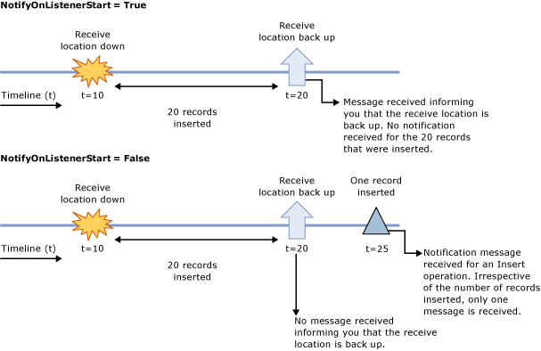

# Receive Oracle E-Business Suite database change notifications after a receive location breakdown
Consider a scenario where you have a BizTalk application that receives database change notification messages when changes are made to the ACCOUNTACTIVITY table. If the receive location configured as part of the BizTalk application breaks down, and simultaneously records are added into the ACCOUNTACTIVITY table, you will not receive notifications for the recently added records. You will also not know when the receive location is available again. The [!INCLUDE[adapteroraclebusinessshort](../../includes/adapteroraclebusinessshort-md.md)] exposes a binding property, **NotifyOnListenerStart**, that you can configure to get a notification that the receive location has recovered. You can specify the following values for the **NotifyOnListenerStart** binding property:  
  
- Set this property to **True**, to receive a notification informing that the receive location is available, as soon as the receive location recovers.  
  
- Set this property to **False**, to not receive a notification informing that the receive location is available, after the receive location recovers.  
  
  Default is **True**.  
  
## Configuring the Oracle E-Business Adapter Behavior  
 For either of the approaches, you do not need to perform any specific tasks while generating metadata or while configuring the BizTalk application. You only need to set the **NotifyOnListenerStart** binding property accordingly on the WCF-Custom or WCF-OracleEBS receive location. To create the BizTalk application, you must perform the same set of tasks as described in [Receive Oracle E-Business Suite Change Notifications Incrementally Using BizTalk Server](../../adapters-and-accelerators/adapter-oracle-ebs/receive-oracle-ebs-change-notifications-incrementally-using-biztalk-server.md). However, when configuring the BizTalk application using [!INCLUDE[btsBizTalkServerNoVersion](../../includes/btsbiztalkservernoversion-md.md)], you can try changing the value of **NotifyOnListenerStart** binding property and see the difference in the two configurations.  
  
 The following figure demonstrates how the notifications are received based on the value of the **NotifyOnListenerStart** binding property.  
  
   
  
 Note that in the first scenario, when the **NotifyOnListenerStart** is set to **True** and records are inserted into the database table while the receive location was down, the adapter only sends you a notification message when the receive location comes up. The adapter does not perform any operation to process the records that were inserted while the receive location was down. The adapter client must implement the relevant logic in their application to process the records that were inserted while the receive location was down.  
  
## See Also  
 [Receive Oracle E-Business Suite Database Change Notifications Using BizTalk Server](../../adapters-and-accelerators/adapter-oracle-ebs/receive-oracle-ebs-database-change-notifications-using-biztalk-server.md)