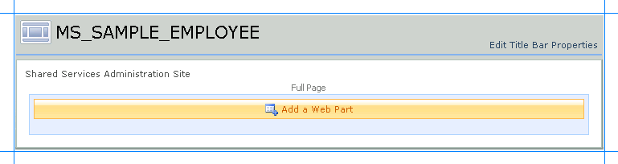
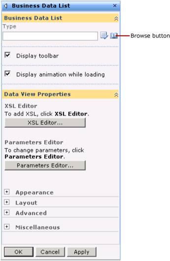
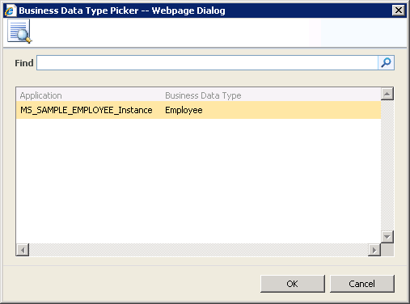
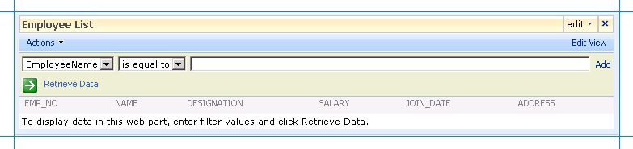

# Scenario 1: Display data using Business Data List web part
We will use the **Business Data List** Web Part for the **Finder** method instance. This Web Part enables you to specify a search expression to retrieve a list of employees from Oracle E-Business Suite. For this tutorial, this is called the Display Employees Web Part. This section provides instructions to create this Web Part. For more information about creating Web Parts, see "Customize business data lists, Web Parts, and sites" at [https://go.microsoft.com/fwlink/?LinkId=104131](/previous-versions/office/sharepoint-2007-products-and-technologies/cc263201(v=office.12)).

 You must create a Web Part page before adding the Web Parts.

## Creating a Web Part Page
 This section provides instructions to create a Web Part page.

###   To create a Web Part page

1.  Start SharePoint 3.0 Central Administration. Click **Start**, point to **All Programs**, point to **Microsoft Office Server**, and click **SharePoint 3.0 Central Administration**.

2.  In the left navigation pane, click the name of the SSP to which you want to import the application definition.

3.  On the Shared Services Administration page, in the upper-right corner, click **Site Actions**, and then click **Create**.

     

4.  On the Create page, in the **Web Pages** section, click **Web Part Page**.

5.  On the New Web Part page, do the following:

    1.  In the **Name** field, type a name for the page. For this tutorial, type the name as **MS_SAMPLE_EMPLOYEE**.

    2.  Select the **Overwrite if file already exists** check box, if you want to overwrite old pages with the same name as the new page you create.

    3.  In the **Layout** section, from the **Choose a Layout Template** box, select a layout for the Web Part page. For this tutorial, select **Full Page, Vertical**.

    4.  In the **Save Location** section, in the **Document Library** list, click **Form Templates**.

    5.  Click **Create**. The following figure shows the Web Part page after it is created.

         

    6.  You must now add the Web Parts to this page.

## Adding a Business Data List Web Part
 You must now add a Business Data List Web Part to the Web Part page. Using this Web Part you will retrieve a list of employee records from the MS_SAMPLE_EMPLOYEE interface table in Oracle E-Business Suite that matches a search expression. This Web Part corresponds to the **Finder** method instance (*Finder_Instance*) that you created in the Business Data Catalog Definition Editor.

#### To add a Business Data List Web Part

1.  On the MS_SAMPLE_EMPLOYEE page, click **Add a Web Part**.

2.  In the **Add Web Parts** dialog box, in the **Business Data** section, select the **Business Data List** check box, and then click **Add**.

     

3.  In the newly added Business Data List Web Part, click the **Open the tool pane** link.

     

4.  The Business Data List tool pane opens in the right pane. In the **Business Data List** section, for the **Type** field, click the **Browse** button.

     

5.  In the **Business Data Type Picker** dialog box, select the **MS_SAMPLE_EMPLOYEE_Instance** application, and then click **OK**.

     

6.  Expand the **Appearance** node, and in the **Title** box, type a title for the Web Part. For this Web Part, type **Employee List**.

7.  In the Business Data List tool pane, click **Apply**, and then click **OK**. The Business Data List Web Part now looks like the following:

     

8.  The Web Part lists the fields that are returned by executing the Select operation on the MS_SAMPLE_EMPLOYEE interface table.

## See Also
 [Step 3: Create a SharePoint Application to Retrieve Data from Oracle E-Business Suite](../../adapters-and-accelerators/adapter-oracle-ebs/step-3-create-a-sharepoint-application-to-retrieve-data-from-oracle-ebs.md)
 [Scenario 2: Search Using the Search Box Web Part](../../adapters-and-accelerators/adapter-oracle-ebs/scenario-2-search-using-the-search-box-web-part.md)