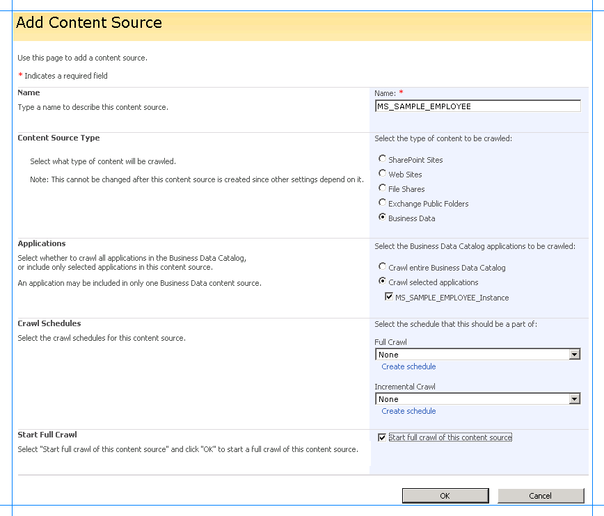
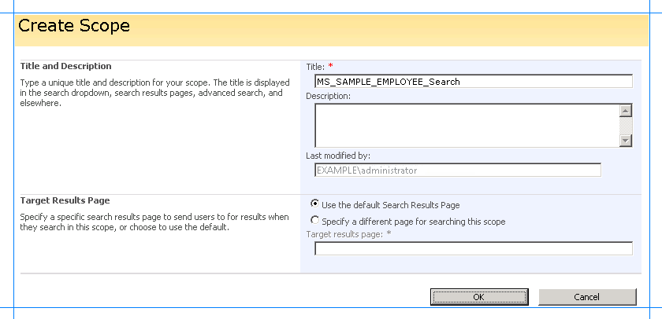
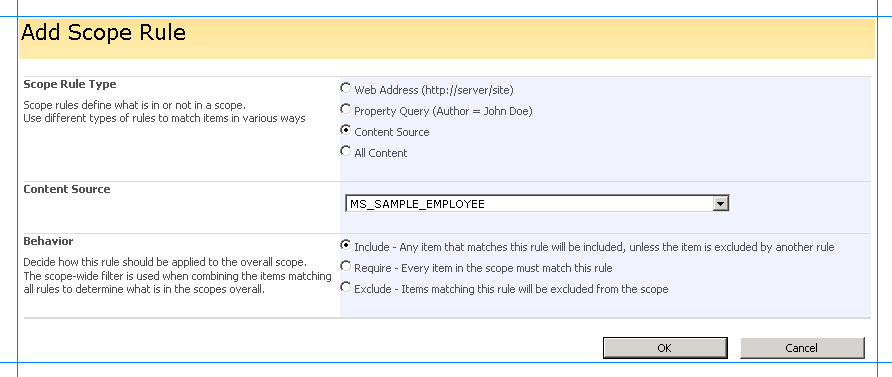
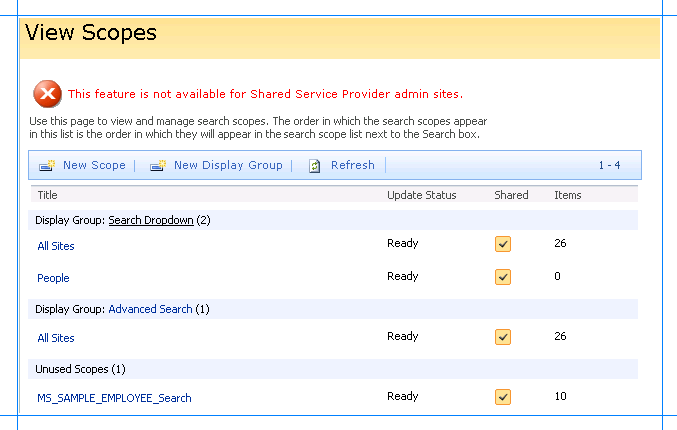
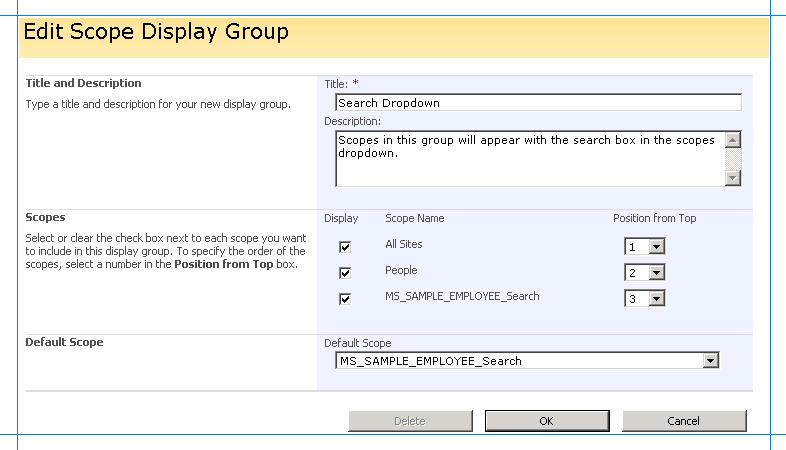
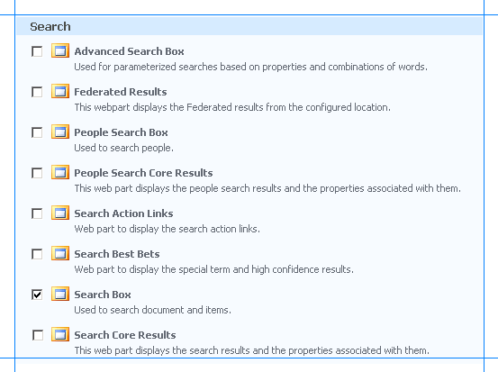
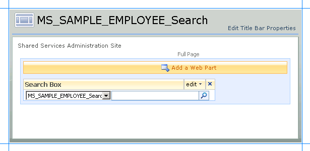

# Scenario 2:  Search using the search box web part
We will configure the search settings in Microsoft Office SharePoint Server to configure a search application using which you can perform a full text search on the MS_SAMPLE_EMPLOYEE interface table in Oracle E-Business Suite. Later, we will add a Search Box Web Part to from where you can perform the search.  
  
 
  
##   Define the Content Source  
 This section talks about defining a content source from where Microsoft Office SharePoint Server can crawl the data. This involves mapping the content to the Id Enumerator method instance created in [Step 2: Create an application definition file for the Oracle E-Business Suite artifacts](../../adapters-and-accelerators/adapter-oracle-ebs/step-2-create-an-application-definition-file-for-the-oracle-ebs-artifacts.md).  
  
#### To define a content source  
  
1.  Start SharePoint 3.0 Central Administration. Click **Start**, point to **All Programs**, point to **Microsoft Office Server**, and then click **SharePoint 3.0 Central Administration**.  
  
2.  In the left navigation pane, click the name of the Shared Service Provider (SSP) where you want to configure the search application.  
  
3.  On the Home page, in the **Search** section, click **Search settings**.  
  
4.  On the Configure Search Settings page, in the left pane under **Crawling**, click **Default content access account** to specify an account to use as the default account when crawling content.  
  
5.  On the Default Content Access Account page, specify the user name and password credentials, and click **OK**. You will return to the Search Administration page.  
  
6.  In the left pane under **Crawling**, click **Content Sources**.  
  
7.  On the Manage Content Sources page, click **New Content Source**.  
  
8.  On the Manage Content Sources page, click **New Content Source**.  
  
9. On the Add Content Source page:  
  
    1.  Type `MS_SAMPLE_EMPLOYEE` in the **Name** box.  
  
    2.  In the **Content Source Type** area, click **Business Data**.  
  
    3.  In the **Applications** area, click **Crawl selected applications**, and then select the **MS_SAMPLE_EMPLOYEE_Instance** check box.  
  
    4.  In the **Start Full Crawl** area, select the **Start full crawl of this content source** check box, and then click **OK**.  
  
           
  
10. You will return to the Manage Content Sources page with the new content source added. The content source will crawl through the data in the MS_SAMPLE_EMPLOYEE interface table in the Oracle E-Business Suite. Wait until the crawling is completed.  
  
11. In the left pane under **Crawling**, click **Crawl Log**, and then verify the log file to ensure that the crawling is successful.  
  
##   Define a Scope for the Crawled Content  
  
1. Start SharePoint 3.0 Central Administration. Click **Start**, point to **All Programs**, point to **Microsoft Office Server**, and then click **SharePoint 3.0 Central Administration**.  
  
2. In the left navigation pane, click the name of the Shared Service Provider (SSP) where you want to configure the search application.  
  
3. On the Home page, in the **Search** section, click **Search settings**.  
  
4. On the Configure Search Settings page, in the left pane under **Queries and Results**, click **Scopes** to define a scope for the crawling of data.  
  
5. On the View Scopes page, click **New Scope**.  
  
6. On the Create Scope page, type `MS_SAMPLE_EMPLOYEE_Search` in the **Title** box, and then click **OK**.  
  
      
  
7. You will return to the View Scopes page with the new scope added. In the **Update Status** column for the newly added scope, click the **Add rules** link.  
  
8. On the Add Scope Rule page:  
  
   1.  In the **Scope Rule Type** area, click **Content Source**.  
  
   2.  In the **Content Source** list, click **MS_SAMPLE_EMPLOYEE**, and then click **OK**.  
  
          
  
9. You will return to the View Scopes page with the rule added for the scope. In the left pane, click **Search Administration**.  
  
10. On the Search Administration page, locate the **Scopes needing update** row, and click the **Start update now** link.  
  
    The **Scope update status** row will display the status of the scope update. Wait until the update is complete. After the updated is completed, the scope is ready to be used.  
  
##   Add the Scope to the Search Dropdown  
 After you have created the search scope, you must add the scope to the search dropdown in Microsoft Office SharePoint Server so that it can be used.  
  
#### To add the scope to the search dropdown  
  
1.  Start SharePoint 3.0 Central Administration. Click **Start**, point to **All Programs**, point to **Microsoft Office Server**, and then click **SharePoint 3.0 Central Administration**.  
  
2.  In the left navigation pane, click the name of the Shared Service Provider (SSP) where you want to configure the search application.  
  
3.  On the Shared Services Administration page, in the upper-right corner, click **Site Actions**, and then click **Site Settings**.  
  
4.  On the Site Settings page, in the **Site Collection Administration** section, click **Search scopes**.  
  
5.  On the View Scopes page, click the **Search Dropdown** link.  
  
       
  
6.  On the Edit Scope Display Group page:  
  
    1.  In the **Scopes** area, select the **MS_SAMPLE_EMPLOYEE_Search** check box.  
  
    2.  In the **Default Scope** area, click **MS_SAMPLE_EMPLOYEE_Search** in the **Default Scope** list, and then click **OK**.  
  
           
  
7.  You will return to the View Scopes page with the MS_SAMPLE_EMPLOYEE_Search scope added in the Search Dropdown display group.  
  
##   Add the Search Box Web Part  
 To enable the users to perform a full-text search on the MS_SAMPLE_EMPLOYEE interface table in Oracle E-Business Suite, you must now create a Web part page, and add a Search Box Web Part to it.  
  
#### To add the Search Box Web Part  
  
1.  Create a Web Part page called **MS_SAMPLE_EMPLOYEE_Search**. To know the steps for creating a Web Part page, see [Scenario 1: Display data using Business Data List web part](../../adapters-and-accelerators/adapter-oracle-ebs/scenario-1-display-data-using-business-data-list-web-part.md) in [Scenario 1: Display data using Business Data List web part](../../adapters-and-accelerators/adapter-oracle-ebs/scenario-1-display-data-using-business-data-list-web-part.md).  
  
2.  On the MS_SAMPLE_EMPLOYEE_Search page, click **Add a Web Part**.  
  
3.  In the **Add Web Parts** dialog box, in the **Search** section, select the **Search Box** check box, and then click **Add**.  
  
       
  
4.  The Search Box Web part is added to the MS_SAMPLE_EMPLOYEE_Search page.  
  
       
  
## See Also  
 [Step 3: Create a SharePoint application to retrieve data from Oracle E-Business Suite](../../adapters-and-accelerators/adapter-oracle-ebs/step-3-create-a-sharepoint-application-to-retrieve-data-from-oracle-ebs.md)  
 [Scenario 1: Display data using Business Data List web part](../../adapters-and-accelerators/adapter-oracle-ebs/scenario-1-display-data-using-business-data-list-web-part.md)