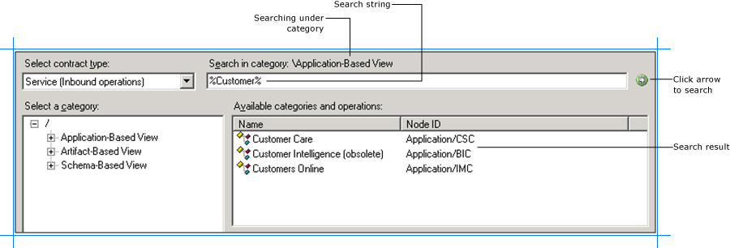

# Search for Oracle E-Business Suite operations
You can use the [!INCLUDE[consumeadapterservshort](../../includes/consumeadapterservshort-md.md)] or the [!INCLUDE[addadapterservrefshort](../../includes/addadapterservrefshort-md.md)] to search for specific artifacts in the Oracle E-Business Suite. This topic provides information on how the search is supported for different views and what wildcard characters can be used for searching Oracle artifacts. This topic also provides information on how to search using the [!INCLUDE[consumeadapterservshort](../../includes/consumeadapterservshort-md.md)] or [!INCLUDE[addadapterservrefshort](../../includes/addadapterservrefshort-md.md)].  

  
> [!NOTE]
>  The [!INCLUDE[consumeadapterservshort](../../includes/consumeadapterservshort-md.md)] and the [!INCLUDE[addadapterservrefshort](../../includes/addadapterservrefshort-md.md)] present essentially the same interface when you browse and search for operations, so both components are covered in the same topics.  
  
 For more information see [Use the Oracle E-Business Suite adapter with SharePoint](../../adapters-and-accelerators/adapter-oracle-ebs/use-the-oracle-e-business-suite-adapter-with-sharepoint.md).  
  
## Prerequisites  
 You must connect to the Oracle E-Business Suite before you can search metadata for target operations. For information about how to connect to the Oracle database when you use the [!INCLUDE[consumeadapterservshort](../../includes/consumeadapterservshort-md.md)] or the [!INCLUDE[addadapterservrefshort](../../includes/addadapterservrefshort-md.md)], see [Connect to the Oracle E-Business Suite in Visual Studio](../../adapters-and-accelerators/adapter-oracle-ebs/connect-to-the-oracle-e-business-suite-in-visual-studio.md).  
  
## Support for Wildcard Characters  
 When searching Oracle E-Business Suite metadata using the [!INCLUDE[consumeadapterservshort](../../includes/consumeadapterservshort-md.md)] or the [!INCLUDE[addadapterservrefshort](../../includes/addadapterservrefshort-md.md)], the [!INCLUDE[adapteroraclebusinessshort](../../includes/adapteroraclebusinessshort-md.md)] supports wildcard and escape characters in the search expression.  
  
|Special character|Interpretation|  
|-----------------------|--------------------|  
|_ (underscore)|Matches exactly one character   For example, A_ matches AB, AC, AD.|  
|% (percentage)|Matches zero or more characters.   For example, A% matches A, AB, ABC.|  
|\ (escape)|Escapes the special meaning of % and _   For example, A\\_B matches A_B.|  
  
> [!NOTE]
>  Escape character is a character that is put before a wildcard character to indicate that the wildcard should be interpreted as a regular character and not as a wildcard.  
  
## Searching Under Different Views  
 The [!INCLUDE[consumeadapterservshort](../../includes/consumeadapterservshort-md.md)] and the [!INCLUDE[addadapterservrefshort](../../includes/addadapterservrefshort-md.md)] categorizes data into three views—application-based view, artifact-based view, and schema-based view. One of the reasons to categorize the artifacts under these three views is to facilitate search based on what you are searching for. The following table describes how search can differ across these views.  
  
|View|How to search|  
|----------|-------------------|  
|**Application-based view**|This view is categorized by the Oracle E-Business Suite application names. You must use this view when you know which application contains the artifacts you want to work with.   Users using this view will be familiar with the Oracle applications and are aware what application they want to use. Hence, the search under this view is supported only at the immediate level. For example, if the **Application-Based View** node is selected, users can search for an application in the Oracle E-Business Suite. Similarly, if the **Interface Table** node is selected, users can search for an interface table in an Oracle E-Business application.|  
|**Artifact-based view**|This view is categorized by the Oracle E-Business Suite artifacts. When working with Oracle E-Business Suite application artifacts, users must use this view when they know which Oracle E-Business Suite artifact they want to work with but are not sure which application the artifact belongs to.   Using this view, users can search for a specific artifact across all Oracle E-Business Suite applications. For example, users can select the **Interface Tables** node and search using the string `AR%`. This is how search will be performed:   -   Because the interface tables are further categorized under applications, all the applications start with AR will be listed. -   All the interface tables starting with AR will be listed. These tables can belong to any Oracle E-Business suite application.   When working with Oracle database artifacts using this view, users can search for a specific artifact either under the current schema with which you log in or all schemas. For example, if users want to use a procedure CREATE_ACCOUNT but are not aware which schema the procedure belongs to, they can select the **All Schemas** node and then search using the string `CREATE%`.|  
|**Schema-based view**|This view is categorized by the schemas available in the underlying Oracle database. You must use this view when you know which schema has the artifacts you want to work with.   Users using this view will be familiar with the schema that has the artifact they want to work with. Hence, the search under this view is supported only at the immediate level. For example, if the **Schema-Based View** node is selected, users can search for a schema in the Oracle database. Similarly, if the **Table** node is selected, users can search for a table in an Oracle E-Business application.|  
  
## Searching for Operations  
 To search metadata in Oracle E-Business Suite using the [!INCLUDE[consumeadapterservshort](../../includes/consumeadapterservshort-md.md)], perform the following steps.  
  
#### To search metadata in Oracle E-Business Suite  
  
1. Connect to Oracle E-Business Suite using the [!INCLUDE[consumeadapterservshort](../../includes/consumeadapterservshort-md.md)] or the [!INCLUDE[addadapterservrefshort](../../includes/addadapterservrefshort-md.md)]. See [Connect to the Oracle E-Business Suite in Visual Studio](../../adapters-and-accelerators/adapter-oracle-ebs/connect-to-the-oracle-e-business-suite-in-visual-studio.md) for instructions.  
  
2. From the **Select contract type** list, select the type of contract based on whether you are searching for inbound or outbound operations.  
  
3. In the **Select a category** box, click the category node under which you want to search for a specific artifact. For example, to search for an Oracle application, click the **Application-Based View** node.  
  
   > [!NOTE]
   >  To search for an application you can specify the friendly name or the short name of the application. For example, to search for the **Receivables** application you can specify the search string as either `Receive%` or `AR`. AR is the application short name.  
  
4. In the **Search in category** box, type a search expression to search for a specific artifact. For example, to search for Oracle applications that has "Customer" in their name, type `%Customer%`.  
  
   > [!NOTE]
   >  The search string is case-sensitive.  
  
5. To start the search, click the button with the right-arrow icon. After the search is complete, the **Available categories and operations** box lists the artifacts that satisfy the search criteria.  
  
    The following figure shows the Oracle applications tables that contain “Customer” in their name.  
  
      
  
   > [!NOTE]
   >  To search for a concurrent program you can specify the friendly name or the actual name of the concurrent program. For example, to search for the **Customer Interface** concurrent program you can specify the search string as either `%Customer Interface%` or `%RACUST%`. RACUST is the actual name of the concurrent program.  
   >   
   >  Also, the search result will always contain the standard concurrent programs irrespective of whether their name matches with the specified search string.  
  
## See Also  
 [Browse, search, and get metadata for Oracle E-Business Suite operations](../../adapters-and-accelerators/adapter-oracle-ebs/browse-search-and-get-metadata-for-oracle-e-business-suite-operations.md)