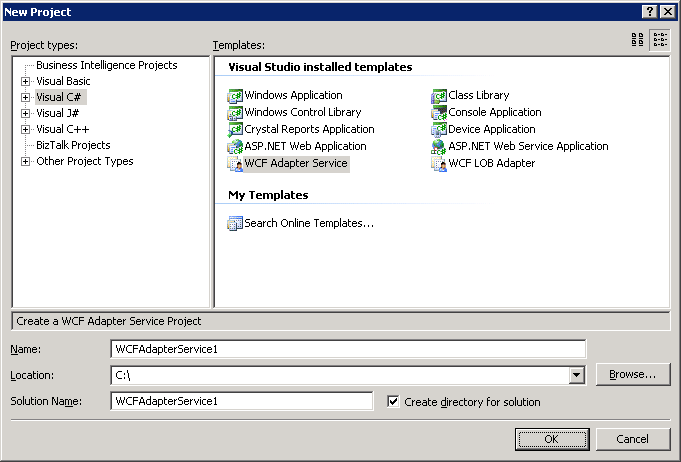
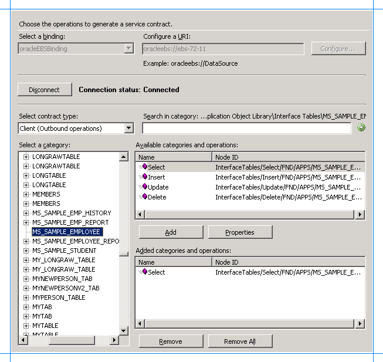
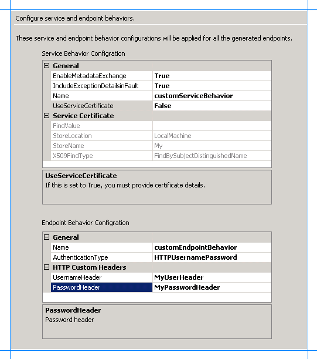
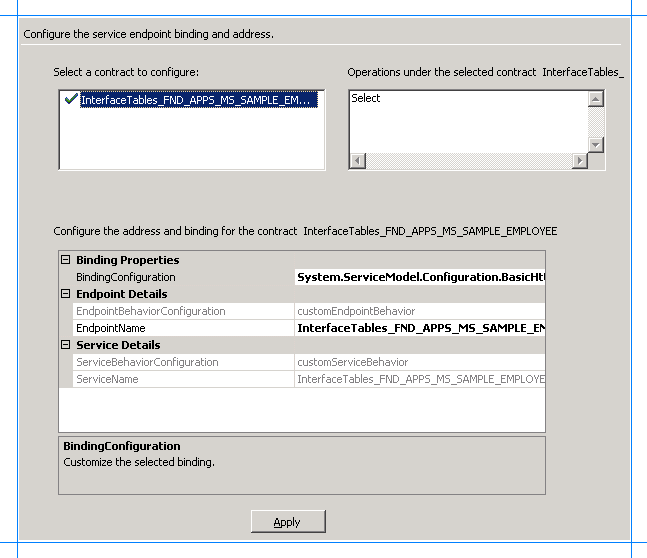

# Step 1: Use the Oracle E-Business Adapter to create and publish a WCF service
  
  
 **Time to complete:** 15 minutes  
  
 **Objective:** You can use the [!INCLUDE[afsvcdevwizlong](../../includes/afsvcdevwizlong-md.md)] to generate a WCF service from the Oracle E-Business Suite artifacts that can be hosted in a hosting environment such as Internet Information Services (IIS) or Windows Process Activation Service (WAS). This topic demonstrates how to use the wizard to generate a WCF service file.  
  
## Prerequisites  
 Before running the wizard, install the following:  
  
- [!INCLUDE[afproductnamelong](../../includes/afproductnamelong-md.md)] either with the **Complete** option or the **Custom** option (and choosing **Tools** within this option). This installs the [!INCLUDE[btsVStudioNoVersion](../../includes/btsvstudionoversion-md.md)] template for the [!INCLUDE[afsvcdevwizshort](../../includes/afsvcdevwizshort-md.md)].  
  
- [!INCLUDE[adapteroracleebusinesslong](../../includes/adapteroracleebusinesslong-md.md)] from the [!INCLUDE[adapterpacknoversion](../../includes/adapterpacknoversion-md.md)].  
  
  For more information about these prerequisites, see the [!INCLUDE[adapterpacknoversion](../../includes/adapterpacknoversion-md.md)] installation guide. The installation guide is typically installed at \<installation drive\>:\Program Files\Microsoft [!INCLUDE[adapterpacknoversion](../../includes/adapterpacknoversion-md.md)]\Documents.  
  
> [!NOTE]
>  You must also run the create_apps_artifacts.sql script provided with the Microsoft Office SharePoint Server sample to create the **MS_SAMPLE_EMPLOYEE** interface table in the **Application Object Library** application. This interface table is used in this tutorial.  
  

  
##  <a name="Create_Service"></a> Create a WCF Service for the Operation on Oracle E-Business Artifact  
 This section provides the steps to create a WCF service for the Select operation on the MS_SAMPLE EMPLOYEE Interface Table.  
  
#### To Create a WCF Service for the Select Operation on the MS_SAMPLE EMPLOYEE Interface Table  
  
1. Start [!INCLUDE[btsVStudioNoVersion](../../includes/btsvstudionoversion-md.md)], and then create a project.  
  
2. In the **New Project** dialog box, from the **Project types** pane, select **Visual C#**. From the **Templates** pane, select **WCF Adapter Service**.  
  
    Alternatively, from the **Project types** pane, expand **Visual C#**, and then select **Web**. From the **Templates** pane, select **WCF Adapter Service**.  
  
      
  
   > [!NOTE]
   >  If you installed [!INCLUDE[btsVStudio2008](../../includes/btsvstudio2008-md.md)] with the Web Development component, the **WCF Adapter Service** template is also available from the **New Web Site** option (**File** > **New** > **Web Site**).  
   > 
   >  However, the [!INCLUDE[adapteroraclebusinessshort](../../includes/adapteroraclebusinessshort-md.md)] only supports Web sites that are created on the file system. Therefore, while creating a Web site in the New Web Site dialog box, you must click File System in the Location list.  
  
3. Specify a name and location for the solution, and then click **OK**. The WCF [!INCLUDE[afsvcdevwizshort](../../includes/afsvcdevwizshort-md.md)] starts.  
  
4. On the Welcome page, click **Next**.  
  
5. On the Choose Operations page, specify a connection string to connect to Oracle E-Business Suite. To do so:  
  
   1. In the **Select a binding** list, click **oracleEBSBinding**, and then click **Configure**.  
  
   2. In the **Configure Adapter** dialog box, click the **Binding Properties** tab.  
  
      1.  Under the **General** category, for the **ClientCredentialType** binding property, select **EBusiness**.  
  
      2.  Under the **OracleEBS** category, specify appropriate values for the **OracleUserName**, **OraclePassword**, and **OracleEBSResponsibilityName** binding properties. In this case, you need to provide database credentials for the **OracleUserName** and **OraclePassword** binding properties.  
  
      3.  Under the **Metadata** category, for the **EnableSafeTyping** binding property, select **True**. If you are retrieving values for the date column, we recommend that you set the **EnableSafeTyping** binding property to **True** when generating the metadata.  
  
   3. Click the **URI Properties** tab, and then specify values for the connection parameters. For more information about the connection URI for the [!INCLUDE[adapteroraclebusinessshort](../../includes/adapteroraclebusinessshort-md.md)], see [Create the Oracle E-Business Suite Connection URI](../../adapters-and-accelerators/adapter-oracle-ebs/create-the-oracle-e-business-suite-connection-uri.md).  
  
   4. Click the **Security** tab, and in the **Client credential type** list, select **Username**. Specify a valid Oracle E-Business Suite user name and password to connect to Oracle E-Business Suite.  
  
   5. Click **OK** to close the Configure Adapter dialog box, and then click **Connect**. After Visual Studio successfully establishes a connection with Oracle E-Business Suite, the connection status is shown as **Connected**. You can also see the Oracle E-Business Suite metadata being displayed on the Choose Operations page.  
  
6. On the Choose Operations page, in the **Select contract type** list, click **Client (Outbound operations)**.  
  
7. In the **Select a category** box, browse to the MS_SAMPLE_EMPLOYEE interface table in Application Object library application. For information about browsing to an artifact in the adapter, see [Browse, Search, and Retrieve Metadata for Oracle E-Business Operations](../../adapters-and-accelerators/adapter-oracle-ebs/browse-search-and-get-metadata-for-oracle-e-business-suite-operations.md).  
  
8. In the **Available categories and operations** box, select the **Select** operation, and then click **Add**. The Select operation is added to the **Added categories and operations** box.  
  
      
  
   > [!NOTE]
   >  You can add more than one operation for each artifact. You can also add operations for different Oracle E-Business Suite artifacts. For example, you can add one operation for an interface table and another for a concurrent program. In addition, you can search for specific operations by specifying wildcard characters in search expressions. For more information about the supported special characters and the node levels at which you can search for the operations, see [Search for Oracle E-Business Suite operations](../../adapters-and-accelerators/adapter-oracle-ebs/search-for-oracle-e-business-suite-operations.md).  
  
9. On the Choose Operations page, click **Next**.  
  
10. On the Configure Service and Endpoint Behaviors page, specify values to configure the service and endpoint behavior.  
  
    1. In the **Service Behavior Configuration** box, specify values for the following:  
  
       |For the property|Specify the value|  
       |----------------------|-----------------------|  
       |EnableMetadataExchange|Set this to **True** to create a metadata exchange endpoint. By setting this to **True**, you make the service metadata available using standardized protocols, such as WS-Metadata Exchange (MEX) and HTTP/GET requests. Default is **False**.|  
       |IncludeExceptionDetailsinFault|Set this to **True** to include managed exception information in detail of SOAP faults returned to the client for debugging purposes. Default is **False**.|  
       |Name|Name for the service behavior configuration. For this tutorial, type **customServiceBehavior**.|  
       |UseServiceCertificate|Specifies whether you want to use the message level security mode of WCF. Default is **True**. For this tutorial, you must set this to **False**.|  
  
       > [!NOTE]
       >  Because we are not using service certificates for this tutorial, you do not need to provide values for the **FindValue**, **StoreLocation**, **StoreName**, and **X509FindType** properties. For more information about the certificates and the associated properties, see "X509ClientCertificateCredentialsElement Properties" at [http://go.microsoft.com/fwlink/?LinkId=103771](http://go.microsoft.com/fwlink/?LinkId=103771).  
  
    2. In the **Endpoint Behavior Configuration** box, specify values for the following:  
  
       |For the property|Specify the value|  
       |----------------------|-----------------------|  
       |Authentication Type|For Microsoft Office SharePoint Server to consume the WCF service, you should set this as **HTTPUserNamePassword**. This enables clients to specify user name and password as part of the HTTP header.|  
       |Name|Specify a name for the endpoint behavior configuration. For this tutorial, type **customEndpointBehavior**.|  
       |UsernameHeader|Name for the user name header. For this example, specify **MyUserHeader**. For more information about HTTP headers, see "Support for Custom HTTP and SOAP Headers" at [http://go.microsoft.com/fwlink/?LinkId=106692](http://go.microsoft.com/fwlink/?LinkId=106692). **Note:**  You must specify a value for this property if the **Authentication Type** is set to **HTTPUserNamePassword**. If **Authentication Type** is set to **Auto**, this property is optional.|  
       |PasswordHeader|Name for the password header. For this example, specify **MyPassHeader**. For more information about HTTP headers, see "Support for Custom HTTP and SOAP Headers" at [http://go.microsoft.com/fwlink/?LinkId=106692](http://go.microsoft.com/fwlink/?LinkId=106692). **Note:**  You must specify a value for this property if the **Authentication Type** is set to **HTTPUserNamePassword**. If **Authentication Type** is set to **Auto**, this property is optional.|  
  
       The following figure shows the Configure Service and Endpoint Behaviors page with the specified values.  
  
         
  
11. On the Configure Service and Endpoint Behaviors page, click **Next**.  
  
12. On the Configure Service Endpoint Binding and Address page, the **Select a contract to configure** displays the artifact (MS_SAMPLE_EMPLOYEE) that you configured. The **Operations under the selected contract** box displays the **Select** operation you selected for the artifact on the Choose Operations page.  
  
13. In the **Configure the address and binding for the contract** box, specify values for the following:  
  
    |For the property|Specify the value|  
    |----------------------|-----------------------|  
    |Binding Configuration|The wizard only supports basic HTTP binding. So, the binding configuration field is automatically populated to *System.ServiceModel.Configuration.BasicHttpBindingElement*.<br /><br /> Click the ellipsis button **(…)** to change the properties for HTTP binding. To use a secure communication channel, you must always set the **Mode** property to **Transport**. The wizard sets the default value for the **Mode** property as **Transport**.<br /><br /> For more information about the other bindings exposed, see "BasicHttpBindingElement Members" at [http://go.microsoft.com/fwlink/?LinkId=103773](http://go.microsoft.com/fwlink/?LinkId=103773).|  
    |Endpoint Name|Specify an endpoint name for the contract.|  
  
     The other fields on this page are automatically populated based on the values you specified in the earlier pages.  
  
     Click **Apply**.  
  
    > [!NOTE]
    >  If you do not specify any values on this page, the default values are accepted for all the contracts.  
  
     The following figure shows the Configure Service Endpoint Binding and Address page with the specified values.  
  
       
  
14. On the Configure Service Endpoint Binding and Address page, click **Next**.  The Summary page lists a tree structure of the Oracle E-Business Suite artifact and the operation selected for the artifact.  
  
15. Review the summary, and then click **Finish**.  
  
16. The wizard creates a WCF service and adds the following files to the [!INCLUDE[btsVStudioNoVersion](../../includes/btsvstudionoversion-md.md)] project:  
  
    1.  .svc file. This is the WCF service file. The wizard generates one file for each contract.  
  
    2.  Web.config file.  
  
    3.  Service code (.cs file)  
  
##  <a name="cs"></a> Modify the .cs file  
 When you create a service out of an Oracle E-Business Suite artifact using the [!INCLUDE[adapteroraclebusinessshort](../../includes/adapteroraclebusinessshort-md.md)] and want to use it from the Business Data List Web Part in Microsoft Office SharePoint Server, you are expected to provide the full filter clause starting with the WHERE clause. For example, if you want to search for an employee who name is “John”, you need to provide the following filter clause in the Business Data List Web Part:  
  
```  
where NAME like ‘JOHN’  
```  
  
 However, if you want the user to only provide the name as an input for the filter clause without actually mentioning the whole filter clause, you can add a code in the .cs file that modifies the filter clause coming in from the Business Data List Web Part in Microsoft Office SharePoint Server to pass it to Oracle E-Business in the WHERE clause format.  
  
 For example, in the case of this tutorial, if you want the user to enter an employee name in Business Data List Web Part in Microsoft Office SharePoint Server and retrieve record for that employee, you can add the following code in the .cs file:  
  
```  
SelectResponse InterfaceTables_FND_APPS_MS_SAMPLE_EMPLOYEE.Select(SelectRequest request)   
{  
     request.FILTER = "where NAME like '" + request.FILTER + "'"; // The code to avoid the users from specifying the WHERE clause in the filter from Business Data List Web Part.  
     return base.Channel.Select(request);  
}  
```  
  
##  <a name="Publish"></a> Publish the WCF Service  
 Make sure that SSL is enabled for IIS. For instructions on how to enable SSL for IIS, see [http://go.microsoft.com/fwlink/?LinkId=197170](http://go.microsoft.com/fwlink/?LinkId=197170).  
  
 To publish the WCF service:  
  
1.  Right-click the project in Solution Explorer, and then click **Publish**.  
  
2.  In the **Publish Web** dialog box, specify a URL for the WCF service. For example:  
  
    ```  
    https://<COMPUTER_NAME>:<PORT_NUMBER>/MS_SAMPLE_EMPLOYEE/  
    ```  
  
    > [!NOTE]
    >  You must publish the WCF service to a SSL-enabled location. In other words, the value in the **Target Location** box must start with “https://”. Because the user credentials are passed in the HTTP header, the wizard automatically configured the adapter’s binding behavior to use “Transport” as the security mode, which implies SSL encryption. You can of course go back, and edit the web.config file to change the value of the **\<security mode\>** parameter, but using SSL is always a better option when you have sensitive information transported in clear text in the HTTP header.  
  
3.  From the **Copy** box, click **All project files**.  
  
4.  Click **Publish**.  
  
5.  Verify that the WCF service is published successfully.  
  
    1.  Start the IIS Microsoft Management Console. Click **Start**, point to **Administrative Tools**, and then click **Internet Information Services (IIS) Manager**.  
  
    2.  Navigate to the node where you published the service. For the **MS_SAMPLE_EMPLOYEE** service, navigate to **Internet Information Services** > **\<Computer Name\>** > **Web Sites** > **Default Web Site** > **MS_SAMPLE_EMPLOYEE**.  
  
    3.  On the right pane, right-click the InterfaceTables_FND_APPS_MS_SAMPLE_EMPLOYEE.svc file, and then click **Browse**.  
  
    4.  The Web page shows up with the URL for retrieving the WSDL. You may want to test metadata retrieval using the **svcutil** command. For example, the command to retrieve metadata for the MS_SAMPLE_EMPLOYEE service is:  
  
        ```  
        svcutil.exe https://<COMPUTER_NAME>:<PORT_NUMBER>/MS_SAMPLE_EMPLOYEE/InterfaceTables_FND_APPS_MS_SAMPLE_EMPLOYEE.svc?wsdl  
  
        ```  
  
## Next Step  
 To create an application definition file for the Oracle E-Business Suite artifact, use the Business Data Catalog Definition Editor. For instructions, see [Step 2: Create an Application Definition File for the Oracle E-Business Suite Artifacts](../../adapters-and-accelerators/adapter-oracle-ebs/step-2-create-an-application-definition-file-for-the-oracle-ebs-artifacts.md). The application definition file identifies where the LOB data is stored and the format in which it is stored.  
  
## See Also  
 [Tutorial: Present Data from Oracle E-Business Suite on a SharePoint Site](Tutorial:%20Present%20data%20from%20Oracle%20E-Business%20Suite%20on%20a%20SharePoint%20Site.md)