# Step 2: Create an application definition file for the Oracle E-Business Suite artifacts
  
  
 **Time to complete:** 15 minutes  
  
 **Objective:** The Business Data Catalog feature in Microsoft SharePoint Server exposes and incorporates data from line-of-business (LOB) applications into portals. To incorporate this data into your portal site, you must build an application definition file that Microsoft Office SharePoint Server can consume.  
  
 The Business Data Catalog Definition Editor tool, available with Microsoft Office SharePoint Server 2007 SDK, enables you to create an application definition file for the Business Data Catalog. This tool automatically generates an XML file for the definition file, so you do not need to manually create the file in an XML editor.  
  
 The purpose of the Microsoft Office SharePoint Server application that you are creating is to:  
  
- Query for an employee in the MS_SAMPLE_EMPLOYEE interface table using a Business Data List Web Part based on an employee name.  
  
- Perform a full-text search from Microsoft Office SharePoint Server on the MS_SAMPLE_EMPLOYEE interface table.  
  
  For each of these requirements, you must complete a set of tasks in the Business Data Catalog Definition Editor tool. This topic provides instructions on how to perform these tasks.  
  
## Prerequisites  
  
-   Be sure that you have the Business Data Catalog Definition Editor installed as part of the Microsoft Office SharePoint Server 2007 SDK. You can download the SDK from [http://go.microsoft.com/fwlink/?LinkId=104130](http://go.microsoft.com/fwlink/?LinkId=104130).  
  
-   Publish the WCF service as described in [Step 1: Use the Oracle E-Business Adapter to Create and Publish a WCF Service](../../adapters-and-accelerators/adapter-oracle-ebs/step-1-use-the-oracle-e-business-adapter-to-create-and-publish-a-wcf-service.md).  
  

  
##  <a name="Connect"></a> Connect to the WCF LOB Service and Create Entity  
 You must connect to the WCF service to extract the Web Services Description Language (WSDL) for the service. From the WSDL, the Business Data Catalog Definition Editor extracts the methods. These methods can be used to create entities. For this tutorial, an entity is created.  
  
#### To connect to the WCF service and create entities  
  
1.  Start the Business Data Catalog Definition Editor. On the **Start** menu, click **Microsoft Business Data Catalog Definition Editor**.  
  
2.  On the toolbar, click **Add LOB System**.  
  
3.  In the Add LOB System window, click **Connect to Webservice**.  
  
4.  In the **URL** box, type the URL for the WCF service. For this tutorial, the URL will be:  
  
    ```  
    https://<COMPUTER_NAME>:<PORT_NUMBER>/MS_SAMPLE_EMPLOYEE/InterfaceTables_FND_APPS_MS_SAMPLE_EMPLOYEE.svc  
    ```  
  
     The URL is available when you test whether the WCF service is published successfully, as described in [Step 1: Use the Oracle E-Business Adapter to Create and Publish a WCF Service](../../adapters-and-accelerators/adapter-oracle-ebs/step-1-use-the-oracle-e-business-adapter-to-create-and-publish-a-wcf-service.md).  
  
5.  Click **Connect**.  
  
6.  To see the operations you selected in the WCF Adapter Service Development Wizard, click the **Add Web Method** tab. You will see the following method: **Select**.  
  
7.  Drag the **Select** methods to the Design Surface. As you drag the method to the Design Surface, an entity is created, and the method becomes part of that entity.  
  
     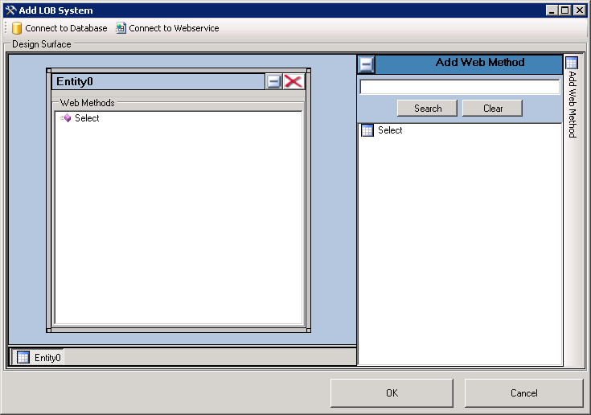  
  
8.  Click **OK**.  
  
9. In the **Enter the name for the LOB System** dialog box, type a name in the **LOB System Name** box. For this example, call it **MS_SAMPLE_EMPLOYEE**, and then click **OK**.  
  
10. In the Business Data Catalog Definition Editor, the newly created entity is listed as **Entity0**. Rename the entity to **Employee**. Perform the following steps to rename the entity:  
  
    1.  Expand the **MS_SAMPLE_EMPLOYEE** node, and then expand the **Entities** node.  
  
    2.  Select the **Entity0** node.  
  
    3.  In the Properties pane, type **Employee** in the **Name** box.  
  
         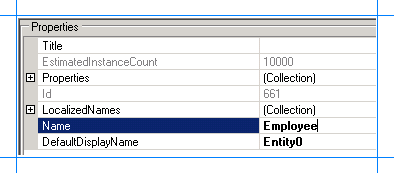  
  
##  <a name="Headers"></a> Specify User Name and Password Headers for the Methods  
 When creating a WCF service for the Select operation on the MS_SAMPLE_EMPLOYEE interface table in Oracle E-Business Suite, you specified user name and password headers as part of the endpoint behavior configuration in [Step 1: Use the Oracle E-Business Adapter to Create and Publish a WCF Service](../../adapters-and-accelerators/adapter-oracle-ebs/step-1-use-the-oracle-e-business-adapter-to-create-and-publish-a-wcf-service.md). You must specify the same values for the Select method property.  
  
#### To specify user name and password headers for the Select method  
  
1.  In the Metadata Objects pane, expand the **Employee** node, and then expand the **Methods** node.  
  
2.  Click the **Select** node, and in the Properties pane click the ellipsis (…) button against the **Properties** box.  
  
3.  In the PropertyView Collection Editor window, click **Add**, and in the Property pane, type **HttpHeaderUserName** for the **Name** box. Type **MyUserHeader** for the **PropertyValue** box. Select **System.String** for the **Type** box.  
  
4.  In the PropertyView Collection Editor window, click **Add**, and in the Property pane, type **HttpHeaderPassword** for the **Name** box. Similarly, type **MyPasswordHeader** for the **PropertyValue** box. Select **System.String** for the **Type** box.  
  
     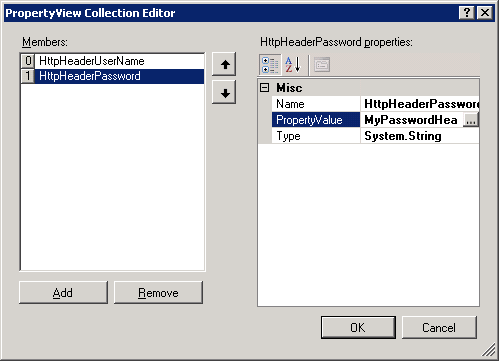  
  
5.  Click **OK**.  
  
##  <a name="Scenario1"></a> Scenario 1: Query for Employees using a Business Data List Web Part  
 To create an application definition file that can be used to search for employees from a Business Data List Web Part and based on employee name, you must perform the following set of tasks.  
  
1.  In the **Select** method, create a filter and map it to the **FILTER** parameter.  
  
2.  Create a **Finder** method instance for the **Select** method. A **Finder** method retrieves a list of records based on a filter.  
  
#### To create a filter, and map it to the FILTER parameter  
  
1.  Create a filter.  
  
    1.  In the Metadata Objects pane, expand the **Employee** node, and then expand the **Methods** node.  
  
    2.  Expand the **Select** method, right-click **Filters**, and then click **Add Filter**.  
  
         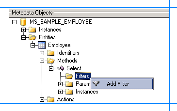  
  
    3.  In the Properties pane, for the **FilterType** property, select **Equals**.  
  
    4.  In the Properties pane, type **EmployeeName** in the **Name** box.  
  
         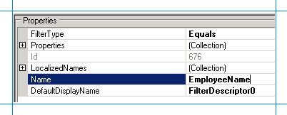  
  
2.  Map the filter to the **FILTER** parameter in the **Select** method.  
  
    1.  In the Metadata Objects pane, expand the **Employee** node, and then expand the **Methods** node.  
  
    2.  Expand the **Select** method, and then expand the **Parameters** node.  
  
    3.  Expand the **FILTER** node, and click the second **FILTER** node.  
  
    4.  In the Properties pane, select **EmployeeName** from the **FilterDescriptor** list.  
  
         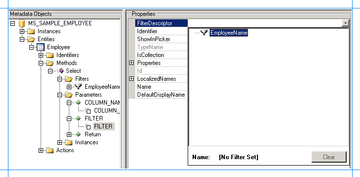  
  
#### To create a Finder method instance for the Select method  
  
1.  In the Metadata Objects pane, expand the **Employee** node, and then expand the **Methods** node.  
  
2.  Expand the **Select** node, right-click **Instances**, and then click **Add Method Instance**.  
  
     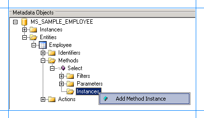  
  
3.  In the Create Method Instance window, click **Finder** for **Method Instance Type**. Select **Return** for **Return TypeDescriptor**.  
  
     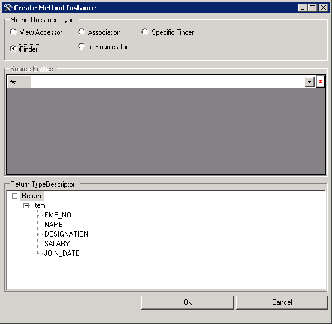  
  
4.  Click **OK**.  
  
5.  In the Properties pane, type **Finder_Instance** in the **Name** box.  
  
     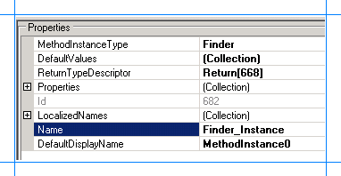  
  
##  <a name="Scenario2"></a> Scenario 2: Full-Text Search on MS_SAMPLE_EMPLOYEE Interface Table from Microsoft Office SharePoint Server  
 To create an application definition file that can be used to perform a full-text search on MS_SAMPLE_EMPLOYEE interface table from Microsoft Office SharePoint Server, you must perform the following set of tasks.  
  
-   In the **Select** method, create an identifier, and map it to the FILTER parameter and the return value that stores the employee name.  
  
-   Create a **Specific Finder** method instance for the **Select**. The **Specific Finder** method will find a specific record based on the identifier, that is, an employee name.  
  
-   Create an ID Enumerator method instance.  
  
#### To create an identifier, and map it to the FILTER parameter and employee name return value  
  
1.  Create an identifier for the **Employee** entity.  
  
    1.  In the Metadata Objects pane, expand the **Employee** node.  
  
    2.  Right-click the **Identifiers** node, and then select **Add Identifier**.  
  
         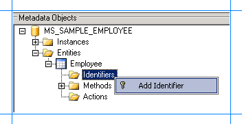  
  
    3.  In the Properties pane, type **EmployeeName** in the **Name** box.  
  
    4.  Select **System.String** for the **Type** box.  
  
         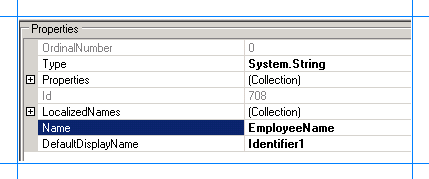  
  
2.  Map the identifier to the FILTER parameter for the **Select** method.  
  
    1.  In the Metadata Objects pane, expand the **Employee** node, and then expand the **Methods** node.  
  
    2.  Expand the **Select** method, and then expand the **Parameters** node.  
  
    3.  Expand the **FILTER** parameter, and then click the second **FILTER** node.  
  
    4.  In the Properties pane, select **EmployeeName[Employee]** from the **Identifier** list.  
  
         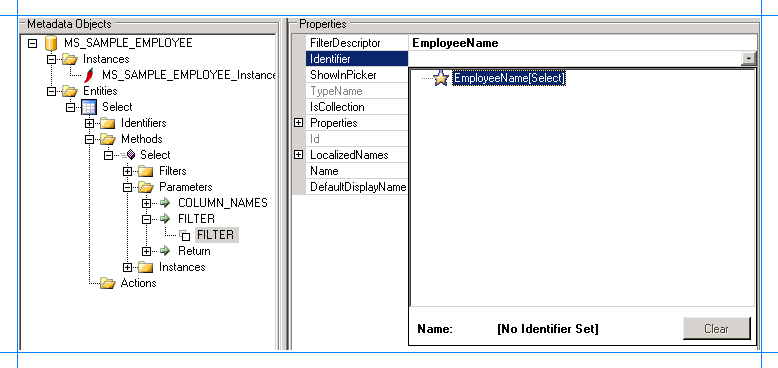  
  
3.  Map the identifier to the employee name return value.  
  
    1.  In the Metadata Objects pane, expand the **Employee** node, and then expand the **Methods** node.  
  
    2.  Expand the **Select** method, and then expand the **Parameters** node.  
  
    3.  Expand the **Return** node, then the second **Return** node, then the **Item** node, and then click the **Name** node.  
  
    4.  In the Properties pane, select **EmployeeName[Employee]** from the **Identifier** list.  
  
#### To create a Specific Finder method instance for the Select method  
  
1.  In the Metadata Objects pane, expand the **Employee** node, and then the **Methods** node.  
  
2.  Expand the **Select** node, right-click **Instances**, and then select **Add Method Instance** to open the Create Method Instance window.  
  
       
  
3.  In the Create Method Instance window, select **Specific Finder** for **Method Instance Type**. Select **Return** for **Return TypeDescriptor**.  
  
     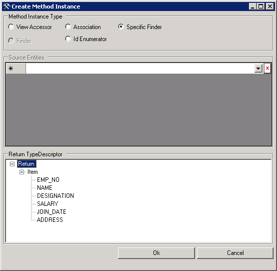  
  
4.  Click **OK**.  
  
5.  In the Properties pane, type **SpeciFinder_Instance** for the **Name** box.  
  
#### To create an Id Enumerator method instance for the Select method  
  
1.  In the Metadata Objects pane, expand the **Employee** node, and then the **Methods** node.  
  
2.  Expand the **Select** node, right-click **Instances**, and then select **Add Method Instance** to open the Create Method Instance window.  
  
       
  
3.  In the Create Method Instance window, select **Id Enumerator** for **Method Instance Type**. Select **Return** for **Return TypeDescriptor**.  
  
     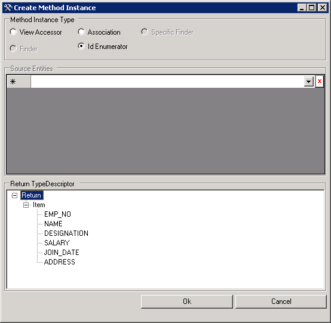  
  
4.  Click **OK**.  
  
5.  In the Properties pane, type **IDEnumerator_Instance** for the **Name** box.  
  
##  <a name="Defaults"></a> Set Default Parameters for the Method Instances  
 The Select method requires you to specify the column names. Therefore, you need to specify a default value for the **COLUMN_NAMES** parameter for the Finder, Specific Finder, and Id Enumerator method instances created earlier. Additionally, you should also specify a default value for the **FILTER** parameter for the Id Enumerator method instance.  
  
#### To set the default parameters for the method instances  
  
1.  In the Metadata Objects pane, expand the **Employee** node, and then expand the **Methods** node.  
  
2.  Expand the **Select** node, and then expand the **Parameters** node.  
  
3.  Expand the **COLUMN_NAMES** node, and then select the **COLUMN_NAMES** parameter.  
  
4.  In the Properties pane, click the ellipsis button (…) against the **DefaultValues** box.  
  
5.  In the **DefaultValueView Collection Editor** dialog box, click **Add**, and in the property pane, click **Finder_Instance** in the **SelectMethodInstance** list.  
  
     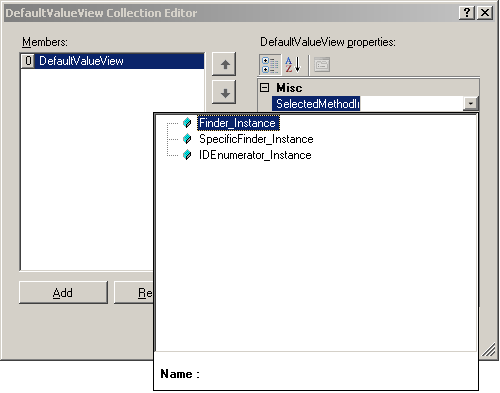  
  
6.  Type `*` in the **Value** box.  
  
7.  Similarly, repeat steps 5 and 6 to add default values for the **SpecificFinder_Instance** and **IDEnumerator_Instance** method instances.  
  
8.  In the **DefaultValueView Collection Editor** dialog box, click **OK**.  
  
9. Next, add a default value for the **FILTER** parameter for the **IDEnumerator_Instance** method instance. Expand the **FILTER** node, and then select the **FILTER** parameter.  
  
10. In the Properties pane, click the ellipsis button (…) against the **DefaultValues** box.  
  
11. In the **DefaultValueView Collection Editor** dialog box, click **Add**, and in the property pane, click **IDEnumerator_Instance** in the **SelectMethodInstance** list.  
  
12. Type `%` in the **Value** box.  
  
     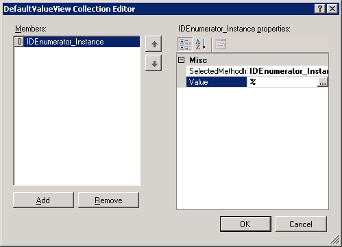  
  
13. In the **DefaultValueView Collection Editor** dialog box, click **OK**.  
  
##  <a name="SSO"></a> Set up Single Sign-On for Connecting to Oracle E-Business Suite  
 After you have finished performing all the procedures in this topic, you will have created an application definition file that can be imported into a SharePoint application. From the application, you invoke the methods to retrieve relevant data from Oracle E-Business Suite. To enable this, you must create a mapping between a user in the Oracle E-Business Suite and the user in the SharePoint application. You create this mapping in SharePoint Central Administration console after you have imported the application definition file.  
  
 However, to create the mapping you must set a property **SecondarySsoApplicationId** in the Business Data Catalog Definition Editor.  
  
#### To set the SecondarySsoApplicationId property  
  
1.  In the Metadata Objects pane, expand the **MS_SAMPLE_EMPLOYEE** node, and then expand the **Instances** node.  
  
2.  Click **MS_SAMPLE_EMPLOYEE_Instance**, and in the Properties pane, click the ellipsis (…) button against the **Properties** box.  
  
3.  In the **PropertyView Collection Editor** dialog box, click **Add**, and in the Property pane, type **SecondarySsoApplicationId** for the **Name** box. Similarly, type **OracleSSO** for the **PropertyValue** box. Select **System.String** for the **Type** box.  
  
     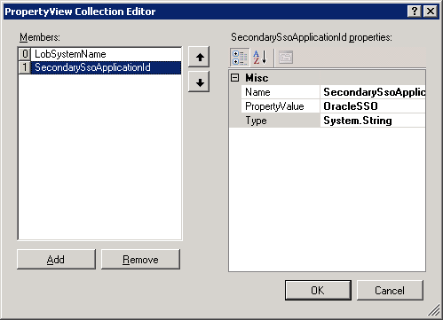  
  
4.  Click **OK**.  
  
##  <a name="Export"></a> Export the Application Definition to a File  
 You have now created an application definition that contains Oracle E-Business Suite instance metadata. You must export this definition to an XML file, which can be imported into Microsoft Office SharePoint Server.  
  
#### To export the application definition to a file  
  
1.  In the Metadata Objects pane, right-click the **MS_SAMPLE_EMPLOYEE** node, and then click **Export**.  
  
2.  Save the file as Employee.xml.  
  
## Next Steps  
 You must now create a SharePoint application to retrieve data from Oracle E-Business Suite. For instructions, see [Step 3: Create a SharePoint Application to Retrieve Data from Oracle E-Business Suite](../../adapters-and-accelerators/adapter-oracle-ebs/step-3-create-a-sharepoint-application-to-retrieve-data-from-oracle-ebs.md).  
  
## See Also  
 [Tutorial: Present Data from Oracle E-Business Suite on a SharePoint Site](Tutorial:%20Present%20data%20from%20Oracle%20E-Business%20Suite%20on%20a%20SharePoint%20Site.md)