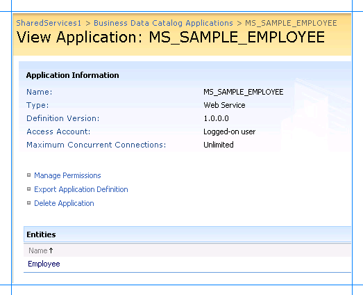

# Step 3: Create a SharePoint application to retrieve data from Oracle E-Business Suite

 **Time to complete:** 15 minutes

 **Objective:** You must now import the application definition file in Microsoft Office SharePoint Server, and set up an application to retrieve data from Oracle E-Business Suite.

## Prerequisites

-   You should have created an application definition file as described in [Step 2: Create an Application Definition File for the Oracle E-Business Suite Artifacts](../../adapters-and-accelerators/adapter-oracle-ebs/step-2-create-an-application-definition-file-for-the-oracle-ebs-artifacts.md).

-   The Microsoft Single Sign-on service must be running.

##   Creating an SSO Application in SharePoint
 To access the data in Oracle E-Business Suite from a SharePoint application, you must set up an SSO application that maps a SharePoint user to an Oracle E-Business Suite user. Creating an SSO application in SharePoint involves the following steps:

1.  **Manage server settings for single sign-on**. In this step, you specify a user account that can manage and set up the single sign-on service. You can do so on the Manage Server Settings page. This option is available from the SharePoint Central Administration console. For more information about this step, refer to the “Configure Single Sign-On for Office SharePoint Server 2007” section at [http://go.microsoft.com/fwlink/?LinkId=105291](https://go.microsoft.com/fwlink/?LinkId=105291).

2.  **Manage settings for enterprise application definitions**. In this step, you configure the settings for the enterprise application definition. You can do so from the Manage Settings for Enterprise Application Definitions page. This option is available from the SharePoint Central Administration console.

    1.  On Central Administration, on the top navigation bar, click **Operations**.

    2.  On the Operations page, in the **Security Configuration** section, click  **Manage settings for single sign-on**.

    3.  On the Manage Settings for Single Sign-On page, in the **Enterprise Application Definition Settings** section, click **Manage settings for enterprise application definitions**.

    4.  On the Manage Enterprise Application Definitions page, provide values for the **Display name**, **Application name**, and the **Contact e-mail address** fields.

        > [!IMPORTANT]
        >  For the **Application name** field, make sure you specify the same SSO application name that you specified for the **SecondarySsoApplicationId** variable while creating the application definition file, as described in [Step 2: Create an Application Definition File for the Oracle E-Business Suite Artifacts](../../adapters-and-accelerators/adapter-oracle-ebs/step-2-create-an-application-definition-file-for-the-oracle-ebs-artifacts.md).

    5.  Leave the other fields as default, and click **OK**.

3.  **Manage account information for enterprise application definitions**. In this step, you enable individual users or groups to connect to an enterprise application from SharePoint. Essentially, in this step you map an individual user or group to a user in the LOB system. You also specify the credentials to connect to the LOB system. You can do so from the Manage Account Information for Enterprise Application Definitions page. This option is available from the SharePoint Central Administration console. For more information about this step, refer to the “Manage account information for an enterprise application definition” section at [http://go.microsoft.com/fwlink/?LinkId=105291](https://go.microsoft.com/fwlink/?LinkId=105291).

##   Creating a Shared Services Provider
 A Shared Service Provider is a logical grouping of shared services and their supporting resources. You can create an SSP by using the SharePoint Central Administration console.

 You must define a Web site when creating an SSP. Remember the port number and the site address that you create. You will import the Business Data Catalog application definition to this site.

 For more information about creating an SSP, see "Chapter overview: Create and configure Shared Services Providers" at [http://go.microsoft.com/fwlink/?LinkId=105119](https://go.microsoft.com/fwlink/?LinkId=105119).

##   Importing the Application Definition File
 You must now import the application definition file into the SSP.

#### To import the application definition file

1.  Start SharePoint 3.0 Central Administration. Click **Start**, point to **All Programs**, point to **Microsoft Office Server**, and then click **SharePoint 3.0 Central Administration**.

2.  In the left navigation pane, click the name of the SSP to which you want to import the application definition.

3.  In the **Business Data Catalog** section, click **Import application definition**.

4.  On the Import Application Definition page that opens, browse to Employee.xml, select the file, and then click **Open**.

5.  Click **Import**.

6.  After the application definition file is imported successfully, click **OK**.

     The application created as a result of importing the application definition file, MS_SAMPLE_EMPLOYEE, appears.

     

## Next Steps
 Now, you are ready to create Web Parts to create a SharePoint site to view and search the business data that will be extracted from Oracle E-Business Suite. We will create a:

-   Business Data List Web Part to display employee records from the MS_SAMPLE_EMPLOYEE interface table. See [Scenario 1: Display Data Using Business Data List Web Part](../../adapters-and-accelerators/adapter-oracle-ebs/scenario-1-display-data-using-business-data-list-web-part.md).

-   Search Box Web Part to perform a full-text search on the MS_SAMPLE_EMPLOYEE interface table. See [Scenario 2: Search Using the Search Box Web Part](../../adapters-and-accelerators/adapter-oracle-ebs/scenario-2-search-using-the-search-box-web-part.md).

## See Also
 [Tutorial: Present Data from Oracle E-Business Suite on a SharePoint Site](Tutorial:%20Present%20data%20from%20Oracle%20E-Business%20Suite%20on%20a%20SharePoint%20Site.md)
