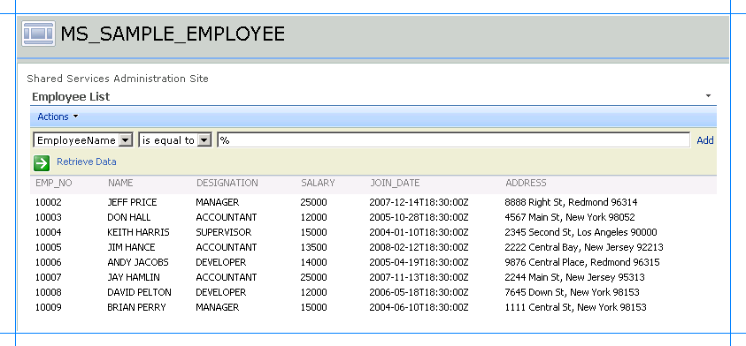
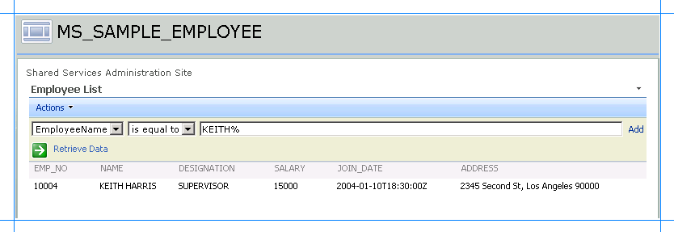
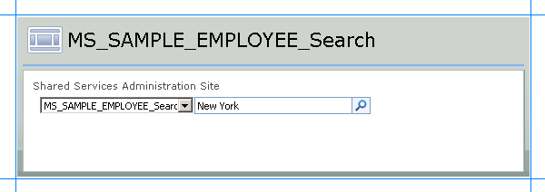
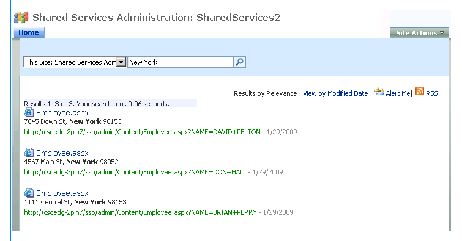
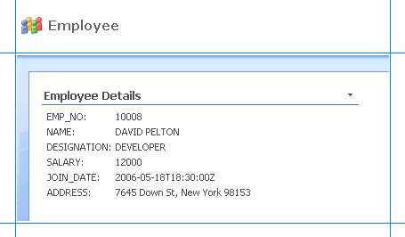

# Step 4: Test your SharePoint application
  
  
 **Time to complete:** 10 minutes  
  
 **Objective:** After you have added Web Parts in the SharePoint site and created an application, you must test the application by retrieving some data from the Oracle E-Business Suite. This topic provides instructions on how to use the application to retrieve the data from the Oracle E-Business Suite.  
  
## Prerequisites  
 You should have created the Web Part page that contains the appropriate Web Parts to retrieve business data. See [Step 3: Create a SharePoint application to retrieve data from Oracle E-Business Suite](../../adapters-and-accelerators/adapter-oracle-ebs/step-3-create-a-sharepoint-application-to-retrieve-data-from-oracle-ebs.md).  
  
### Scenario 1: To test the SharePoint application created using Business Data List Web Part  
  
1.  Start SharePoint 3.0 Central Administration. Click **Start**, point to **All Programs**, point to **Microsoft Office Server**, and then click **SharePoint 3.0 Central Administration**.  
  
2.  In the left navigation pane, click the name of the SSP under which you created the application.  
  
3.  In the left pane, click **View All Site Content**. In the right pane, click **Form Templates**.  
  
4.  In the **Form Category** list, click **MS_SAMPLE_EMPLOYEE**. You specified this name when you created the Web Part page in [Scenario 1: Display data using Business Data List web part](../../adapters-and-accelerators/adapter-oracle-ebs/scenario-1-display-data-using-business-data-list-web-part.md).  
  
5.  Search for employees based on a search string. For example, to search for all the employees, type **%** in the text box, and click **Retrieve Data**. The following figure shows the records retrieved from Oracle E-Business Suite:  
  
       
  
6.  You can also search for a specific employee by entering their first name or last name:  
  
    -   To search using the first name, type the initial letters of an employee name followed by the **%** symbol to return records of all the employees matching the search criteria.  
  
    -   To search using the last name, type **%** followed by employee’s last name.  
  
    > [!NOTE]
    >  The search string is case sensitive.  
  
       
  
### Scenario 2: To test the SharePoint application created to perform a full-text search  
  
1.  Start SharePoint 3.0 Central Administration. Click **Start**, point to **All Programs**, point to **Microsoft Office Server**, and then click **SharePoint 3.0 Central Administration**.  
  
2.  In the left navigation pane, click the name of the SSP under which you created the application.  
  
3.  In the left pane, click **View All Site Content**. In the right pane, click **Form Templates**.  
  
4.  In the **Form Category** list, click **MS_SAMPLE_EMPLOYEE_Search**. You specified this name when you created the Web Part page in [Scenario 2: Perform a Search Using the Search Box Web Part](../../adapters-and-accelerators/adapter-oracle-ebs/scenario-2-search-using-the-search-box-web-part.md) in [Scenario 2: Perform a Search Using the Search Box Web Part](../../adapters-and-accelerators/adapter-oracle-ebs/scenario-2-search-using-the-search-box-web-part.md).  
  
5.  The MS_SAMPLE_EMPLOYEE_Search page displays the search box where you can perform a full-text search on the MS_SAMPLE EMPLOYEE table. For example, if you want to search for all the employees who live in New York, type `New York` in the search box, and press ENTER.  
  
       
  
6.  A page appears with the search results. Each matching records is displayed as a link in the search results page.  
  
       
  
7.  Click a link in the search result to view the respective employee record.  
  
       
  
## Summary  
 In this tutorial, you created a WCF service for the Oracle E-Business Suite artifacts you want to access from a SharePoint Portal. You also created an application definition for the Oracle E-Business Suite artifacts that is imported into a SharePoint portal to create Web Parts to present and search data in Oracle E-Business Suite.  
  
## See Also  
 [Tutorial: Present data from Oracle E-Business Suite on a SharePoint Site](../../adapters-and-accelerators/adapter-oracle-ebs/tutorial-present-data-from-oracle-e-business-suite-on-a-sharepoint-site.md)