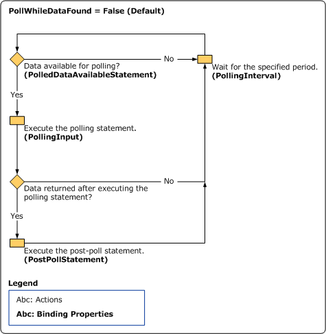
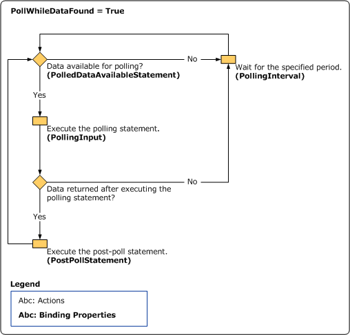

# Support for Inbound Calls Using Polling
The [!INCLUDE[adapteroracleebusinesslong](../../includes/adapteroracleebusinesslong-md.md)] enables client programs to receive messages from Oracle E-Business Suite informing them of changes to data in Oracle E-Business Suite. The [!INCLUDE[adapteroraclebusinessshort](../../includes/adapteroraclebusinessshort-md.md)] supports receiving "polling-based" messages wherein the adapter executes a specified SQL statement, stored procedure, function or a procedure within a package, retrieves the data, and provides the result to the client at regular intervals of time.  

> [!NOTE]
>  You can also set the applications context for the Poll operation in [!INCLUDE[adapteroraclebusinessshort](../../includes/adapteroraclebusinessshort-md.md)]. It is mandatory to set the applications context for the Poll operation if the operation is performed on an interface table or interface view. For information about applications context, and how to set it, see [Set Application Context](../../adapters-and-accelerators/adapter-oracle-ebs/set-application-context.md).  

 A typical polling operation using the [!INCLUDE[adapteroraclebusinessshort](../../includes/adapteroraclebusinessshort-md.md)] involves the following:  

1. The adapter clients must specify `Polling` as the inbound operation in the **InboundOperationType** binding property. The default value for this binding property is **Polling**.  

2. The adapter clients must specify a SELECT statement for the **PolledDataAvailableStatement** binding property to determine whether there is data available for polling. If the first column of the first row of the first result set returned on execution of this statement contains a positive integer value, there is date available for polling.  

3. The adapter clients must specify a polling interval for the **PollingInterval** binding property to define the interval in seconds at which the statement specified in the **PolledDataAvailableStatement** binding property is executed. At the end of every polling interval, the polled data available statement is executed, and the result set is returned.  

4. The adapter clients must specify a SELECT statement or a stored procedure for the **PollingInput** binding property. If you want to poll a table or view, you must specify a SELECT statement for this binding property. If you want to poll using a stored procedure, you must specify the entire request message for this binding property.  

    The statement in the **PollingInput** binding property is executed only if there is data available for polling, which is determined by the **PolledDataAvailableStatement** binding property in step 2.  

5. The adapter clients must specify an action for the polling operation in the **PollingAction** binding property. The polling action for a specific operation is determined from the metadata generated for the operation using the Consume Adapter Service Add-in.  

6. The adapter clients can use the **PollWhileDataFound** binding property to ignore the polling interval, and continuously poll data, as and when available.  

   > [!IMPORTANT]
   >  If you set the value of the **PollWhileDataFound** binding property to True, the adapter clients continuously poll data from Oracle and in the process open and close connections to the Oracle database in a loop. As the rate at which connections are opened by ODP.NET is greater than the connections being closed, the connections get exhausted after some time, and an exception is thrown. As a work around, make sure that the value of the **UseOracleConnectionPool** is set to True, and an appropriate value is mentioned in the **IncrPoolSize** binding property to control the number of connections that can be opened by the adapter clients.  

7. The adapter clients can specify a post-poll statement, an Oracle PL/SQL block, for the **PostPollStatement** binding property. The statement specified in this binding property is executed after the statement specified in the **PollingInput** binding property is executed.  

   > [!NOTE]
   >  The adapter executes the statement specified in the **PollingInput** and **PostPollStatement** binding properties in a transaction. For more information about transactions in the [!INCLUDE[adapteroraclebusinessshort](../../includes/adapteroraclebusinessshort-md.md)], see [How does the Adapter Handle Transactions?](https://msdn.microsoft.com/library/dd788428.aspx).  

   The adapter suppresses any empty polling responses coming from Oracle E-Business Suite.  

   The illustration below provides information about the polling workflow in [!INCLUDE[adapteroraclebusinessshort](../../includes/adapteroraclebusinessshort-md.md)]. Two scenarios for the polling workflow are illustrated:  

8. When the value of the **PollWhileDataFound** is set to “False” (default setting).  

9. When the value of the **PollWhileDataFound** is set to “True.”  

      

## Differences between Polling and Notification  
 Though polling and notification are both inbound operations, and inform the adapter clients about the data changes in the Oracle database, the following table lists some differences between the two. The following differences will help you decide on an operation depending on your requirements:  

|                                                                                                                                                                                                                                                      Polling                                                                                                                                                                                                                                                      |                                                                                                                              Notification                                                                                                                               |
|-------------------------------------------------------------------------------------------------------------------------------------------------------------------------------------------------------------------------------------------------------------------------------------------------------------------------------------------------------------------------------------------------------------------------------------------------------------------------------------------------------------------|-------------------------------------------------------------------------------------------------------------------------------------------------------------------------------------------------------------------------------------------------------------------------|
|                                                                                                                                                                   Polling is supported for all the Oracle database versions that are supported by the [!INCLUDE[adapteroraclebusinessshort](../../includes/adapteroraclebusinessshort-md.md)].                                                                                                                                                                    |                                                                                               Notification is only supported for Oracle database versions 10.2 and later.                                                                                               |
| You can either configure the polling interval to check the data available for polling at regular intervals or instantaneously as and when the data is available. **Tip:**  Polling can give you better throughput in scenarios where the data changes are happening continuously, and you do not want to be notified of each change as and when it happens. Instead, you specify a polling interval after which you want to be notified of all the changes that have happened since the last change notification. |                                                                                                          The data-change notification is always instantaneous.                                                                                                          |
|                                                                                                                                         Polling is initiated by the adapter. The adapter executes a SQL statement to validate whether data is available for polling, and then initiates polling by executing the polling statement if some data is available for polling.                                                                                                                                         | Notification is initiated by the Oracle database. The notification statement issued by the adapter just instructs the database to initiate notification in case there is a change in the result set of the statement. Notification is a feature of the Oracle database. |
|                                                                                                                                                                                                                 You can use the polling statement to read or update data in the Oracle database.                                                                                                                                                                                                                  |                                                                                             You can use the notification statement to only read data in an Oracle database.                                                                                             |
|                                                                                                                                                                                                                            Polling informs you about the actual data that has changed.                                                                                                                                                                                                                            |                                                                                   Notification informs only about the type of change in the data such as Insert, Update, and Delete.                                                                                    |

 For more information about:  

- The binding properties related to polling, see [Read about the  BizTalk Adapter for Oracle E-Business Suite Binding Properties](../../adapters-and-accelerators/adapter-oracle-ebs/read-about-the-biztalk-adapter-for-oracle-e-business-suite-binding-properties.md).  

- Receiving polling-based messages using [!INCLUDE[btsBizTalkServerNoVersion](../../includes/btsbiztalkservernoversion-md.md)], see [Poll Oracle E-Business Suite Using BizTalk Server](../../adapters-and-accelerators/adapter-oracle-ebs/poll-oracle-e-business-suite-using-biztalk-server.md).  

## See Also  
 [What Operations Can be Performed Using the Adapter?](https://msdn.microsoft.com/library/cc185219(v=bts.10).aspx)