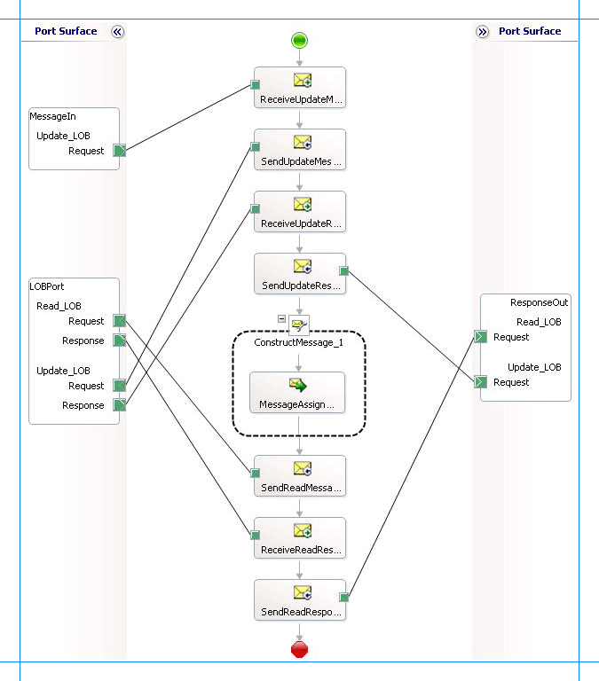

# Working with tables that have large data types in Oracle E-Business Suite
The [!INCLUDE[adapteroraclebusinessshort](../../includes/adapteroraclebusinessshort-md.md)] enables adapter clients to perform operations on interface tables and views with large data types such as BLOB, CLOB, NCLOB, and BFILE.  
  
- For columns of type BLOB, CLOB, and NCLOB the adapter enables clients to read as well as update data. The adapter exposes Read_\<LOBColName\> and Update_\<LOBColName\> operations to read and update data respectively, where \<LOBColName\> is the name of column with large data type. If there is more than one column with large data type in a single interface table, the adapter exposes as many read and update operations for that interface table.  
  
- For columns of type BFILE, adapter clients can only read data. The adapter exposes Read_\<LOBColName\> operation to read data from columns of BFILE type. If there is more than one column with large data type in a single interface table, the adapter exposes as many read operations for the interface table.  
  
  For more information about these operations, see [Operations on Interface Tables, Interface Views, Tables, and Views That Contain LOB Data](../../adapters-and-accelerators/adapter-oracle-ebs/read-and-update-on-interface-tables-and-views-with-large-object-data-types.md). For information about message schemas for performing these operations, see [Message Schemas for Special LOB Operations](../../adapters-and-accelerators/adapter-oracle-ebs/message-schemas-for-special-lob-operations1.md).  
  
## How to Perform Operations on Columns with Large Data Types  
 Performing an operation on Oracle E-Business Suite by using [!INCLUDE[adapteroraclebusinessshort](../../includes/adapteroraclebusinessshort-md.md)] with [!INCLUDE[btsBizTalkServerNoVersion](../../includes/btsbiztalkservernoversion-md.md)] involves procedural tasks described in [Building blocks to create Oracle E-Business Suite applications](../../adapters-and-accelerators/adapter-oracle-ebs/building-blocks-to-create-oracle-e-business-suite-applications.md). To perform operations on interface tables and interface views in Oracle E-Business Suite that contain large data types, these tasks are:  
  
1. Create a BizTalk project, and generate schema for the operation (Read_\<LOBColName\> or Update_\<LOBColName\>) you want to invoke on a table or view.  
  
2. Create messages in the BizTalk project for sending and receiving messages from the Oracle E-Business Suite.  
  
3. Create an orchestration to invoke the operation on the interface table or view.  
  
4. Build and deploy the BizTalk project.  
  
5. Configure the BizTalk application by creating physical send and receive ports.  
  
6. Start the BizTalk application.  
  
   This topic provides instructions to perform these tasks.  
  
## How This Topic Demonstrates Reading and Writing Data Into Columns of Large Data Types  
 To demonstrate reading and writing data into columns of large data types, this topic provides instructions to create an orchestration that does the following:  
  
- Update the PHOTO column (of BLOB data type) of the CUSTOMER table.  
  
- Read the value for the PHOTO column for the updated record.  
  
  This orchestration is designed in such a way that you only provide the request message for the update operation at run-time. The message for the read operation will be constructed within the operation.  
  
> [!NOTE]
>  The orchestration in this topic reads and updates data from the CUSTOMER table, which is a base database table created by running the scripts provided with the samples. You must perform similar procedures as described in this topic to perform read or update operations on any interface table or interface view.  
  
## Generating Schema  
 This topic demonstrates how to perform basic read and update operations on a PHOTO column (of BLOB data type) in a CUSTOMER table. This table is created by running the scripts provided with the samples.  
  
 To demonstrate how to read and write data to a column of large data type, schema is generated for the **Update_PHOTO** and **Read_PHOTO** operations for the CUSTOMER table. You must create a BizTalk project and use the [!INCLUDE[consumeadapterservshort](../../includes/consumeadapterservshort-md.md)] to generate the schema. See [Retrieving Metadata for Oracle E-Business Suite Operations in Visual Studio](../../adapters-and-accelerators/adapter-oracle-ebs/get-metadata-for-oracle-e-business-suite-operations-in-visual-studio.md) for more information about how to generate schemas.  
  
## Defining Messages and Message Types  
 The schema that you generated earlier describes the “types” required for the messages in the orchestration. A message is typically a variable, the type for which is defined by the corresponding schema. You must now create messages for the orchestration, and link them to schemas that you generated in the previous step.  
  
 In this orchestration you must create four messages—one receive-response set for the **Update_PHOTO** operation and the other receive-response set for the **Read_PHOTO** operation.  
  
#### To create messages and link to schema  
  
1.  Add an orchestration to the BizTalk project. From Solution Explorer, right-click the BizTalk project name, point to **Add**, and then click **New Item**. Type a name for the BizTalk orchestration, and then click **Add**.  
  
2.  Open the Orchestration View window of the BizTalk project, if it is not already open. To do so, click **View**, point to **Other Windows**, and then click **Orchestration View**.  
  
3.  In Orchestration View, right-click **Messages**, and then click **New Message**.  
  
4.  Right-click the newly created message, and then select **Properties Window**.  
  
5.  In the **Properties** pane for the **Message_1**, do the following:  
  
    |Use this|To do this|  
    |--------------|----------------|  
    |Identifier|Type `UpdateMessage`|  
    |Message Type|From the drop-down list, expand **Schemas**, and then select *LOBOperations.OracleEBSBinding.Update_PHOTO*, where LOBOperations is the name of your BizTalk project. OracleEBSBindingSchema is the schema generated for invoking the **Update_PHOTO** operation on CUSTOMER table.|  
  
6.  Repeat step 3 to create three new message. In the **Properties** pane for the new message, do the following:  
  
    |Set Identifier to|Set Message Type to|  
    |-----------------------|-------------------------|  
    |UpdateResponse|*LOBOperations.OracleEBSBinding.Update_PHOTOResponse*|  
    |ReadMessage|*LOBOperations.OracleEBSBinding1.Read_PHOTO*|  
    |ReadResponse|*LOBOperations.OracleEBSBinding1.Read_PHOTOResponse*|  
  
## Setting up the Orchestration  
 In this orchestration, the adapter receives a request message to perform an Update_PHOTO operation on a CUSTOMER table. The notification message is received at a FILE location. The adapter consumes this message and passes it on to Oracle database. The response from Oracle database is saved at another location. Once the response is received, the orchestration constructs a message to invoke the Read_PHOTO operation, which reads the value of the PHOTO column updated by the Update_PHOTO operation. The response for this message is also received at the same FILE location.  
  
 So, your orchestration must contain the following:  
  
- A FILE receive port to drop a request message for **Update_PHOTO** operation.  
  
- A two-way WCF-Custom or WCF-OracleEBS send port to send messages to execute the **Update_PHOTO** operation.  
  
- A two-way WCF-Custom or WCF-OracleEBS send port to send messages to execute the **Read_PHOTO** operation. You can also perform both **Read_PHOTO** and **Update_PHOTO** using the same WCF-Custom or WCF-OracleEBS send port. In this topic, you will use a single send port for both the operations.  
  
- A **Construct Message** shape to construct messages within the orchestration.  
  
- A FILE send port to save the response messages for **Update_PHOTO** and **Read_PHOTO** operations.  
  
- Receive and send shapes.  
  
  A sample orchestration resembles the following.  
  
    
  
### Adding Message Shapes  
 Make sure you specify the following properties for each of the message shapes. The names listed in the Shape column are the names of the message shapes as displayed in the just-mentioned orchestration.  
  
|Shape|Shape Type|Properties|  
|-----------|----------------|----------------|  
|ReceiveUpdateMessage|Receive|-   Set **Name** to *ReceiveUpdateMessage*<br />-   Set **Activate** to *True*|  
|SendUpdateMessage|Send|-   Set **Name** to *SendUpdateMessage*|  
|ReceiveUpdateResponse|Receive|-   Set **Name** to *ReceiveUpdateResponse*|  
|SendUpdateResponse|Receive|-   Set **Name** to *SendUpdateResponse*|  
|SendReadMessage|Send|-   Set **Name** to *SendReadMessage*|  
|ReceiveReadResponse|Receive|-   Set **Name** to *ReceiveReadResponse*|  
|SaveReadResponse|Send|-   Set **Name** to *SaveReadResponse*|  
  
### Adding Construct Message Shape  
 You can use the **Construct Message** shape to generate a request message within the orchestration to execute the **Read_PHOTO** operation. To do so, you must add a **Construct Message** shape and within that a **Message Assignment** shape to your orchestration. For this example, the **Message Assignment** shape invokes code that generates a message that is sent to Oracle E-Business Suite to execute the **Read_PHOTO** operation. The **Message Assignment** shape also sets the action for the message to be sent to Oracle E-Business Suite.  
  
 For the construct message shape, set the **Message Constructed** property to **ReadMessage**.  
  
 The code to generate the response could be part of the same Visual Studio solution as your BizTalk project. A sample code for generating a response message looks like this.  
  
```  
namespace MessageCreator  
{  
    public class MessageCreator  
    {  
        private static XmlDocument Message;  
        private static string XmlFileLocation;  
        private static string ResponseDoc;  
  
        public static XmlDocument XMLMessageCreator()  
        {  
            XmlFileLocation = "C:\\TestLocation\\MessageIn";  
            try  
            {  
                ResponseDoc = (Directory.GetFiles(XmlFileLocation, "*.xml", SearchOption.TopDirectoryOnly))[0];  
            }  
            catch (Exception ex)  
            {  
                Console.WriteLine("Trying to get XML from: " + XmlFileLocation);  
                Console.WriteLine("EXCEPTION: " + ex.ToString());  
                throw ex;  
            }  
            //Create Message From XML  
            Message = new XmlDocument();  
            Message.PreserveWhitespace = true;  
            Message.Load(ResponseDoc);  
            return Message;  
        }   
    }  
}  
```  
  
 For the above code excerpt to be able to generate a request message, you must have an XML request message (for the **Read_PHOTO** operation) in the location specified for the `XmlFileLocation` variable.  
  
> [!NOTE]
>  After you build the project, MessageCreator.dll will be created in the project directory. You must add this DLL to the global assembly cache (GAC). Also, you must add the MessageCreator.dll as a reference in the BizTalk project.  
  
 Add the following expression to invoke this code from the **Message Assignment** shape and to set the action for message. To add an expression, double-click the **Message Assignment** shape to open the Expression Editor.  
  
```  
ReadMessage = MessageCreator.MessageCreator.XMLMessageCreator();  
ReadMessage(WCF.Action) = "Tables/ReadLOB/SCOTT/CUSTOMER/PHOTO ";  
```  
  
### Adding Ports  
 Make sure you specify the following properties for each of the logical ports. The names listed in the Port column are the names of the ports as displayed in the orchestration.  
  
|Port|Properties|  
|----------|----------------|  
|MessageIn|-   Set **Identifier** to *MessageIn*<br />-   Set **Type** to *MessageInType*<br />-   Set **Communication Pattern** to *One-Way*<br />-   Set **Communication Direction** to *Receive*|  
|LOBPort|-   Set **Identifier** to *LOBPort*<br />-   Set **Type** to *LOBPortType*<br />-   Set **Communication Pattern** to *Request-Response*<br />-   Set **Communication Direction** to *Send-Receive*<br />-   Create an operation *Read_LOB*. This operation is used for messages to read values from large data type columns.<br />-   Create an operation *Update_LOB*. This operation is used for messages to update values in large data type columns.|  
|ResponseOut|-   Set **Identifier** to *ResponseOut*<br />-   Set **Type** to *ResponseOutType*<br />-   Set **Communication Pattern** to *One-Way*<br />-   Set **Communication Direction** to *Send*<br />-   Create an operation *Read_LOB*. This operation is used for messages to read values from large data type columns.<br />-   Create an operation *Update_LOB*. This operation is used for messages to update values in large data type columns.|  
  
### Specify Messages for Action Shapes and Connect to Ports  
 The following table specifies the properties and their values that you should set to specify messages for action shapes and to link the messages to the ports. The names listed in the Shape column are the names of the message shapes as displayed in the orchestration mentioned earlier.  
  
|Shape|Properties|  
|-----------|----------------|  
|ReceiveUpdateMessage|-   Set **Message** to *UpdateMessage*<br />-   Set **Operation** to *MessageIn.Update_LOB.Request*|  
|SendUpdateMessage|-   Set **Message** to *UpdateMessage*<br />-   Set **Operation** to *LOBPort.Update_LOB.Request*|  
|ReceiveUpdateResponse|-   Set **Message** to *UpdateResponse*<br />-   Set **Operation** to *LOBPort.Update_LOB.Response*|  
|SendUpdateResponse|-   Set **Message** to *UpdateResponse*<br />-   Set **Operation** to *ResponseOut.Update_LOB.Request*|  
|SendReadMessage|-   Set **Message** to *ReadMessage*<br />-   Set **Operation** to *LOBPort.Read_LOB.Request*|  
|ReceiveReadResponse|-   Set **Message** to *ReadResponse*<br />-   Set **Operation** to *LOBPort.Read_LOB.Response*|  
|SendReadResponse|-   Set **Message** to *ReadResponse*<br />-   Set **Operation** to *ResponseOut.Read_LOB.Request*|  
  
 After you have specified these properties, the message shapes and ports are connected and your orchestration is complete.  
  
 You must now build the BizTalk solution and deploy it to a [!INCLUDE[btsBizTalkServerNoVersion](../../includes/btsbiztalkservernoversion-md.md)]. For more information, see [Building and Running Orchestrations](../../core/building-and-running-orchestrations.md).  
  
## Configuring the BizTalk Application  
 After you have deployed the BizTalk project, the orchestration you created earlier is listed under the Orchestrations pane in the [!INCLUDE[btsBizTalkServerNoVersion](../../includes/btsbiztalkservernoversion-md.md)] Administration console. You must use the [!INCLUDE[btsBizTalkServerNoVersion](../../includes/btsbiztalkservernoversion-md.md)] Administration console to configure the application. For a walkthrough, see [Walkthrough: Deploying a Basic BizTalk Application](Walkthrough:%20Deploying%20a%20Basic%20BizTalk%20Application.md).
  
 Configuring an application involves:  
  
- Selecting a host for the application.  
  
- Mapping the ports that you created in your orchestration to physical ports in the [!INCLUDE[btsBizTalkServerNoVersion](../../includes/btsbiztalkservernoversion-md.md)] Administration console. For this orchestration you must:  
  
  - Define a location on the hard disk and a corresponding FILE port where you will drop a request message. The BizTalk orchestration will consume the request message and send it to Oracle database.  
  
  - Define a location on the hard disk and a corresponding FILE port where the BizTalk orchestration will drop the response message containing the response from Oracle database.  
  
  - Define a physical WCF-Custom or WCF-OracleEBS send port to send messages to Oracle database. You must also specify the action in the send port. For information about how to create ports, see [Manually Configuring a Physical Port Binding to the Oracle E-Business Adapter](../../adapters-and-accelerators/adapter-oracle-ebs/manually-configure-a-physical-port-binding-to-the-oracle-e-business-adapter.md). You must make the following considerations while configuring the WCF-Custom or WCF-OracleEBS send port.  
  
    -   An `Update_<LOBColName>` operation must be performed as part of transaction. To ensure this, the **UseAmbientTransaction** binding property must be set to **True**.  
  
    -   Because the WCF-Custom or WCF-OracleEBS send port sends and receives messages conforming to more than one schema and performs two operations, you must set dynamic action for both the operations. For more information about actions, see [Configure the SOAP Action for Oracle E-Business Suite](../../adapters-and-accelerators/adapter-oracle-ebs/configure-the-soap-action-for-oracle-e-business-suite.md). For this orchestration, the action should be set as follows:  
  
        ```  
        <BtsActionMapping xmlns:xsi="http://www.w3.org/2001/XMLSchema-instance" xmlns:xsd="http://www.w3.org/2001/XMLSchema">  
          <Operation Name="Update_LOB" Action="Tables/UpdateBlob/SCOTT/CUSTOMER/PHOTO" />  
          <Operation Name="Read_LOB" Action="Tables/ReadLOB/SCOTT/CUSTOMER/PHOTO" />  
        </BtsActionMapping>  
        ```  
  
        > [!IMPORTANT]
        >  Note that the operation name in a dynamic action must be same as the operation name you specified on the logical ports while creating the BizTalk orchestration.  
  
    > [!NOTE]
    >  To perform operations on interface tables or interface views you must also set the application context. For more information on how the adapter supports setting the application context, see [Set Application Context](../../adapters-and-accelerators/adapter-oracle-ebs/set-application-context.md). You can set the application context either by specifying the binding properties or by setting the message context properties exposed by the [!INCLUDE[adapteroraclebusinessshort](../../includes/adapteroraclebusinessshort-md.md)]. For instructions on how to set the binding properties, see [Configure the Binding Properties for Oracle E-Business Suite](../../adapters-and-accelerators/adapter-oracle-ebs/configure-the-binding-properties-for-oracle-e-business-suite.md). For instructions on how to set the application context using message context properties, see [Configure the Application Context Using Message Context Properties in Oracle E-Business Suite](../../adapters-and-accelerators/adapter-oracle-ebs/configure-application-context-using-message-context-properties-in-oracle-ebs.md).  
    > 
    > [!NOTE]
    >  Generating the schema using the [!INCLUDE[consumeadapterservlong](../../includes/consumeadapterservlong-md.md)] also creates a binding file that contains information about the ports and the actions to be set for those ports. You can import this binding file from the [!INCLUDE[btsBizTalkServerNoVersion](../../includes/btsbiztalkservernoversion-md.md)] Administration console to create send ports (for outbound calls) or receive ports (for inbound calls). For more information, see [Configure a Physical Port Binding Using a Port Binding File to Oracle E-Business Suite](../../adapters-and-accelerators/adapter-oracle-ebs/configure-a-physical-port-binding-using-a-port-binding-file-to-oracle-ebs.md).  
  
## Starting the Application  
 Before starting the BizTalk orchestration, make sure the request XML to invoke the **Read_PHOTO** operation is available at C:\TestLocation\MessageIn. The request XML must resemble the following:  
  
```  
<Read_PHOTO xmlns="http://schemas.microsoft.com/OracleEBS/2008/05/Tables/SCOTT/CUSTOMER">  
  <FILTER>WHERE NAME='Mindy Martin'</FILTER>  
</Read_PHOTO>  
```  
  
> [!NOTE]
>  The request message has a filter on the specific name because in the request message for **Update_PHOTO** operation, the value for the PHOTO column is updated for the same name. So, the read operation will read the same value that you insert using the update operation.  
  
 You must now start the BizTalk application for reading and writing values of large data types from an Oracle database. For instructions on starting a BizTalk application, see [How to Start an Orchestration](../../core/how-to-start-an-orchestration.md).  
  
 At this stage, make sure:  
  
-   The FILE receive port to receive request messages for the orchestration is running.  
  
-   The FILE send port to receive the response messages from the orchestration is running.  
  
-   The WCF-Custom or WCF-OracleEBS send port to send messages to Oracle database is running.  
  
-   The BizTalk orchestration for the operation is running.  
  
## Executing the Operation  
 After you start the application you must drop a request message to the FILE receive location. The schema for the request message must conform to the schema for the **Update_PHOTO** operation you generated earlier. For example, a request message that updates the PHOTO column of the CUSTOMER table resembles the following:  
  
```  
<Update_PHOTO xmlns="http://schemas.microsoft.com/OracleEBS/2008/05/Tables/SCOTT/CUSTOMER">  
  <FILTER>WHERE Name='Mindy Martin'</FILTER>  
  <DATA>U2FtcGxlIERhdGE=</DATA>  
</Update_PHOTO>  
```  
  
> [!NOTE]
>  While updating BLOB columns, the DATA element must always contain a base64 encoded value. For CLOB and NCLOB, the DATA element can have string values.  
  
 The preceding request message updates the value in the PHOTO column for the record matching the WHERE clause. See Message Schemas for Operations on Large Data Types for more information about the request message schema for performing operations on large data types using the [!INCLUDE[adapteroraclebusinessshort](../../includes/adapteroraclebusinessshort-md.md)].  
  
 The orchestration consumes the message and sends it to Oracle database. The response from Oracle database is saved at the other FILE location defined as part of the orchestration. For example, the response from Oracle database for the preceding request message resembles the following:  
  
```  
<?xml version="1.0" encoding="utf-8"?>  
<Update_PHOTOResponse xmlns="http://schemas.microsoft.com/OracleEBS/2008/05/Tables/SCOTT/CUSTOMER" />  
```  
  
 The orchestration now constructs a request message for the **Read_PHOTO** operation by using the request message available at C:\TestLocation\MessageIn. The request message is sent to Oracle database and the response is saved at the same FILE location. The response for the read operation on PHOTO column resembles the following:  
  
```  
<?xml version="1.0" encoding="utf-8"?>  
<Read_PHOTOResponse xmlns="http://schemas.microsoft.com/OracleEBS/2008/05/Tables/SCOTT/CUSTOMER">  
  <Read_PHOTOResult>U2FtcGxlIERhdGE=</Read_PHOTOResult>  
</Read_PHOTOResponse>  
```  
  
> [!NOTE]
>  Note that the response contains the same value for the PHOTO column that you passed in the **Update_PHOTO** operation.  
  
## Best Practices  
 After you have deployed and configured the BizTalk project, you can export configuration settings to an XML file called the binding file. Once you generate a binding file, you can import the configuration settings from the file, so that you do not need to create items such as send ports and receive ports for the same orchestration. For more information about binding files, see [Reuse Adapter Bindings with Oracle E-Business Suite](../../adapters-and-accelerators/adapter-oracle-ebs/reuse-adapter-bindings-with-oracle-e-business-suite.md).  
  
## See Also  
[Develop BizTalk applications using the Oracle E-Business Suite adapter](../../adapters-and-accelerators/adapter-oracle-ebs/develop-biztalk-applications-using-the-oracle-e-business-suite-adapter.md)