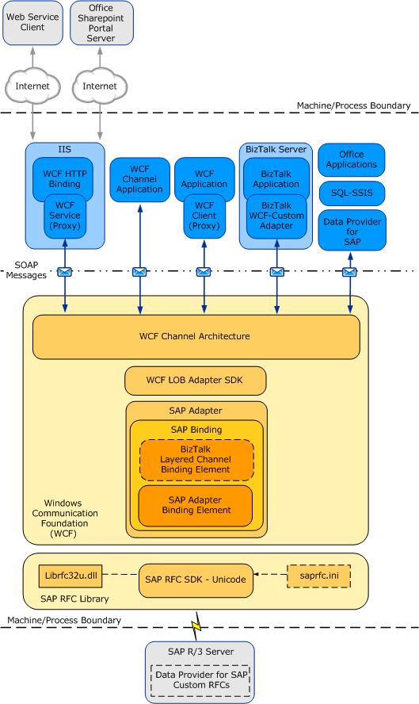
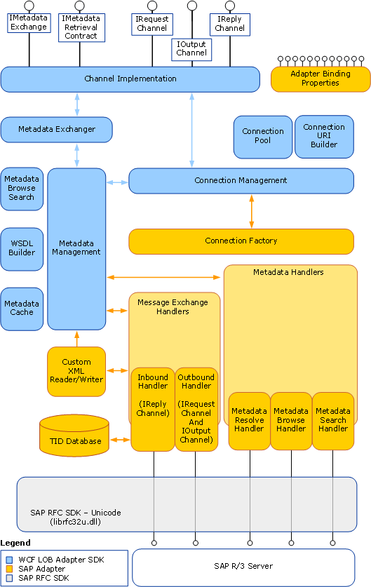

# Architecture overview of the BizTalk Adapter for mySAP Business Suite
The [!INCLUDE[adaptersap](../../includes/adaptersap-md.md)] implements a [!INCLUDE[firstref_btsWinCommFoundation](../../includes/firstref-btswincommfoundation-md.md)] custom binding, which contains a single custom transport binding element that enables communication with an SAP system. The [!INCLUDE[adaptersap_short](../../includes/adaptersap-short-md.md)] is wrapped by the [!INCLUDE[afproductnamelong](../../includes/afproductnamelong-md.md)] runtime and is exposed to applications through the [!INCLUDE[nextref_btsWinCommFoundation](../../includes/nextref-btswincommfoundation-md.md)] channel architecture. The [!INCLUDE[adaptersap_short](../../includes/adaptersap-short-md.md)] communicates with the SAP system through either the 64-bit or 32-bit version of the SAP Unicode RFC SDK (librfc32u.dll). 

The following figure shows the end-to-end architecture for solutions that are developed by using the [!INCLUDE[adaptersap_short](../../includes/adaptersap-short-md.md)].  
  
   
  
## Consuming the Adapter  
 The [!INCLUDE[adaptersap_short](../../includes/adaptersap-short-md.md)] exposes the SAP system as a [!INCLUDE[nextref_btsWinCommFoundation](../../includes/nextref-btswincommfoundation-md.md)] service to client applications. Client applications exchange SOAP messages with the [!INCLUDE[adaptersap_short](../../includes/adaptersap-short-md.md)] through [!INCLUDE[nextref_btsWinCommFoundation](../../includes/nextref-btswincommfoundation-md.md)] channels to perform operations and to access data on the SAP system. The preceding figure shows four ways in which the [!INCLUDE[adaptersap_short](../../includes/adaptersap-short-md.md)] can be consumed.  
  
- Through a [!INCLUDE[nextref_btsWinCommFoundation](../../includes/nextref-btswincommfoundation-md.md)] channel application that performs operations on the SAP system by using the [!INCLUDE[nextref_btsWinCommFoundation](../../includes/nextref-btswincommfoundation-md.md)] channel model to exchange SOAP messages directly with the [!INCLUDE[adaptersap_short](../../includes/adaptersap-short-md.md)]. For more information about developing solutions for the [!INCLUDE[adaptersap_short](../../includes/adaptersap-short-md.md)] by using [!INCLUDE[nextref_btsWinCommFoundation](../../includes/nextref-btswincommfoundation-md.md)] channel model programming, see [Develop applications using the WCF Channel Model](../../adapters-and-accelerators/adapter-sap/develop-sap-applications-using-the-wcf-channel-model.md).  
  
- Through a [!INCLUDE[nextref_btsWinCommFoundation](../../includes/nextref-btswincommfoundation-md.md)] service model application that calls methods on a [!INCLUDE[nextref_btsWinCommFoundation](../../includes/nextref-btswincommfoundation-md.md)] client to perform operations on the SAP system. A [!INCLUDE[nextref_btsWinCommFoundation](../../includes/nextref-btswincommfoundation-md.md)] client models the operations exposed by the [!INCLUDE[adaptersap_short](../../includes/adaptersap-short-md.md)] as .NET methods. You can use the [!INCLUDE[afproductnamelong](../../includes/afproductnamelong-md.md)] or the svcutil.exe tool to create a [!INCLUDE[nextref_btsWinCommFoundation](../../includes/nextref-btswincommfoundation-md.md)] client class from metadata exposed by the [!INCLUDE[adaptersap_short](../../includes/adaptersap-short-md.md)]. For more information about [!INCLUDE[nextref_btsWinCommFoundation](../../includes/nextref-btswincommfoundation-md.md)] service model programming and the [!INCLUDE[adaptersap_short](../../includes/adaptersap-short-md.md)], see [Develop applications using the WCF Service Model](../../adapters-and-accelerators/adapter-sap/develop-sap-applications-using-the-wcf-service-model.md).  
  
- Through a BizTalk port that is configured to use the BizTalk WCF-Custom adapter with the SAP Binding configured as the binding for the WCF-Custom transport type in a [!INCLUDE[btsBizTalkServerNoVersion](../../includes/btsbiztalkservernoversion-md.md)] application. The BizTalk WCF-Custom adapter enables communication between a [!INCLUDE[btsBizTalkServerNoVersion](../../includes/btsbiztalkservernoversion-md.md)] application and a [!INCLUDE[nextref_btsWinCommFoundation](../../includes/nextref-btswincommfoundation-md.md)] service. The BizTalk WCF-Custom adapter supports custom [!INCLUDE[nextref_btsWinCommFoundation](../../includes/nextref-btswincommfoundation-md.md)] bindings through its WCF-Custom transport type, which enables you to configure any [!INCLUDE[nextref_btsWinCommFoundation](../../includes/nextref-btswincommfoundation-md.md)] binding exposed to the configuration system as the binding used by the BizTalk WCF-Custom adapter. For more information about how to use the [!INCLUDE[adaptersap_short](../../includes/adaptersap-short-md.md)] in [!INCLUDE[btsBizTalkServerNoVersion](../../includes/btsbiztalkservernoversion-md.md)] solutions, see [Develop BizTalk applications](../../adapters-and-accelerators/adapter-sap/develop-biztalk-applications-using-the-sap-adapter.md). BizTalk transactions are supported by the BizTalk Layered Channel binding element which can be loaded by setting a binding property on the SAP Binding.  
  
- Through an IIS-hosted Web service. In this scenario, the [!INCLUDE[adaptersap_short](../../includes/adaptersap-short-md.md)] is exposed through a [!INCLUDE[nextref_btsWinCommFoundation](../../includes/nextref-btswincommfoundation-md.md)] Service proxy, which is hosted in IIS by using one of the standard [!INCLUDE[nextref_btsWinCommFoundation](../../includes/nextref-btswincommfoundation-md.md)] HTTP bindings.  
  
- Through the [!INCLUDE[adoprovidersaplong](../../includes/adoprovidersaplong-md.md)]. The [!INCLUDE[adoprovidersapshort](../../includes/adoprovidersapshort-md.md)] runs on top of the [!INCLUDE[adaptersap_short](../../includes/adaptersap-short-md.md)] and provides an ADO.NET interface to an SAP system.  
  
  The [!INCLUDE[adaptersap_short](../../includes/adaptersap-short-md.md)] and the SAP RFC library are always hosted in-process with the application or service that consumes the adapter.  
  
## SAP Adapter and WCF  
 [!INCLUDE[nextref_btsWinCommFoundation](../../includes/nextref-btswincommfoundation-md.md)] presents a programming model based on the exchange of SOAP messages over channels between clients and services. These messages are sent between endpoints exposed by a communicating client and service.  
  
 An endpoint consists of an *endpoint address* which specifies the location at which messages are received, a *binding* which specifies the communication protocols used to exchange messages, and a *contract* which specifies the operations and data types exposed by the endpoint. A binding consists of one or more binding elements that stack on top of each other to define how messages are exchanged with the endpoint.  
  
 At a minimum, a binding must specify the transport and encoding used to exchange messages with the endpoint. Message exchange between endpoints occurs over a channel stack that is composed of one or more channels. Each channel is a concrete implementation of one of the binding elements in the binding configured for the endpoint.  
  
The [WCF documentation](http://go.microsoft.com/fwlink/?LinkID=196850) includes more details about [!INCLUDE[nextref_btsWinCommFoundation](../../includes/nextref-btswincommfoundation-md.md)], and the [!INCLUDE[nextref_btsWinCommFoundation](../../includes/nextref-btswincommfoundation-md.md)] programming model.  
  
 The [!INCLUDE[adaptersap](../../includes/adaptersap-md.md)] exposes a [!INCLUDE[nextref_btsWinCommFoundation](../../includes/nextref-btswincommfoundation-md.md)] custom binding, the SAP Binding (**Microsoft.Adapters.SAP.SAPBinding**). By default, this binding contains a single custom transport binding element, the SAP Adapter Binding Element (**Microsoft.Adapters.SAP.SAPAdapter**), which enables operations on an SAP system. When using the [!INCLUDE[adaptersap_short](../../includes/adaptersap-short-md.md)] with [!INCLUDE[btsBizTalkServerNoVersion](../../includes/btsbiztalkservernoversion-md.md)], you can set the **EnableBizTalkCompatibilityMode** binding property to load a custom binding element, the BizTalk Layered Channel Binding Element, on top of the SAP Adapter Binding Element. The BizTalk Layered Channel Binding Element is implemented internally by the [!INCLUDE[adaptersap_short](../../includes/adaptersap-short-md.md)] and is not exposed outside the SAP Binding.  
  
 **Microsoft.Adapters.SAP.SAPBinding** (the SAP Binding) and **Microsoft.Adapters.SAP.SAPAdapter** (the SAP Adapter Binding Element) are public classes and are also exposed to the configuration system. Because the SAP Adapter Binding Element is exposed publicly, you can build your own custom [!INCLUDE[nextref_btsWinCommFoundation](../../includes/nextref-btswincommfoundation-md.md)] bindings capable of extending the functionality of the [!INCLUDE[adaptersap_short](../../includes/adaptersap-short-md.md)]. For example, you could implement a custom binding to support Enterprise Single Sign-On (SSO) in a [!INCLUDE[nextref_btsWinCommFoundation](../../includes/nextref-btswincommfoundation-md.md)] channel or a [!INCLUDE[nextref_btsWinCommFoundation](../../includes/nextref-btswincommfoundation-md.md)] service model programming solution, to aggregate database operations into a single multifunction operation, or to perform schema transformation between operations implemented by a custom application and operations on the SAP system.  
  
 The [!INCLUDE[adaptersap_short](../../includes/adaptersap-short-md.md)] is built on top of the [!INCLUDE[afproductnamelong](../../includes/afproductnamelong-md.md)] and runs on top of the [!INCLUDE[afproductnameshort](../../includes/afproductnameshort-md.md)] runtime. The [!INCLUDE[afproductnameshort](../../includes/afproductnameshort-md.md)] provides a software framework and tooling infrastructure that the [!INCLUDE[adaptersap_short](../../includes/adaptersap-short-md.md)] leverages to provide a rich set of features to users and adapter clients.  

## SAP adapter and the WCF LOB Adapter SDK
The [!INCLUDE[adaptersap](../../includes/adaptersap-md.md)] implements a set of core components that leverage functionality provided by the [!INCLUDE[afproductnamelong](../../includes/afproductnamelong-md.md)] and provide connectivity to the SAP system through the SAP Unicode RFC SDK Library (librfc32u.dll).  
  
 The [!INCLUDE[afproductnameshort](../../includes/afproductnameshort-md.md)] serves as the software layer through which the [!INCLUDE[adaptersap_short](../../includes/adaptersap-short-md.md)] interfaces with [!INCLUDE[firstref_btsWinCommFoundation](../../includes/firstref-btswincommfoundation-md.md)], and the RFC SDK serves as the layer through which the [!INCLUDE[adaptersap_short](../../includes/adaptersap-short-md.md)] interfaces with the SAP system. The following figure shows the relationships between the internal components of the [!INCLUDE[adaptersap_short](../../includes/adaptersap-short-md.md)] and between these components and the RFC SDK.  
  
   
  
## Connection to the SAP system  
 The [!INCLUDE[adaptersap_short](../../includes/adaptersap-short-md.md)] connects with the SAP system through the SAP Unicode RFC SDK Library (librfc32u.dll). The [!INCLUDE[adaptersap_short](../../includes/adaptersap-short-md.md)] supports both the 32 bit and the 64 bit versions of the SAP RFC SDK. The SAP RFC SDK enables external programs to call ABAP functions on a SAP system.  
  
 You establish a connection to an SAP system by providing a connection URI to the [!INCLUDE[adaptersap_short](../../includes/adaptersap-short-md.md)]. The [!INCLUDE[adaptersap_short](../../includes/adaptersap-short-md.md)] supports the following kinds of connections to an SAP system:  
  
- An application host–based connection (A), in which the [!INCLUDE[adaptersap_short](../../includes/adaptersap-short-md.md)] connects directly to an SAP application server.  
  
- A load balancing connection (B), in which the [!INCLUDE[adaptersap_short](../../includes/adaptersap-short-md.md)] connects to an SAP messaging server.  
  
- A destination-based connection (D), in which the connection to the SAP system is specified by a destination in the saprfc.ini configuration file. A, B, and R type connections are supported.  
  
- A listener connection (R), in which the adapter receives RFCs, tRFC and IDOCs through an RFC Destination on the SAP system that is specified by a listener host, a listener gateway service, and a listener program ID, either directly in the connection URI or by an R-based destination in the saprfc.ini configuration file.  
  
  For more information about the saprfc.ini file, see "The SAPRFC.INI File" in the [SAP documentation](https://help.sap.com/doc/PRODUCTION/saphelp_nwpi711/7.1.1/en-US/48/c4168eca64581de10000000a42189c/frameset.htm).  
  
  For more information about how the [!INCLUDE[adaptersap_short](../../includes/adaptersap-short-md.md)] connects to an SAP system, see [Create a Connection to the SAP System](../../adapters-and-accelerators/adapter-sap/create-a-connection-to-the-sap-system.md).  
  
## See Also  
 [Understand BizTalk Adapter for mySAP Business Suite](../../adapters-and-accelerators/adapter-sap/understand-biztalk-adapter-for-mysap-business-suite.md)