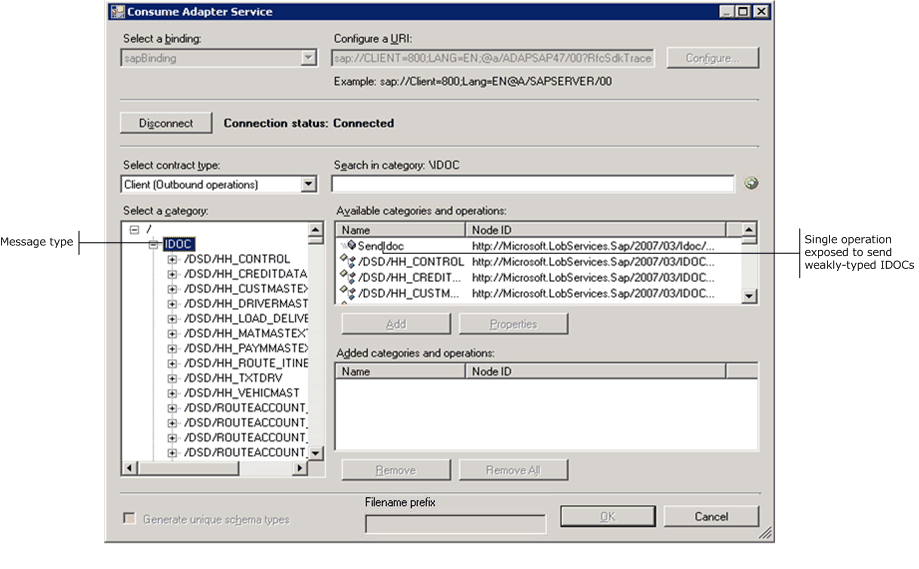
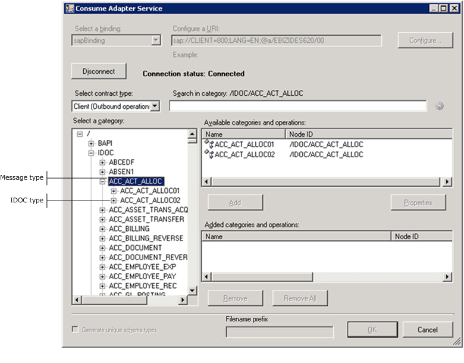
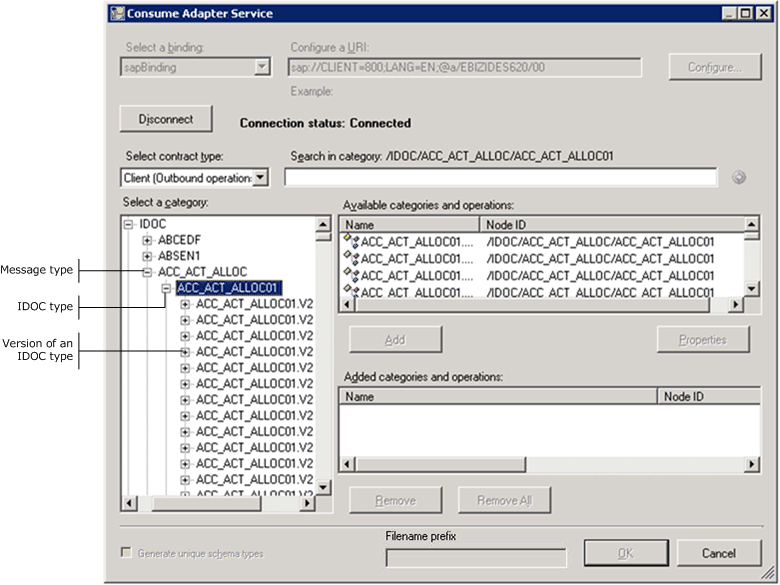
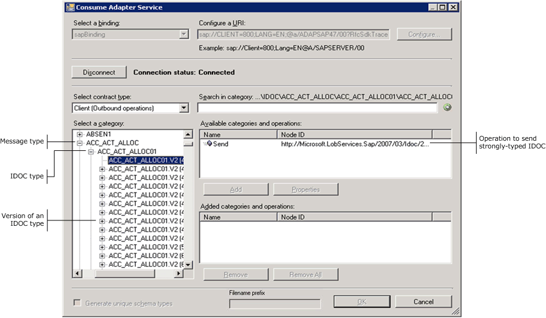
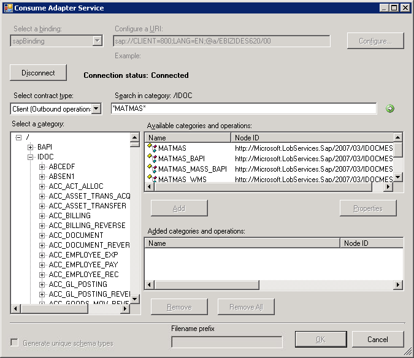
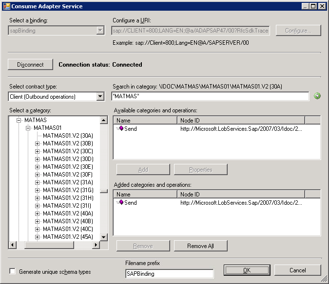
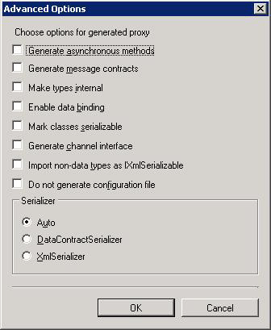

# Browse, search, and get metadata for IDOC operations in SAP
This section provides instructions on how to browse, search, and retrieve metadata from SAP for IDOC operations using [!INCLUDE[addadapterservrefshort](../../includes/addadapterservrefshort-md.md)], [!INCLUDE[addadapterwiz](../../includes/addadapterwiz-md.md)], or [!INCLUDE[consumeadapterservshort](../../includes/consumeadapterservshort-md.md)]. Most of the instructions are same for all three user interface. Wherever applicable, separate procedures are provided for the relevant user interface.  
  
 Before performing the steps provided in the following sections, you must have:  
  
- Created a [!INCLUDE[btsVStudioNoVersion](../../includes/btsvstudionoversion-md.md)] project.  
  
- Connected to the SAP system using [!INCLUDE[consumeadapterservshort](../../includes/consumeadapterservshort-md.md)], [!INCLUDE[addadapterwiz](../../includes/addadapterwiz-md.md)], or [!INCLUDE[addadapterservrefshort](../../includes/addadapterservrefshort-md.md)]. For instructions see [Connect to the SAP System in Visual Studio](../../adapters-and-accelerators/adapter-sap/connect-to-the-sap-system-in-visual-studio.md) Note that before connecting to an SAP system to generate schema or a WCF client for IDOCs, you must set certain binding properties.  
  
  - GenerateFlatFileCompatibleIdocSchema  
  
  - ReceiveIdocFormat  
  
  - FlatFileSegmentIndicator  
  
    These properties govern how metadata for IDOC is retrieved from an SAP system. For more information about these properties, see [Read about BizTalk Adapter for mySAP Business Suite binding properties](../../adapters-and-accelerators/adapter-sap/read-about-biztalk-adapter-for-mysap-business-suite-binding-properties.md). For instructions on how to set the binding properties see [Configure the binding properties for the SAP adapter](../../adapters-and-accelerators/adapter-sap/configure-the-binding-properties-for-the-sap-adapter.md).  
  
## Browsing IDOCs in an SAP System  
 While browsing metadata using [!INCLUDE[consumeadapterservshort](../../includes/consumeadapterservshort-md.md)], [!INCLUDE[addadapterwiz](../../includes/addadapterwiz-md.md)], or [!INCLUDE[addadapterservrefshort](../../includes/addadapterservrefshort-md.md)], the [!INCLUDE[adaptersap_short](../../includes/adaptersap-short-md.md)] surfaces separate operations for sending and receiving IDOCs from an SAP system.  
  
- **Send** and **Receive**. Adapter clients can use these operations to send and receive IDOCs from an SAP system using a strongly-typed schema. The adapter surfaces these operations separately for each IDOC and are available under the respective IDOC node.  
  
- **SendIdoc** and **ReceiveIdoc**. Adapter clients can use these operations to send and receive IDOCs from an SAP system using a weakly-typed schema. The [!INCLUDE[adaptersap_short](../../includes/adaptersap-short-md.md)] only surfaces one **SendIdoc** and **ReceiveIdoc** operation for all IDOCs. These operations are available directly under the **IDOC** node.  
  
  Perform the following steps to browse IDOCs in an SAP system using the [!INCLUDE[consumeadapterservshort](../../includes/consumeadapterservshort-md.md)], [!INCLUDE[addadapterwiz](../../includes/addadapterwiz-md.md)], or [!INCLUDE[addadapterservrefshort](../../includes/addadapterservrefshort-md.md)].  
  
#### To browse IDOCs in an SAP system  
  
1. Connect to an SAP server using the [!INCLUDE[consumeadapterservshort](../../includes/consumeadapterservshort-md.md)], [!INCLUDE[addadapterwiz](../../includes/addadapterwiz-md.md)], or [!INCLUDE[addadapterservrefshort](../../includes/addadapterservrefshort-md.md)]. See [Connecting to the SAP System in Visual Studio](../../adapters-and-accelerators/adapter-sap/connect-to-the-sap-system-in-visual-studio.md) for instructions.  
  
2. From the **Select contract type** drop-down list, select the type of contract based on whether you will be performing inbound or outbound operations using the adapter.  
  
3. In the **Select a category** box, click the IDOC node to see the IDOC message types in the **Available categories and operations** box. Alternatively, you can also see the IDOC message types by expanding the IDOC node.  
  
   > [!TIP]
   >  You can directly go to the “immediate” category node or subcategory nodes in the tree, by typing the name of the artifact in while the focus is on the tree view in the **Select a category** box. For example, to jump to the **ACC_BILLING** IDOC message type, keep the focus on the **IDOC** node, and then type `ACC_BILLING`.  
  
    The following figure shows the [!INCLUDE[consumeadapterservshort](../../includes/consumeadapterservshort-md.md)] listing the IDOC message types. The root IDOC node also surfaces a **SendIdoc** option to send weakly-typed IDOCs to the SAP system.  
  
      
  
   > [!NOTE]
   >  For an inbound scenario, the root IDOC node surfaces a **ReceiveIdoc** operation to receive weakly typed IDOCs.  
  
4. Click the IDOC message types to see the relevant IDOC type. The following figure shows the [!INCLUDE[consumeadapterservshort](../../includes/consumeadapterservshort-md.md)] with the IDOC type under a particular IDOC message type.  
  
      
  
5. Click the IDOC types to see the different versions for an IDOC type. The following figure shows the [!INCLUDE[consumeadapterservshort](../../includes/consumeadapterservshort-md.md)] with the versions for a particular IDOC type.  
  
      
  
6. Click the version of an IDOC type to see the supported operations on that IDOC type. The following figure shows the [!INCLUDE[consumeadapterservshort](../../includes/consumeadapterservshort-md.md)] with the operation supported for a particular IDOC type version.  
  
      
  
## Searching IDOCs in an SAP System  
 While searching metadata for IDOCs in an SAP system using [!INCLUDE[consumeadapterservshort](../../includes/consumeadapterservshort-md.md)], [!INCLUDE[addadapterwiz](../../includes/addadapterwiz-md.md)], [!INCLUDE[addadapterservrefshort](../../includes/addadapterservrefshort-md.md)], the [!INCLUDE[adaptersap_short](../../includes/adaptersap-short-md.md)]:  
  
- Supports wildcard characters in the search expression.  
  
- Enables search immediately under the node at which the search operation is performed.  
  
  The following table lists the special characters that can be used for search and their interpretation by the [!INCLUDE[adaptersap_short](../../includes/adaptersap-short-md.md)].  
  
|Special character|Interpretation|  
|-----------------------|--------------------|  
|+ (plus)|Matches exactly one character.   For example, A+ matches AB, AC, AD|  
|* (asterisk)|Matches zero or more characters.   For example, A* matches A, AB, ABC.|  
  
 For more information about the special characters supported by the adapter, see [Expose adapter settings as a binding property using the WCF LOB Adapter SDK](../../adapters-and-accelerators/wcf-lob-adapter-sdk/expose-adapter-settings-as-a-binding-property-using-the-wcf-lob-adapter-sdk.md).
  
 Perform the following steps to search IDOCs in an SAP system using the [!INCLUDE[consumeadapterservshort](../../includes/consumeadapterservshort-md.md)], [!INCLUDE[addadapterwiz](../../includes/addadapterwiz-md.md)], [!INCLUDE[addadapterservrefshort](../../includes/addadapterservrefshort-md.md)].  
  
#### To search IDOCs in an SAP system  
  
1. Connect to an SAP server using the [!INCLUDE[consumeadapterservshort](../../includes/consumeadapterservshort-md.md)], [!INCLUDE[addadapterwiz](../../includes/addadapterwiz-md.md)], or [!INCLUDE[addadapterservrefshort](../../includes/addadapterservrefshort-md.md)]. See [Connect to the SAP System in Visual Studio](../../adapters-and-accelerators/adapter-sap/connect-to-the-sap-system-in-visual-studio.md) for instructions.  
  
2. From the **Select contract type** drop-down list, select the type of contract based on whether you will be searching for inbound or outbound operations using the adapter.  
  
3. In the **Select a category** box, click the IDOC node.  
  
   > [!IMPORTANT]
   >  You can search for IDOCs only at the root level.  
  
4. In the **Search in category** text box, enter a search expression to search for a specific IDOC message type. For example, to search for IDOCs that have "MATMAS" in their names, type *MATMAS\* in the text box.  
  
5. Click the button with the right-arrow icon to start the search. After the search is complete, the **Available categories and operations** box lists the IDOCs that satisfy the search criteria.  
  
    The following figure shows the [!INCLUDE[consumeadapterservshort](../../includes/consumeadapterservshort-md.md)] listing the IDOC search result.  
  
      
  
## Generating Schema for BizTalk Projects  
 You can use the [!INCLUDE[consumeadapterservshort](../../includes/consumeadapterservshort-md.md)] or [!INCLUDE[addadapterwiz](../../includes/addadapterwiz-md.md)] to generate schema for selected SAP artifacts. Once you have browsed and searched for the artifacts you want to invoke, you can generate schema for those artifacts and send messages, conforming to the schema, to the SAP system.  
  
> [!NOTE]
>  You can select category nodes to return all the operations in that category's sub-tree—for example, you can select an IDOC type (to generate schema for all the versions of IDOCs in that group) or select a specific version of IDOC to generate schema for only that version of IDOC. For more information about the nodes, see [Metadata Node IDs](../../adapters-and-accelerators/adapter-sap/metadata-node-ids4.md).  
  
#### To retrieve metadata for IDOCs  
  
1. Connect to an SAP server using the [!INCLUDE[consumeadapterservshort](../../includes/consumeadapterservshort-md.md)] or [!INCLUDE[addadapterwiz](../../includes/addadapterwiz-md.md)]. See [Connect to the SAP System in Visual Studio](../../adapters-and-accelerators/adapter-sap/connect-to-the-sap-system-in-visual-studio.md) for instructions.  
  
2. From the **Select contract type** drop-down list, select the type of contract based on whether you will be performing inbound or outbound operations using the adapter.  
  
3. In the **Select a category** box, click the IDOC message type or the IDOC type for which you want to generate metadata.  
  
4. In the **Available categories and operations** box, select the IDOC type or the supported operations for which you want to generate metadata and click **Add**. The selected IDOC types or operations are listed in the **Added categories and operations** box.  
  
    The following figure shows the [!INCLUDE[consumeadapterservshort](../../includes/consumeadapterservshort-md.md)] listing the selected IDOCs.  
  
      
  
    If you want to generate schema for multiple operations, there may be some duplicate element definitions among these schema that may cause failure in compiling the BizTalk project. For example, consider a scenario where you generate schema for an operation “Op1”. The schema for “Op1” contains a parameter of complex data type “CT1”. After generating the schema for “Op1” you close the [!INCLUDE[consumeadapterservshort](../../includes/consumeadapterservshort-md.md)] and re-open it to generate schema for another operation “Op2”. Assume that “Op2” also contains a parameter of complex data type “CT1”. After you exit the [!INCLUDE[consumeadapterservshort](../../includes/consumeadapterservshort-md.md)] and compile the project, you will get compilation errors because the complex data type “CT1” is defined twice in different XSD files. In such situations, we recommend the following:  
  
   - Generate schema for all the operations in a single run of [!INCLUDE[consumeadapterservshort](../../includes/consumeadapterservshort-md.md)]. This ensures that the [!INCLUDE[consumeadapterservshort](../../includes/consumeadapterservshort-md.md)] generates only one definition for the complex data type “CT1”.  
  
   - If you want to generate schema for multiple operations across different runs of [!INCLUDE[consumeadapterservshort](../../includes/consumeadapterservshort-md.md)], make sure you select the **Generate unique schema types** check box so that the generated XSD files contain unique namespaces for the complex data type “CT1”.  
  
5. Click **OK**. The schema file is saved with an .xsd extension at the same location as the IDOC project.  
  
   > [!NOTE]
   >  If you are using [!INCLUDE[consumeadapterservshort](../../includes/consumeadapterservshort-md.md)], by default the files are created with the naming convention "SAPBinding\<n\>.xsd", where 'n' can be 1, 2, etc. depending on the number of schema files created. Alternatively, you can provide a custom name to the schema files by entering a name in the **Filename prefix** text box. The [!INCLUDE[consumeadapterservshort](../../includes/consumeadapterservshort-md.md)] now creates schema files with the naming convention \<filename prefix\>\<n\>.xsd.  
   > 
   > [!NOTE]
   >  The [!INCLUDE[consumeadapterservshort](../../includes/consumeadapterservshort-md.md)] also creates a binding file (an XML file) containing the binding properties that you specified while generating the schema for an operation and the SOAP action to invoke the operation. You can import this binding file in the BizTalk Server Administration console to create a WCF-Custom port with the connection URI, binding properties, and the SOAP action set. For more information, see [Configure a physical port binding using a port binding file to SAP](../../adapters-and-accelerators/adapter-sap/configure-a-physical-port-binding-using-a-port-binding-file-to-sap.md).  
  
6. On the **File** menu, click **Save All**.  
  
## Generating a WCF Client for IDOC Operations Using the Add Adapter Service Reference Plug-in  
 You can use the [!INCLUDE[addadapterservrefshort](../../includes/addadapterservrefshort-md.md)] to generate either WCF client code to send IDOCs to an SAP system or a WCF service contract to receive IDOCs from an SAP system.  
  
#### To generate a WCF client or a WCF service contract for IDOCs  
  
1. In the [!INCLUDE[addadapterservrefshort](../../includes/addadapterservrefshort-md.md)], from the **Select contract type** drop-down list, select the type of contract based on whether you will be performing inbound (receiving IDOCs) or outbound (sending IDOCs) operations.  
  
2. In the **Select a category** box, expand the **IDOC** node, and then browse or search for the IDOC message type or the IDOC type that you want to send or receive.  
  
3. In the **Available categories and operations** box, select the IDOC type or the supported operations for which you want to generate a WCF client (or WCF service contract), and then click **Add**. The selected operations are listed in the **Added categories and operations** box. You can select any node that is listed in the **Available categories and operations** box. If you select a category node, then all of the operations available under that node and its sub-nodes will be added.  
  
   > [!IMPORTANT]
   >  The [!INCLUDE[addadapterservrefshort](../../includes/addadapterservrefshort-md.md)] generates a unique WCF client class (or WCF service contract) for each IDOC type. Depending on the categories and operations that you select, more than one WCF client class may be generated. For more information, see [Generate a WCF client or a WCF service contract for SAP solution artifacts](../../adapters-and-accelerators/adapter-sap/generate-a-wcf-client-or-a-wcf-service-contract-for-sap-solution-artifacts.md).  
  
4. For most scenarios the default serialization options are sufficient; however, if needed, you can control several aspects about the code that is generated and the type of serializer that is used. To set these options:  
  
   1. Click **Advanced Options** to open the **Advanced Options** box.  
  
   2. In the **Advanced Options** box under **Choose options for generated proxy**, select the options that you want. For example, you can select whether asynchronous methods are generated for the WCF client or disable the generation of a configuration file.  
  
   3. Under **Serializer** select the serializer that should be used.  
  
      The following figure shows the **Advanced Options** box with the default selections (**Auto** is selected for the serializer and no other options are selected).  
  
        
  
      The options that you can configure in the **Advanced Options** box are equivalent to some of the options available when you use the ServiceModel Metadata Utility Tool (svcutil.exe). For more information about these options, see [ServiceModel Metadata Utility Tool (Svcutil.exe)](https://msdn.microsoft.com/library/aa347733.aspx).
  
5. Click **OK**. The [!INCLUDE[addadapterservrefshort](../../includes/addadapterservrefshort-md.md)] saves the WCF client class (or WCF service interface) and helper code for the operations and categories that you have selected in your project directory. By default, a configuration file is also saved. Slightly different files are generated for inbound and outbound operations; for more information, see [Generate a WCF client or a WCF service contract for SAP solution artifacts](../../adapters-and-accelerators/adapter-sap/generate-a-wcf-client-or-a-wcf-service-contract-for-sap-solution-artifacts.md).  
  
## See Also  
 [Get Metadata for SAP Operations in Visual Studio](../../adapters-and-accelerators/adapter-sap/get-metadata-for-sap-operations-in-visual-studio.md)