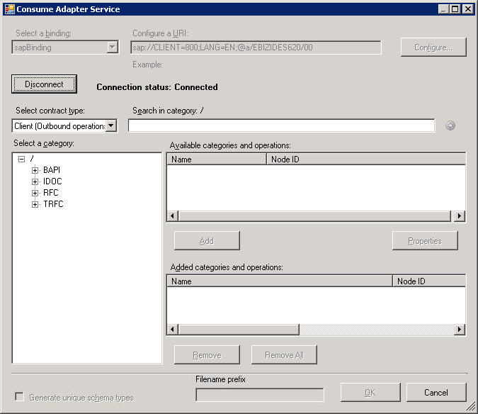

# Connecting to SAP in Visual Studio Using Consume Adapter Service Add-in
The [!INCLUDE[consumeadapterservshort](../../includes/consumeadapterservshort-md.md)] is installed when you install WCF LOB Adapter SDK. The [!INCLUDE[consumeadapterservshort](../../includes/consumeadapterservshort-md.md)] loads all the WCF-Custom bindings installed on the computer. To connect to SAP system using the WCF-based [!INCLUDE[adaptersap_short](../../includes/adaptersap-short-md.md)] in a BizTalk project, you must use the **sapbinding**.  

 This topic provides instructions on how to use the [!INCLUDE[consumeadapterservshort](../../includes/consumeadapterservshort-md.md)].  

## Connecting to an SAP System Using Consume Adapter Service Add-in  
 Perform the following steps to connect to an SAP system using the [!INCLUDE[consumeadapterservshort](../../includes/consumeadapterservshort-md.md)].  

#### To connect to an SAP system  

1. To connect using the [!INCLUDE[consumeadapterservshort](../../includes/consumeadapterservshort-md.md)] in a BizTalk solution:  

   1. Create a BizTalk project using [!INCLUDE[btsVStudioNoVersion](../../includes/btsvstudionoversion-md.md)].  

   2. Right-click the project name in Solution Explorer, point to **Add**, and then click **Add Generated Items**.  

   3. In the **Add Generated Items** dialog box, do the following:  

      |    Use this    |             To do this             |
      |----------------|------------------------------------|
      | **Categories** | Click **Consume Adapter Service**. |
      | **Templates**  | Click **Consume Adapter Service**. |

   4. Click **Add**. The [!INCLUDE[consumeadapterservshort](../../includes/consumeadapterservshort-md.md)] opens.  

2. From the **Select a binding** drop-down list, select **sapBinding** and click **Configure**.  

3. In the **Configure Adapter** dialog box, click the **Security** tab, and from the **Client credential type** drop-down list box, select **Username** and specify the user name and password to connect to the SAP system.  

   > [!IMPORTANT]
   >  If you are using the SAP Secure Network Connection (SNC) library to connect to an SAP system, do not specify a username and password.  

4. Click the **URI Properties** tab and specify values for the connection parameters. For more information about the connection URI for the [!INCLUDE[adaptersap_short](../../includes/adaptersap-short-md.md)], see [Create the SAP system connection URI](../../adapters-and-accelerators/adapter-sap/create-the-sap-system-connection-uri.md).  

   > [!IMPORTANT]
   >  If you are using the SAP SNC library to connect to an SAP system, set the **UseSnc** connection property to **True**.  

   > [!NOTE]
   >  If the connection parameters contain any reserved characters, you must specify them as-is in the **URI Properties** tab, that is, without using any escape characters. However, if you specify the URI directly in the **Configure a URI** field and the connection parameters contain reserved characters, you must specify the connection parameters using proper escape characters.  

5. Click the **Binding Properties** tab, and then specify values for the binding properties, if any, required by the operations you want to target. For example, if you want to target a ReceiveIdoc operation you must set the **ReceiveIdocFormat** binding property to String. For more information about binding properties, see [Read about BizTalk Adapter for mySAP Business Suite binding properties](../../adapters-and-accelerators/adapter-sap/read-about-biztalk-adapter-for-mysap-business-suite-binding-properties.md).  

   > [!IMPORTANT]
   >  If you are using the SAP SNC library to connect to an SAP system, set the **SncLibrary** and **SncPartnerName** to appropriate values.  
   > 
   >  The **SncLibrary** binding property takes the path and the filename of the DLLs required for using SNC to connect to an SAP system. These DLLs must be present on the computer with the SAP client and [!INCLUDE[adaptersap_short](../../includes/adaptersap-short-md.md)] installed. For more information see the [!INCLUDE[adapterpacknoversion](../../includes/adapterpacknoversion-md.md)] installation guide available at \<installation guide\>:\Program Files\Microsoft [!INCLUDE[adapterpacknoversion](../../includes/adapterpacknoversion-md.md)]\Documents.  
   > 
   >  The **SncPartnerName** binding property takes the SNC name of the communication partner.  

6. Click **OK**.  

7. Click **Connect**. After the connection is established, the connection status is shown as **Connected**.  

    The following figure shows the [!INCLUDE[consumeadapterservshort](../../includes/consumeadapterservshort-md.md)] immediately after the connection is established.  

      

    The [!INCLUDE[consumeadapterservshort](../../includes/consumeadapterservshort-md.md)] displays different nodes containing various artifacts that can be invoked in an SAP system. For example, the **RFC** node contains all the RFCs available in the SAP system you connected to. For more information about these nodes, see [Metadata Node IDs](../../adapters-and-accelerators/adapter-sap/metadata-node-ids4.md).  

## See Also  
 [Connect to the SAP System in Visual Studio](../../adapters-and-accelerators/adapter-sap/connect-to-the-sap-system-in-visual-studio.md)