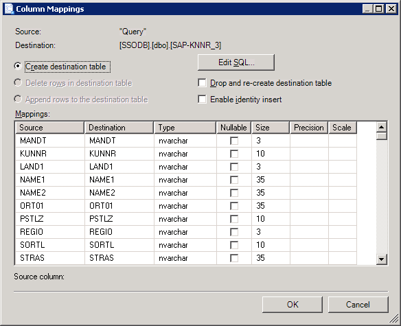

# Import SAP Data Using Visual Studio
This section provides information on how to use Microsoft [!INCLUDE[btsVStudioNoVersion](../../includes/btsvstudionoversion-md.md)] to import data from an SAP system into a SQL Server database. This section provides instruction on how to create an SSIS package that you can execute to import data. This section also provides information on how to execute the SSIS package.  
  
## Prerequisites  
 Before performing the procedures provided in this topic, make sure:  
  
- [!INCLUDE[adoprovidersapshort](../../includes/adoprovidersapshort-md.md)] is installed on the computer.  
  
- [!INCLUDE[btsVStudio2008](../../includes/btsvstudio2008-md.md)] is installed on the computer.  
  
### To import data using Visual Studio  
  
1. Start [!INCLUDE[btsVStudioNoVersion](../../includes/btsvstudionoversion-md.md)] and create an Integration Service project.  
  
2. From the **Project** menu, select **SSIS Import and Export Wizard**. This starts the **SQL Server Import and Export Wizard**.  
  
3. Read the information on the welcome screen and click **Next**.  
  
4. In the **Choose a Data Source** dialog box, from the **Data Source** drop-down list **.NET Framework Data Provider for mySAP Business Suite**. The dialog box lists the different connection parameters to connect to an SAP system. A typical connection string to connect to an SAP system using the [!INCLUDE[adoprovidersapshort](../../includes/adoprovidersapshort-md.md)] requires:  
  
   - The connection parameters for a connection type. The [!INCLUDE[adoprovidersapshort](../../includes/adoprovidersapshort-md.md)] supports connection types A, B, and D. To connect to an SAP system you must provide connection parameters for any *one* of these connection types. For example, for connection type A, you must provide the name of the application server host and the system number.  
  
   - The login information to connect to an SAP system such as username and password.  
  
     For more information about the connection string to connect to an SAP system using the [!INCLUDE[adoprovidersapshort](../../includes/adoprovidersapshort-md.md)], see [Read about Data Provider for the SAP Connection String](../../adapters-and-accelerators/adapter-sap/read-about-data-provider-types-for-the-sap-connection-string.md).  
  
     In the **Choose a Data Source** dialog box, specify:  
  
   - The connection parameters for any one connection type.  
  
   - The login information to connect to an SAP system.  
  
   - Whether you want to enable SAP GUI debugging.  
  
   - Whether you want to use RFC SDK tracing.  
  
     Click **Next**.  
  
5. In the **Choose a Destination** dialog box:  
  
   1.  From the **Destination** drop-down list, select **SQL Native Client**.  
  
   2.  From the **Server name** drop-down list, select a SQL server name.  
  
   3.  Select an authentication mode.  
  
   4.  From the **Database** drop-down list, select the database to which you want to import the SAP table.  
  
   5.  Click **Next**.  
  
6. In the **Specify Table Copy or Query** dialog box, choose the **Write a query to specify the data to transfer** option and click **Next**.  
  
7. In the **Provide a Source Query** dialog box, specify a SELECT query to filter the data to be imported into the SQL Server. For more information about the grammar for a SELECT query for the [!INCLUDE[adoprovidersapshort](../../includes/adoprovidersapshort-md.md)], see [Syntax for a SELECT Statement in SAP](../../adapters-and-accelerators/adapter-sap/syntax-for-a-select-statement-in-sap.md).  
  
    Click the **Parse** button to validate the query and click **OK** in the pop-up dialog box. Click **Next**.  
  
8. In the **Select Source Tables and Views** dialog box, select the check box against the source and destination tables. The source is the query you specified to retrieve data from SAP. The destination is the table that will be created in the SQL Server database.  
  
9. The wizard creates a default mapping between the source and destination table fields. However, you can change the mappings according to your requirement. To change the field mappings, click **Edit Mappings**.  
  
       
  
10. In the **Column Mappings** dialog box, you can:  
  
    -   Change the names of columns in the destination table.  
  
    -   Ignore certain columns in the destination table.  
  
    -   Change the data type for fields in destination table.  
  
    -   Change other field attributes such as nullable, size, precision, and scale.  
  
    -   Click **OK**.  
  
11. In the **Select Source Tables and Views** dialog box, click **Next**.  
  
12. In the **Complete the Wizard** dialog box, review the summary of actions that the wizard will perform, and click **Finish**.  
  
13. In the **Performing Operation** dialog box, the wizard starts executing tasks to import the information from SAP into a SQL Server database table. The status for each task is displayed in the wizard.  
  
14. After all the tasks are successfully executed, click **Close**. If a task fails, see the corresponding error message, fix the issue, and rerun the wizard.  
  
15. The wizard adds an SSIS package to your Integration Service project. Save the Integration Service project.  
  
## Running the SSIS Package  
 Once the package is created within an Integration Service project, you can execute it to import data from an SAP system into a SQL Server database. Perform the following steps to import SAP data by executing the package.  
  
#### To run the package from Visual Studio  
  
1. Navigate to the SSIS package in the Solution Explorer.  
  
2. Right-click the package name and select **Execute Package**.  
  
   For more information about running packages, see [http://go.microsoft.com/fwlink/?LinkId=94972](http://go.microsoft.com/fwlink/?LinkId=94972). For any other information related to SSIS packages, see [http://go.microsoft.com/fwlink/?LinkId=94973](http://go.microsoft.com/fwlink/?LinkId=94973).  
  
## Verifying the Results  
 After executing the package, you must verify the results by logging on to the SQL Server and navigating to the database to which the SAP data is imported. Executing the package should have created a table in destination database and populated with the values from the SAP table.  
  
## See Also  
 [Use the Data Provider for SAP with SSIS](../../adapters-and-accelerators/adapter-sap/use-the-data-provider-for-sap-with-ssis.md)