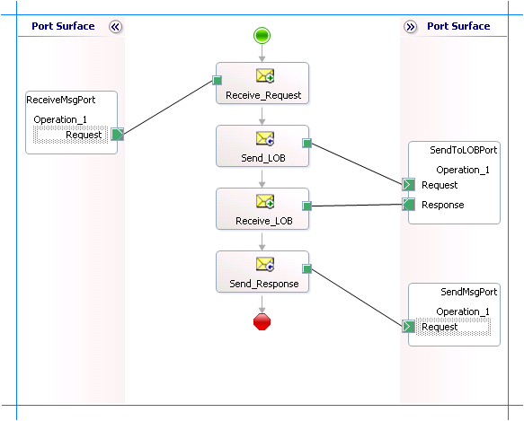

# Invoke RFCs in SAP using BizTalk Server
The [!INCLUDE[adaptersap_short](../../includes/adaptersap-short-md.md)] surfaces the RFCs exposed by an SAP system as operations that can be invoked by an adapter client. This section provides instructions on invoking an RFC in an SAP system by using the [!INCLUDE[adaptersap_short](../../includes/adaptersap-short-md.md)] with Microsoft [!INCLUDE[btsBizTalkServerNoVersion](../../includes/btsbiztalkservernoversion-md.md)]. For more information about how the [!INCLUDE[adaptersap_short](../../includes/adaptersap-short-md.md)] supports invoking an RFC in an SAP system, see [Operations on RFCs in SAP](../../adapters-and-accelerators/adapter-sap/operations-on-rfcs-in-sap.md). For more information about the structure of SOAP message for invoking an RFC, see [Message Schemas for RFC Operations](../../adapters-and-accelerators/adapter-sap/message-schemas-for-rfc-operations.md).  
  
## How to Invoke an RFC in an SAP system?  
 Performing an operation on an SAP system using the [!INCLUDE[adaptersap_short](../../includes/adaptersap-short-md.md)] with [!INCLUDE[btsBizTalkServerNoVersion](../../includes/btsbiztalkservernoversion-md.md)] involves procedural tasks described in [Building blocks to create SAP applications](../../adapters-and-accelerators/adapter-sap/building-blocks-to-create-sap-applications.md). To invoke an RFC in an SAP system, these tasks are:  
  
1. Create a BizTalk project and generate schema for the RFC you want to invoke in the SAP system.  
  
2. Create messages in the BizTalk project for sending and receiving messages from the SAP system.  
  
3. Create an orchestration to invoke an RFC in the SAP system.  
  
4. Build and deploy the BizTalk project.  
  
5. Configure the BizTalk application by creating physical send and receive ports.  
  
6. Start the BizTalk application.  
  
   This topic provides instructions to perform these tasks.  
  
## Generating Schema  
 In this topic, to demonstrate how to invoke an RFC in an SAP system, we generate the schema for *RFC_CUSTOMER_GET*. See [Browse, Search, and get Metadata for RFC Operations in SAP](../../adapters-and-accelerators/adapter-sap/browse-search-and-get-metadata-for-rfc-operations-in-sap.md) for more information about how to generate schema.  
  
## Defining Messages and Message Types  
 The schema that you generated earlier describes the "types" required for the messages in the orchestration. A message is typically a variable, the type for which is defined by the corresponding schema. You must link the schema you generated to the messages from the Orchestration view of the BizTalk project.  
  
 For this topic, you must create two messages—one to send a request to the SAP system and the other to receive a response.  
  
 Perform the following steps to create messages and link them to the schema.  
  
#### To create messages and link to schema  
  
1.  Open the orchestration view the BizTalk project, if not already open. Click **View**, point to **Other Windows**, and click **Orchestration View**.  
  
2.  In the **Orchestration View**, right-click **Messages**, and then click **New Message**.  
  
3.  Right-click the newly create message and select **Properties Window**.  
  
4.  In the **Properties** pane for **Message_1**, do the following.  
  
    |Use this|To do this|  
    |--------------|----------------|  
    |Identifier|Type **Request**.|  
    |Message Type|From the drop-down list, expand **Schemas**, and select *InvokeRFC.SAPBindingSchema.RFC_CUSTOMER_GET*, where *InvokeRFC* is the name of your BizTalk project.  *SAPBindingSchema* is the schema generated for *RFC_CUSTOMER_GET*.|  
  
5.  Repeat the previous step to create a new message. In the **Properties** pane for the new message, do the following.  
  
    |Use this|To do this|  
    |--------------|----------------|  
    |Identifier|Type **Response**.|  
    |Message Type|From the drop-down list, expand **Schemas**, and select *InvokeRFC.SAPBindingSchema.RFC_CUSTOMER_GETResponse*.|  
  
## Setting up the Orchestration  
 You must create a BizTalk orchestration to use [!INCLUDE[btsBizTalkServerNoVersion](../../includes/btsbiztalkservernoversion-md.md)] for invoking RFCs in the SAP system. In this orchestration, you drop a request message at a defined receive location. The [!INCLUDE[adaptersap_short](../../includes/adaptersap-short-md.md)] consumes the message and passes it on to the SAP system. The response from the SAP system is saved to another location. A typical orchestration for invoking RFCs in an SAP system would contain:  
  
- Send and Receive shapes to send messages to the SAP system and receive responses.  
  
- A one-way receive port to receive request messages to send to the SAP system.  
  
- A two-way send port to send request messages to the SAP system and receive responses.  
  
- A one-way send port to send the responses from the SAP system to a folder.  
  
  A sample orchestration resembles the following:  
  
    
  
### Adding Message Shapes  
 Make sure you specify the following properties for each of the message shapes. The names listed in the *Shape* column are the names of the message shapes as displayed in the preceding orchestration.  
  
|Shape|Shape Type|Properties|  
|-----------|----------------|----------------|  
|Receive_Request|Receive|-   Set **Name** to *Receive_Request*<br />-   Set **Activate** to *True*|  
|Send_LOB|Send|-   Set **Name** to *Send_LOB*|  
|Receive_LOB|Receive|-   Set **Name** to *Receive_LOB*<br />-   Set **Activate** to *False*|  
|Send_Response|Send|-   Set **Name** to *Send_Response*|  
  
### Adding Ports  
 Specify the following properties for each of the logical ports. The names listed in the *Port* column are the names of the ports as displayed in the orchestration.  
  
|Port|Properties|  
|----------|----------------|  
|ReceiveMsgPort|-   Set **Identifier** to *ReceiveMsgPort*<br />-   Set **Type** to *ReceiveMsgPortType*<br />-   Set **Communication Pattern** to *One-Way*<br />-   Set **Communication Direction** to *Receive*|  
|SendToLOBPort|-   Set **Identifier** to *SendToLOBPort*<br />-   Set **Type** to *SendToLOBPortType*<br />-   Set **Communication Pattern** to *Request-Response*<br />-   Set **Communication Direction** to *Send-Receive*|  
|SendMsgPort|-   Set **Identifier** to *SendMsgPort*<br />-   Set **Type** to *SendMsgPortType*<br />-   Set **Communication Pattern** to *One-Way*<br />-   Set **Communication Direction** to *Send*|  
  
## Specify Messages for Action Shapes and Connect to Ports  
 The following table specifies the properties and their values to be set to specify messages for action shapes and linking them to the ports. The names listed in the *Shape* column are the names of the message shapes as displayed in the preceding orchestration.  
  
|Shape|Properties|  
|-----------|----------------|  
|Receive_Request|-   Set **Message** to *Request*<br />-   Set **Operation** to *ReceiveMsgPort.Operation_1.Request*|  
|Send_LOB|-   Set **Message** to *Request*<br />-   Set **Operation** to *SendToLOBPort.Operation_1.Request*|  
|Receive_LOB|-   Set **Message** to *Response*<br />-   Set **Operation** to *SendToLOBPort.Operation_1.Response*|  
|Send_Response|-   Set **Message** to *Response*<br />-   Set **Operation** to *SendMsgPort.Operation_1.Request*|  
  
 After you have specified these properties, the message shapes and ports are connected and your orchestration is complete.  
  
 You must now build the BizTalk solution and deploy it to a [!INCLUDE[btsBizTalkServerNoVersion](../../includes/btsbiztalkservernoversion-md.md)]. For more information, see [Building and Running Orchestrations](../../core/building-and-running-orchestrations.md).
  
## Configuring the BizTalk Application  
 After you have deployed the BizTalk project, the orchestration you created earlier is listed under the **Orchestrations** pane in the BizTalk Server Administration console. You must use the BizTalk Server Administration console to configure the application. For more information about configuring an application, see [How to Configure an Application](../../core/how-to-configure-an-application.md).
  
 Configuring an application involves:  
  
- Selecting a host for the application.  
  
- Mapping the ports that you created in your orchestration to physical ports in the BizTalk Server Administration console. For this orchestration you must:  
  
  - Define a location on the hard disk and a corresponding file port where you will drop a request message. The BizTalk orchestration will consume the request message and send it to the SAP system.  
  
  - Define a location on the hard disk and a corresponding file port where the BizTalk orchestration will drop the response message containing the response from the SAP system.  
  
  - Define a physical WCF-Custom or WCF-SAP send port to send messages to the SAP system. You must also specify the action in the send port. For information about how to create ports, see [Manually configure a physical port binding to the SAP adapter](../../adapters-and-accelerators/adapter-sap/manually-configure-a-physical-port-binding-to-the-sap-adapter.md).
  
    > [!NOTE]
    >  Generating the schema using the [!INCLUDE[consumeadapterservlong](../../includes/consumeadapterservlong-md.md)] also creates a binding file containing information about the ports and the actions to be set for those ports. You can import this binding file from the BizTalk Server Administration console to create send ports (for outbound calls) or receive ports (for inbound calls). For more information, see [Configure a physical port binding using a port binding file to SAP](../../adapters-and-accelerators/adapter-sap/configure-a-physical-port-binding-using-a-port-binding-file-to-sap.md).
  
## Starting the Application  
 You must start the BizTalk application for invoking an RFC in the SAP system. For instructions on starting a BizTalk application, see [How to Start an Orchestration](../../core/how-to-start-an-orchestration.md) or [how to start an application](../../core/how-to-start-and-stop-a-biztalk-application.md).
  
 At this stage, make sure:  
  
-   The FILE receive port to receive request messages for the orchestration is running.  
  
-   The FILE send port to receive the response messages from the orchestration is running.  
  
-   The WCF-Custom or WCF-SAP send port to send messages to the SAP system is running.  
  
-   The BizTalk orchestration for the operation is running.  
  
## Executing the Operation  
 After you run the application, you must drop a request message for the orchestration at a predefined location. See [Message Schemas for RFC Operations](../../adapters-and-accelerators/adapter-sap/message-schemas-for-rfc-operations.md) to know about the schema for the request message for invoking an RFC in an SAP system. For example, the request message to invoke RFC_CUSTOMER_GET is:  
  
```  
<RFC_CUSTOMER_GET xmlns="http://Microsoft.LobServices.Sap/2007/03/Rfc/">  
  <KUNNR>0000001390</KUNNR>  
  <NAME1>*</NAME1>  
  <CUSTOMER_T/>  
</RFC_CUSTOMER_GET>  
```  
  
 The orchestration consumes the message and sends it to the SAP system. The response from the SAP system is saved at other file location defined as part of the orchestration. For example, the response from the SAP system for the above request message is:  
  
```  
<?xml version="1.0" encoding="utf-8" ?>   
<RFC_CUSTOMER_GETResponse xmlns="http://Microsoft.LobServices.Sap/2007/03/Rfc/">  
  <CUSTOMER_T>  
    <RFCCUST xmlns="http://Microsoft.LobServices.Sap/2007/03/Types/Rfc/">  
      <KUNNR>0000001390</KUNNR>   
      <ANRED>Firma</ANRED>   
      <NAME1>Contoso, Ltd.</NAME1>   
      <PFACH />   
      <STRAS>4567 Main Street</STRAS>   
      <PSTLZ>98052</PSTLZ>   
      <ORT01>USA</ORT01>   
      <TELF1>555-0101</TELF1>   
      <TELFX>555-0102</TELFX>   
    </RFCCUST>  
  </CUSTOMER_T>  
</RFC_CUSTOMER_GETResponse>  
```  
  
## Possible Exceptions  
 For information about the exceptions you might encounter while invoking an RFC in an SAP system using BizTalk Server, see [Exceptions and Error Handling with the SAP adapter](../../adapters-and-accelerators/adapter-sap/exceptions-and-error-handling-with-the-sap-adapter.md).  
  
## Best Practices  
 After you have deployed and configured the BizTalk project, you can export configuration settings to an XML file called the bindings file. Once you generate a bindings file, you can import the configuration settings from the file so that you do not need to create the send ports, receive ports, etc. for the same orchestration. For more information about binding files, see [Reuse SAP adapter bindings](../../adapters-and-accelerators/adapter-sap/reuse-sap-adapter-bindings.md).  
  
## See Also  
[Develop BizTalk applications](../../adapters-and-accelerators/adapter-sap/develop-biztalk-applications-using-the-sap-adapter.md)