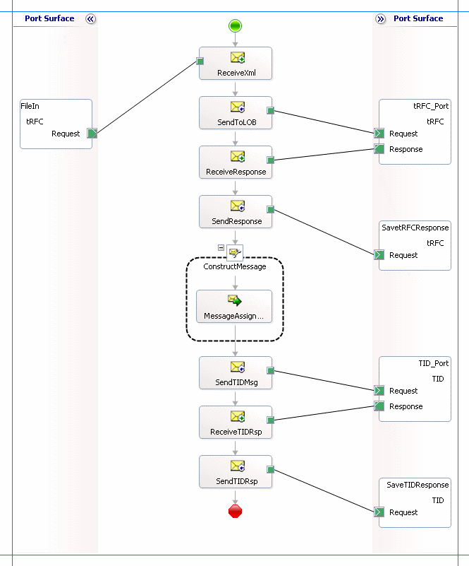

# Invoke tRFCs in SAP using BizTalk Server
Transactional Remote Function Calls (tRFCs) guarantee a one and only one time execution of an RFC on a SAP system. You can invoke any of the RFCs surfaced by the [!INCLUDE[adaptersap_short](../../includes/adaptersap-short-md.md)] as a tRFC. Invoking a tRFC is similar to invoking an RFC (see [Invoke RFCs in SAP by Using BizTalk Server](../../adapters-and-accelerators/adapter-sap/invoke-rfcs-in-sap-using-biztalk-server.md)) with the following differences:  
  
- The [!INCLUDE[adaptersap_short](../../includes/adaptersap-short-md.md)] surfaces tRFCs under a different node (**TRFC**) than RFCs (**RFC**).  
  
- tRFC operations include a GUID parameter that is mapped to the SAP Transaction ID for the tRFC by the [!INCLUDE[adaptersap_short](../../includes/adaptersap-short-md.md)].  
  
- After you invoke a tRFC, you must invoke the RfcConfirmTransID operation to confirm (commit) the tRFC on the SAP system. This operation is surfaced directly under the **TRFC** node in [!INCLUDE[consumeadapterservshort](../../includes/consumeadapterservshort-md.md)].  
  
  For more information about how the [!INCLUDE[adaptersap_short](../../includes/adaptersap-short-md.md)] supports invoking a tRFC, see [Operations on tRFCs in SAP](../../adapters-and-accelerators/adapter-sap/operations-on-trfcs-in-sap.md). For more information about the structure of SOAP messages for invoking a tRFC, see [Message Schemas for tRFC Operations](../../adapters-and-accelerators/adapter-sap/message-schemas-for-trfc-operations.md).  
  
## How to Invoke a tRFC in an SAP System Using BizTalk Server?  
 Performing an operation on an SAP system using [!INCLUDE[btsBizTalkServerNoVersion](../../includes/btsbiztalkservernoversion-md.md)] involves procedural tasks described in [Building blocks to create SAP applications](../../adapters-and-accelerators/adapter-sap/building-blocks-to-create-sap-applications.md). To invoke a tRFC in an SAP system, these tasks are:  
  
1. Create a BizTalk project and generate schema for the tRFC you want to invoke in the SAP system. You must also generate schema for the **RfcConfirmTransID** operation to commit the TID in the SAP system.  
  
2. Create messages in the BizTalk project for sending and receiving messages from the SAP system.  
  
3. Create an orchestration to invoke a tRFC in the SAP system and then commit the TID that is created in the SAP system in response to the tRFC call by the [!INCLUDE[adaptersap_short](../../includes/adaptersap-short-md.md)].  
  
4. Build and deploy the BizTalk project.  
  
5. Configure the BizTalk application by creating physical send and receive ports.  
  
6. Start the BizTalk application.  
  
   This topic provides instructions to perform these tasks.  
  
## Sample Based On This Topic  
 A sample, tRFCClient, based on this topic is also provided with the [!INCLUDE[adapterpacknoversion](../../includes/adapterpacknoversion-md.md)]. For more information, see [Samples fro the SAP adapter](../../adapters-and-accelerators/adapter-sap/samples-for-the-sap-adapter.md).  
  
## Generating Schema  
 In this topic, to demonstrate how to invoke a tRFC using the [!INCLUDE[adaptersap_short](../../includes/adaptersap-short-md.md)], we will generate the schema for:  
  
- *BAPI_SALESORDER_CREATEFROMDAT2* tRFC.  
  
- RfcConfirmTransID operation. You must use this operation to commit the TID that is created in the SAP system. Once the SAP system receives this call it deletes the TID from the system.  
  
  See [Browse, Search, and get Metadata for tRFC Operations in SAP](../../adapters-and-accelerators/adapter-sap/browse-search-and-get-metadata-for-trfc-operations-in-sap.md) for more information about how to generate schema.  
  
## Defining Messages and Message Types  
 The schema that you generated earlier describes the "types" required for the messages in the orchestration. A message is typically a variable, the type for which is defined by the corresponding schema. You must link the schema you generated to the messages from the Orchestration view of the BizTalk project.  
  
 For this topic, you must create four messages—a request-response message set to invoke the tRFC and another request-response message set to invoke the RfcConfirmTransID operation.  
  
 Perform the following steps to create messages and link them to the schema.  
  
#### To create messages and link to schema  
  
1.  Open the orchestration view the BizTalk project, if not already open. Click **View**, point to **Other Windows**, and click **Orchestration View**.  
  
2.  In the **Orchestration View**, right-click **Messages**, and then click **New Message**.  
  
3.  Right-click the newly create message and select **Properties Window**.  
  
4.  In the **Properties** pane for **Message_1**, do the following.  
  
    |Use this|To do this|  
    |--------------|----------------|  
    |Identifier|Type **Request**.|  
    |Message Type|From the drop-down list, expand **Schemas**, and select the message type. For example, select *tRFC_Client.SAPBindingSchema1.BAPI_SALESORDER_CREATEFROMDAT2*, where *tRFC_Client* is the name of your BizTalk project. *SAPBindingSchema1* is the schema generated for *BAPI_SALESORDER_CREATEFROMDAT2*.|  
  
5.  Repeat the previous step to create three more messages. In the **Properties** pane for the new messages, do the following.  
  
    |Set Identifier to|Set Message Type to|  
    |-----------------------|-------------------------|  
    |Response|*tRFC_Client.SAPBindingSchema1.BAPI_SALESORDER_CREATEFROMDAT2Response*|  
    |TIDRequest|*tRFC_Client.SAPBindingSchema3.RfcConfirmTransID*|  
    |TIDResponse|*tRFC_Client.SAPBindingSchema3.RfcConfirmTransIDResponse*|  
  
## Setting up the Orchestration  
 You must create a BizTalk orchestration to use [!INCLUDE[btsBizTalkServerNoVersion](../../includes/btsbiztalkservernoversion-md.md)] for invoking tRFCs in an SAP system. In this orchestration, you will be dropping a request message at a defined receive location. The orchestration consumes this message and passes it on to the SAP system. The response is received from SAP and is saved at another location. The response message contains a GUID. The orchestration includes a **Construct Message** shape to extract the GUID from the response and construct a message that conforms to the schema of the **RfcConfirmTransID** operation. The message to invoke the **RfcConfirmTransID** operation is sent to the SAP system with the GUID as a parameter _ A typical orchestration for invoking tRFCs in an SAP system, followed by a **RfcConfirmTransID** operation would contain:  
  
- Send and Receive shapes to send messages to the SAP system and receive responses.  
  
- A Construct Message shape and within that a Message Assignment shape to construct a message for the **RfcConfirmTransID** operation.  
  
- A one-way receive port to receive request messages to send to the SAP system to invoke the tRFC.  
  
- A two-way send port to send messages to invoke the tRFC and receive response.  
  
- A two-way send port to send messages to invoke the **RfcConfirmTransID** operation and receive response.  
  
- Two one-way send ports to send the responses from the SAP system to a folder.  
  
  A sample orchestration resembles the following:  
  
    
  
### Adding Message Shapes  
 Specify the following properties for each of the message shapes. The names listed in the *Shape* column are the names of the message shapes as displayed in the preceding orchestration.  
  
|Shape|Shape Type|Properties|  
|-----------|----------------|----------------|  
|ReceiveXml|Receive|-   Set **Name** to *ReceiveXml*<br />-   Set **Activate** to *True*|  
|SendToLOB|Send|-   Set **Name** to *SendToLOB*|  
|ReceiveResponse|Receive|-   Set **Name** to *ReceiveResponse*<br />-   Set **Activate** to *False*|  
|SendResponse|Send|-   Set **Name** to *SendResponse*|  
|SendTIDMsg|Send|-   Set **Name** to *SendTIDMsg*|  
|ReceiveTIDRsp|Receive|-   Set **Name** to *ReceiveTIDRsp*<br />-   Set **Activate** to *False*|  
|SendTIDRsp|Send|-   Set **Name** to *SendTIDRsp*|  
  
### Adding the Construct Message Shape  
 The response from the SAP system for the tRFC call contains a GUID. To commit the tRFC call, you must pass the same GUID to the RfcConfirmTransID operation. To do so, you must include a Construct Message shape, and within that a Message Assignment shape, in the orchestration. Here, the purpose of the Construct Message shape is:  
  
- To extract the GUID from the response that is received from the SAP system for the tRFC call.  
  
- To construct a message that conforms to the message schema for the RfcConfirmTransID operation.  
  
  For the Construct Message shape, you must set the **Message Constructed** property to **TIDRequest**.  
  
  You must add the following code excerpt to the Message Assignment shape:  
  
```  
XmlDoc = new System.Xml.XmlDocument();  
XmlDoc.LoadXml("<RfcConfirmTransID xmlns='http://Microsoft.LobServices.Sap/2007/03/RfcApi/'><TransactionalRfcOperationIdentifier /></RfcConfirmTransID>");  
TIDRequest = XmlDoc;  
TIDRequest.TransactionalRfcOperationIdentifier = xpath(Response,"string(/*[local-name()='BAPI_SALESORDER_CREATEFROMDAT2Response']/*[local-name()='TransactionalRfcOperationIdentifier']/text())");  
```  
  
 To use the above code excerpt, you must have:  
  
-   Created a variable, **XmlDoc**, in your BizTalk project and set its type to System.Xml.XmlDocument. For more information about creating variables, see [Using Variables in Orchestrations](../../core/using-variables-in-orchestrations.md).
  
-   Promoted the **TransactionalRfcOperationIdentifier** property in the schema for RfcConfirmTransID operation. For more information about promoting a property, see [Promoting Properties](../../core/promoting-properties.md).
  
### Adding Ports  
 Make sure you specify the following properties for each of the logical ports. The names listed in the *Port* column are the names of the ports as displayed in the orchestration.  
  
|Port|Properties|  
|----------|----------------|  
|FileIn|-   Set **Identifier** to *FileIn*<br />-   Set **Type** to *FileInPortType*<br />-   Set **Communication Pattern** to *One-Way*<br />-   Set **Communication Direction** to *Receive*|  
|tRFC_Port|-   Set **Identifier** to *tRFC_Port*<br />-   Set **Type** to *tRFC_PortType*<br />-   Set **Communication Pattern** to *Request-Response*<br />-   Set **Communication Direction** to *Send-Receive*|  
|SavetRFCResponse|-   Set **Identifier** to *SavetRFCResponse*<br />-   Set **Type** to *SavetRFCResponsePortType*<br />-   Set **Communication Pattern** to *One-Way*<br />-   Set **Communication Direction** to *Send*|  
|TID_Port|-   Set **Identifier** to *TID_Port*<br />-   Set **Type** to *TIDPortType*<br />-   Set **Communication Pattern** to *Request-Response*<br />-   Set **Communication Direction** to *Send-Receive*|  
|SaveTIDResponse|-   Set **Identifier** to *SaveTIDResponse*<br />-   Set **Type** to *SaveTIDResponsePortType*<br />-   Set **Communication Pattern** to *One-Way*<br />-   Set **Communication Direction** to *Send*|  
  
## Specify Messages for Action Shapes and Connect to Ports  
 The following table specifies the properties and their values to be set to specify messages for action shapes and linking them to the ports. The names listed in the *Shape* column are the names of the message shapes as displayed in the previous orchestration.  
  
|Shape|Properties|  
|-----------|----------------|  
|ReceiveXml|-   Set **Message** to *Request*<br />-   Set **Operation** to *FileIn.tRFC.Request*|  
|SendToLOB|-   Set **Message** to *Request*<br />-   Set **Operation** to *tRFC_Port.tRFC.Request*|  
|ReceiveResponse|-   Set **Message** to *Response*<br />-   Set **Operation** to *tRFC_Port.tRFC.Response*|  
|SendResponse|-   Set **Message** to *Response*<br />-   Set **Operation** to *SavetRFCResponse.tRFC.Request*|  
|SendTIDMsg|-   Set **Message** to *TIDRequest*<br />-   Set **Operation** to *TID_Port.TID.Request*|  
|ReceiveTIDRsp|-   Set **Message** to *TIDResponse*<br />-   Set **Operation** to *TID_Port.TID.Response*|  
|SendTIDRsp|-   Set **Message** to *TIDResponse*<br />-   Set **Operation** to *SaveTIDResponse.TID.Request*|  
  
 After you have specified these properties, the message shapes and ports are connected and your orchestration is complete.  
  
 You must now build the BizTalk solution and then deploy it to a BizTalk Server. For more information, see [Building and Running Orchestrations](../../core/building-and-running-orchestrations.md).  
  
## Configuring the BizTalk Application  
 After you have deployed the BizTalk project, the orchestration you created earlier is listed under the **Orchestrations** pane in the BizTalk Server Administration console. You must use the BizTalk Server Administration console to configure the application. For more information about configuring an application, see [How to Configure an Application](../../core/how-to-configure-an-application.md).
  
 Configuring an application involves:  
  
- Selecting a host for the application.  
  
- Mapping the ports that you created in your orchestration to physical ports in the BizTalk Server Administration console. For this orchestration you must:  
  
  - Define a location on the hard disk and a corresponding file port where you will drop a request message. The BizTalk orchestration will consume the request message to send it to the SAP system.  
  
  - Define a location on the hard disk and a corresponding file port where the BizTalk orchestration will drop the response message containing the response from the SAP system.  
  
  - Define physical WCF-Custom or WCF-SAP send ports (one each for the tRFC request message and the RfcConfirmTransID message) to send messages to the SAP system. You must also specify the action in the send port. For information about how to create ports, see [Manually configure a physical port binding to the SAP adapter](../../adapters-and-accelerators/adapter-sap/manually-configure-a-physical-port-binding-to-the-sap-adapter.md).
  
    > [!NOTE]
    >  Generating the schema using the [!INCLUDE[consumeadapterservlong](../../includes/consumeadapterservlong-md.md)] also creates a binding file containing information about the ports and the actions to be set for those ports. You can import this binding file from the BizTalk Server Administration console to create send ports (for outbound calls) or receive ports (for inbound calls). For more information, see [Configure a physical port binding using a port binding file to SAP](../../adapters-and-accelerators/adapter-sap/configure-a-physical-port-binding-using-a-port-binding-file-to-sap.md).
  
## Starting the Application  
 You must start the BizTalk application for invoking tRFCs in an SAP system. For instructions on starting a BizTalk application, see [How to Start an Orchestration](../../core/how-to-start-an-orchestration.md), or [How to start an application](../../core/how-to-start-and-stop-a-biztalk-application.md).  
  
 At this stage, make sure:  
  
-   The FILE receive port to receive request messages for the orchestration is running.  
  
-   The FILE send port to receive the response messages from the orchestration is running.  
  
-   The WCF-Custom or WCF-SAP send ports to send messages to the SAP system are running.  
  
-   The BizTalk orchestration for the operation is running.  
  
## Executing the Operation  
 After you run the application, you must drop a request message for the orchestration. See [Message Schemas for tRFC Operations](../../adapters-and-accelerators/adapter-sap/message-schemas-for-trfc-operations.md) to know about the schema for the request message for invoking a tRFC in an SAP system. For example, the request message to invoke BAPI_SALEASORDER_CREATEFROMDAT2 as a tRFC is:  
  
```  
<BAPI_SALESORDER_CREATEFROMDAT2 xmlns="http://Microsoft.LobServices.Sap/2007/03/Trfc/">  
  <ORDER_HEADER_IN>  
    <DOC_TYPE xmlns="http://Microsoft.LobServices.Sap/2007/03/Types/Rfc/">TA</DOC_TYPE>  
    <SALES_ORG xmlns="http://Microsoft.LobServices.Sap/2007/03/Types/Rfc/">1000</SALES_ORG>  
    <DISTR_CHAN xmlns="http://Microsoft.LobServices.Sap/2007/03/Types/Rfc/">10</DISTR_CHAN>  
    <DIVISION xmlns="http://Microsoft.LobServices.Sap/2007/03/Types/Rfc/">00</DIVISION>  
    <SALES_OFF xmlns="http://Microsoft.LobServices.Sap/2007/03/Types/Rfc/">1000</SALES_OFF>  
    <REQ_DATE_H xmlns="http://Microsoft.LobServices.Sap/2007/03/Types/Rfc/">2006-09-01T23:50:00</REQ_DATE_H>  
    <PURCH_DATE xmlns="http://Microsoft.LobServices.Sap/2007/03/Types/Rfc/">2006-08-25T23:50:00</PURCH_DATE>  
    <PURCH_NO_C xmlns="http://Microsoft.LobServices.Sap/2007/03/Types/Rfc/">Cust PO</PURCH_NO_C>  
    <CURRENCY xmlns="http://Microsoft.LobServices.Sap/2007/03/Types/Rfc/">EUR</CURRENCY>  
  </ORDER_HEADER_IN>  
  <ORDER_ITEMS_IN>  
    <BAPISDITM xmlns="http://Microsoft.LobServices.Sap/2007/03/Types/Rfc/">  
      <MATERIAL>P-109</MATERIAL>  
      <PLANT>1000</PLANT>  
      <TARGET_QU>ST</TARGET_QU>  
    </BAPISDITM>  
  </ORDER_ITEMS_IN>  
  <ORDER_PARTNERS>  
    <BAPIPARNR xmlns="http://Microsoft.LobServices.Sap/2007/03/Types/Rfc/">  
      <PARTN_ROLE>AG</PARTN_ROLE>  
      <PARTN_NUMB>0000001390</PARTN_NUMB>  
    </BAPIPARNR>  
  </ORDER_PARTNERS>  
  <RETURN/>  
  <TransactionalRfcOperationIdentifier>def689b1-b514-4627-a861-d6d7f51c84e3</TransactionalRfcOperationIdentifier>  
</BAPI_SALESORDER_CREATEFROMDAT2>  
```  
  
 The orchestration consumes the message, passes it on to the SAP system, and receives a response from the SAP system. The response message is saved at the other file location specified as part of the orchestration. The response from the SAP system contains a GUID. The orchestration then generates another request message from the response and passes it to the SAP system to execute the RfcConfirmTransID. After the response is received from the SAP system for the RfcConfirmTransID operation, it is copied to the file location. To summarize, after the operation is successfully executed:  
  
-   A response message from SAP for invoking the tRFC is copied to the file location. This contains the same GUID that was sent to the SAP system. The response message invoking BAPI_SALESORDER_CREATEFROMDAT2 as a tRFC is:  
  
    ```  
    <?xml version="1.0" encoding="utf-8"?>  
    <BAPI_SALESORDER_CREATEFROMDAT2Response xmlns="http://Microsoft.LobServices.Sap/2007/03/Trfc/">  
      <TransactionalRfcOperationIdentifier>def689b1-b514-4627-a861-d6d7f51c84e3</TransactionalRfcOperationIdentifier>  
    </BAPI_SALESORDER_CREATEFROMDAT2Response>  
    ```  
  
-   A response message for the RfcConfirmTransID is copied to the same location. This is an empty response. The response message for the RfcConfirmTransID is:  
  
    ```  
    <?xml version="1.0" encoding="utf-8"?>  
    <RfcConfirmTransIDResponse xmlns="http://Microsoft.LobServices.Sap/2007/03/RfcApi/"></RfcConfirmTransIDResponse>  
    ```  
  
> [!NOTE]
>  You can use the **ConvertGuidToTid()** public method exposed by the SAP adapter assembly to retrieve the TID in the SAP system mapped to the GUID. For more information, see [Special Operations](../../adapters-and-accelerators/adapter-sap/special-operations.md).  
  
## Possible Exceptions  
 For information about the exceptions you might encounter while invoking a tRFC in an SAP system using BizTalk Server, see [Exceptions and Error Handling with the SAP adapter](../../adapters-and-accelerators/adapter-sap/exceptions-and-error-handling-with-the-sap-adapter.md).  
  
## Best Practices  
 After you have deployed and configured the BizTalk project, you can export configuration settings to an XML file called the bindings file. Once you generate a bindings file, you can import the configuration settings from the file so that you do not need to create the send ports, receive ports, etc. for the same orchestration. For more information about binding files, see [Reuse SAP adapter bindings](../../adapters-and-accelerators/adapter-sap/reuse-sap-adapter-bindings.md).
  
## See Also  
[Develop BizTalk applications](../../adapters-and-accelerators/adapter-sap/develop-biztalk-applications-using-the-sap-adapter.md)