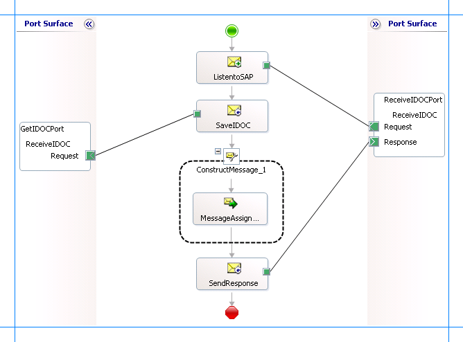

# Receive IDOCs from SAP using BizTalk Server
Receiving an IDOC involves the [!INCLUDE[adaptersap_short](../../includes/adaptersap-short-md.md)] to act as an RFC server to receive a special RFC call from SAP. The SAP adapter can receive IDOCs acting as an RFC server or a tRFC server. For more information about receiving an IDOC with the adapter behaving as a tRFC server, see [Receive IDOCs from SAP in a Transactional Context by Using BizTalk Server](../../adapters-and-accelerators/adapter-sap/receive-idocs-from-sap-in-a-transactional-context-using-biztalk-server.md).  

 The [!INCLUDE[adaptersap_short](../../includes/adaptersap-short-md.md)] surfaces two different operations to receive IDOCs:  

- **Receive** operation enables adapter to receive IDOCs having a strongly-typed schema.  

- **ReceiveIdoc** operation enables adapter to receive IDOCs having a weakly-typed schema. This operation receives IDOCs as a string in an XML message under the \<idocData\> tag.  

  On the adapter side, you can specify a value for the **ReceiveIDocFormat** binding property to specify the format of IDOC the adapter would receive.  

- **Typed** specifies the adapter will receive IDOCs with strongly-typed schema. This yields an XML IDOC.  

- **String** specifies the adapter will receive IDOCs with weakly-typed schema. This yields an XML message with the \<idocData\> tag.  

- **Rfc** specifies the adapter will receive IDOCs in any format.  

  For receiving IDOCs, the [!INCLUDE[adaptersap_short](../../includes/adaptersap-short-md.md)] also supports a set of message context properties that adapter clients can use in the orchestrations. For the list of properties, see [Message Context Properties for Receiving IDOCs](../../adapters-and-accelerators/adapter-sap/message-context-properties-for-receiving-idocs.md).  

  For more information about how the [!INCLUDE[adaptersap_short](../../includes/adaptersap-short-md.md)] supports receiving IDOCs from an SAP system, see [Operations on IDOCs in SAP](../../adapters-and-accelerators/adapter-sap/operations-on-idocs-in-sap.md). For more information about the structure of SOAP messages for receiving an IDOC, see [Message Schemas for IDOC Operations](../../adapters-and-accelerators/adapter-sap/message-schemas-for-idoc-operations.md).  

## BizTalk Scenarios for Receiving IDOCs from an SAP System  
 The following table provides key BizTalk scenarios for receiving IDOCs from an SAP system:  


| Input to Adapter from SAP |                                                                                                                                                                                                                                                                                                                                                                                                                                                                                                                                                                                        BizTalk Processing                                                                                                                                                                                                                                                                                                                                                                                                                                                                                                                                                                                        |            Output             |
|---------------------------|--------------------------------------------------------------------------------------------------------------------------------------------------------------------------------------------------------------------------------------------------------------------------------------------------------------------------------------------------------------------------------------------------------------------------------------------------------------------------------------------------------------------------------------------------------------------------------------------------------------------------------------------------------------------------------------------------------------------------------------------------------------------------------------------------------------------------------------------------------------------------------------------------------------------------------------------------------------------------------------------------------------------------------------------------------------------------------------------------------------------------------------------------------------------------------------------------|-------------------------------|
| IDOC (via tRFC interface) |                                                                                                                                                                                                                                                                                                                                           **Metadata Design Time**<br /><br /> 1.  Set the binding property GenerateFlatFileCompatibleIdocSchema to **True**.<br />2.  Generate the schema for the **Receive** operation for a specific IDOC using [!INCLUDE[consumeadapterservshort](../../includes/consumeadapterservshort-md.md)].<br />3.  Set the binding property ReceiveIdocFormat to **Typed**.<br /><br /> **Orchestration Design Time**<br /><br /> 1.  Receive XML IDOC.<br />2.  Use flat-file assembler to convert XML IDOC to flat-file.                                                                                                                                                                                                                                                                                                                                           |        Flat-file IDOC         |
| IDOC (via tRFC interface) |                                                                                                                                                                                                                                                                                                                                                                             **Metadata Design Time**<br /><br /> 1.  Set the binding property GenerateFlatFileCompatibleIdocSchema to **True**.<br />2.  Generate the schema for the **Receive** operation for a specific IDOC using [!INCLUDE[consumeadapterservshort](../../includes/consumeadapterservshort-md.md)].<br />3.  Set the binding property ReceiveIdocFormat to **Typed**.<br /><br /> **Orchestration Design-Time**<br /><br /> - Receive XML IDOC.                                                                                                                                                                                                                                                                                                                                                                              |           XML IDOC            |
| IDOC (via tRFC interface) | **Metadata Design Time**<br /><br /> 1.  Set the binding property GenerateFlatFileCompatibleIdocSchema to **True**.<br />2.  Generate the schema for the **Receive** operation for a specific IDOC using [!INCLUDE[consumeadapterservshort](../../includes/consumeadapterservshort-md.md)].<br />3.  Set the binding property ReceiveIdocFormat to **String**.<br /><br /> **Orchestration Design Time**<br /><br /> 1.  Receive XML message with flat-file IDOC in \<idocData\> tag.<br />2.  Use the WCF adapter’s XPath support in the receive port configuration to extract the flat-file IDoc from the XML message. For example:<br />     `/*[local-name()='ReceiveIdoc']/*[local-name()='idocData']`<br />3.  Use flat-file disassembler to convert flat-file IDOC to XML IDOC.<br /><br /> **Important** This approach can be used to receive IDOCs using the new WCF-based [!INCLUDE[adaptersap_short](../../includes/adaptersap-short-md.md)] and directly apply them in an existing BizTalk project written to receive IDOCs from the existing BizTalk SAP adapter. This is also the recommended approach to receive IDOCs with version number less than the release number (SYSREL). |           XML IDOC            |
| IDOC (via tRFC interface) |                                                                                                                                                                                                                                                                                                                                                                                     **Metadata Design Time**<br /><br /> 1.  Generate the schema for the **ReceiveIdoc** operation from the IDOC node using [!INCLUDE[consumeadapterservshort](../../includes/consumeadapterservshort-md.md)].<br />2.  Set the binding property ReceiveIdocFormat to **String**.<br /><br /> **Orchestration Design Time**<br /><br /> - Receive XML message with the IDOC represented as a string in the \<idocData\> tag.                                                                                                                                                                                                                                                                                                                                                                                     | Flat-file IDOC in XML message |

## How to Receive an IDOC from an SAP System?  
 Performing an operation on an SAP system using [!INCLUDE[btsBizTalkServerNoVersion](../../includes/btsbiztalkservernoversion-md.md)] involves procedural tasks described in [Building blocks to create SAP applications](../../adapters-and-accelerators/adapter-sap/building-blocks-to-create-sap-applications.md). To receive an IDOC from an SAP system, these tasks are:  

1. Create a BizTalk project and generate schema for the IDOC you want to invoke in the SAP system. While generating the schema make sure you set the required binding properties, as listed in the previous table. For instructions on how to set the binding properties, see [Configure the binding properties for the SAP adapter](../../adapters-and-accelerators/adapter-sap/configure-the-binding-properties-for-the-sap-adapter.md).  

2. Create messages in the BizTalk project for sending and receiving messages from the SAP system.  

3. Create an orchestration to receive an IDOC from an SAP system.  

4. Build and deploy the BizTalk project.  

5. Configure the BizTalk application by creating physical send and receive ports.  

6. Start the BizTalk application.  

   This topic provides instructions to perform these tasks.  

## Samples Based On This Topic  
 Samples, ReceiveIDOC and ReceiveIDOC_SYSREL, based on this topic are also provided with the [!INCLUDE[adapterpacknoversion](../../includes/adapterpacknoversion-md.md)]. For more information, see [Samples for the SAP adapter](../../adapters-and-accelerators/adapter-sap/samples-for-the-sap-adapter.md).  

## Generating Schema  
 You must generate schema for the *Receive* operation of the *ORDERS03.V3.620* IDOC under the */IDOC/ORDERS/ORDERS03* node. See [Browse, search and get Metadata for IDOC Operations in SAP](../../adapters-and-accelerators/adapter-sap/browse-search-and-get-metadata-for-idoc-operations-in-sap.md) for instructions on how to generate schema for a particular IDOC. While generating the schema, you might want to set the following properties as well:  

-   *GenerateFlatFileCompatibleIDoc* –Generates \<appinfo\> tags so that the BizTalk flat-file parser can be used in BizTalk scenarios to support flat-file IDOCs.  

-   *FlatFileSegmentIndicator* – Indicates if the IDOC schema \<appinfo\> tags should contain segment definition names or segment type names. This is applicable when a used wishes to send/receive a flat-file IDOC to/from SAP. If the *GenerateFlatFileCompatibleIDoc* is set to false, then *FlatFileSegmentIndicator* binding property is ignored.  

> [!IMPORTANT]
>  Because you are generating the schema for an inbound IDOC call, make sure you select **Service (Inbound operation)** from the **Select contract type** drop-down list in the [!INCLUDE[consumeadapterservlong](../../includes/consumeadapterservlong-md.md)].  

## Defining Messages and Message Types  
 The schema that you generated earlier describes the "types" required for the messages in the orchestration. A message is typically a variable, the type for which is defined by the corresponding schema. You must link the schema you generated in the first step to the messages from the Orchestration view of the BizTalk project.  

 For this topic, you must create two messages—one to receive an IDOC from the SAP system and the other to send a response.  

 Perform the following steps to create messages and link them to the schema:  

#### To create messages and link to schema  

1.  Add a new orchestration to the BizTalk project.  

2.  Open the orchestration view the BizTalk project, if not already open. Click **View**, point to **Other Windows**, and click **Orchestration View**.  

3.  In the **Orchestration View**, right-click **Messages**, and then click **New Message**.  

4.  Right-click the newly create message and select **Properties Window**.  

5.  In the **Properties** pane for **Message_1**, do the following:  

    |Use this|To do this|  
    |--------------|----------------|  
    |Identifier|Type **Request**.|  
    |Message Type|From the drop-down list, expand **Schemas**, and select *ReceiveIDOC.SAPBindingSchema2*, where *ReceiveIDOC* is the name of your BizTalk project. *SAPBindingSchema2* is the schema generated for the Receive operation.|  

6.  Repeat step 2 to create a new message. In the **Properties** pane for the new message, do the following:  

    |Use this|To do this|  
    |--------------|----------------|  
    |Identifier|Type **Response**.|  
    |Message Type|From the drop-down list, expand **Schemas**, and select *ReceiveIDOC.SAPBindingSchema3*.|  

## Setting up the Orchestration  
 You must create a BizTalk orchestration to use [!INCLUDE[btsBizTalkServerNoVersion](../../includes/btsbiztalkservernoversion-md.md)] for receiving IDOCs from the SAP system. In a typical scenario, the [!INCLUDE[adaptersap_short](../../includes/adaptersap-short-md.md)] receives an IDOC call from the SAP system, processes the request, and passes the response to the SAP system. To achieve this as part of an orchestration, the orchestration must contain:  

- A two-way receive port to receive IDOCs from the SAP system and send the response.  

- Send and Receive shapes.  

- Construct Message shape, and within that a Message Assignment shape, to generate a response to be sent to the SAP system.  

  > [!NOTE]
  >  If the orchestration includes a two-way receive port (request-response) to receive IDOCs from the SAP system, the orchestration must send a response back to the SAP system. If not, the SAP system does not send the next IDOC. However, if a one-way receive port, the orchestration does not have to send a response to the SAP system.  

- A one-way send port to send the IDOCs received from the SAP system to a folder.  

  A sample orchestration for receiving an IDOC from an SAP system looks like:  

    

### Adding Message Shapes  
 Make sure you specify the following properties for each of the message shapes. The names listed in the *Shape* column are the names of the message shapes as displayed in the orchestration above.  

|Shape|Shape Type|Properties|  
|-----------|----------------|----------------|  
|ListenToSAP|Receive|- Set **Name** to *ListenToSAP*<br /><br /> - Set **Activate** to *True*|  
|SaveIDOC|Send|- Set **Name** to *SaveIDOC*|  
|SendResponse|Send|- Set **Name** to *SendResponse*|  

### Adding Construct Message Shape  
 Within the orchestration, you must generate a response and send it to the SAP system. To do so, you must add a Construct Message shape and within that a Message Assignment shape to your orchestration. The Message Assignment shape invokes code that generates a response message that is sent to the SAP system. The Message Assignment shape also sets the action for the response to be sent to the SAP system.  

> [!IMPORTANT]
>  If the orchestration includes a two-way receive port (request-response) to receive IDOCs from the SAP system, the orchestration must send a response back to the SAP system. If not, the SAP system does not send the next IDOC. However, if a one-way receive port, the orchestration does not have to send a response to the SAP system.  

 For the construct message shape, set the **Message Constructed** property to **Response**.  

 The code to generate the response could be part of the same Visual Studio solution as your BizTalk project. A sample code for generating a response message looks like this.  

```  
namespace IdocReceiveResponseMessageCreator  
{  
    public class IdocReceiveResponseMessageCreator  
    {  
        private static XmlDocument Message;  
        private static string XmlFileLocation;  
        private static string ResponseDoc;  

        public static XmlDocument XMLMessageCreator()  
        {  
            XmlFileLocation = "C:\\test\\in";  
            try  
            {  
                ResponseDoc = (Directory.GetFiles(XmlFileLocation, "*.xml", SearchOption.TopDirectoryOnly))[0];  
            }  
            catch (Exception ex)  
            {  
                Console.WriteLine("Trying to get XML from: " + XmlFileLocation);  
                Console.WriteLine("EXCEPTION: " + ex.ToString());  
                throw ex;  
            }  
            //Create Message From XML  
            Message = new XmlDocument();  
            Message.PreserveWhitespace = true;  
            Message.Load(ResponseDoc);  
            return Message;  
        }   
    }  
}  
```  

> [!NOTE]
>  After you build the project, IdocReceiveResponseMessageCreator.dll will be created in the project directory. You must add this DLL to the global assembly cache (GAC).  

 Add the following expression to invoke this code from the Message Assignment shape and to set the action for the response sent to the SAP system. To add an expression, double-click the Message Assignment shape to open the Expression Editor.  

```  
Response = IdocReceiveResponseMessageCreator.IdocReceiveResponseMessageCreator.XMLMessageCreator();  
Response(WCF.Action)= "http://Microsoft.LobServices.Sap/2007/03/Idoc/3/ORDERS03//620/Receive/response";  
```  

> [!IMPORTANT]
>  You must explicitly set the action on the response message. If you do not set the action, WCF-Custom adapter arrives at the action message by appending “Response” to the request action. So, the action for the response message becomes `http://Microsoft.LobServices.Sap/2007/03/Idoc/3/ORDERS03//620/ReceiveResponse`. However, the sapBinding expects the response action by appending “/response” to the request action, for example `http://Microsoft.LobServices.Sap/2007/03/Idoc/3/ORDERS03//620/Receive/response`.  

### Adding Ports  
 Make sure you specify the following properties for the logical port. The name listed in the *Port* column is the name of the port as displayed in the orchestration.  

|Port|Properties|  
|----------|----------------|  
|ReceiveIDOCPort|- Set **Identifier** to *ReceiveIDOCPort*<br /><br /> - Set **Type** to *ReceiveIDOCPortType*<br /><br /> - Set **Communication Pattern** to *Request-Response*<br /><br /> - Set **Communication Direction** to *Receive-Send*|  
|GetIDOCPort|- Set **Identifier** to *GetIDOCPort*<br /><br /> - Set **Type** to *GetIDOCPortType*<br /><br /> - Set **Communication Pattern** to *One-Way*<br /><br /> - Set **Communication Direction** to *Send*|  

> [!IMPORTANT]
>  If the orchestration includes a two-way receive port (request-response) to receive IDOCs from the SAP system, the orchestration must send a response back to the SAP system. If not, the SAP system does not send the next IDOC.  

### Adding a Flat File Assembler  
 You must add an assembler to convert the incoming IDOC message to a flat file.  

##### To add a flat file assembler  

1.  Right-click the BizTalk project, point to **Add**, and select **New Item**.  

2.  From the dialog box, do the following:  

    |Use this|To do this|  
    |--------------|----------------|  
    |Categories|Pipeline Files|  
    |Visual Studio installed templates|Send Pipeline|  
    |Name|SendIDOC|  

3.  This opens the Pipeline Designer. From the **BizTalk Pipeline Components** toolbox, drag the **Flat file assembler** pipeline component into the **Assemble** stage of the send pipeline.  

4.  From the **Pipeline Component Properties** view, specify a value for the **Document Schema** property. From the drop-down make sure you select the schema corresponding to the IDOC receive operation.  

## Specify Messages for Action Shapes and Connect to Ports  
 The following table specifies the properties and their values to be set to specify messages for action shapes and linking them to the ports. The names listed in the *Shape* column are the names of the message shapes as displayed in the orchestration above.  

|Shape|Properties|  
|-----------|----------------|  
|ListenToSAP|- Set **Message** to *Request*<br /><br /> - Set **Operation** to *ReceiveIDOCPort.ReceiveIDOC.Request*|  
|SaveIDOC|- Set **Message** to *Request*<br /><br /> - Set **Operation** to *GetIDOCPort.ReceiveIDOC.Request*|  
|SendResponse|- Set **Message** to *Response*<br /><br /> - Set **Operation** to *ReceiveIDOCPort.ReceiveIDOC.Response*|  

 After you have specified these properties, the message shapes and ports are connected and your orchestration is complete.  

 You must now build the BizTalk solution and deploy it to a [!INCLUDE[btsBizTalkServerNoVersion](../../includes/btsbiztalkservernoversion-md.md)]. For more information, see [Building and Running Orchestrations](../../core/building-and-running-orchestrations.md)

## Configuring the BizTalk Application  
 After you have deployed the BizTalk project, the orchestration you created earlier is listed under the **Orchestrations** pane in the BizTalk Server Administration console. You must use the BizTalk Server Administration console to configure the application. For more information about configuring an application, see [How to Configure an Application](../../core/how-to-configure-an-application.md).

 Configuring an application involves:  

- Selecting a host for the application.  

- Mapping the ports that you created in your orchestration to physical ports in the BizTalk Server Administration console. For this orchestration you must:  

  - Define send locations and physical send port. This location will contain the IDOCs coming from the SAP system.  

    > [!IMPORTANT]
    >  For the XMLTransmit pipeline, make sure you select ***SendIDOC***. You created this pipeline as part of the BizTalk project.  

  - Define a WCF-Custom or WCF-SAP receive port. This port will receive an inbound IDOC from the SAP system and pass it on to the orchestration. This port also sends the response to the SAP system. For information about how to create ports, see [Manually configure a physical port binding to the SAP adapter](../../adapters-and-accelerators/adapter-sap/manually-configure-a-physical-port-binding-to-the-sap-adapter.md).

    > [!IMPORTANT]
    >  Make sure the binding property **ReceiveIDocFormat** is set to **Typed**.  
    > 
    > [!IMPORTANT]
    >  If the binding property **EnableBizTalkCompatibilityMode** is set to true, make sure you add the BizTalk property schema DLL for the [!INCLUDE[adaptersap_short](../../includes/adaptersap-short-md.md)] as a resource in your BizTalk application, that is, the application in which your project is deployed. For instructions on adding resources see [Troubleshoot Operational Issues with the SAP adapter](../../adapters-and-accelerators/adapter-sap/troubleshoot-operational-issues-with-the-sap-adapter.md).  
    > 
    > [!NOTE]
    >  Generating the schema using the [!INCLUDE[consumeadapterservlong](../../includes/consumeadapterservlong-md.md)] also creates a binding file containing information about the ports and the actions to be set for those ports. You can import this binding file from the BizTalk Administration Console to create send ports (for outbound calls) or receive ports (for inbound calls). For more information, see [Configure a physical port binding using a port binding file to SAP](../../adapters-and-accelerators/adapter-sap/configure-a-physical-port-binding-using-a-port-binding-file-to-sap.md).

  You must also add the assembly for the IdocReceiveResponseMessageCreator project to your BizTalk application. You created this project to generate the response to be sent to the SAP system. To do so:  

1.  In the console tree on the left side of the BizTalk Server Administration console, under the BizTalk application where you imported the bindings, right-click **Resources**, point to **Add** and then click **BizTalk Assemblies**.  

2.  In the **Add Resources** dialog box, Click **Add** and navigate to the folder containing IdocReceiveResponseMessageCreator.dll. Select the file and then click **Open**.  

3.  In the **Add Resources** dialog box, click **OK**.  

## Starting the Application  
 You must start the BizTalk application for receiving an IDOC from the SAP system. For instructions on starting a BizTalk application, see [How to Start an Orchestration](../../core/how-to-start-an-orchestration.md), or [How to start an application](../../core/how-to-start-and-stop-a-biztalk-application.md).

 At this stage, make sure:  

-   The FILE send port to save the incoming IDOC to a file location is running  

-   The WCF-Custom or WCF-SAP receive port to receive IDOCs from the SAP system is running.  

-   The BizTalk orchestration for the operation is running.  

## Executing the Operation  
 After you run the application, you must go the SAP system and send an IDOC into the adapter. The adapter receives the IDOC and saves it to a file location specified as part of the orchestration.  

## Possible Exceptions  
 For information about the exceptions you might encounter while receiving an IDOC from an SAP system using BizTalk Server, see [Exceptions and Error Handling with the SAP adapter](../../adapters-and-accelerators/adapter-sap/exceptions-and-error-handling-with-the-sap-adapter.md).  

## Best Practices  
 After you have deployed and configured the BizTalk project, you can export configuration settings to an XML file called the bindings file. Once you generate a bindings file, you can import the configuration settings from the file so that you do not need to create the send ports, receive ports, etc. for the same orchestration. For more information about binding files, see [Reuse SAP adapter bindings](../../adapters-and-accelerators/adapter-sap/reuse-sap-adapter-bindings.md).

## See Also  
[Develop BizTalk applications](../../adapters-and-accelerators/adapter-sap/develop-biztalk-applications-using-the-sap-adapter.md)