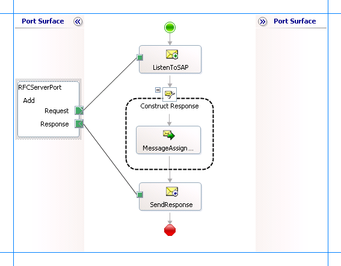

# Receive Inbound RFC Calls from SAP using BizTalk Server
In an RFC server scenario, there are three entities:  
  
- An SAP client that sends a request to SAP to invoke an RFC. This could be invoked either by using the SAP GUI or by making an RFC client call through the [!INCLUDE[adaptersap_short](../../includes/adaptersap-short-md.md)].  
  
- The SAP system that contains an RFC function definition that the SAP client invokes. The SAP system passes on the request to the RFC server (the adapter). This is used by the adapter to get the metadata of the RFC call that the SAP server makes into the adapter.  
  
- The [!INCLUDE[adaptersap_short](../../includes/adaptersap-short-md.md)] that acts as the RFC server and hosts the actual RFC.  
  
  The first entity, the SAP client, is not discussed in this topic. If you are using the SAP GUI to invoke an RFC, refer to SAP documentation. If you are using the [!INCLUDE[adaptersap_short](../../includes/adaptersap-short-md.md)] to invoke an RFC, see [Invoke RFCs in SAP by Using BizTalk Server](../../adapters-and-accelerators/adapter-sap/invoke-rfcs-in-sap-using-biztalk-server.md).  
  
  This section provides instructions on how to use the adapter to receive an RFC server call, once the RFC is invoked by an SAP client. For more information on how the adapter supports receiving RFC server calls using the [!INCLUDE[adaptersap_short](../../includes/adaptersap-short-md.md)], see [Operations on RFCs in SAP](../../adapters-and-accelerators/adapter-sap/operations-on-rfcs-in-sap.md).  
  
## How to Receive an Inbound RFC Call from the SAP System?  
 Performing an operation on an SAP system using [!INCLUDE[btsBizTalkServerNoVersion](../../includes/btsbiztalkservernoversion-md.md)] involves procedural tasks described in [Building blocks to create SAP applications](../../adapters-and-accelerators/adapter-sap/building-blocks-to-create-sap-applications.md). To receive an RFC call from the SAP system, these tasks are:  
  
1. Configure your SAP system to send RFC to an external application, in this case the [!INCLUDE[adaptersap_short](../../includes/adaptersap-short-md.md)].  
  
2. Create a BizTalk project and generate schema for the RFC that the [!INCLUDE[adaptersap_short](../../includes/adaptersap-short-md.md)] will be receiving from the SAP system.  
  
3. Create messages in the BizTalk project for receiving messages from the SAP system and sending responses.  
  
4. Create an orchestration to receive an RFC from the SAP system, process it, and send the response to the SAP system.  
  
5. Build and deploy the BizTalk project.  
  
6. Configure the BizTalk application by creating physical send and receive ports.  
  
7. Start the BizTalk application.  
  
   This topic provides instructions to perform these tasks.  
  
## Activities on the SAP System  
 Before using the [!INCLUDE[adaptersap_short](../../includes/adaptersap-short-md.md)] to receive inbound RFC calls from the SAP system, make sure you complete the following tasks on the SAP system.  
  
- An RFC destination for the SAP adapter must exist. The [!INCLUDE[adaptersap_short](../../includes/adaptersap-short-md.md)] receives RFCs from the SAP system through an RFC destination defined on the SAP system. The RFC destination contains the SAP Gateway Host, the SAP Gateway Service, and the SAP Program ID that you must specify in the connection URI in your code. For information about how to setup an RFC destination on SAP, see [Create an RFC, RFC destination, and send an RFC from SAP system](creating-an-rfc-in-an-sap-system.md).  
  
- You must create a function module that defines the RFC on the SAP system. The [!INCLUDE[adaptersap_short](../../includes/adaptersap-short-md.md)] uses the RFC definition on the SAP system to retrieve metadata about the RFC (both at design-time and at runtime). For more information see [Creating an RFC in an SAP System](../../adapters-and-accelerators/adapter-sap/creating-an-rfc-in-an-sap-system.md).  
  
   The following is an example of the source code on the SAP system for an RFC that adds two integers and returns their result. The code merely calls the RFC through a specified destination. The implementation of the function is done by the SAP adapter client code.  
  
  ```  
  FUNCTION Z_RFC_ADD.  
  *"------------------------------------------------------------------  
  *"  
  *"Local interface:  
  *"  IMPORTING  
  *"     VALUE(X) TYPE  INT4  
  *"     VALUE(Y) TYPE  INT4  
  *"     VALUE(DEST) TYPE  CHAR20 DEFAULT 'SAPADAPTER'  
  *"  EXPORTING  
  *"     VALUE(RESULT) TYPE  INT4  
  *"------------------------------------------------------------------  
  CALL FUNCTION 'Z_RFC_ADD' DESTINATION DEST  
    EXPORTING X = X  
              Y = Y  
    IMPORTING RESULT = RESULT.  
  
  ENDFUNCTION.  
  ```  
  
## Sample Based On This Topic  
 A sample, RFCServer, based on this topic is also provided with the [!INCLUDE[adapterpacknoversion](../../includes/adapterpacknoversion-md.md)]. For more information, see [Samples for the SAP adapter](../../adapters-and-accelerators/adapter-sap/samples-for-the-sap-adapter.md).  
  
## Generating the Schema  
 In this topic, to demonstrate how to receive an inbound RFC call from the SAP system, we generate the schema for *Z_RFC_ADD* RFC. You created this RFC in the previous step. This RFC takes two integer values as input parameters.  
  
 See [Browse, search, and get Metadata for RFC Operations in SAP](../../adapters-and-accelerators/adapter-sap/browse-search-and-get-metadata-for-rfc-operations-in-sap.md) for instructions on how to generate schema for a particular RFC.  
  
> [!IMPORTANT]
>  Because you are generating the schema for an inbound RFC call, make sure you select **Service (Inbound operation)** from the **Select contract type** drop-down list in the [!INCLUDE[consumeadapterservlong](../../includes/consumeadapterservlong-md.md)].  
  
## Defining Messages and Message Types  
 The schema that you generated earlier describes the "types" required for the messages in the orchestration. A message is typically a variable, the type for which is defined by the corresponding schema. You must link the schema you generated in the first step to the messages from the Orchestration view of the BizTalk project.  
  
 For this topic, you must create two messages—one to receive messages from the SAP system and the other to send a response to the SAP system.  
  
 Perform the following steps to create messages and link them to the schema:  
  
#### To create messages and link to schema  
  
1.  Add a new orchestration to the BizTalk project.  
  
2.  Open the orchestration view the BizTalk project, if not already open. Click **View**, point to **Other Windows**, and click **Orchestration View**.  
  
3.  In the **Orchestration View**, right-click **Messages**, and then click **New Message**.  
  
4.  Right-click the newly create message and select **Properties Window**.  
  
5.  In the **Properties** pane for **Message_1**, do the following.  
  
    |Use this|To do this|  
    |--------------|----------------|  
    |Identifier|Type **Request**.|  
    |Message Type|From the drop-down list, expand **Schemas**, and select *RFCServer.SAPBindingSchema.Z_RFC_ADD*, where *RFCServer* is the name of your BizTalk project. *SAPBindingSchema* is the schema generated for the RFC *Z_RFC_ADD*.|  
  
6.  Repeat step 2 to create a new message. In the **Properties** pane for the new message, do the following.  
  
    |Use this|To do this|  
    |--------------|----------------|  
    |Identifier|Type **Response**.|  
    |Message Type|From the drop-down list, expand **Schemas**, and select *RFCServer.SAPBindingSchema.Z_RFC_ADDResponse*.|  
  
## Setting up the Orchestration  
 You must create a BizTalk orchestration to use [!INCLUDE[btsBizTalkServerNoVersion](../../includes/btsbiztalkservernoversion-md.md)] for receiving RFC server calls from the SAP system. For this example, consider a scenario where an RFC client sends a request to the SAP system to add two integers. The SAP system takes the request, with the input parameters, and passes it on to the external RFC server hosted by the [!INCLUDE[adaptersap_short](../../includes/adaptersap-short-md.md)]. The [!INCLUDE[adaptersap_short](../../includes/adaptersap-short-md.md)] receives the request from the SAP system, process the request to add two integers, and generates a response. The [!INCLUDE[adaptersap_short](../../includes/adaptersap-short-md.md)] passes the response to the SAP system, which in turn, is passed on to the RFC client.  
  
 To achieve this as part of an orchestration, the orchestration must contain:  
  
- A two-way receive port to receive the RFC server request from the SAP system and send the response.  
  
- Send and Receive shapes.  
  
- Construct Message shape, and within that a Message Assignment shape, to process the RFC server request coming from the SAP system.  
  
  A sample orchestration for an RFC server call resembles the following.  
  
    
  
### Adding Message Shapes  
 Make sure you specify the following properties for each of the message shapes. The names listed in the *Shape* column are the names of the message shapes as displayed in the preceding orchestration.  
  
|Shape|Shape Type|Properties|  
|-----------|----------------|----------------|  
|ListenToSAP|Receive|-   Set **Name** to *ListenToSAP*<br />-   Set **Activate** to *True*|  
|SendResponse|Send|-   Set **Name** to *SendResponse*|  
  
### Adding Construct Message Shape  
 To process the incoming RFC call to add two integer values, you must add a Construct Message shape and within that a Message Assignment shape to your orchestration, between the two send shapes. For this example, the Message Assignment shape invokes to add two integers. The Message Assignment shape also sets the action for the response to be sent to the SAP system.  
  
 For the Construct Message shape, set the **Message Constructed** property to **Response**.  
  
 The code to process the RFC request could be part of the same Visual Studio solution as your BizTalk project. A sample code for adding two integers looks like this.  
  
```  
namespace RFCServerResponseCreator  
{  
    public class RFCServerResponseCreator  
    {  
        private static XmlDocument messageIn;  
        private static XmlDocument messageOut;  
        public static XmlDocument CreateRequest(int a, int b, string destination)  
        {  
            messageIn = new XmlDocument();  
            messageIn.LoadXml(  "<Z_RFC_ADD xmlns=\"http://Microsoft.LobServices.Sap/2007/03/Rfc/\">" +  
                                "<DEST>" + destination + "</DEST>" +  
                                "<X>" + a + "</X>" +  
                                "<Y>" + b + "</Y>" +   
                                "</Z_RFC_ADD>"  
                             );  
            return messageIn;  
        }  
        public static XmlDocument CreateResponse(int a, int b)  
        {  
            int c = a + b;  
            messageOut = new XmlDocument();  
            messageOut.LoadXml( "<Z_RFC_ADDResponse xmlns=\"http://Microsoft.LobServices.Sap/2007/03/Rfc/\">" +  
                                "<RESULT>" + c + "</RESULT>" +   
                                "</Z_RFC_ADDResponse>"  
                              );  
            return messageOut;  
        }  
    }  
}  
```  
  
> [!NOTE]
>  After you build the project, RFCServerResponseCreator.dll will be created in the project directory. You must add this DLL to the global assembly cache (GAC).  
  
 Add the following expression to invoke this code from the Message Assignment shape and to set the action for the response sent to the SAP system. To add an expression, double-click the Message Assignment shape to open the Expression Editor.  
  
```  
Response = RFCServerResponseCreator.RFCServerResponseCreator.CreateResponse(Request.X, Request.Y);  
Response(WCF.Action) = "http://Microsoft.LobServices.Sap/2007/03/Rfc/Z_RFC_ADD/response";  
```  
  
> [!IMPORTANT]
>  You must explicitly set the action on the response message. If you do not set the action, WCF-Custom adapter arrives at the action message by appending “Response” to the request action. So, the action for the response message becomes `http://Microsoft.LobServices.Sap/2007/03/Rfc/Z_RFC_ADDResponse`. However, the sapBinding expects the response action by appending “/response” to the request action, for example `http://Microsoft.LobServices.Sap/2007/03/Rfc/Z_RFC_ADD/response`.  
  
### Adding Ports  
 Make sure you specify the following properties for the logical port. The name listed in the *Port* column is the name of the port as displayed in the orchestration.  
  
|Port|Properties|  
|----------|----------------|  
|RFCServerPort|-   Set **Identifier** to *RFCServerPort*<br />-   Set **Type** to *RFCServerPortType*<br />-   Set **Communication Pattern** to *Request-Response*<br />-   Set **Communication Direction** to *Receive-Send*|  
  
## Specify Messages for Action Shapes and Connect to Ports  
 The following table specifies the properties and their values to be set to specify messages for action shapes and linking them to the ports. The names listed in the *Shape* column are the names of the message shapes as displayed in the preceding orchestration.  
  
|Shape|Properties|  
|-----------|----------------|  
|ListenToSAP|-   Set **Message** to *Request*<br />-   Set **Operation** to *RFCServerPort.Add.Request*|  
|SendResponse|-   Set **Message** to *FuncResponse*<br />-   Set **Operation** to *RFCServerPort.Add.Response*|  
  
 After you have specified these properties, the message shapes and ports are connected and your orchestration is complete.  
  
 You must now build the BizTalk solution and then deploy it to a BizTalk Server. For more information, see [Building and Running Orchestrations](../../core/building-and-running-orchestrations.md).
  
## Configuring the BizTalk Application  
 After you have deployed the BizTalk project, the orchestration you created earlier is listed under the **Orchestrations** pane in the BizTalk Server Administration console. You must use the BizTalk Server Administration console to configure the application. For more information about configuring an application, see [How to Configure an Application](../../core/how-to-configure-an-application.md).
  
 Configuring an application involves:  
  
- Selecting a host for the application.  
  
- Mapping the ports that you created in your orchestration to physical ports in the BizTalk Server Administration console. For this orchestration you must:  
  
  - Define a WCF-Custom or WCF-SAP receive port. This port will receive inbound RFC calls from the SAP system and will send the response back to the SAP system. For information about how to create ports, see [Manually configure a physical port binding to the SAP adapter](../../adapters-and-accelerators/adapter-sap/manually-configure-a-physical-port-binding-to-the-sap-adapter.md).  
  
    > [!NOTE]
    >  Generating the schema using the [!INCLUDE[consumeadapterservlong](../../includes/consumeadapterservlong-md.md)] also creates a binding file containing information about the ports and the actions to be set for those ports. You can import this binding file from the BizTalk Administration Console to create send ports (for outbound calls) or receive ports (for inbound calls). For more information, see [Configure a physical port binding using a port binding file to SAP](../../adapters-and-accelerators/adapter-sap/configure-a-physical-port-binding-using-a-port-binding-file-to-sap.md).
  
  You must also add the assembly for the RFCServerResponseCreator project to your BizTalk application. You created this project to process the RFC call received from the SAP system. To do so:  
  
1.  In the console tree on the left side of the BizTalk Server Administration console, under the BizTalk application where you imported the bindings, right-click **Resources**, point to **Add**, and then click **BizTalk Assemblies**.  
  
2.  In the **Add Resources** dialog box, Click **Add**, and then navigate to the folder containing RFCServerResponseCreator.dll. Select the file and then click **Open**.  
  
3.  In the **Add Resources** dialog box, click **OK**.  
  
## Starting the Application  
 You must start the BizTalk application for receiving inbound RFC calls from an SAP system. For instructions on starting a BizTalk application, see [How to Start an Orchestration](../../core/how-to-start-an-orchestration.md), and [How to start an application](../../core/how-to-start-and-stop-a-biztalk-application.md).
  
 At this stage, make sure:  
  
-   The WCF-Custom or WCF-SAP receive port to receive RFC calls from the SAP system is running.  
  
-   The BizTalk orchestration for the operation is running.  
  
## Executing the Operation  
 After you run the application, you must send an RFC to the [!INCLUDE[adaptersap_short](../../includes/adaptersap-short-md.md)]. You can do so by executing the transaction SE37 on the SAP system. You must also specify the input parameters for the RFC call. The adapter receives the call along with the parameters, processes it, and sends the response back to the SAP system. You will be able to see the response on the same transaction from where you sent the RFC.  
  
## Possible Exceptions  
 For information about the exceptions you might encounter while receiving an RFC server call from an SAP system using BizTalk Server, see [Exceptions and Error Handling with the SAP adapter](../../adapters-and-accelerators/adapter-sap/exceptions-and-error-handling-with-the-sap-adapter.md).  
  
## Best Practices  
 After you have deployed and configured the BizTalk project, you can export configuration settings to an XML file called the bindings file. Once you generate a bindings file, you can import the configuration settings from the file so that you do not need to create the send ports, receive ports, etc. for the same orchestration. For more information about binding files, see [Reuse SAP adapter bindings](../../adapters-and-accelerators/adapter-sap/reuse-sap-adapter-bindings.md).
  
## See Also  
[Develop BizTalk applications](../../adapters-and-accelerators/adapter-sap/develop-biztalk-applications-using-the-sap-adapter.md)