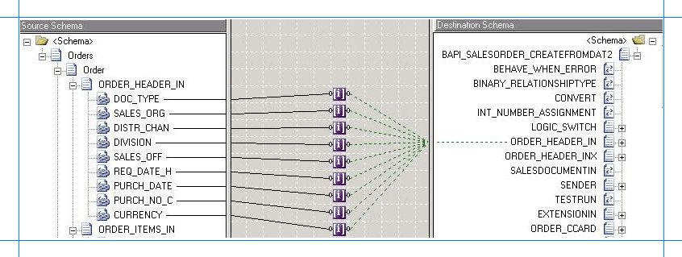

# Run BAPI Transactions in SAP using BizTalk Server
The [!INCLUDE[adaptersap_short](../../includes/adaptersap-short-md.md)] enables adapter clients to perform transactions on an SAP system by using [!INCLUDE[btsBizTalkServerNoVersion](../../includes/btsbiztalkservernoversion-md.md)]. Before creating an orchestration for a transaction, you must first understand a basic scenario in which transactions will be performed. In a typical transaction scenario, a request message with multiple operations (such as invoking a BAPI) is sent to the SAP system. This will be referred to as an "operation message." The orchestration must extract each operation message from the request message and send the individual operation messages to the SAP system. The orchestration sends them one after the other using the same connection. The orchestration extracts the individual messages from the "operation message" by using an XML transform via a BizTalk map.  
  
 After the operations are performed, the orchestration must commit or abort the transaction by sending messages for BAPI_TRANSACTION_COMMIT or BAPI_TRANSACTION_ROLLBACK, respectively. These will be referred to as "transaction messages."  
  
## How Does the Adapter Enable Transactions Through BizTalk Server?  
 To enable transactions on an SAP system using the [!INCLUDE[btsBizTalkServerNoVersion](../../includes/btsbiztalkservernoversion-md.md)], the [!INCLUDE[adaptersap_short](../../includes/adaptersap-short-md.md)]:  
  
- Provides message context properties OPEN, REUSE, CLOSE, and ABORT.  
  
- Uses BAPI_TRANSACTION_COMMIT and BAPI_TRANSACTION_ROLLBACK to commit or abort the operations. These are exposed by the SAP system.  
  
  The following table lists some guidelines on using the properties with BAPI_TRANSACTION_COMMIT or BAPI_TRANSACTION_ROLLBACK:  
  
|Message|OPEN|REUSE|CLOSE|ABORT|  
|-------------|----------|-----------|-----------|-----------|  
|First message (operation message)|Yes|No|No|No|  
|Subsequent messages (operation messages)|No|Yes|No|No|  
|BAPI_TRANSACTION_COMMIT (transaction message)|No|No|Yes|No|  
|BAPI_TRANSACTION_ROLLBACK (transaction message)|No|No|Yes|Yes|  
  
 In the table, a "Yes" denotes the message context property to be used for a message. Similarly, a "No" denotes the message context property not to be used with a message.  
  
 To summarize the table:  
  
-   The first message must always be an operation message and must only use the OPEN property.  
  
-   The subsequent operation messages must use the REUSE property.  
  
-   The transaction message corresponding to BAPI_TRANSACTION_COMMIT for committing the transaction must use the CLOSE property.  
  
-   The transaction message corresponding to BAPI_TRANSACTION_ROLLBACK to abort the transaction can use either the CLOSE or ABORT properties. If using ABORT, ideally the message must be in the orchestration exception block.  
  
## Key Considerations Related to Transactions Using BizTalk Server  
  
- If there is more than one send port in an orchestration, the adapter automatically separates transaction for messages received from each port. That is, a transaction cannot span across ports.  
  
- Message retry attempts are not supported for messages in an SAP transaction. Therefore, users should set the message retry attempt to zero.  
  
- The adapter might produce undesirable results for the combinations marked as "No" in the preceding table. You should use combinations marked as "Yes".  
  
- Messages sent to the adapter that do not have a message context property will be executed normally without being bound to the current transaction context.  
  
- BAPI_TRANSACTION_COMMIT or BAPI_TRANSACTION_ROLLBACK should ideally be the last message in the current transaction context in the orchestration.  
  
  The following sections provide instructions on how to perform transactions in SAP using the [!INCLUDE[adaptersap_short](../../includes/adaptersap-short-md.md)].  
  
## How to Perform a Transaction on an SAP System?  
 Performing an operation on an SAP system using the [!INCLUDE[adaptersap_short](../../includes/adaptersap-short-md.md)] with [!INCLUDE[btsBizTalkServerNoVersion](../../includes/btsbiztalkservernoversion-md.md)] involves procedural tasks described in [Building blocks to create SAP applications](../../adapters-and-accelerators/adapter-sap/building-blocks-to-create-sap-applications.md). To perform transactions on an SAP system, these tasks are:  
  
1. Create a BizTalk project and generate schema for the RFC on which you want to perform the transaction. Additionally, you must generate schema for BAPI_TRANSACTION_COMMIT and BAPI_TRANSACTION_ROLLBACK RFCs.  
  
2. Create messages in the BizTalk project for sending and receiving messages from the SAP system.  
  
3. Create an orchestration that extracts individual "operation messages" from the request message and sends it to the SAP system. Based on the request message, the orchestration also decides whether to commit or roll back the transaction.  
  
4. Build and deploy the BizTalk project.  
  
5. Configure the BizTalk application by creating physical send and receive ports.  
  
6. Start the BizTalk application.  
  
   This topic provides instructions to perform these tasks.  
  
## Sample Based On This Topic  
 A sample, SAPTransaction, based on this topic is provided with the [!INCLUDE[adapterpacknoversion](../../includes/adapterpacknoversion-md.md)]. For more information, see [Samples for the SAP adapter](../../adapters-and-accelerators/adapter-sap/samples-for-the-sap-adapter.md).  
  
## Generating Schema  
 To demonstrate how to perform transactions on an SAP system, you need the following schemas:  
  
- For the "operation message" to perform operations on an SAP system. The request message sent to the adapter must conform to this schema. This can be any user-specific schema containing any number of operation nodes. In this topic, the schema MultipleOrders.xsd is used. The schema is also provided as part of the transaction sample shipped with the [!INCLUDE[adapterpacknoversion](../../includes/adapterpacknoversion-md.md)] samples. For more information, see [Schema Samples](../../adapters-and-accelerators/accelerator-rosettanet/schema-samples.md).  
  
- For performing the operations on an SAP system, such as invoking an RFC. The request message to perform an operation must conform to this schema. This schema must be generated by using the [!INCLUDE[consumeadapterservlong](../../includes/consumeadapterservlong-md.md)]. In this topic, the BAPI_SALESORDER_CREATEFROMDAT2 RFC is invoked. For information about generating schema for RFC, see [Browse, search and get Metadata for RFC Operations in SAP](../../adapters-and-accelerators/adapter-sap/browse-search-and-get-metadata-for-rfc-operations-in-sap.md).  
  
- For aborting or committing a transaction. The request to commit or abort a transaction must conform to this schema. The [!INCLUDE[adaptersap_short](../../includes/adaptersap-short-md.md)] uses the BAPI_TRANSACTION_COMMIT and BAPI_TRANSACTION_ROLLBACK RFC to commit and rollback the operations respectively. You must generate schema for these RFCs using the [!INCLUDE[consumeadapterservshort](../../includes/consumeadapterservshort-md.md)].  
  
> [!NOTE]
>  You must ensure that all the required schemas are added to the BizTalk project.  
> 
> [!IMPORTANT]
>  You must add a reference to the BizTalk property schema for [!INCLUDE[adaptersap_short](../../includes/adaptersap-short-md.md)] to your BizTalk project. The schema file, *Microsoft.Adapters.SAP.BiztalkPropertySchema.dll*, is installed by the [!INCLUDE[adapterpacknoversion](../../includes/adapterpacknoversion-md.md)] setup, typically at \<installation drive\>:\Program Files\Microsoft BizTalk Adapter Pack\bin.  
  
## Defining Messages and Message Types  
 The schema that you generated earlier describes the "types" required for the messages in the orchestration. A message is typically a variable, the type for which is defined by the corresponding schema. You must link the schema you generated in the first step to the messages from the Orchestration View window of the BizTalk project.  
  
 Before creating messages, you must determine the number of "operation" nodes the request message (of MultipleOrders.xsd type) has. For this example, assume that the request message has two operation messages to invoke the BAPI_SALESORDER_CREATEFROMDAT2 RFC. Therefore, you must create one request-response message set that maps to the schema generated for this RFC.  
  
 You must create the following messages in the BizTalk project.  
  
- A message, SendtoAdapter, for the request message that will be sent to the orchestration. This message must be mapped to the schema for the input message, MultipleOrders.xsd.  
  
- A message, BAPIMessage, for the first operation sent to the SAP system. You must also create a response message, BAPIResponse, for the response of the first operation. The request and response messages must be mapped to the schema generated for the BAPI_SALESORDER_CREATEFROMDAT2 RFC.  
  
- A message, BAPICommitMessage, for the commit operation. You must also create a response message, BAPICommitResponse, for the corresponding response message. The request and response messages must be mapped to the schema of BAPI_TRANSACTION_COMMIT RFC.  
  
- A message, BAPIRollbackMessage, for the rollback operation. You must also create a response message, BAPIRollbackResponse, for the corresponding response message. The request and response messages must be mapped to the schema of BAPI_TRANSACTION_ROLLBACK RFC.  
  
  Perform the following steps to create messages and link them to the schema.  
  
#### To create messages and link to schema  
  
1.  Open the orchestration view the BizTalk project, if it is not already open. Click **View**, point to **Other Windows**, and click **Orchestration View**.  
  
2.  In the **Orchestration View**, right-click **Messages**, and then click **New Message**.  
  
3.  Right-click the newly create message, and then select **Properties Window**.  
  
4.  In the **Properties** pane for **Message_1**, do the following.  
  
    |Use this|To do this|  
    |--------------|----------------|  
    |Identifier|Type **SendToAdapter**.|  
    |Message Type|From the drop-down list, expand **Schemas**, and select *SAPTransaction.MultipleOrders*, where *SAPTransaction* is the name of your BizTalk project. *MultipleOrders* is the schema for the request message.|  
  
5.  Repeat the previous step to create six more messages. In the **Properties** pane for the new messages, do the following.  
  
    |Set Identifier to|Set Message Type to|  
    |-----------------------|-------------------------|  
    |BAPIMessage|*SAPTransaction.SAPBindingSchema.BAPI_SALESORDER_CREATEFROMDAT2*|  
    |BAPIResponse|*SAPTransaction.SAPBindingSchema.BAPI_SALESORDER_CREATEFROMDAT2Response*|  
    |BAPICommitMessage|*SAPTransaction.SAPBindingSchema.BAPI_TRANSACTION_COMMIT*|  
    |BAPICommitResponse|*SAPTransaction.SAPBindingSchema.BAPI_TRANSACTION_COMMITResponse*|  
    |BAPIRollbackMessage|*SAPTransaction.SAPBindingSchema.BAPI_TRANSACTION_ROLLBACK*|  
    |BAPIRollbackResponse|*SAPTransaction.SAPBindingSchema.BAPI_TRANSACTION_ROLLBACKResponse*|  
  
## Setting up the Orchestration  
 You must create a BizTalk orchestration to use [!INCLUDE[btsBizTalkServerNoVersion](../../includes/btsbiztalkservernoversion-md.md)] for performing transactions in an SAP system. In this orchestration, you drop a request message at a defined receive location. The [!INCLUDE[adaptersap_short](../../includes/adaptersap-short-md.md)] consumes the message and passes it to the SAP system. The response from the SAP system is saved to another location.  
  
 Another consideration to make when creating an orchestration is to:  
  
- Map the schema of the request message to that of the BAPI_SALESORDER_CREATEFROMDAT2 RFC.  
  
- Map the schema of the request message to that of the BAPI_TRANSACTION_COMMIT and BAPI_TRANSACTION_ROLLBACK RFC.  
  
  You can map the schemas by using an XML transform via a BizTalk map. To achieve this, include Transform shapes in the orchestration.  
  
  Finally, based on whether the request message has information to commit or abort the transaction, the orchestration must decide on the appropriate message to be sent to the SAP system. To achieve this, include a Decide shape in the orchestration.  
  
  For more information about the different shapes included in the orchestration, see the **Orchestration Designer UI** [!INCLUDE[ui-guidance-developers-reference](../../includes/ui-guidance-developers-reference.md)].
  
  A sample orchestration for an SAP transaction resembles the following.  
  
    
  
### Adding Message Shapes  
 Make sure you specify the following properties for each of the message shapes. The names listed in the Shape column are the names of the message shapes as displayed in the preceding orchestration.  
  
|Shape|Shape Type|Properties|  
|-----------|----------------|----------------|  
|ReceiveInputXML|Receive|- Set **Name** to *ReceiveInputXML*<br /><br /> - Set **Activate** to *True*|  
|SendToLOB|Send|- Set **Name** to *SendToLOB*|  
|ReceiveResponse|Receive|- Set **Name** to *ReceiveResponse*<br /><br /> - Set **Activate** to *False*|  
|SendResponse|Send|- Set **Name** to *SendResponse*|  
  
 Because the request message has two insert messages, you must create another set of send and receive shapes to send messages to SAP and to receive a response. However, because the insert messages might be committed or rolled back, the second set of shapes must be created within a decision block. You must create one set of shapes for commit and another set of shapes for rollback.  
  
> [!NOTE]
>  You can add a decision block by dragging and dropping the Decide shape from the BizTalk Orchestrations toolbox.  
  
#### Message Shapes for Commit  
 The following table lists the shapes for the "commit path" of the orchestration. Here, you do not need to create a receive message for a request message. The request message will be passed on from the previous message shape.  
  
|Shape|Shape Type|Properties|  
|-----------|----------------|----------------|  
|SendBAPICommit|Send|- Set **Name** to *SendBAPICommit*|  
|ReceiveCommitResponse|Receive|- Set **Name** to *ReceiveCommitResponse*<br /><br /> - Set **Activate** to *False*|  
|SendResponse2|Send|- Set **Name** to *SendResponse2*|  
  
#### Message Shapes for Abort  
 The following table lists the shapes for the "rollback path" of the orchestration.  
  
|Shape|Shape Type|Properties|  
|-----------|----------------|----------------|  
|SendBAPIRollback|Send|- Set **Name** to *SendBAPIRollback*|  
|ReceiveRollbackResponse|Receive|- Set **Name** to *ReceiveRollbackResponse*<br /><br /> - Set **Activate** to *False*|  
|SendResponse3|Send|- Set **Name** to *SendResponse3*|  
  
### Setting the Rule Expression  
 You included the message shapes for the commit and abort operations within a decision block by adding a Decide shape. To specify the condition on which the orchestration will make a decision, you must specify an expression on the Rule shape based on which the transaction will either be committed or rolled back. For example, you must specify the following expression for the Rule shape:  
  
```  
SendToAdapter.isCommit == true  
```  
  
 Where, SendToAdapter is the message you created for the schema of the request message. So, in the request message, if the `isCommit` tag is set to **True**, the orchestration takes the "commit" route. Otherwise, the orchestration takes the "rollback" route.  
  
 For you to be able to specify this condition in the expression editor, you must have promoted the `isCommit` property in the message schema for the request message sent to the adapter. For this topic, the input schema to use is MultipleOrders.xsd. You must promote the `isCommit` property in this schema. For more information about promoting a property, see [Promoting Properties](../../core/promoting-properties.md).
  
### Adding Construct Message Shapes  
 As discussed earlier, the request message sent to the adapter contains two insert messages and then a commit or abort message. You must add a Construct Message shape, and within that a Transform shape to extract individual operation messages to be sent to the SAP system. You must also add a Message Assignment shape to set the message context properties for enabling transactions.  
  
#### The First Construct Message Shape  
 Suppose the first Construct Message shape is called "ReceiveXML." For this shape, specify the Messages Constructed property as "BAPIMessage". Double-click the Transform shape to open the **Transform Configuration** dialog box. In the dialog box:  
  
- Choose to create a new map.  
  
- From the left pane, select **Source** and from the **Variable name** drop-down select *SendToAdapter*.  
  
- From the left pane, select **Destination** and from the **Variable name** drop-down select *BAPIMessage*.  
  
- Click **OK** to start the mapper. Map the schema of the request message to the schema of the BAPI_SALESORDER_CREATEFROMDAT2. You can use the **Index** functoid to create a map between the source and the destination schemas. An **Index** functoid enables you to select information for a specific record in a series of records.  
  
   The following figure shows the schemas mapped using an **Index** functoid.  
  
     
  
   For more information about using the **Transform Configuration** dialog box, see the **Transform Configuration Dialog Box** [!INCLUDE[ui-guidance-developers-reference](../../includes/ui-guidance-developers-reference.md)].
  
   For more information about using the Index functoid, see [Index Functoid](../../core/index-functoid.md).
       
   After you have mapped the schemas, you can test the mapping using the property page of the map file. For more information, see the **<Map File> Property Page Dialog Box, Test Map** tab [!INCLUDE[ui-guidance-developers-reference](../../includes/ui-guidance-developers-reference.md)].
  
  In the Message Assignment shape, specify the message context property to start the transaction. For example, the message context property for the first message could be:  
  
```  
BAPIMessage(Microsoft.Adapters.SAP.BiztalkPropertySchema.ConnectionState) = "OPEN";  
```  
  
#### The Commit Construct Message Shape  
 Suppose the Construct Message shape for the commit operation is called "CommitMessage." For this shape, specify the Messages Constructed property as "BAPICommitMessage". Double-click the Transform shape to open the **Transform Configuration** dialog box. In the dialog box:  
  
- Choose to create a new map.  
  
- From the left pane, select **Source** and from the **Variable name** drop-down select *SendToAdapter*.  
  
- From the left pane, select **Destination** and from the **Variable name** drop-down select *BAPICommitMessage*.  
  
- Click OK to launch the mapper. Map the schema of the request message to the schema of BAPI_TRANSACTION_COMMIT. You need not include an Index functoid for this mapping because the BAPI_TRANSACTION_COMMIT node does not contain a record hierarchy.  
  
  In the Message Assignment shape, specify the message context property to commit the transaction. For example, the message context property for the first message could be:  
  
```  
BAPICommitMessage(Microsoft.Adapters.SAP.BiztalkPropertySchema.ConnectionState) = "CLOSE";  
```  
  
#### The Rollback Construct Message Shape  
 Suppose the Construct Message shape for the rollback operation is called "RollbackMessage." For this shape, specify the Messages Constructed property as "BAPIRollbackMessage". Double-click the Transform shape to open the **Transform Configuration** dialog box. In the dialog box:  
  
- Choose to create a new map.  
  
- From the left pane, select **Source** and from the **Variable name** drop-down select *SendToAdapter*.  
  
- From the left pane, select **Destination** and from the **Variable name** drop-down select *BAPIRollbackMessage*.  
  
- Click OK to launch the mapper. Map the schema of the request message to the schema of BAPI_TRANSACTION_ROLLBACK. You need not include an Index functoid for this mapping because the BAPI_TRANSACTION_ROLLBACK node does not contain a record hierarchy.  
  
  In the Message Assignment shape, specify the message context property to rollback the transaction. For example, the message context property for the first message could be:  
  
```  
BAPIRollbackMessage(Microsoft.Adapters.SAP.BiztalkPropertySchema.ConnectionState) = "ABORT";  
```  
  
> [!IMPORTANT]
>  In typical scenarios, the message corresponding to BAPI_TRANSACTION_ROLLBACK with the ABORT context property must be used in an exception block.  
  
### Adding Ports  
 Make sure you specify the following properties for each of the logical ports. The names listed in the *Port* column are the names of the ports as displayed in the orchestration.  
  
 For this orchestration, three ports are created. The first port picks request message from a specified folder. The second port sends the messages to the SAP system and receives a response. The third port will save the response to another folder. Therefore:  
  
-   The first port only receives messages for a single schema, that is, MultipleOrders.xsd.  
  
-   The second port sends and receives messages for the schema of BAPI_SALESORDER_CREATEFROMDAT2 RFC. Also, the same port will be used to commit or roll back the transaction. So, this port also receives messages of schemas for BAPI_TRANSACTION_COMMIT and BAPI_TRANSACTION_ROLLBACK RFCs. To enable this, three different operations are created on this port, each corresponding to a specific message schema.  
  
-   Similar to the second port, this port will also be receiving messages with three different schemas. So, it is necessary to create three different operations on this port.  
  
|Port|Properties|  
|----------|----------------|  
|FileIn|- Set **Identifier** to *FileIn*<br /><br /> - Set **Type** to *FileInType*<br /><br /> - Set **Communication Pattern** to *One-Way*<br /><br /> - Set **Communication Direction** to *Receive*|  
|LOBPort|- Set **Identifier** to *LOBPort*<br /><br /> - Set **Type** to *LOBPortType*<br /><br /> - Set **Communication Pattern** to *Request-Response*<br /><br /> - Set **Communication Direction** to *Send-Receive*<br /><br /> - Create an operation *BAPIMessage*.<br /><br /> - Create an operation *CommitMessage*. This operation will be used to send commit message.<br /><br /> - Create an operation *RollbackMessage*. This operation will be used to send rollback message.|  
|SaveResponse|- Set **Identifier** to *SaveResponse*<br /><br /> - Set **Type** to *SaveResponseType*<br /><br /> - Set **Communication Pattern** to *One-Way*<br /><br /> - Set **Communication Direction** to *Send*.<br /><br /> - Create an operation *BAPIMessage*.<br /><br /> - Create an operation *CommitMessage*. This operation will be used to save responses for the commit message.<br /><br /> - Create an operation *RollbackMessage*. This operation will be used to save responses for the rollback message.|  
  
## Specify Messages for Action Shapes and Connect to Ports  
 The following table specifies the properties and their values to be set to specify messages for action shapes and linking them to the ports. The names listed in the *Shape* column are the names of the message shapes as displayed in the preceding orchestration.  
  
|Shape|Properties|  
|-----------|----------------|  
|ReceiveInputXML|- Set **Message** to *SendToAdapter*<br /><br /> - Set **Operation** to *FileIn.Transaction.Request*|  
|SendToLOB|- Set **Message** to *BAPIMessage*<br /><br /> - Set **Operation** to *LOBPort.BAPIMessage.Request*|  
|ReceiveResponse|- Set **Message** to *BAPIResponse*<br /><br /> - Set **Operation** to *LOBPort.BAPIMessage.Response*|  
|SendResponse|- Set **Message** to *BAPIResponse*<br /><br /> - Set **Operation** to *SaveResponse.BAPIMessage.Request*|  
|SendBAPICommit|- Set **Message** to *BAPICommitMessage*<br /><br /> - Set **Operation** to *LOBPort.CommitMessage.Request*|  
|ReceiveCommitResponse|- Set **Message** to *BAPICommitResponse*<br /><br /> - Set **Operation** to *LOBPort.CommitMessage.Response*|  
|SendResponse2|- Set **Message** to *BAPICommitResponse*<br /><br /> - Set **Operation** to *SaveResponse.CommitMessage.Request*|  
|SendBAPIRollback|- Set **Message** to *BAPIRollbackMessage*<br /><br /> - Set **Operation** to *LOBPort.RollbackMessage.Request*|  
|ReceiveRollbackResponse|- Set **Message** to *BAPIRollbackResponse*<br /><br /> - Set **Operation** to *LOBPort.RollbackMessage.Response*|  
|SendResponse3|- Set **Message** to *BAPIRollbackResponse*<br /><br /> - Set **Operation** to *SaveResponse.RollbackMessage.Request*|  
  
 After you have specified these properties, the message shapes and ports are connected and your orchestration is complete.  
  
## Handling Exceptions  
 In complex orchestrations like the one for performing BAPI transactions, it is important that you keep track of the state of the orchestration, report errors as they occur, so that you can resolve the problems as they occur. BizTalk orchestration provides tools to handle errors, to maintain the state of an orchestration, and to fix problems as they occur through transactions, compensation, and exception handling.  
  
 As a framework for transactions and exception handling, Orchestration Designer provides the **Scope** shape. A scope can have a transaction type, a compensation, and any number of exception handlers. A scope contains one or more blocks. It has a body and can optionally have any number of exception-handling blocks appended to it. In the case of BAPI transactions, the entire orchestration (see earlier figure) can be included in a scope.  
  
 To catch the exception, you must add a **Catch Exception** block to the orchestration. **Catch Exception** blocks are attached to the end of a **Scope** shape in Orchestration Designer. In the case of BAPI transactions, you must add the “ABORT” routine to the **Catch Exception** block, that is, you must add the following to the “ABORT” routine:  
  
- A Construct Message shape consisting of a Transform (to extract the request message from the input message) and a Message Assignment shape (to set the context property)  
  
- Send and Receive shapes.  
  
  The SAP transaction sample for [!INCLUDE[btsBizTalkServerNoVersion](../../includes/btsbiztalkservernoversion-md.md)] (SAPTransaction) shipped with [!INCLUDE[adapterpacknoversion](../../includes/adapterpacknoversion-md.md)] demonstrates exception handling, too. For more information about the sample, see [Samples for the SAP adapter](../../adapters-and-accelerators/adapter-sap/samples-for-the-sap-adapter.md).  
  
  For more information about how to handle exceptions, in general, using [!INCLUDE[btsBizTalkServerNoVersion](../../includes/btsbiztalkservernoversion-md.md)], see [Using Transactions and Handling Exceptions](../../core/using-transactions-and-handling-exceptions.md).
  
## Add the BizTalk Property Schema to BizTalk  
 In your BizTalk project, you added an assembly reference to the BizTalk property schema for [!INCLUDE[adaptersap_short](../../includes/adaptersap-short-md.md)]. You must add the same assembly as a resource in the BizTalk application, that is, the application where the BizTalk project will be deployed. The schema file, *Microsoft.Adapters.SAP.BiztalkPropertySchema.dll*, is installed by the [!INCLUDE[adapterpacknoversion](../../includes/adapterpacknoversion-md.md)] setup typically under \<installation drive\>:\Program Files\Microsoft BizTalk Adapter Pack\bin. Without this resource, you will not be able to deploy your project.  
  
#### To add an assembly as a resource in BizTalk  
  
1. Start the [!INCLUDE[btsBizTalkServerNoVersion](../../includes/btsbiztalkservernoversion-md.md)] Administration console.  
  
2. In the console tree, expand **BizTalk Group**, expand **Applications**, and then the application to which you want to add a BizTalk assembly.  
  
3. Right-click **Resources**, point to **Add** and then click **BizTalk Assemblies**.  
  
4. In the **Add Resource** dialog box, click **Add**, navigate to the folder containing the BizTalk assembly file, select the BizTalk assembly file, and then click **Open**.  
  
5. In **Options**, specify the options for installing the BizTalk assembly to the GAC, and then click **OK**.  
  
   You must now build the BizTalk solution and then deploy it to a BizTalk Server. For more information, see [Building and Running Orchestrations](../../core/building-and-running-orchestrations.md).
  
## Configuring the BizTalk Application  
 After you have deployed the BizTalk project, the orchestration you created earlier is listed under the **Orchestrations** pane in the BizTalk Server Administration console. You must use the BizTalk Server Administration console to configure the application. For more information about configuring an application, see [How to Configure an Application](../../core/how-to-configure-an-application.md).
  
 Configuring an application involves:  
  
- Selecting a host for the application.  
  
- Mapping the ports that you created in your orchestration to physical ports in the BizTalk Server Administration console. For this orchestration you must:  
  
  - Define a location on the hard disk and a corresponding file port where you will drop a request message. The BizTalk orchestration will consume the request message and send it to the SAP system.  
  
  - Define a location on the hard disk and a corresponding file port where the BizTalk orchestration will drop the response message containing the response from the SAP system.  
  
  - Define a physical WCF-Custom or WCF-SAP send port to send messages to the SAP system. For information about how to create ports, see [Manually configure a physical port binding to the SAP adapter](../../adapters-and-accelerators/adapter-sap/manually-configure-a-physical-port-binding-to-the-sap-adapter.md). Because the send port sends and receive messages conforming to more than one schema and performs two operations, you must set dynamic action for both the operations. For more information about actions, see [Configure the SOAP action for the SAP system](../../adapters-and-accelerators/adapter-sap/configure-the-soap-action-for-the-sap-system.md). Make sure you adhere to the following key considerations while creating a WCF-Custom or WCF-SAP send port to perform transactions.  
  
    |Set the following|To this value|  
    |-----------------------|-------------------|  
    |Action|The send port sends and receives messages for more than one operation. So, the action on the send port must be set for each operation.<br /><br /> `<BtsActionMapping>   <Operation Name="BAPIMessage" Action="http://Microsoft.LobServices.Sap/2007/03/Rfc/BAPI_SALESORDER_CREATEFROMDAT2" />   <Operation Name="CommitMessage" Action="http://Microsoft.LobServices.Sap/2007/03/Rfc/BAPI_TRANSACTION_COMMIT" />   <Operation Name="RollbackMessage" Action="http://Microsoft.LobServices.Sap/2007/03/Rfc/BAPI_TRANSACTION_ROLLBACK" /> </BtsActionMapping>`|  
    |EnableBizTalkCompatibilityMode|Set this binding property to **True**.|  
    |EnableConnectionPooling|Set this binding property to **False** before performing any transactions. In scenarios where the channel set up between the adapter and BizTalk is unexpectedly terminated, the corresponding connection is added to the connection pool. When another channel is opened, and the new channel picks the same connection object, the uncommitted transactions on the old connection object will also be committed when the transactions are committed over the new channel. To avoid this, connection pooling must be disabled while performing transactions.|  
  
    > [!NOTE]
    >  Generating the schema using the [!INCLUDE[consumeadapterservlong](../../includes/consumeadapterservlong-md.md)] also creates a binding file containing information about the ports and the actions to be set for those ports. You can import this binding file from the BizTalk Server Administration console to create send ports (for outbound calls) or receive ports (for inbound calls). For more information, see [Configure a physical port binding using a port binding file to SAP](../../adapters-and-accelerators/adapter-sap/configure-a-physical-port-binding-using-a-port-binding-file-to-sap.md).
    > 
    > [!IMPORTANT]
    >  You can configure a backup transport on a WCF-Custom or WCF-SAP send port that enables you to send messages to another SAP system if the primary transport fails to function. However, for performing transactions on an SAP system, the WCF-based [!INCLUDE[adaptersap_short](../../includes/adaptersap-short-md.md)] does not support specifying a backup transport pointing to another SAP server.  
  
## Starting the Application  
 You must start the BizTalk application performing transactions an SAP system. For instructions on starting a BizTalk application, see [How to Start an Orchestration](../../core/how-to-start-an-orchestration.md), [How to Start an application](../../core/how-to-start-and-stop-a-biztalk-application.md).
  
 At this stage, make sure:  
  
-   The FILE receive port to receive request messages for the orchestration is running.  
  
-   The FILE send port to receive the response messages from the orchestration is running.  
  
-   The WCF-Custom or WCF-SAP send port to send messages to the SAP system is running.  
  
-   The BizTalk orchestration for the operation is running.  
  
## Executing the Operation  
 After you run the application, you must drop a request message for the orchestration at a predefined location. The request message must conform to a specific schema, for instance, MultipleOrders.xsd schema. For example, a request message to create sales orders in an SAP system and then to commit the operation is:  
  
```  
<ns0:Orders xmlns:ns0="http://BAPISend.MultipleOrders">  
  <Order>  
      <ORDER_HEADER_IN>  
        <DOC_TYPE>TA</DOC_TYPE>  
        <SALES_ORG>1000</SALES_ORG>  
        <DISTR_CHAN>10</DISTR_CHAN>  
        <DIVISION>00</DIVISION>  
        <SALES_OFF>1000</SALES_OFF>  
        <REQ_DATE_H>20060901</REQ_DATE_H>  
        <PURCH_DATE>20060901</PURCH_DATE>  
        <PURCH_NO_C>Cust A</PURCH_NO_C>  
        <CURRENCY>EUR</CURRENCY>  
      </ORDER_HEADER_IN>  
      <ORDER_ITEMS_IN>  
          <MATERIAL>P-109</MATERIAL>  
          <PLANT>1000</PLANT>  
          <TARGET_QU>ST</TARGET_QU>  
      </ORDER_ITEMS_IN>  
      <ORDER_PARTNERS>  
          <PARTN_ROLE>AG</PARTN_ROLE>  
          <PARTN_NUMB>0000000257</PARTN_NUMB>  
      </ORDER_PARTNERS>  
    <RETURN></RETURN>  
  </Order>  
  <isCommit>true</isCommit>  
  <BAPI_TRANSACTION_COMMIT>  
  </BAPI_TRANSACTION_COMMIT>  
</ns0:Orders>  
```  
  
 The orchestration consumes the message and sends it to the SAP system. The response from the SAP system is saved at other file location defined as part of the orchestration. For the above request message, you get two response messages—one for invoking the BAPI_SALESORDER_CREATEFROMDAT2 RFC and the other for the commit operation using BAPI_TRANSACTION_COMMIT.  
  
 The response for BAPI_SALESORDER_CREATEFROMDAT2 is:  
  
```  
<?xml version="1.0" encoding="utf-8" ?>   
<BAPI_SALESORDER_CREATEFROMDAT2Response xmlns="http://Microsoft.LobServices.Sap/2007/03/Rfc/">  
  <SALESDOCUMENT />   
  <ORDER_ITEMS_IN>  
    <BAPISDITM xmlns="http://Microsoft.LobServices.Sap/2007/03/Types/Rfc/">  
      <ITM_NUMBER>0</ITM_NUMBER>   
      <HG_LV_ITEM>0</HG_LV_ITEM>   
      <PO_ITM_NO />   
      ......  
    </BAPISDITM>  
  </ORDER_ITEMS_IN>  
  <ORDER_PARTNERS>  
    <BAPIPARNR xmlns="http://Microsoft.LobServices.Sap/2007/03/Types/Rfc/">  
      <PARTN_ROLE>AG</PARTN_ROLE>   
      <PARTN_NUMB>0000000257</PARTN_NUMB>   
      <ITM_NUMBER>0</ITM_NUMBER>   
      ......   
    </BAPIPARNR>  
  </ORDER_PARTNERS>  
</BAPI_SALESORDER_CREATEFROMDAT2Response>  
```  
  
 The response for BAPI_TRANSACTION_COMMIT is:  
  
```  
<?xml version="1.0" encoding="utf-8" ?>   
<BAPI_TRANSACTION_COMMITResponse xmlns="http://Microsoft.LobServices.Sap/2007/03/Rfc/">  
  <RETURN>  
    <TYPE xmlns="http://Microsoft.LobServices.Sap/2007/03/Types/Rfc/" />   
    <ID xmlns="http://Microsoft.LobServices.Sap/2007/03/Types/Rfc/" />   
    <NUMBER xmlns="http://Microsoft.LobServices.Sap/2007/03/Types/Rfc/">0</NUMBER>   
    <MESSAGE xmlns="http://Microsoft.LobServices.Sap/2007/03/Types/Rfc/" />   
    <LOG_NO xmlns="http://Microsoft.LobServices.Sap/2007/03/Types/Rfc/" />   
    <LOG_MSG_NO xmlns="http://Microsoft.LobServices.Sap/2007/03/Types/Rfc/">0</LOG_MSG_NO>   
    <MESSAGE_V1 xmlns="http://Microsoft.LobServices.Sap/2007/03/Types/Rfc/" />   
    <MESSAGE_V2 xmlns="http://Microsoft.LobServices.Sap/2007/03/Types/Rfc/" />   
    <MESSAGE_V3 xmlns="http://Microsoft.LobServices.Sap/2007/03/Types/Rfc/" />   
    <MESSAGE_V4 xmlns="http://Microsoft.LobServices.Sap/2007/03/Types/Rfc/" />   
    <PARAMETER xmlns="http://Microsoft.LobServices.Sap/2007/03/Types/Rfc/" />   
    <ROW xmlns="http://Microsoft.LobServices.Sap/2007/03/Types/Rfc/">0</ROW>   
    <FIELD xmlns="http://Microsoft.LobServices.Sap/2007/03/Types/Rfc/" />   
    <SYSTEM xmlns="http://Microsoft.LobServices.Sap/2007/03/Types/Rfc/" />   
  </RETURN>  
</BAPI_TRANSACTION_COMMITResponse>  
```  
  
> [!NOTE]
>  If the request message invoked the BAPI_TRANSACTION_ROLLBACK RFC, the second response will be for BAPI_TRANSACTION_ROLLBACK.  
  
## Possible Exceptions  
 For information about the exceptions you might encounter while performing transactions on an SAP system by using BizTalk Server, see [Exceptions and Error Handling with the SAP adapter](../../adapters-and-accelerators/adapter-sap/exceptions-and-error-handling-with-the-sap-adapter.md).  
  
## Best Practices  
 After you have deployed and configured the BizTalk project, you can export configuration settings to an XML file called the bindings file. Once you generate a bindings file, you can import the configuration settings from the file so that you do not need to create the send ports and receive ports, for the same orchestration. For more information about binding files, see [Reuse SAP adapter bindings](../../adapters-and-accelerators/adapter-sap/reuse-sap-adapter-bindings.md).  
  
## See Also  
[Develop BizTalk applications](../../adapters-and-accelerators/adapter-sap/develop-biztalk-applications-using-the-sap-adapter.md)