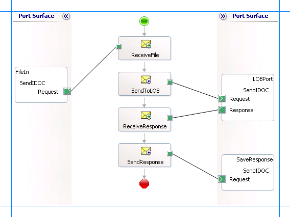

# Send IDOCs to SAP using BizTalk Server
All IDOC calls to SAP are internally treated as tRFC calls where the adapter acts as a tRFC client and calls an RFC in SAP to send an IDOC. This section provides information on sending IDOCs to SAP by using the [!INCLUDE[adaptersap](../../includes/adaptersap-md.md)] with [!INCLUDE[btsBizTalkServerNoVersion](../../includes/btsbiztalkservernoversion-md.md)]. The [!INCLUDE[adaptersap_short](../../includes/adaptersap-short-md.md)] surfaces two different operations to send IDOCs:  

- **Send** operation enables adapter clients to send IDOCs having a strongly-typed schema.  

- **SendIdoc** operation enables adapter clients to send IDOCs having a weakly-typed schema. Using this, the adapter clients can send flat-file IDOCs to the SAP system. The entire flat-file IDOC would be a node value in a SendIdoc XML message.  

  For more information about how the [!INCLUDE[adaptersap_short](../../includes/adaptersap-short-md.md)] supports sending IDOCs to an SAP system, see [Operations on IDOCs in SAP](../../adapters-and-accelerators/adapter-sap/operations-on-idocs-in-sap.md). For more information about the structure of SOAP messages for sending an IDOC, see [Message Schemas for IDOC Operations](../../adapters-and-accelerators/adapter-sap/message-schemas-for-idoc-operations.md).  

## BizTalk Scenarios for Sending IDOCs with the SAP Adapter  
 The following table provides key BizTalk scenarios for sending IDOCs to an SAP system:  


|       Input to BizTalk        |                                                                                                                                                                                                                                                                                                                 BizTalk Processing                                                                                                                                                                                                                                                                                                                  | Output to Adapter |
|-------------------------------|-----------------------------------------------------------------------------------------------------------------------------------------------------------------------------------------------------------------------------------------------------------------------------------------------------------------------------------------------------------------------------------------------------------------------------------------------------------------------------------------------------------------------------------------------------------------------------------------------------------------------------------------------------|-------------------|
|        Flat-file IDOC         |                                                         **Metadata Design Time**<br /><br /> 1.  Set the binding property GenerateFlatFileCompatibleIdocSchema to **True**.<br />2.  Generate the schema for the **Send** operation for a specific IDOC using [!INCLUDE[consumeadapterservshort](../../includes/consumeadapterservshort-md.md)].<br /><br /> **Orchestration Design Time**<br /><br /> 1.  Receive flat-file IDOC<br />2.  Use flat-file disassembler to convert flat-file IDOC to XML IDOC using the schema just generated.<br />3.  Set the Action to **Send** operation.                                                         |   Send message    |
|        Flat-file IDOC         | **Metadata Design Time**<br /><br /> 1.  Set the binding property GenerateFlatFileCompatibleIdocSchema to **True**.<br />2.  Generate the schema for the **SendIdoc** operation from the IDOC node using [!INCLUDE[consumeadapterservshort](../../includes/consumeadapterservshort-md.md)].<br /><br /> **Orchestration Design Time**<br /><br /> 1.  Receive flat-file IDOC<br />2.  Use flat-file disassembler to convert flat-file IDOC to XML (in this case, the XML message contains an \<idocData\> node that contains the entire flat-file Idoc message) using the schema just generated.<br />3.  Set the Action to **SendIdoc** operation. | SendIdoc message  |
|           XML IDOC            |                                                                                                                                                           **Metadata Design Time**<br /><br /> -   Generate the schema for the **Send** operation for a specific IDOC using [!INCLUDE[consumeadapterservshort](../../includes/consumeadapterservshort-md.md)].<br /><br /> **Orchestration Design Time**<br /><br /> 1.  Receive XML IDOC.<br />2.  Set the Action to **Send** operation.                                                                                                                                                           |   Send message    |
| Flat-file IDOC in XML message |                                                                                                                                                      **Metadata Design Time**<br /><br /> -   Generate the schema for the **SendIdoc** operation from the IDOC node using [!INCLUDE[consumeadapterservshort](../../includes/consumeadapterservshort-md.md)].<br /><br /> **Orchestration Design Time**<br /><br /> 1.  Receive XML message.<br />2.  Set the Action to **SendIdoc** operation.                                                                                                                                                      | SendIdoc message  |

## How to Send an IDOC to an SAP System  
 Performing an operation on an SAP system using [!INCLUDE[btsBizTalkServerNoVersion](../../includes/btsbiztalkservernoversion-md.md)] involves procedural tasks described in [Building blocks to create SAP applications](../../adapters-and-accelerators/adapter-sap/building-blocks-to-create-sap-applications.md). To send an IDOC to an SAP system, these tasks are:  

1. Create a BizTalk project and generate schema for the IDOC you want to invoke in the SAP system. While generating the schema make sure you set the required binding properties, as listed in the previous table. For instructions on how to set the binding properties, see [Configure the binding properties for the SAP adapter](../../adapters-and-accelerators/adapter-sap/configure-the-binding-properties-for-the-sap-adapter.md).  

2. Create messages in the BizTalk project for sending and receiving messages from the SAP system.  

3. Create an orchestration to send an IDOC to an SAP system.  

4. Build and deploy the BizTalk project.  

5. Configure the BizTalk application by creating physical send and receive ports.  

6. Start the BizTalk application.  

   This topic provides instructions to perform these tasks.  

## Sample Based On This Topic  
 A sample, IDOCSend, based on this topic is also provided with the [!INCLUDE[adapterpacknoversion](../../includes/adapterpacknoversion-md.md)]. For more information, see [Samples for the SAP Adapter ](../../adapters-and-accelerators/adapter-sap/samples-for-the-sap-adapter.md).  

## Generating Schema  
 This topic demonstrates how to send an IDOC to an SAP system by generating schema for the *Send* operation under \IDOC\ORDERS\ORDERS05\ORDERS05.V3(620) IDOC. See [Browse, search and get metadata for IDOC operations in SAP](../../adapters-and-accelerators/adapter-sap/browse-search-and-get-metadata-for-idoc-operations-in-sap.md) for more information about how to generate schema for a particular IDOC.  

## Defining Messages and Message Types  
 The schema that you generated earlier describes the "types" required for the messages in the orchestration. A message is typically a variable, the type for which is defined by the corresponding schema. You must link the schema you generated in the first step to the messages from the Orchestration view of the BizTalk project.  

 For this topic, you must create two messages—one to send an IDOC to the SAP system and the other to receive a response.  

 Perform the following steps to create messages and link them to the schema:  

#### To create messages and link to schema  

1.  Open the orchestration view the BizTalk project, if not already open. Click **View**, point to **Other Windows**, and click **Orchestration View**.  

2.  In the **Orchestration View**, right-click **Messages**, and then click **New Message**.  

3.  Right-click the newly create message and select **Properties Window**.  

4.  In the **Properties** pane for **Message_1**, do the following:  

    |Use this|To do this|  
    |--------------|----------------|  
    |Identifier|Type **IDOCSend**.|  
    |Message Type|From the drop-down list, expand **Schemas**, and select *IDOCSend.SAPBindingSchema3*, where *IDOCSend* is the name of your BizTalk project. *SAPBindingSchema3* is the schema generated for the Send operation.|  

5.  Repeat the previous step to create a new message. In the **Properties** pane for the new message, do the following:  

    |Use this|To do this|  
    |--------------|----------------|  
    |Identifier|Type **IDOCResponse**.|  
    |Message Type|From the drop-down list, expand **Schemas**, and select *IDOCSend.SAPBindingSchema4*.|  

## Setting up the Orchestration  
 You must create a BizTalk orchestration to use [!INCLUDE[btsBizTalkServerNoVersion](../../includes/btsbiztalkservernoversion-md.md)] for sending IDOCs to an SAP system. In this orchestration, you will be dropping a flat-file IDOC at a defined receive location. This file is converted into an XML request message using a flat-file disassembler. The [!INCLUDE[adaptersap_short](../../includes/adaptersap-short-md.md)] consumes this message and passes it on to the SAP system. The response with a GUID is received from SAP and is saved at another location. You must include send and receive shapes to send IDOCs to the SAP system and receive responses. You must also include a flat-file disassembler to convert a flat file into an XML file. A typical orchestration to send and IDOC to an SAP system would contain:  

- Send and Receive shapes to send messages to the SAP system and receive responses.  

- A one-way receive port to receive flat-file IDOCs to send to the SAP system.  

- A flat-file disassembler to convert the flat-file IDOC into an XML file.  

- A two-way send port to send the IDOC to the SAP system and receive responses.  

- A one-way send port to send the responses from the SAP system to a folder.  

  A sample orchestration would look like the following:  

    

### Adding Message Shapes  
 Make sure you specify the following properties for each of the message shapes. The names listed in the *Shape* column are the names of the message shapes as displayed in the orchestration above.  

|Shape|Shape Type|Properties|  
|-----------|----------------|----------------|  
|ReceiveFile|Receive|-   Set **Name** to *ReceiveFile*<br />-   Set **Activate** to *True*|  
|SendToLOB|Send|-   Set **Name** to *SendToLOB*|  
|ReceiveResponse|Receive|-   Set **Name** to *ReceiveResponse*<br />-   Set **Activate** to *False*|  
|SendResponse|Send|-   Set **Name** to *SendResponse*|  

### Adding Ports  
 Make sure you specify the following properties for each of the logical ports. The names listed in the *Port* column are the names of the ports as displayed in the orchestration.  

|Port|Properties|  
|----------|----------------|  
|FileIn|-   Set **Identifier** to *FileIn*<br />-   Set **Type** to *FileInType*<br />-   Set **Communication Pattern** to *One-Way*<br />-   Set **Communication Direction** to *Receive*|  
|LOBPort|-   Set **Identifier** to *LOBPort*<br />-   Set **Type** to *LOBPortType*<br />-   Set **Communication Pattern** to *Request-Response*<br />-   Set **Communication Direction** to *Send-Receive*|  
|SaveResponse|-   Set **Identifier** to *SaveResponse*<br />-   Set **Type** to *SaveResponseType*<br />-   Set **Communication Pattern** to *One-Way*<br />-   Set **Communication Direction** to *Send*|  

### Adding a Flat File Disassembler  
 You must add a flat file disassembler to your orchestration to convert the flat-file IDOC into an XML format.  

##### To add a flat file disassembler  

1.  Right-click the BizTalk project, point to **Add**, and select **New Item**.  

2.  From the dialog box, do the following:  

    |Use this|To do this|  
    |--------------|----------------|  
    |Categories|Pipeline Files|  
    |Visual Studio installed templates|Receive Pipeline|  
    |Name|IDOCReceive|  

3.  This opens the Pipeline Designer. From the **BizTalk Pipeline Components** toolbox, drag the **Flat file disassembler** pipeline component into the **Disassemble** stage of the receive pipeline.  

4.  From the **Pipeline Component Properties** view, specify a value for the **Document Schema** property. From the drop-down make sure you select the schema corresponding to the IDOC send operation.  

## Specify Messages for Action Shapes and Connect to Ports  
 The following table specifies the properties and their values to be set to specify messages for action shapes and linking them to the ports. The names listed in the *Shape* column are the names of the message shapes as displayed in the orchestration above.  

|Shape|Properties|  
|-----------|----------------|  
|ReceiveFile|-   Set **Message** to *IDOCSend*<br />-   Set **Operation** to *FileIn.SendIDOC.Request*|  
|SendToLob|-   Set **Message** to *IDOCSend*<br />-   Set **Operation** to *LOBPort.SendIDOC.Request*|  
|ReceiveResponse|-   Set **Message** to *IDOCResponse*<br />-   Set **Operation** to *LOBPort.SendIDOC.Response*|  
|SendResponse|-   Set **Message** to *IDOCResponse*<br />-   Set **Operation** to *SaveResponse.SendIDOC.Request*|  

 After you have specified these properties, the message shapes and ports are connected and your orchestration is complete.  

 You must now build the BizTalk solution and deploy it to a [!INCLUDE[btsBizTalkServerNoVersion](../../includes/btsbiztalkservernoversion-md.md)]. For more information, see [Building and Running Orchestrations](../../core/building-and-running-orchestrations.md).

## Configuring the BizTalk Application  
 After you have deployed the BizTalk project, the orchestration you created earlier is listed under the **Orchestrations** pane in the BizTalk Server Administration console. You must use the BizTalk Server Administration console to configure the application. For more information about configuring an application, see [How to Configure an Application](../../core/how-to-configure-an-application.md).

 Configuring an application involves:  

- Selecting a host for the application.  

- Mapping the ports that you created in your orchestration to physical ports in the BizTalk Server Administration console. For this orchestration you must:  

  - Define a location on the hard disk and a corresponding file port where you will drop a request message. The BizTalk orchestration will consume the request message and send it to the SAP system.  

    > [!IMPORTANT]
    >  For the XMLReceive pipeline for this port, make sure you select ***IDOCReceive***. You created this pipeline as part of the BizTalk project.  

  - Define a location on the hard disk and a corresponding file port where the BizTalk orchestration will drop the response message containing the response from the SAP system.  

  - Define a physical WCF-Custom or WCF-SAP send port to send messages to the SAP system. You must also specify the action in the send port. For information about how to create ports, see [Manually configure a physical port binding to the SAP adapter](../../adapters-and-accelerators/adapter-sap/manually-configure-a-physical-port-binding-to-the-sap-adapter.md).

    > [!NOTE]
    >  You can also set the *AutoConfirmSentIdocs* binding property to automatically commit IDOCs into the SAP system. If you do so, you do not need to explicitly call the RfcConfirmTransID operation to commit the IDOCs. For more information about the binding property, see [Read about BizTalk Adapter for mySAP Business Suite Binding Properties](../../adapters-and-accelerators/adapter-sap/read-about-biztalk-adapter-for-mysap-business-suite-binding-properties.md). For more information about the RfcConfirmTransID operation, see [Operations on tRFCs in SAP](../../adapters-and-accelerators/adapter-sap/operations-on-trfcs-in-sap.md).  
    > 
    > [!NOTE]
    >  Generating the schema using the [!INCLUDE[consumeadapterservlong](../../includes/consumeadapterservlong-md.md)] also creates a binding file containing information about the ports and the actions to be set for those ports. You can import this binding file from the BizTalk Administration Console to create send ports (for outbound calls) or receive ports (for inbound calls). For more information, see [Configure a physical port binding using a port binding file to SAP](../../adapters-and-accelerators/adapter-sap/configure-a-physical-port-binding-using-a-port-binding-file-to-sap.md).

## Starting the Application  
 You must start the BizTalk application for sending an IDOC to the SAP system. For instructions on starting a BizTalk application, see [How to Start an Orchestration](../../core/how-to-start-an-orchestration.md), or [How to start an application](../../core/how-to-start-and-stop-a-biztalk-application.md).

 At this stage, make sure:  

-   The FILE receive port to receive request messages for the orchestration is running.  

-   The FILE send port to receive the response messages from the orchestration is running.  

-   The WCF-Custom or WCF-SAP send port to send messages to the SAP system is running.  

-   The BizTalk orchestration for the operation is running.  

## Executing the Operation  
 After you run the application, you must drop a request message for the orchestration. For this example, we will drop a flat-file IDOC at the defined FILE receive location. The following actions take place after you drop the request message:  

- The orchestration picks this flat-file IDOC and converts it into XML request message, the schema for which conforms to the schema you generated earlier.  

- If the request message you provided contains a GUID, the adapter generates a transaction ID (TID) and sends it to the SAP system.  

- If the request message you provided does not contain a GUID, the adapter generates a GUID and uses that GUID to generate a TID. The TID is then sent to the SAP system.  

  In both the cases, the response message from the SAP system contains a GUID. For example, a response message for the Send operation on the ORDERS05 IDOC is:  

```  
<?xml version="1.0" encoding="utf-8"?>  
<SendResponse xmlns="http://Microsoft.LobServices.Sap/2007/03/Idoc/3/ORDERS05//620/Send">  
  <guid>a5afe162-d5cc-47b0-bf6f-3b0bfe06a97e</guid>  
</SendResponse>  
```  

 After you receive the GUID you must invoke the **RfConfirmTransID** operation to commit the TID. For more information about the **RfcConfirmTransID** operation, see [Operations on tRFCs in SAP](../../adapters-and-accelerators/adapter-sap/operations-on-trfcs-in-sap.md). You can either create a new orchestration to call this operation or modify the existing orchestration. If you want to create a new orchestration, it will be similar to any other orchestration on an SAP system. If you want to update the existing orchestration, see [Invoke tRFCs in SAP using BizTalk Server](../../adapters-and-accelerators/adapter-sap/invoke-trfcs-in-sap-using-biztalk-server.md). The orchestration for invoking a tRFC, as described in the topic demonstrates how to call a **RfcConfirmTransID** operation from the same orchestration.  

> [!NOTE]
>  You need not invoke the RfcConfirmTransID operation if you set the *AutoConfirmSentIdocs* binding property to **True**.  

## Possible Exceptions  
 For information about the exceptions you might encounter while sending an IDOC to an SAP system using BizTalk Server, see [Exceptions and Error Handling with the SAP adapter](../../adapters-and-accelerators/adapter-sap/exceptions-and-error-handling-with-the-sap-adapter.md).  

## Best Practices  
 After you have deployed and configured the BizTalk project, you can export configuration settings to an XML file called the bindings file. Once you generate a bindings file, you can import the configuration settings from the file so that you do not need to create the send ports, receive ports, etc. for the same orchestration. For more information about binding files, see [Reuse SAP adapter bindings](../../adapters-and-accelerators/adapter-sap/reuse-sap-adapter-bindings.md).

## See Also  
[Develop BizTalk applications](../../adapters-and-accelerators/adapter-sap/develop-biztalk-applications-using-the-sap-adapter.md)