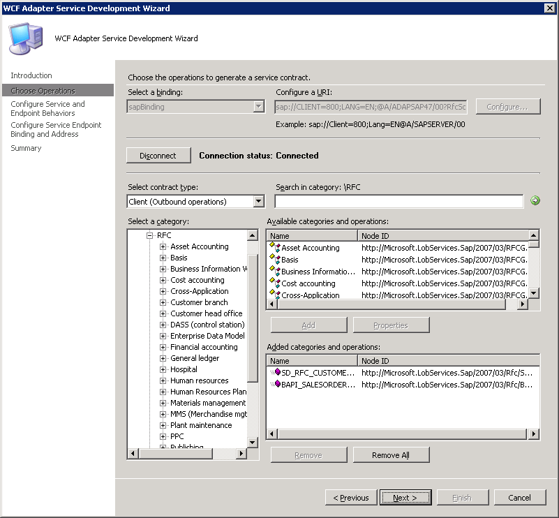
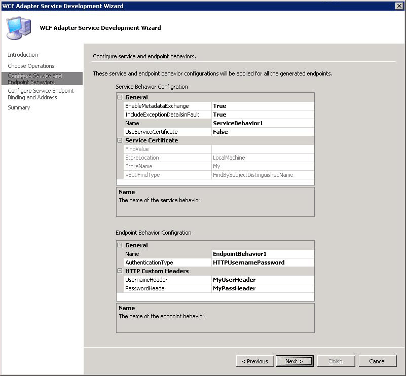
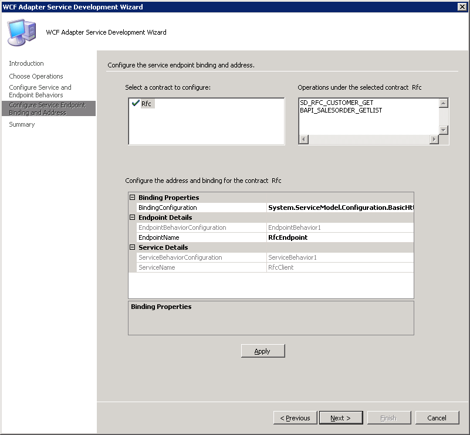

# Step 1: Publish the SAP Artifacts as a WCF Service
  
  
 **Time to complete:** 10 minutes  
  
 **Objective:** You can use the WCF Adapter Service Development Wizard to generate a WCF service that can be hosted in a hosting environment such as Internet Information Services (IIS) or Windows Process Activation Service (WAS). This topic demonstrates how to use the wizard to generate a WCF service file.  
  
## Prerequisites  
 Before running the wizard, install the following:  
  
- [!INCLUDE[afproductnamelong](../../includes/afproductnamelong-md.md)] either with the **Complete** option or the **Custom** option (and choosing **Tools** within this option). This installs the [!INCLUDE[btsVStudioNoVersion](../../includes/btsvstudionoversion-md.md)] template for the WCF Adapter Service Development Wizard.  
  
- [!INCLUDE[adaptersap](../../includes/adaptersap-md.md)] from the [!INCLUDE[adapterpacknoversion](../../includes/adapterpacknoversion-md.md)].  
  
- The required SAP client libraries.  
  
  For more information about these prerequisites, see the [!INCLUDE[adapterpacknoversion](../../includes/adapterpacknoversion-md.md)] installation guide. The installation guide is typically installed at \<installation drive\>:\Program Files\Microsoft [!INCLUDE[adapterpacknoversion](../../includes/adapterpacknoversion-md.md)]\Documents.  
  
### To publish the SAP artifacts as a WCF service  
  
1. Start [!INCLUDE[btsVStudioNoVersion](../../includes/btsvstudionoversion-md.md)], and then create a project.  
  
2. In the **New Project** dialog box, from the **Project types** pane, select **Visual C#**. From the **Templates** pane, select **WCF Adapter Service**.  
  
    Alternatively, from the **Project types** pane, expand **Visual C#**, and then select **Web**. From the **Templates** pane, select **WCF Adapter Service**.  
  
   > [!NOTE]
   >  If you installed [!INCLUDE[btsVStudio2008](../../includes/btsvstudio2008-md.md)] with the Web Development component, the **WCF Adapter Service** template is also available from the **New Website** option.  
  
3. Specify a name and location for the solution, and then click **OK**. The WCF Adapter Service Development Wizard starts.  
  
4. On the Welcome page, click **Next**.  
  
5. On the Choose Operations page, specify a connection string to connect to the SAP system. To do so:  
  
   1. In the **Select a binding** list, click **sapBinding**, and then click **Configure**.  
  
   2. In the **Configure Adapter** dialog box, click the **Security** tab.  
  
   3. In the **Client credential type** list, select **Username**, and then specify a valid SAP user name and password to connect to the SAP system.  
  
   4. Click the **URI Properties** tab, and then specify values for the connection parameters. For more information about the connection URI for the [!INCLUDE[adaptersap_short](../../includes/adaptersap-short-md.md)], see [Create the SAP system connection URI](../../adapters-and-accelerators/adapter-sap/create-the-sap-system-connection-uri.md).  
  
      > [!NOTE]
      >  If the connection parameters contain any reserved characters (such as XML special characters), you must specify them as-is in the **URI Properties** tab, that is, without using any escape characters. However, if you specify the URI directly in the **Configure a URI** box and the connection parameters contain reserved characters, you must specify the connection parameters using proper escape characters.  
  
   5. Click the **Binding Properties** tab, and then specify values for the binding properties, if any, required for the operations you want to target. In this tutorial, the BAPI_SALESORDER_GETLIST RFC is invoked to get the list of sales orders for a specific customer. The sales order information might also contain date columns. When retrieving values for the date column, we recommend that you set the **EnableSafeTyping** binding property to **True** when generating the metadata. If this property is set, the SAP DATS data type is surfaced as strings.  
  
       For more information about how the SAP data types are mapped to equivalent .NET types, see [Basic SAP Data Types](../../adapters-and-accelerators/adapter-sap/basic-sap-data-types.md).  
  
       For more information about binding properties, see [Read about BizTalk Adapter for mySAP Business Suite binding properties](../../adapters-and-accelerators/adapter-sap/read-about-biztalk-adapter-for-mysap-business-suite-binding-properties.md).  
  
   6. Click **OK**, and then click **Connect**. After the connection is established, the connection status is shown as **Connected**.  
  
6. On the Choose Operations page, in the **Select contract type** list, click **Client (Outbound operations)**.  
  
7. In the **Select a category** box, expand an SAP artifact type. For example, expand the **RFC** node to see the functional group containing the RFC for which you want to generate a WCF service.  
  
8. In the **Available categories and operations** box, select the operations for which you want to generate a WCF service, and then click **Add**. The selected operations are listed in the **Added categories and operations** box.  
  
   > [!NOTE]
   >  You can add more than one operation for each artifact. You can also add operations for different SAP artifacts. For example, you can add one operation for RFC and another for IDOC. In addition, you can search for specific operations by specifying wildcard characters in search expressions. For more information about the supported special characters and the node levels at which you can search for the operations, see [Connecting to SAP in Visual Studio Using Add Adapter Metadata Wizard](../../adapters-and-accelerators/adapter-sap/connecting-to-sap-in-visual-studio-using-add-adapter-metadata-wizard.md)  
  
    For this example, the SD_RFC_CUSTOMER_GET and BAPI_SALESORDER_GETLIST RFCs are added.  
  
   > [!NOTE]
   >  Some versions of the SAP system expose an RFC_CUSTOMER_GET RFC instead of SD_RFC_CUSTOMER_GET.  
  
      
  
9. On the Choose Operations page, click **Next**.  
  
10. On the Configure Service and Endpoint Behaviors page, specify values to configure the service and endpoint behavior.  
  
    1. In the **Service Behavior Configuration** box, specify values for the following:  
  
       |For the property|Specify the value|  
       |----------------------|-----------------------|  
       |EnableMetadataExchange|Set this to **True** to create a metadata exchange endpoint. By setting this to **True**, you make the service metadata available using standardized protocols, such as WS-Metadata Exchange (MEX) and HTTP/GET requests.<br /><br /> Default is **False**.|  
       |IncludeExceptionDetailsinFault|Set this to **True** to include managed exception information in detail of SOAP faults returned to the client for debugging purposes. Default is **False**.|  
       |Name|Name for the service behavior configuration.|  
       |UseServiceCertificate|Specifies whether you want to use the message level security mode of WCF. Default is **True**.<br /><br /> For this tutorial, you must set this to **False**.|  
       |FindValue|A string that specifies the value to search for in the X.509 certificate store.<br /><br /> **Note:** Specify a value for this property only if **UseServiceCertificate** is set to **True**.|  
       |StoreLocation|A value that specifies the location of the certificate store that the service can use to validate the client's certificate.<br /><br /> **Note:** Specify a value for this property only if **UseServiceCertificate** is set to **True**.|  
       |StoreName|Name of the X.509 certificate store to open.<br /><br /> **Note:** Specify a value for this property only if **UseServiceCertificate** is set to **True**.|  
       |X509FindType|The type of X.509 search to be executed.<br /><br /> **Note:** Specify a value for this property only if **UseServiceCertificate** is set to **True**.|  
  
       > [!NOTE]
       >  For more information about the certificates and the associated properties, see "X509ClientCertificateCredentialsElement Properties" at [http://go.microsoft.com/fwlink/?LinkId=103771](http://go.microsoft.com/fwlink/?LinkId=103771).  
  
    2. In the **Endpoint Behavior Configuration** box, specify values for the following:  
  
       |For the property|Specify the value|  
       |----------------------|-----------------------|  
       |Authentication Type|- Set this to **ClientCredentialUserNamePassword** to enable the clients to specify the user name and password when consuming the WCF service.<br /><br /> - Set this to **HTTPUserNamePassword** to enable clients to specify user name and password as part of the HTTP header.<br /><br /> - Set this to **Auto** to first enable clients to specify credentials through the **ClientCredential** interface. If this fails, clients can pass credentials as part of the HTTP header.<br /><br /> Default is **Auto**. For Microsoft Office SharePoint Server to consume the WCF service, you should set this as **HTTPUserNamePassword**.|  
       |Name|Specify a name for the endpoint behavior configuration.|  
       |UsernameHeader|Name for the user name header. For this example, specify **MyUserHeader**. For more information about HTTP headers, see "Support for Custom HTTP and SOAP Headers" at [http://go.microsoft.com/fwlink/?LinkId=106692](http://go.microsoft.com/fwlink/?LinkId=106692).<br /><br /> **Note:** You must specify a value for this property if the **Authentication Type** is set to **HTTPUserNamePassword**. If **Authentication Type** is set to **Auto**, this property is optional.|  
       |PasswordHeader|Name for the password header. For this example, specify **MyPassHeader**. For more information about HTTP headers, see "Support for Custom HTTP and SOAP Headers" at [http://go.microsoft.com/fwlink/?LinkId=106692](http://go.microsoft.com/fwlink/?LinkId=106692).<br /><br /> **Note:** You must specify a value for this property if the **Authentication Type** is set to **HTTPUserNamePassword**. If **Authentication Type** is set to **Auto**, this property is optional.|  
  
       The following figure shows the Configure Service and Endpoint Behaviors page with the specified values.  
  
         
  
11. On the Configure Service and Endpoint Behaviors page, click **Next**.  
  
12. On the Configure Service Endpoint Binding and Address page, the **Select a contract to configure** box lists the SAP artifacts for which you selected the operations on the Choose Operations page.  
  
     For example, if you selected artifacts under RFC and IDOC, the **Select a Contract to configure** lists both RFC and IDOC. If you selected only an RFC, the box will only list RFC.  
  
13. The **Operations under the selected contract** box displays the operations you selected for each artifact on the Choose Operations page.  
  
14. In the **Configure the address and binding for the contract** box, specify values for the following:  
  
    |For the property|Specify the value|  
    |----------------------|-----------------------|  
    |Binding Configuration|The wizard only supports basic HTTP binding. So, the binding configuration field is automatically populated to *System.ServiceModel.Configuration.BasicHttpBindingElement*.<br /><br /> Click the ellipsis button **(…)** to change the properties for HTTP binding. To use a secure communication channel, you must always set the **Mode** property to **Transport**. The wizard sets the default value for the **Mode** property as **Transport**.<br /><br /> For more information about the other bindings exposed, see "BasicHttpBindingElement Members" at [http://go.microsoft.com/fwlink/?LinkId=103773](http://go.microsoft.com/fwlink/?LinkId=103773).|  
    |Endpoint Name|Specify an endpoint name for the contract.|  
  
     The other fields on this page are automatically populated based on the values you specified in the earlier pages.  
  
     Click **Apply**. Perform this step for all the contracts displayed under the **Select a contract to configure** box.  
  
    > [!NOTE]
    >  If you do not specify any values on this page, the default values are accepted for all the contracts.  
  
     The following figure shows the Configure Service Endpoint Binding and Address page with the specified values.  
  
       
  
15. On the Configure Service Endpoint Binding and Address page, click **Next**.  The Summary page lists a tree structure of the SAP artifacts and, under that, the operations selected for each artifact.  
  
16. Review the summary, and then click **Finish**.  
  
17. The wizard creates a WCF service and adds the following files to the [!INCLUDE[btsVStudioNoVersion](../../includes/btsvstudionoversion-md.md)] project:  
  
    1.  .svc file. This is the WCF service file. The wizard generates one file for each contract.  
  
    2.  Web.config file.  
  
    3.  Service code (.cs file)  
  
18. Publish the WCF service.  
  
    1.  Make sure SSL is enabled for Internet Information Services (IIS). For instructions on how to enable SSL for IIS, see [http://go.microsoft.com/fwlink/?LinkId=197170](http://go.microsoft.com/fwlink/?LinkId=197170).  
  
    2.  Right-click the project in Solution Explorer, and then click **Publish**.  
  
    3.  In the **Publish Web** dialog box, specify a URL for the WCF service. For example:  
  
        ```  
        https://<computer_name>/Customer_Order/  
        ```  
  
    4.  From the **Copy** box, click **All project files**.  
  
    5.  Click **Publish**.  
  
19. Verify that the WCF service is published successfully.  
  
    1.  Start the IIS Microsoft Management Console. Click **Start**, point to **Administrative Tools**, and then click **Internet Information Services (IIS) Manager**.  
  
    2.  Navigate to the node where you published the service. For the **Customer_Order** service, navigate to **Internet Information Services** > **\<Computer Name\>** > **Web Sites** > **Default Web Site** > **Customer_Order**.  
  
    3.  On the right pane, right-click the Rfc.svc file, and then click **Browse**.  
  
    4.  The Web page shows up with the URL for retrieving the WSDL. You may want to test metadata retrieval using the **svcutil** command. For example, the command to retrieve metadata for the Customer_Order service is:  
  
        ```  
        svcutil.exe https://<computer_name>/Customer_Order/Rfc.svc?wsdl  
  
        ```  
  
## Next Step  
 To create an application definition file for the SAP artifacts, use the Business Data Catalog Definition Editor. See [Step 2: Create an Application Definition File for the SAP Artifacts](../../adapters-and-accelerators/adapter-sap/step-2-create-an-application-definition-file-for-the-sap-artifacts.md) for instructions. The application definition file identifies where the LOB data is stored and the format in which it is stored.  
  
## See Also  
 [Tutorial 1: Presenting Data from an SAP System on a SharePoint Site](../../adapters-and-accelerators/adapter-sap/tutorial-1-presenting-data-from-an-sap-system-on-a-sharepoint-site.md)