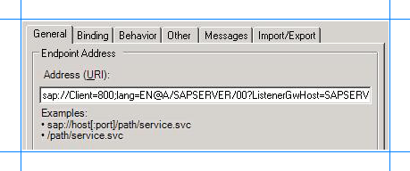
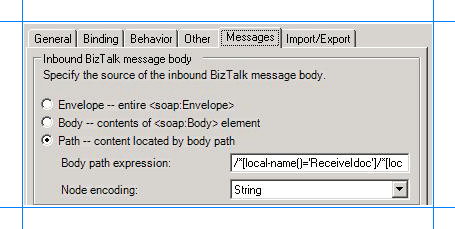

# Step 2: Configure a WCF-Custom One-way Receive Port
  
  
 **Time to complete:** 10 minutes  
  
 **Objective:** In this step, you configure a WCF-Custom port to receive a flat-file IDOC from an SAP system. After configuring the port, you configure the BizTalk application to use the WCF-Custom receive port.  
  
## Prerequisites  
 You must have built and deployed your vPrev BizTalk project to receive IDOCs from an SAP system.  
  
### To configure a WCF-Custom one-way receive port  
  
1. Start the [!INCLUDE[btsBizTalkServerNoVersion](../../includes/btsbiztalkservernoversion-md.md)] Administration console.  
  
2. In the console tree, expand **BizTalk Group**, and then expand **Applications**.  
  
3. Expand the application under which you want create the receive port.  
  
4. Right-click **Receive Ports**, point to **New**, and click **One-way Receive Port**.  
  
5. In the **Receive Port Properties** dialog box, on the **General** tab, type a name for the receive port.  
  
6. On the **Receive Locations** tab, click **New**. The **Receive Location Properties** dialog box appears.  
  
7. In the **Receive Location Properties** dialog box, do the following:  
  
   1.  Specify a name for the receive location.  
  
   2.  From the **Type** drop-down list, select **WCF-Custom**, and then click **Configure**.  
  
8. In the **WCF-Custom Transport Properties** dialog box, do the following:  
  
   1. Click the **General** tab, and in the **Address (URI)** field, specify the connection URI to receive messages from the SAP system. The connection URI to receive messages from the SAP system must be in the following format:  
  
      ```  
      sap://Client=800;lang=EN@A/YourSAPHOST/00?ListenerGwHost=YourSAPHOST&ListenerGwServ=SAPGW00&ListenerProgramId=MyProgramId  
      ```  
  
       The following figure shows the port properties dialog box with the URI specified:  
  
         
  
       For more information about the connection URI, see [Create a  connection to the SAP system](../../adapters-and-accelerators/adapter-sap/create-a-connection-to-the-sap-system.md).  
  
   2. Click the **Binding** tab, and from the **Binding Type** drop-down list, select **sapBinding**. Make sure you specify the following binding properties for the receive port.  
  
      |Binding property|Set value to|  
      |----------------------|------------------|  
      |flatFileSegmentIndicator|**SegmentType**. This indicates that the flat files should contain the segment type for each segment in the IDOC.|  
      |padReceivedIdocWithSpaces|**True**. Specifies whether each line in the IDOC is padded with spaces to the correct length.|  
      |receiveIDocFormat|**String**. This specifies that the IDOC message should be represented as a single string field.|  
  
       For more information about binding properties, see [Read about BizTalk Adapter for mySAP Business Suite Binding Properties](../../adapters-and-accelerators/adapter-sap/read-about-biztalk-adapter-for-mysap-business-suite-binding-properties.md).  
  
   3. Click the **Others** tab, and specify the credentials to connect to an SAP system.  
  
   4. Click the **Messages** tab, and in the **Inbound BizTalk message body** section, choose the **Path** option.  
  
   5. In the **Body path expression** text box, specify the XPath query to extract the flat-file IDOC from the XML message. By doing so, the receive port extracts the data from the IDOC and trims the XML tag that is part of the **ReceiveIdoc** operation for the WCF-based [!INCLUDE[adaptersap_short](../../includes/adaptersap-short-md.md)]. For more information about the message schema for the **ReceiveIdoc** operation, see [Message Schemas for IDOC Operations](../../adapters-and-accelerators/adapter-sap/message-schemas-for-idoc-operations.md).  
  
         
  
       You must specify the following XPath query:  
  
      ```  
      /*[local-name()='ReceiveIdoc']/*[local-name()='idocData']  
      ```  
  
   6. From the **Node encoding** drop-down list, select **String**.  
  
   7. Click **Apply**, and then click **OK**.  
  
9. In the Receive Location Properties dialog box, from the **Receive handler** drop-down list, select **BizTalkServerApplication**.  
  
10. From the **Receive pipeline** drop-down list, select **ConvertToXML**. This flat-file disassembler pipeline is already a part of the vPrev BizTalk project to convert a flat-file IDOC to an XML IDOC.  
  
11. Click **OK**.  
  
### To configure the BizTalk application  
  
1. In the BizTalk Server Administration console, expand **BizTalk Group**, expand **Applications**, and expand the BizTalk Application where the orchestration is deployed.  
  
2. Right-click the BizTalk application, and then select **Configure**.  
  
3. From the left pane, click the orchestration to configure. From the right pane, from the **Host** drop-down list, select a BizTalk host instance.  
  
4. Under the **Bindings** box, map the logical ports of the BizTalk orchestration to the physical ports in the BizTalk Server Administration console.  
  
   1. Select the WCF-Custom receive port you created earlier in this topic.  
  
   2. Select a file port where you will receive the flat-file IDOC.  
  
   3. Click **OK**.  
  
      For more information about configuring an application, see [http://go.microsoft.com/fwlink/?LinkId=102360](http://go.microsoft.com/fwlink/?LinkId=102360).  
  
## Next Steps  
 You have now completed migration of your vPrev BizTalk project to a BizTalk project that receives IDOCs from an SAP system using the WCF-based [!INCLUDE[adaptersap_short](../../includes/adaptersap-short-md.md)]. You must now test the migrated BizTalk application by receiving a flat-file IDOC, as described in [Step 3: Test the Migrated Application](../../adapters-and-accelerators/adapter-sap/step-3-test-the-migrated-application5.md).  
  
## See Also  
 [Tutorial 4: Migrating an SAP Receive IDOC BizTalk Project](../../adapters-and-accelerators/adapter-sap/tutorial-4-migrating-an-sap-receive-idoc-biztalk-project.md)