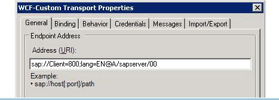
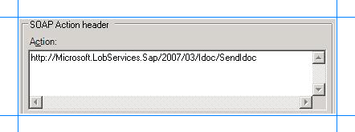
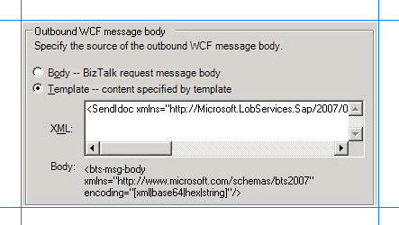

# Step 2: Configure a WCF-Custom One-way Send Port
  
  
 **Time to complete:** 10 minutes  
  
 **Objective:** In this step, you configure a WCF-Custom port to send the flat-file IDOC to an SAP system. After configuring the port, you configure the BizTalk application to use the WCF-Custom send port.  
  
## Prerequisites  
 You must have built and deployed your vPrev BizTalk project to send IDOCs to an SAP system.  
  
### To configure a WCF-Custom one-way send port  
  
1. Start the [!INCLUDE[btsBizTalkServerNoVersion](../../includes/btsbiztalkservernoversion-md.md)] Administration console.  
  
2. In the console tree, expand **BizTalk Group**, and then expand **Applications**.  
  
3. Expand the application under which you want to create the send port.  
  
4. Right-click **Send Ports**, point to **New**, and click **Static One-way Send Port**.  
  
5. In the **Send Port Properties** dialog box, on the **General** tab, type a name for the send port.  
  
6. From the **Type** drop-down list, select **WCF-Custom**, and then click **Configure**.  
  
7. In the **WCF-Custom Transport Properties** dialog box, do the following:  
  
   1. Click the **General** tab, and in the **Address (URI)** field, specify the connection URI to send messages to the SAP system. For more information about the connection URI, see [Create the SAP System Connection URI](../../adapters-and-accelerators/adapter-sap/create-the-sap-system-connection-uri.md).  
  
         
  
   2. On the **General** tab, in the **Action** text box, type the action for the operation. To send a flat-file IDOC, you must use the **SendIdoc** operation exposed by the WCF-based [!INCLUDE[adaptersap_short](../../includes/adaptersap-short-md.md)]. **SendIdoc** operation enables adapter clients to send IDOCs having a weakly-typed schema. For more information, see [Operations on IDOCs in SAP](../../adapters-and-accelerators/adapter-sap/operations-on-idocs-in-sap.md). The following figure shows the **Action** text box with the action for the **SendIdoc** operation.  
  
         
  
   3. Click the **Binding** tab, and from the **Binding Type** drop-down list, select **sapBinding**.  
  
   4. Click the **Credentials** tab and specify the credentials to connect to an SAP system.  
  
   5. Click the **Messages** tab, and in the **Outbound WCF message body** section, choose the **Template** option.  
  
   6. In the **XML** text box, specify the template that will be used to construct the WCF message. By doing so, you create a message that conforms to the **SendIdoc** operation for the WCF-based [!INCLUDE[adaptersap_short](../../includes/adaptersap-short-md.md)]. For more information about the message structure for the **SendIdoc** operation, see [Message Schemas for IDOC Operations](../../adapters-and-accelerators/adapter-sap/message-schemas-for-idoc-operations.md).  
  
         
  
       For the SendIdoc operation, you must specify the following template:  
  
      ```  
      <SendIdoc xmlns="http://Microsoft.LobServices.Sap/2007/03/Idoc/">  
      <idocData><bts-msg-body xmlns="http://www.microsoft.com/schemas/bts2007" encoding="string"/></idocData>  
      </SendIdoc>  
      ```  
  
       In the preceding template, the `bts-msg-body` is XML IDOC that is created using the flat-file disassembler associated with the file receive port. The XML IDOC is encapsulated in the SendIdoc message.  
  
   7. Click **Apply**, and then click **OK**.  
  
8. In the **Send Port Properties** dialog box, from the **Send handler** drop-down list, select **BizTalkServerApplication**.  
  
9. From the **Send pipeline** drop-down list, select **ConvertToFlatFile**. This flat-file assembler pipeline is already a part of the vPrev BizTalk project and is used to convert an XML IDOC to a flat-file IDOC.  
  
10. Click **OK**.  
  
### To configure the BizTalk application  
  
1. In the BizTalk Server Administration console, expand **BizTalk Group**, expand **Applications**, and expand the BizTalk Application where the orchestration is deployed.  
  
2. Right-click the BizTalk application, and then select **Configure**.  
  
3. From the left pane, click the orchestration to configure. From the right pane, from the **Host** drop-down list, select a BizTalk host instance.  
  
4. Under the **Bindings** box, map the logical ports of the BizTalk orchestration to the physical ports in the BizTalk Server Administration console.  
  
   1. Select the file port where you will drop the flat-file IDOC.  
  
   2. Select the WCF-Custom send port you created earlier in this topic.  
  
   3. Click **OK**.  
  
      For more information about configuring an application, see "How to Configure an Application" at [http://go.microsoft.com/fwlink/?LinkId=102360](http://go.microsoft.com/fwlink/?LinkId=102360).  
  
## Next Steps  
 You have now completed migration of your vPrev BizTalk project to a BizTalk project that sends IDOCs to an SAP system using the WCF-based [!INCLUDE[adaptersap_short](../../includes/adaptersap-short-md.md)]. You must now test the migrated BizTalk application by sending a flat-file IDOC, as described in [Step 3: Test the Migrated Application](../../adapters-and-accelerators/adapter-sap/step-3-test-the-migrated-application2.md).  
  
## See Also  
 [Tutorial 3: Migrating an SAP Send IDOC BizTalk Project](../../adapters-and-accelerators/adapter-sap/tutorial-3-migrating-an-sap-send-idoc-biztalk-project.md)