# Step 2: Create an Application Definition File for the SAP Artifacts
  
  
 **Time to complete:** 15 minutes  
  
 **Objective:** The Business Data Catalog feature in Microsoft SharePoint Server exposes and incorporates data from line-of-business (LOB) applications into portals. To incorporate this data into your portal site, you must build an application definition file that Microsoft Office SharePoint Server can consume.  
  
 The Business Data Catalog Definition Editor tool, available with Microsoft Office SharePoint Server 2007 SDK,enables you to create an application definition file for the Business Data Catalog. This tool automatically generates an XML file for the definition file, so you do not need to manually create the file in an XML editor.  
  
 The purpose of the Microsoft Office SharePoint Server application that you are creating is to:  
  
- Search for a customer in the SAP system based on a customer name.  
  
- Select a customer from the list of fetched customers and retrieve the details for the customer.  
  
- Select a customer from the list of fetched customers and retrieve the sales orders for the customer.  
  
  For each of these requirements, you must complete a set of tasks in the Business Data Catalog Definition Editor tool. This topic provides instructions on how to perform these tasks.  
  
## Prerequisites  
  
-   Be sure that you have the Business Data Catalog Definition Editor installed as part of the Microsoft Office SharePoint Server 2007 SDK. You can download the SDK from [http://go.microsoft.com/fwlink/?LinkId=104130](http://go.microsoft.com/fwlink/?LinkId=104130).  
  
-   Publish the WCF service as described in [Step 1: Publish the SAP Artifacts as a WCF Service](../../adapters-and-accelerators/adapter-sap/step-1-publish-the-sap-artifacts-as-a-wcf-service.md).  
  
## Creating an Application Definition File  
 This topic provides step-by-step instructions to create an application definition file for the WCF service.  
  
### Connect to the WCF LOB Service, and Create Entities  
 You must connect to the WCF service to extract the Web Services Description Language (WSDL) for the service. From the WSDL, the Business Data Catalog Definition Editor extracts the methods. These methods can be used to create entities. For this example, two entities are created, one each for the customer and sales orders.  
  
##### To connect to the WCF service and create entities  
  
1. Start the Business Data Catalog Definition Editor. On the **Start** menu, click **Microsoft Business Data Catalog Definition Editor**.  
  
2. On the toolbar, click **Add LOB System**.  
  
3. In the Add LOB System window, click **Connect to Webservice**.  
  
4. In the **URL** box, type the URL for the WCF service. The URL must be in the following format:  
  
   ```  
   https://<computer_name>/Customer_Order/Rfc.svc?wsdl  
   ```  
  
    where Rfc.svc is the file created for the Rfc contract.  
  
    The URL is available when you test whether the WCF service is published successfully, as described in the topic [Step 1: Publish the SAP Artifacts as a WCF Service](../../adapters-and-accelerators/adapter-sap/step-1-publish-the-sap-artifacts-as-a-wcf-service.md).  
  
5. Click **Connect**.  
  
6. To see the operations you selected in the WCF Adapter Service Development Wizard, click the **Add Web Method** tab. You will see the following methods:  
  
   - SD_RFC_CUSTOMER_GET  
  
   - BAPI_SALESORDER_GETLIST  
  
      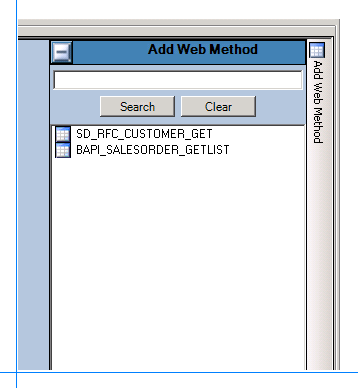  
  
     Drag the methods to the Design Surface. Make sure you drag both operations to the different entities.  
  
     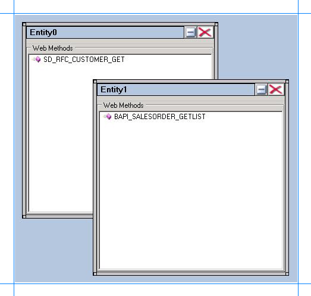  
  
7. Click **OK**.  
  
8. In the **Enter the name for the LOB System** dialog box, type a name in the **LOB System Name** box. For this example, call it **Customer_Order**, and then click **OK**.  
  
9. In the Business Data Catalog Definition Editor, the two entities are listed as **Entity0** and **Entity1**. Give these entities friendly names. Rename the entity for SD_RFC_CUSTOMER_GET to **Customer**, and rename the entity for BAPI_SALESORDER_GETLIST to **SalesOrder**. Perform the following steps to rename the entities:  
  
    1.  Expand the **Customer_Order** node, and then expand the **Entities** node.  
  
    2.  Select the **Entity0** node.  
  
    3.  In the Properties pane, type **Customer** in the **Name** box.  
  
         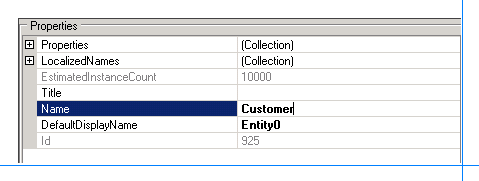  
  
    4.  Select the **Entity1** node.  
  
    5.  In the Properties pane, type **SalesOrder** in the **Name** box.  
  
### Specify User Name and Password Headers for the Methods  
 When creating a WCF service for the selected RFCs in the SAP system, you specified user name and password headers as part of the endpoint behavior configuration. See [Step 1: Publish the SAP Artifacts as a WCF Service](../../adapters-and-accelerators/adapter-sap/step-1-publish-the-sap-artifacts-as-a-wcf-service.md). You must specify the same values for the method properties.  
  
##### To specify user name and password headers  
  
1.  Add the user name and password headers for the SD_RFC_CUSTOMER_GET method.  
  
    1.  In the Metadata Objects pane, expand the **Customer** node, and then expand the **Methods** node.  
  
    2.  Click the SD_RFC_CUSTOMER_GET node, and in the Properties pane click the ellipsis (…) button against the **Properties** box.  
  
    3.  In the PropertyView Collection Editor window, click **Add**, and in the Property pane, type **HttpHeaderUserName** for the **Name** box. Similarly, type **MyUserHeader** for the **PropertyValue** box. Select **System.String** for the **Type** box.  
  
           
  
    4.  In the PropertyView Collection Editor window, click **Add**, and in the Property pane, type **HttpHeaderPassword** for the **Name** box. Similarly, type **MyPassHeader** for the **PropertyValue** box. Select **System.String** for the **Type** box.  
  
    5.  Click **OK**.  
  
2.  Add the user name and password headers for the BAPI_SALESORDER_GETLIST method.  
  
    1.  In the Metadata Objects pane, expand the **SalesOrder** node, and then expand the **Methods** node.  
  
    2.  Click the BAPI_SALESORDER_GETLIST node, and in the Properties pane click the ellipsis (…) button against the **Properties** box.  
  
    3.  In the PropertyView Collection Editor window, click **Add**, and in the Property pane, type **HttpHeaderUserName** for the **Name** box. Similarly, type **MyUserHeader** for the **PropertyValue** box. Select **System.String** for the **Type** box.  
  
    4.  In the PropertyView Collection Editor window, click **Add**, and in the Property pane, type **HttpHeaderPassword** for the **Name** box. Similarly, type **MyPassHeader** for the **PropertyValue** box. Select **System.String** for the **Type** box.  
  
    5.  Click **OK**.  
  
### Set up Single Sign-On for Connecting to the SAP System  
 After you have finished performing all the procedures in this topic, you will have created an application definition file that can be imported into a SharePoint application. From the application, you invoke the SAP methods to retrieve relevant data from the SAP system. To enable this, you must create a mapping between a user in the SAP system and the user in the SharePoint application. You create this mapping in SharePoint Central Administration console after you have imported the application definition file.  
  
 However, to create the mapping you must set a property **SecondarySsoApplicationId** in the Business Data Catalog Definition Editor.  
  
##### To set the SecondarySsoApplicationId property  
  
1.  In the Metadata Objects pane, expand the **Customer_Order** node, and then expand the **Instances** node.  
  
2.  Click **Customer_Order_Instance**, and in the Properties pane, click the ellipsis (…) button against the **Properties** box.  
  
3.  In the PropertyView Collection Editor window, click **Add**, and in the Property pane, type **SecondarySsoApplicationId** for the **Name** box. Similarly, type **SAPSSO** for the **PropertyValue** box. Select **System.String** for the **Type** box.  
  
     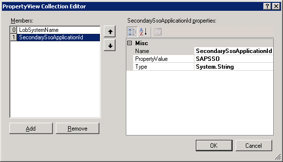  
  
4.  Click **OK**.  
  
### Requirement 1: Search for Customers Based on Customer Name  
 To create an application definition file that can be used to search for customers based on customer name, you must perform the following set of tasks.  
  
-   In the SD_RFC_CUSTOMER_GET method, create a filter and map it to the parameter that stores the customer name.  
  
-   Create a **Finder** method instance for the SD_RFC_CUSTOMER_GET method. A **Finder** method retrieves a list of records based on a filter.  
  
##### To create a filter, and map it to the customer name parameter  
  
1.  Create a filter.  
  
    1.  In the Metadata Objects pane, expand the **Customer** node, and then expand the **Methods** node.  
  
    2.  Expand the SD_RFC_CUSTOMER_GET method, right-click **Filters**, and then click **Add Filter**.  
  
         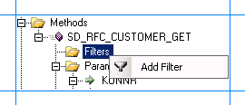  
  
    3.  In the Properties pane, type **CustomerName** in the **Name** box.  
  
         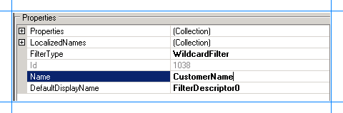  
  
    4.  For the **FilterType** property, select **WildcardFilter**.  
  
2.  Map the filter to the **NAME1** parameter in the SD_RFC_CUSTOMER_GET method.  
  
    1.  In the Metadata Objects pane, expand the **Customer** node, and then expand the **Methods** node.  
  
    2.  Expand the SD_RFC_CUSTOMER_GET method, and then expand the **Parameters** node.  
  
    3.  Expand the **NAME1** node, and click the second **NAME1** node. The **NAME1** parameter contains the name of the customer.  
  
    4.  In the Properties pane, select **CustomerName** from the **FilterDescriptor** list.  
  
         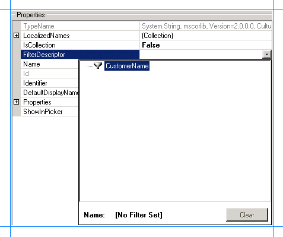  
  
##### To create a Finder method instance for the SD_RFC_CUSTOMER_GET method  
  
1.  In the Metadata Objects pane, expand the **Customer** node, and then expand the **Methods** node.  
  
2.  Expand the **SD_RFC_CUSTOMER_GET** node, right-click **Instances**, and then click **Add Method Instance** to open the Create Method Instance window.  
  
     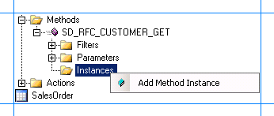  
  
3.  In the Create Method Instance window, click **Finder** for **Method Instance Type**. Select **CUSTOMER_T** for **Return TypeDescriptor**.  
  
     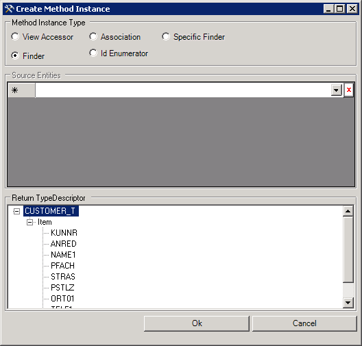  
  
4.  Click **OK**.  
  
5.  In the Properties pane, type **GetCustomerByName_Instance** in the **Name** box.  
  
     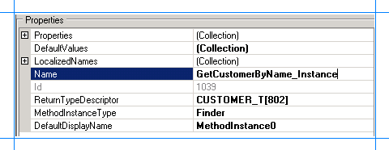  
  
### Requirement 2: Retrieve Details for a Specific Customer from the List of Customers  
 To create an application definition file that can be used to search for customers based on customer name, you must perform the following set of tasks.  
  
-   In the SD_RFC_CUSTOMER_GET method, create an identifier, and map it to the parameter that stores the customer number.  
  
-   Create a **Specific Finder** method instance for the SD_RFC_CUSTOMER_GET method. A **Specific Finder** method finds a specific record based on an identifier.  
  
##### To create an identifier, and map it to the customer number parameter  
  
1.  Create an identifier for the **Customer** entity.  
  
    1.  In the Metadata Objects pane, expand the **Customer** node.  
  
    2.  Right-click the **Identifiers** node, and then select **Add Identifier**.  
  
         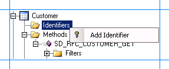  
  
    3.  In the Properties pane, type **CustomerID** in the **Name** box.  
  
    4.  Select **System.String** for the **Type** box.  
  
           
  
2.  Map the identifier to the key parameter for the SD_RFC_CUSTOMER_GET method.  
  
    1.  In the Metadata Objects pane, expand the **Customer** node, and then expand the **Methods** node.  
  
    2.  Expand the SD_RFC_CUSTOMER_GET method, and then expand the **Parameters** node.  
  
    3.  Expand the **KUNNR** parameter, and then click the second **KUNNR** node.  
  
    4.  In the Properties pane, select **CustomerID[Customer]** from the **Identifier** list.  
  
         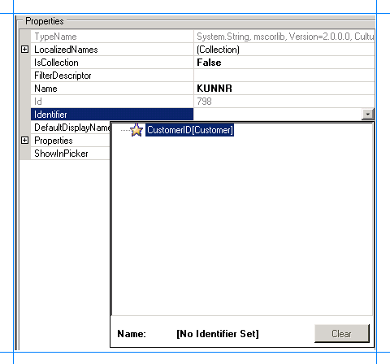  
  
3.  Set up an association between input and return parameters.  
  
    1.  In the Metadata Objects pane, expand the **Customer** node, and then expand the **Methods** node.  
  
    2.  Expand the SD_RFC_CUSTOMER_GET method, and then expand the **Parameters** node.  
  
    3.  Expand the **CUSTOMER_T** node, then the second **CUSTOMER_T** node, then the **Item** node, and then click the **KUNNR** node.  
  
    4.  In the Properties pane, select **CustomerID[Customer]** from the **Identifier** list.  
  
##### To create a Specific Finder method instance for the SD_RFC_CUSTOMER_GET method  
  
1.  In the Metadata Objects pane, expand the **Customer** node, and then the **Methods** node.  
  
2.  Expand the **SD_RFC_CUSTOMER_GET** node, right-click **Instances**, and then select **Add Method Instance** to open the Create Method Instance window.  
  
       
  
3.  In the Create Method Instance window, select **Specific Finder** for **Method Instance Type**. Similarly, select **CUSTOMER_T** for **Return TypeDescriptor**.  
  
     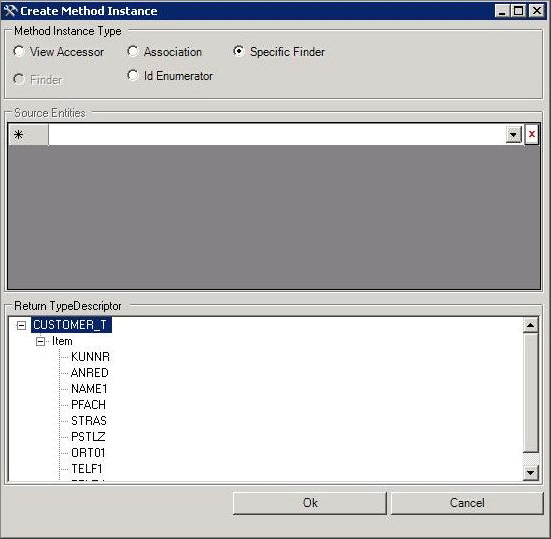  
  
4.  Click **OK**.  
  
5.  In the Properties pane, type **GetCustomerByNumber_Instance** for the **Name** box.  
  
       
  
### Requirement 3: Retrieve Sales Order Details for a Specific Customer from the List of Customers  
 To create an application definition file that can be used to retrieve sales order details for a specific customer, you must perform the following set of tasks.  
  
-   Set up an association between the **Customer** and **SalesOrder** entities.  
  
-   Create an **Association** method for the BAPI_SALESORDER_GETLIST method.  
  
##### To create an association between the Customer and SalesOrder entities  
  
1.  In the Metadata Objects pane, expand the **SalesOrder** node, and then expand the **Methods** node.  
  
2.  Expand the BAPI_SALESORDER_GETLIST method, and then expand the **Parameters** node.  
  
3.  Expand the **CUSTOMER_NUMBER** node, and then click the second **CUSTOMER_NUMBER** node.  
  
4.  In the Properties pane, select **CustomerID[Customer]** from the **Identifier** list.  
  
     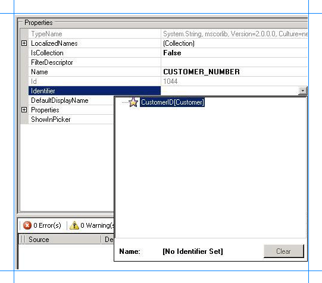  
  
##### To create an Association method instance for the BAPI_SALESORDER_GETLIST method  
  
1.  In the Metadata Objects pane, expand the **SalesOrder** node, and then expand the **Methods** node.  
  
2.  Expand the **BAPI_SALESORDER_GETLIST** node, right-click **Instances**, and then select **Add Method Instance** to open the Create Method Instance window.  
  
     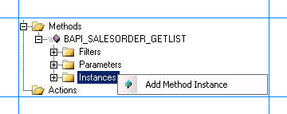  
  
3.  In the Create Method Instance window, select **Association** for **Method Instance Type**.  
  
4.  In the **Source Entities** list, select **Customer**.  
  
5.  In the **Return TypeDescriptor** list, select **SALES_ORDERS**..  
  
     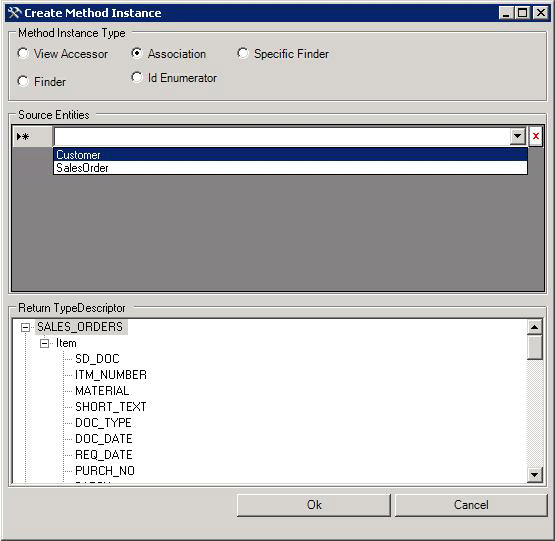  
  
6.  Click **OK**.  
  
7.  In the Properties pane, type **SalesOrderForCustomer_Instance** for the **Name** box.  
  
     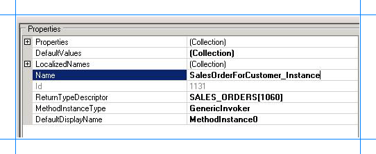  
  
### Remove Parameters of System.Nullable Type  
 While creating the **Association** method instance for the BAPI_SALESORDER_GETLIST method, you selected the return type as SALES_ORDERS. If you expand the SALES_ORDER parameter, you will notice some parameters are of System.Nullable type. You can see the parameter type by selecting the parameter in the Business Data Catalog Definition Editor, and looking at the value for the **TypeName** property.  
  
 For such parameters, the Business Data Catalog Definition Editor creates another parameter with the same name but with a “Specified” suffix. For example, look at parameters *ITM_NUMBER* and *ITM_NUMBERSpecified*. Microsoft Office SharePoint Server does not support System.Nullable parameters. So, when you try records that contain the System.Nullable parameter type, it throws an exception. Therefore, you must remove both the parameters (with and without the “Specified” suffix and having the same name) from the Business Data Catalog Definition Editor  
  
##### To remove the parameters of System.Nullable type  
  
1.  In the Metadata Objects pane, expand the **SalesOrder** node, and then expand the **Methods** node.  
  
2.  Expand the **BAPI_SALESORDER_GETLIST** node, and then expand the **Parameters** node.  
  
3.  Expand **SALES_ORDERS**, expand the second **SALES_ORDERS**, and then expand **Item**.  
  
4.  Right-click the parameter that contains the "Specified" suffix in the name, and then select **Delete**.  
  
5.  Right-click the parameter that has the same name as the parameter you deleted, without the suffix, and then select **Delete**. Typically, this parameter is right before the parameter that has the "Specified" suffix.  
  
### Set Default Parameters  
 The BAPI_SALESORDER_GETLIST takes two parameters. One of these parameters, TRANSACTION_GROUP, is the default parameter. So, you must set the default value for this parameter.  
  
##### To set the default value for TRANSACTION_GROUP  
  
1.  In the Metadata Objects pane, expand the **SalesOrder** node, and then expand the **Methods** node.  
  
2.  Expand the **BAPI_SALESORDER_GETLIST** node, and then expand the **Instances** node.  
  
3.  Select the **SalesOrderForCustomer_Instance** method instance, and in the Properties pane, click the ellipsis button (…) against the **DefaultValues** box.  
  
4.  In the Edit window, expand **TRANSACTION_GROUP** node, and for the **TRANSACTION_GROUP** box, specify the default value 0.  
  
     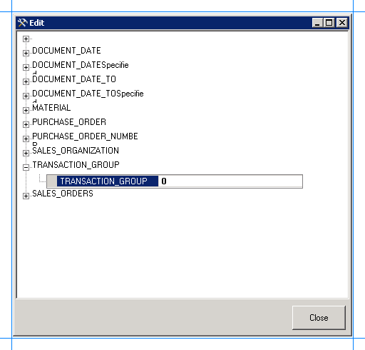  
  
5.  Click **Close**.  
  
### Export the Application Definition to a File  
 You have now created an application definition that contains the SAP system instance metadata. You must export this definition to an XML file, which can be imported into Microsoft Office SharePoint Server.  
  
##### To export the application definition to a file  
  
1.  In the Metadata Objects pane, right-click the **Customer_Order** node, and then click **Export**.  
  
2.  Save the file as Customer_Order.xml.  
  
## Next Steps  
 You must now create a SharePoint application to retrieve data from an SAP system. See [Step 3: Create a SharePoint Application to Retrieve Data from SAP](../../adapters-and-accelerators/adapter-sap/step-3-create-a-sharepoint-application-to-retrieve-data-from-sap.md) for instructions.  
  
## See Also  
 [Tutorial 1: Presenting Data from an SAP System on a SharePoint Site](../../adapters-and-accelerators/adapter-sap/tutorial-1-presenting-data-from-an-sap-system-on-a-sharepoint-site.md)