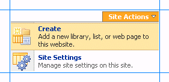
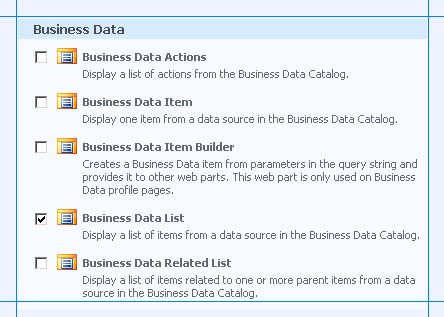
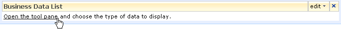
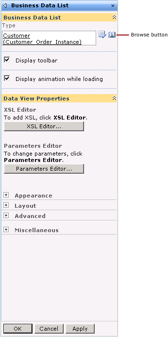
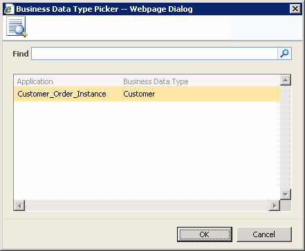
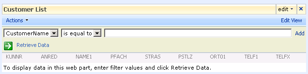
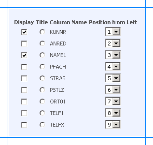
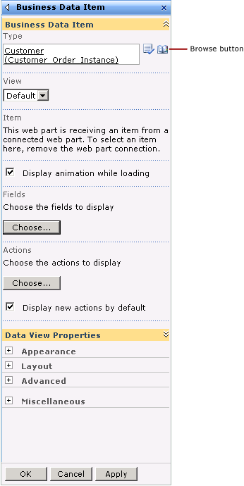
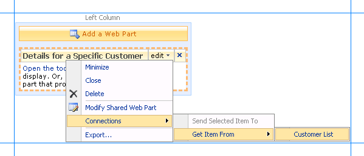
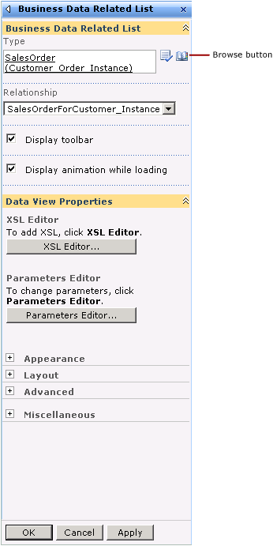

# Step 3: Create a SharePoint Application to Retrieve Data from SAP
  
  
 **Time to complete:** 15 minutes  
  
 **Objective:** You must now take the application definition file that you created by using the Business Data Catalog Definition Editor tool, and import it into Microsoft Office SharePoint Server.  
  
## Prerequisites  
  
-   You should have created an application definition file as described in [Step 2: Create an Application Definition File for the SAP Artifacts](../../adapters-and-accelerators/adapter-sap/step-2-create-an-application-definition-file-for-the-sap-artifacts.md).  
  
-   The Microsoft Single Sign-on service must be running.  
  
## How to Create a SharePoint Application  
 Creating a SharePoint application involves the following steps:  
  
- Create a single sign-on (SSO) application in SharePoint  
  
- Create a Shared Services provider  
  
- Import the application definition file  
  
- Create a Web Part page, and add Web Parts  
  
  This topic demonstrates how to perform these steps.  
  
## Creating an SSO Application in SharePoint  
 To access the data in an SAP system from a SharePoint application, you must set up an SSO application that maps a SharePoint user to an SAP user. Creating an SSO application in SharePoint involves the following steps:  
  
1.  **Manage server settings for single sign-on**. In this step, you specify a user account that can manage and set up the single sign-on service. You can do so on the Manage Server Settings page. This option is available from the SharePoint Central Administration console. For more information about this step, refer to the “Configure Single Sign-On for Office SharePoint Server 2007” section at [http://go.microsoft.com/fwlink/?LinkId=105291](http://go.microsoft.com/fwlink/?LinkId=105291).  
  
2.  **Manage settings for enterprise application definitions**. In this step, you configure the settings for the enterprise application definition. You can do so from the Manage Settings for Enterprise Application Definitions page. This option is available from the SharePoint Central Administration console.  
  
    1.  On Central Administration, on the top navigation bar, click **Operations**.  
  
    2.  On the Operations page, in the **Security Configuration** section, click  **Manage settings for single sign-on**.  
  
    3.  On the Manage Settings for Single Sign-On page, in the **Enterprise Application Definition Settings** section, click **Manage settings for enterprise application definitions**.  
  
    4.  On the Manage Enterprise Application Definitions page, provide values for the **Display name**, **Application name**, and the **Contact e-mail address** fields.  
  
        > [!IMPORTANT]
        >  For the **Application name** field, make sure you specify the same SSO application name that you specified for the **SecondarySsoApplicationId** variable while creating the application definition file, as described in [Step 2: Create an Application Definition File for the SAP Artifacts](../../adapters-and-accelerators/adapter-sap/step-2-create-an-application-definition-file-for-the-sap-artifacts.md).  
  
    5.  Leave the other fields as default, and click **OK**.  
  
3.  **Manage account information for enterprise application definitions**. In this step, you enable individual users or groups to connect to an enterprise application from SharePoint. Essentially, in this step you map an individual user or group to a user in the LOB system. You also specify the credentials to connect to the LOB system. You can do so from the Manage Account Information for Enterprise Application Definitions page. This option is available from the SharePoint Central Administration console. For more information about this step, refer to the “Manage account information for an enterprise application definition” section at [http://go.microsoft.com/fwlink/?LinkId=105291](http://go.microsoft.com/fwlink/?LinkId=105291).  
  
## Creating a Shared Services Provider  
 A Shared Service Provider is a logical grouping of shared services and their supporting resources. You can create an SSP by using the SharePoint Central Administration console.  
  
 You must define a Web site when creating an SSP. Remember the port number and the site address that you create. You will import the Business Data Catalog application definition to this site.  
  
 For more information about creating an SSP, see "Chapter overview: Create and configure Shared Services Providers" at [http://go.microsoft.com/fwlink/?LinkId=105119](http://go.microsoft.com/fwlink/?LinkId=105119).  
  
## Importing the Application Definition File  
 You must now import the application definition file into the SSP.  
  
#### To import the application definition file  
  
1.  Start SharePoint 3.0 Central Administration. Click **Start**, point to **All Programs**, point to **Microsoft Office Server**, and then click **SharePoint 3.0 Central Administration**.  
  
2.  In the left navigation pane, click the name of the SSP to which you want to import the application definition.  
  
3.  In the **Business Data Catalog** section, click **Import application definition**.  
  
4.  On the Import Application Definition page that opens, browse to Customer_Orders.xml, select the file, and then click **Open**.  
  
5.  Click **Import**.  
  
6.  Click **OK**.  
  
     After importing the application, you can view your application by going to the **View Applications** link. Click the application name to see the entities in the application.  
  
## Creating Web Parts  
 You must now create Web Parts in your SharePoint site to view and manage the business data that will be extracted from the SAP system. Web Parts are reusable components that can contain any kind of Web-based information, including analytical, collaborative, and database information.  
  
 In this tutorial, Web Parts are created for the method instances that were created in the Business Data Catalog Definition Editor. Office SharePoint Server provides different kinds of Web Parts for specific use. The following Web Parts are used here:  
  
- **Business Data List** Web Part for the **Finder** method instance. This Web Part enables you to specify a search expression to retrieve a list of customers from the SAP system. For this tutorial, this is called the Search Customers Web Part.  
  
- **Business Data Item** Web Part for the **Specific Finder** method instance. This Web Part presents the details for a specific customer that you select from the Search Customers Web Part. This Web Part is mapped to the Search Customer Web Part.  For this tutorial, this is called the Customer Details Web Part.  
  
- **Business Data Related List** Web Part for the **Association** method instance. This Web Part lists the sales orders for a specific customer that you select from the Search Customers Web Part. This Web Part is associated with the Search Customer Web Part.  For this tutorial, this is called the Sales Order Details Web Part.  
  
  This section provides instructions to create these Web Parts and to create associations between them. For more information about creating Web Parts, see "Customize business data lists, Web Parts, and sites" at [http://go.microsoft.com/fwlink/?LinkId=104131](http://go.microsoft.com/fwlink/?LinkId=104131).  
  
  The Web Parts will be added to a single Web Part page. You must create a Web Part page before adding the Web Parts. For this tutorial, this Web Part page is called Customer_SalesOrders.  
  
### Creating a Web Part Page  
 This section provides instructions to create a Web Part page.  
  
##### To create a Web Part page  
  
1.  Start SharePoint 3.0 Central Administration. Click **Start**, point to **All Programs**, point to **Microsoft Office Server**, and click **SharePoint 3.0 Central Administration**.  
  
2.  In the left navigation pane, click the name of the SSP to which you want to import the application definition.  
  
3.  On the Shared Services Administration page, in the upper-right corner, click **Site Actions**, and then click **Create**.  
  
       
  
4.  On the Create page, in the **Web Pages** section, click **Web Part Page**.  
  
5.  On the New Web Part page, do the following:  
  
    1.  In the **Name** field, type a name for the page. For this tutorial, type the name as **Customer_SalesOrders**.  
  
    2.  Select the **Overwrite if file already exists** check box, if you want to overwrite old pages with the same name as the new page you create.  
  
    3.  In the **Layout** section, from the **Choose a Layout Template** box, select a layout for the Web Part page. For this tutorial, select **Header, Left Column, Body**.  
  
    4.  In the **Save Location** section, in the **Document Library** list, click **Form Templates**.  
  
    5.  Click **Create**. The following figure shows a Web Part page after it is just created.  
  
           
  
    6.  You must now add the different Web Parts to this page.  
  
### Adding a Business Data List Web Part  
 You must now add a Business Data List Web Part to the Web Part page. Using this Web Part you will retrieve a list of customers from the SAP system that matches a search expression. This Web Part corresponds to the **Finder** method instance (*GetCustomerByName_Instance*) that you created in the Business Data Catalog Definition Editor.  
  
##### To add a Business Data List Web Part  
  
1.  On the Customer_SalesOrders page, in the **Header** section, click **Add a Web Part**.  
  
2.  In the **Add Web Parts** dialog box, in the **Business Data** section, select the **Business Data List** check box, and then click **Add**.  
  
       
  
3.  In the newly added Business Data List Web Part, click the **Open the tool pane** link.  
  
       
  
4.  The Business Data List tool pane opens in the right pane. In the **Business Data List** section, for the **Type** field, click the **Browse** button.  
  
       
  
5.  In the **Business Data Type Picker** dialog box, select the **Customer_Order_Instance** application, and then click **OK**.  
  
       
  
6.  Expand the **Appearance** node, and in the **Title** box, type a title for the Web Part. For this Web Part, type **Customer List**.  
  
7.  In the Business Data List tool pane, click **Apply**, and then click **OK**. The Business Data List Web Part now looks like the following:  
  
       
  
8.  The Web Part lists the fields that are returned by executing the SD_RFC_CUSTOMER_GET RFC. You can remove the fields that you do not want to display on the SharePoint portal. To remove the fields, click the **Edit View** link in the upper-right corner of the Web Part.  
  
9. On the Edit View page, in the Columns section, clear the check boxes against the columns that you do not want to display.  
  
       
  
10. Click **OK**.  
  
### Adding a Business Data Item Web Part  
 You must now add a Business Data Item Web Part to the Web Part page. You will also connect this Web Part to the Business Data List Web Part that you just created. By doing so, you will be able to see the details for a customer that you select in the Business Data List Web Part. This Web Part corresponds to the **Specific Finder** method instance (*GetCustomerByNumber_Instance*) that you created in the Business Data Catalog Definition Editor.  
  
##### To add a Business Data Item Web Part  
  
1.  On the Customer_SalesOrders page, in the upper-right corner, click **Site Actions**, and then click **Edit Page**.  
  
2.  On the Customer_SalesOrders page, in the **Left Column** section, click **Add a Web Part**.  
  
3.  In the **Add Web Parts** dialog box, in the **Business Data** section, select the **Business Data Item** check box, and then click **Add**.  
  
4.  In the newly added Business Data Item Web Part, click the **Open the tool pane** link.  
  
5.  The Business Data Item tool pane opens in the right pane. In the **Business Data Item** section, for the **Type** field, click the **Browse** button.  
  
       
  
6.  In the **Business Data Type Picker** dialog box, select the **Customer_Order_Instance** application, and then click **OK**.  
  
7.  In the **View** list, select **Default**.  
  
8.  Leave the **Item** list empty.  
  
    > [!NOTE]
    >  For the **Item** field, you must specify a customer name or customer number for which you want to see the details. That serves as an input parameter for this Web Part. Because you will be getting the input parameter by connecting to the Business Data List Web Part, you need not specify an item explicitly.  
  
9. In the **Fields** section, click **Choose** to select the fields you want to display on the page.  
  
10. Expand the **Appearance** node, and in the **Title** field, specify a title for the Web Part. For this Web Part, specify **Details for a Specific Customer**.  
  
11. Click **Apply**, and then click **OK**.  
  
12. Connect the Web Part to the **Customer List** Web Part. To do so:  
  
    1.  Click **edit** towards the upper-right corner of the Web Part.  
  
    2.  From the context menu point to **Connections**, point to **Get Item From**, and click **Customer List**.  
  
           
  
### Adding a Business Data Related List Web Part  
 You must now add a Business Data Related List Web Part to the Web Part page. You will also connect this Web Part to the Business Data List Web Part you created earlier. By doing so, you will be able to see the sales orders for a customer that you select in the Business Data List Web Part. This Web Part corresponds to the **Association** method instance (*SalesOrderForCustomer_Instance*) you created in the Business Data Catalog Definition Editor.  
  
##### To add a Business Data Related List Web Part  
  
1.  On the Customer_SalesOrders page, in the **Body** section, click **Add a Web Part**.  
  
2.  In the **Add Web Parts** dialog box, in the **Business Data** section, select the **Business Data Related List** check box, and click **Add**.  
  
3.  In the newly added Business Data Related List Web Part, click the **Open the tool pane** link.  
  
4.  The Business Data Related List tool pane opens in the right pane. In the **Business Data Related List** section, for the **Type** field, click the **Browse** button.  
  
       
  
5.  In the **Business Data Type Picker** dialog box, select the **Customer_Order_Instance** application, and then click **OK**. The **Relationship** list populates with the name of the **Association** method instance (*SalesOrderForCustomer_Instance*).  
  
6.  Expand the **Appearance** node, and in the **Title** box, type a title for the Web Part. For this Web Part, type **Sales Order for a Specific Customer**.  
  
7.  Click **Apply**, and then click **OK**.  
  
8.  The Web Part lists the fields that are returned by executing the BAPI_SALESORDER_GETLIST RFC. You can remove the fields that you do not want to display on the SharePoint portal. To remove the fields, click the **Edit View** link in the upper-right corner of the Web Part.  
  
9. On the Edit View page, in the **Columns** section, clear the text boxes against the columns that you do not want to display.  
  
10. Click **OK**.  
  
11. Connect the Web Part to the **Customer List** Web Part. To do so:  
  
    1.  Click **edit** towards the upper-right corner of the **Sales Order for a Specific Customer** Web Part.  
  
    2.  From the context menu, point to **Connections**, point to **Get Related Item From**, and then click **Customer List**.  
  
12. Click **Exit Edit Mode** from the upper-right corner of the page.  
  
## Next Steps  
 Test the SharePoint application by retrieving data from an SAP system. See [Step 4: Test Your SharePoint Application](../../adapters-and-accelerators/adapter-sap/step-4-test-your-sharepoint-application1.md).  
  
## See Also  
 [Tutorial 1: Presenting Data from an SAP System on a SharePoint Site](../../adapters-and-accelerators/adapter-sap/tutorial-1-presenting-data-from-an-sap-system-on-a-sharepoint-site.md)