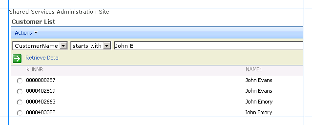
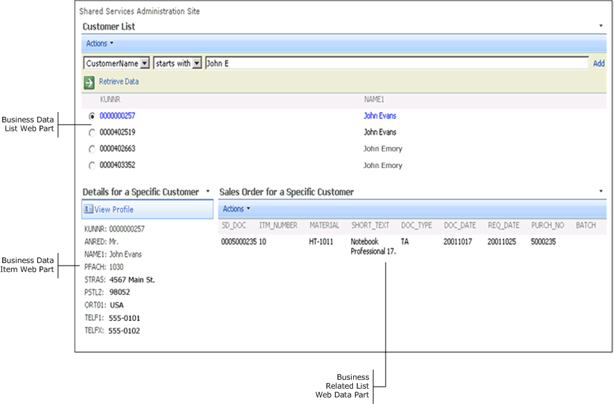

# Step 4: Test Your SharePoint Application
  
  
 **Time to complete:** 10 minutes  
  
 **Objective:** After you have added Web Parts in the SharePoint site and created an application, you must test the application by retrieving some data from the SAP system. This topic provides instructions on how to use the application to retrieve the data from the SAP system.  
  
## Prerequisites  
  
-   You should have created the Web Part page that contains the appropriate Web Parts to retrieve business data. See [Step 3: Create a SharePoint Application to Retrieve Data from SAP](../../adapters-and-accelerators/adapter-sap/step-3-create-a-sharepoint-application-to-retrieve-data-from-sap.md).  
  
### To test the SharePoint application  
  
1.  Start SharePoint 3.0 Central Administration. Click **Start**, point to **All Programs**, point to **Microsoft Office Server**, and then click **SharePoint 3.0 Central Administration**.  
  
2.  In the left navigation pane, click the name of the SSP under which you created the application.  
  
3.  In the left pane, click **View All Site Content**. In the right pane, click **Form Templates**.  
  
4.  In the **Form Category** list, click **Customer_SalesOrders**. You specified this name when you created the Web Part page. The following figure shows the Web Part page that you created.  
  
       
  
5.  Search for customers based on a search string. For example, search for customers with names starting with "John E". To do so:  
  
    1.  In the Customer List section, from the first list, click **CustomerName**.  
  
    2.  From the second list, click **starts with**.  
  
    3.  In the text box, type **John E**.  
  
    4.  Click the **Retrieve Data** link or press ENTER. The following figure shows the records retrieved from the SAP system that satisfy the search criteria.  
  
           
  
6.  You can now see the details of any customer in the list and the sales orders associated with the customers, if any. To do so, click the option button against a customer number. The page refreshes to present the details and the sales orders for a specific customer in the respective Web Parts.  
  
       
  
     If the details of the customers and the associated sales order are displayed correctly, you have successfully completed the tutorial. If no or incorrect data is displayed, carefully check your work to make sure you performed all the tasks correctly.  
  
## Summary  
 In this tutorial you created a WCF service for the SAP artifacts you want to access from a SharePoint Portal. You also created an application definition for the SAP artifacts that is imported into a SharePoint portal to create Web Parts to present data from an SAP system.  
  
## See Also  
 [Tutorial 1: Presenting Data from an SAP System on a SharePoint Site](../../adapters-and-accelerators/adapter-sap/tutorial-1-presenting-data-from-an-sap-system-on-a-sharepoint-site.md)
