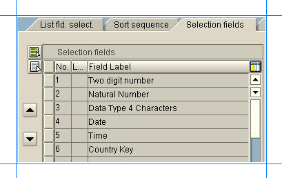
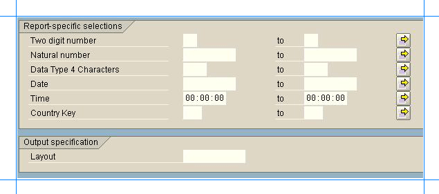
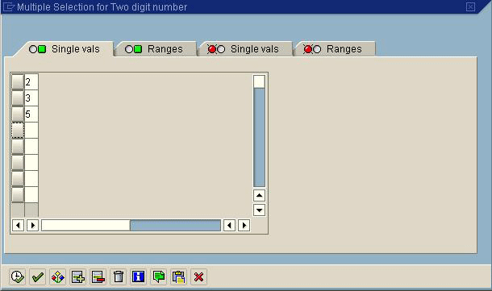
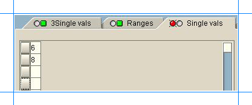
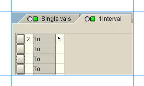
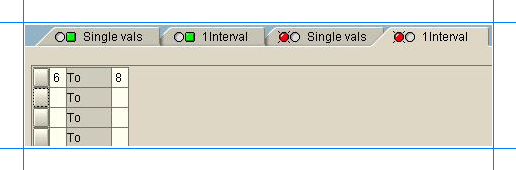

# Translate SAP query parameters into EXECQUERY command
Explains how the parameters of a query translate into an EXECQUERY command text. This topic uses the example of a custom SAP query, ZQUERY_TST_NEW.  
  
## Open the Query in SAP GUI  
 Perform the following steps to open the query in SAP. The steps provided here are for ZQUERY_TST_NEW query and are specific to SAP versions.  
  
1. Run the transaction SQ01.  
  
2. In the **Query from User Group** page, click **Quick Viewer**.  
  
3. In the **Quick Viewer** page, in the **Quick View** text box, type `ZQUERY_TST_NEW`, and then click **Display**.  
  
4. In the **Quick Viewer** page, click the **Selection fields** tab to list all the parameters in the query.  
  
    The following figure shows all the parameters in the query definition.  
  
      
  
5. Click **Execute**. The following page is displayed.  
  
      
  
6. Click the yellow arrows to define each parameter. You can either define specific allowable/non-allowable values or you can define a range of allowable/non-allowable values.  The EXECQUERY syntax must be specified based on the values configured in the SAP GUI for each parameter.  
  
   The next section provides an explanation about how the values are defined in the SAP GUI and how those values translate to EXECQUERY syntax.  
  
## Frame an EXECQUERY Syntax  
 Let’s look at what the EXECQUERY syntax looks like based on the parameter values defined in the query definition. To understand this, we’ll show examples of how the values configured for the first parameter, **Two digit number**, translate to the  **ZQUERY_TST_NEW** query.  
  
 First, let’s assume the values in the **Single vals** tab (with a green dot) are defined as shown in the following screenshot:  
  
   
  
> [!NOTE]
>  This dialog box appears after you click the yellow arrow against the **Two digit number** parameter.  
  
 In such a case, the EXECQUERY syntax looks like:  
  
```  
EXECQUERY ZQUERY_TST_NEW @USERGROUP='mygroup', @P1 = '2', @P1 = '3', @P1 = '5'  
```  
  
 For the same query, in addition to the values in the **Single vals** tab (with a green dot), you can also have the values in the **Single vals** tab (with a red dot) defined as following:  
  
   
  
 In such a case, EXECQUERY syntax looks like:  
  
```  
EXECQUERY ZQUERY_TST_NEW @USERGROUP='mygroup', @P1 = '2', @P1 = '3', @P1 = '5', NOT @P1 = '6', NOT @P1 = '8'  
```  
  
 Now, if you add values to the **Ranges** tab (with a green dot), like shown in the following screenshot:  
  
   
  
 the EXECQUERY syntax looks like:  
  
```  
EXECQUERY ZQUERY_TST_NEW @USERGROUP='mygroup', @P1 = '2', @P1 = '3', @P1 = '5', NOT @P1 = '6', NOT @P1 = '8', @P1 BETWEEN '2' and '5'  
```  
  
 Similarly, if you add values to the **Ranges** tab (with a red dot), like shown in the following screenshot:  
  
   
  
 the EXECQUERY syntax looks like:  
  
```  
EXECQUERY ZQUERY_TST_NEW @USERGROUP='mygroup', @P1 = '2', @P1 = '3', @P1 = '5', NOT @P1 = '6', NOT @P1 = '8', @P1 BETWEEN '2' and '5', NOT @P1 BETWEEN '6' AND '8'  
```  
  
 For simplicity and understanding, this topic only talks about the first parameter, **Two digit number**. You can use similar methods to determine how values defined for other parameters translate into an EXECQUERY syntax.  
  
