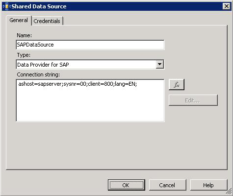

# Use the Data Provider for SAP to Create a Report Server Project
You must create a Report Server project, using the [!INCLUDE[adoprovidersapshort](../../includes/adoprovidersapshort-md.md)], to generate reports for the data available in an SAP system. This topic provides instructions on how to create a Report Server project.  
  
## Prerequisites  
 Before performing the procedures provided in this topic, make sure you installed the [!INCLUDE[adoprovidersapshort](../../includes/adoprovidersapshort-md.md)] while installing the [!INCLUDE[adaptersap_short](../../includes/adaptersap-short-md.md)] as part of the [!INCLUDE[adapterpacknoversion](../../includes/adapterpacknoversion-md.md)] installation. For more information about [!INCLUDE[adapterpacknoversion](../../includes/adapterpacknoversion-md.md)] installation, refer to the installation guide available at \<*installation drive*\>:\Program Files\Microsoft [!INCLUDE[adapterpacknoversion](../../includes/adapterpacknoversion-md.md)]\Documents.  
  
### To create a Report Server project  
  
1. Start [!INCLUDE[btsVStudioNoVersion](../../includes/btsvstudionoversion-md.md)] and create a Report Server project. To create a Report Server project, do the following:  
  
   1.  Click the **File** menu, click **New**, and then click **Project**.  
  
   2.  In the **New Project** dialog box, from the **Project types** list, select **Business Intelligence Projects**. From **the Visual Studio installed templates** list, select **Report Server Project**.  
  
   3.  Specify a name and location of the project and click **OK**. For this topic, specify the name of the project as `SAP_ Report`.  
  
2. Add a new data source:  
  
   1. From the Solution Explorer, right-click **Shared Data Sources**, and click **Add New Data Source**.  
  
   2. In the **Shared Data Source** dialog box, in the **General** tab, specify a name for the data source. For this topic, specify the name as `SAPDataSource`.  
  
   3. From the **Type** list, select **Data Provider for SAP**.  
  
   4. In the **Connection String** box, specify the connection string for the [!INCLUDE[adoprovidersapshort](../../includes/adoprovidersapshort-md.md)]. For information about the [!INCLUDE[adoprovidersapshort](../../includes/adoprovidersapshort-md.md)] connection string, see [Read about Data Provider types for the SAP Connection String](../../adapters-and-accelerators/adapter-sap/read-about-data-provider-types-for-the-sap-connection-string.md).  
  
         
  
      > [!NOTE]
      >  You can choose to specify the credentials as part of the connection string or specify them as described in the next step.  
  
   5. In the **Credentials** tab, choose one of the following, and then click **OK**:  
  
      |Use this|To do this|  
      |--------------|----------------|  
      |**Use a specific user name and password**|Specify a user name and password to connect to the SAP system.|  
      |**Prompt for credentials**|Enter the credentials for the SAP system while the report is generated. **Note:**  The credentials you specify for this option will override the credentials, if specified, as part of the connection string.|  
      |**No credentials**|Choose this option if you are providing the user name and password as part of the connection string.|  
  
      > [!NOTE]
      >  The Windows Authentication mode is not supported for Report Server projects.  
  
3. Add a new report:  
  
   1. From the Solution Explorer, right-click **Reports**, and then click **Add New Report**.  
  
       This starts the Report Wizard.  
  
   2. Read the information on the welcome screen, and then click **Next**.  
  
   3. In the **Select the Data Source** dialog box, choose the **Shared data source** option, select the **SAPDataSource** you created in the previous step, and then click **Next**.  
  
   4. If you chose the **Prompt for credentials** option to specify the user credentials while creating the data source, an **Enter Data Source Credentials** dialog box appears. Specify the user name and password to connect to the SAP system, and then click **OK**.  
  
       If you chose any other option for specifying credentials, the wizard proceeds to the next step.  
  
   5. In the **Design the Query** dialog box, specify a query string that is used to generate a report. For example:  
  
      ```  
      SELECT TOP 2 KUNNR, NAME1 FROM KNA1 WHERE NAME1 LIKE @PARAM  
      ```  
  
       This query will retrieve the top two records from the KNA1 table where the NAME1 is the name that you will specify while generating the report.  
  
       Click **Next**.  
  
   6. In the subsequent dialog boxes you can design the format in which you want the report to appear. If you want to use the default format, click **Finish >>&#124;** to directly go to the **Finish** dialog box.  
  
   7. In the **Completing the Wizard** dialog box, specify a name for the report, review the summary, and then click **Finish**. For this topic, specify the name of the report as `SAPReport`.  
  
      You can now view the report. For instructions about how to view the report, see [view the Reports for SAP](../../adapters-and-accelerators/adapter-sap/view-the-reports-for-sap.md).  
  
## See Also  
 [Use the Data Provider for SAP with SSRS](../../adapters-and-accelerators/adapter-sap/use-the-data-provider-for-sap-with-ssrs.md)