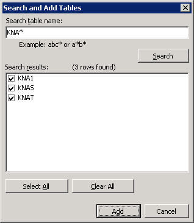
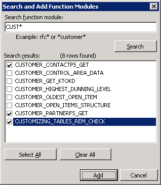

# Use the Data Provider for SAP with the DDEX Plug-in
If you chose to install the [!INCLUDE[adoprovidersaplong](../../includes/adoprovidersaplong-md.md)] along with the [!INCLUDE[adapterpacknoversion](../../includes/adapterpacknoversion-md.md)] installation, the setup program installs a [!INCLUDE[btsVStudioNoVersion](../../includes/btsvstudionoversion-md.md)] DDEX plug-in. You can use this plug-in to browse SAP objects using [!INCLUDE[btsVStudioNoVersion](../../includes/btsvstudionoversion-md.md)]. This section provides information about using the DDEX plug-in.  
  
 You can use the plug-in to establish connectivity with the SAP system, add tables from the SAP system, and add function modules from the SAP system. After you have added the tables and function modules using the Visual Studio plug-in, the newly added tables and function modules are reflected in the SAPDiscoveredObjects.xml file. For more information about this file, see [About the SAPDiscoveredObjects.xml File in SAP](../../adapters-and-accelerators/adapter-sap/about-the-sapdiscoveredobjects-xml-file-in-sap.md).  
  
## Prerequisites  
 Make sure you chose to install the [!INCLUDE[adoprovidersapshort](../../includes/adoprovidersapshort-md.md)] along with the [!INCLUDE[adapterpacknoversion](../../includes/adapterpacknoversion-md.md)] installation.  
  
### To connect to an SAP system using the DDEX plug-in  
  
1. Start Microsoft [!INCLUDE[btsVStudioNoVersion](../../includes/btsvstudionoversion-md.md)].  
  
2. In [!INCLUDE[btsVStudioNoVersion](../../includes/btsvstudionoversion-md.md)], on the **View** menu, click **Server Explorer**.  
  
3. In the **Server Explorer**, right-click **Data Connections**, and select **Add Connection**.  
  
4. In the **Change Data Source** dialog box, from the **Data source** box, select **\<other\>**.  
  
5. From the **Data provider** drop-down list, select **.NET Framework Data Provider for mySAP Business Suite** and click **OK**. The **Add Connection** dialog box opens.  
  
6. The **Add Connection** dialog box lists the different connection parameters to connect to an SAP system. A typical connection string to connect to an SAP system using the [!INCLUDE[adoprovidersapshort](../../includes/adoprovidersapshort-md.md)] requires:  
  
   - The connection parameters for a connection type. The [!INCLUDE[adoprovidersapshort](../../includes/adoprovidersapshort-md.md)] supports connection types A, B, and D. To connect to an SAP system you must provide connection parameters for any *one* of these connection types. For example, for connection type A, you must provide the name of the application server host and the system number.  
  
   - The login information to connect to an SAP system such as username and password.  
  
     For more information about the connection string to connect to an SAP system using the [!INCLUDE[adoprovidersapshort](../../includes/adoprovidersapshort-md.md)], see [Read about Data Provider types for the SAP Connection String](../../adapters-and-accelerators/adapter-sap/read-about-data-provider-types-for-the-sap-connection-string.md).  
  
     In the **Add Connection** dialog box, specify:  
  
   - The connection parameters for any one connection type.  
  
   - The login information to connect to an SAP system.  
  
   - Whether you want to enable SAP GUI debugging.  
  
   - Whether you want to use RFC SDK tracing.  
  
     Click **OK**. A new connection node is created under the **Data Connections** node with the server name you specified in the previous step.  
  
7. Expand the new connection node to view the **Tables** and **Function Modules** nodes.  
  
    The following figure shows the Server Explorer after the connection is established.  
  
      
  
### To add tables from an SAP system using the DDEX plug-in  
  
1. In the **Server Explorer**, right-click the **Tables** node and click **Search and Add Tables**.  
  
2. In the **Search table name** text box, specify a search string to search tables in the SAP system, and click **Search**.  
  
   > [!NOTE]
   >  The [!INCLUDE[adoprovidersapshort](../../includes/adoprovidersapshort-md.md)] supports the use of only the asterisk (*) wildcard character for searching tables.  
  
3. The **Search results** box lists the table names that satisfy the search criteria.  
  
      
  
4. Select the check box corresponding to the tables you want to add and click **Add**. To select all the tables, click **Select All**. To clear all the selections, click **Clear All**.  
  
5. A dialog box informs you that the added tables would be visible after you refresh the **Tables** node. Click **OK**.  
  
6. Right-click the **Tables** node and select **Refresh**. The selected tables appear under the **Tables** node. Click a table name to see the table properties in the **Properties** pane.  
  
7. Expand a table name to see the fields for the table. Click a field name to see the field properties in the **Properties** pane.  
  
### To add RFCs from an SAP system using the DDEX plug-in  
  
1. In the **Server Explorer**, right-click the **Function Modules** node and click **Search and Add Function Modules**.  
  
2. In the **Search function module** text box, specify a search string to search function modules in the SAP system, and click **Search**.  
  
   > [!NOTE]
   >  The [!INCLUDE[adoprovidersapshort](../../includes/adoprovidersapshort-md.md)] supports the use of only the asterisk (*) wildcard character for searching functional modules.  
  
3. The **Search results** box lists the function modules that satisfy the search criteria.  
  
      
  
4. Select the check box corresponding to the function modules you want to add and click **Add**. To select all the modules, click **Select All**. To clear all the selections, click **Clear All**.  
  
5. A dialog box informs you that the added function modules would be visible after you refresh the **Function Modules** node. Click **OK**.  
  
6. Right-click the **Function Modules** node and select **Refresh**. The selected function modules appear under the **Function Modules** node. Click a function module name to see the properties in the **Properties** pane.  
  
7. Expand a function module name to see nodes for import, export, changing, and table parameters.  
  
8. Expand the **Import** node to list the import parameters for the function module. Similarly, expand the **Export** and **Tables** nodes to see the list of export and table parameters for the function module.  
  
## See Also  
 [Use the .NET Framework Data Provider for mySAP Business Suite](../../adapters-and-accelerators/adapter-sap/use-the-net-framework-data-provider-for-mysap-business-suite.md)