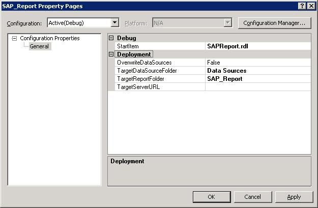
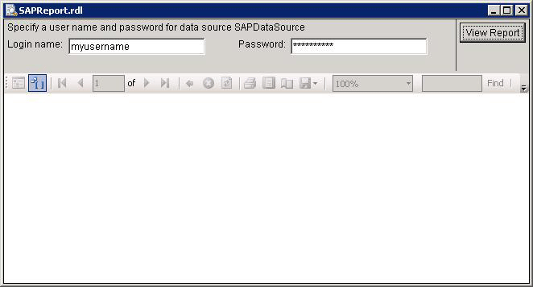
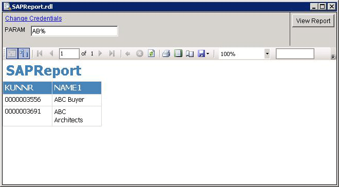
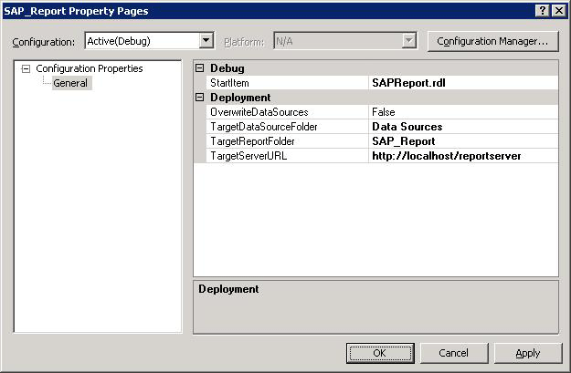
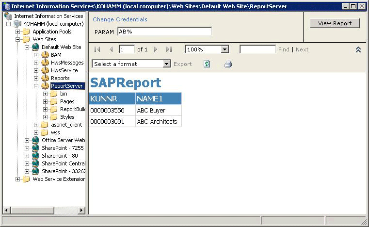

# View the Reports for SAP
After you have created the report, you can view it either using Visual Studio or host it on the Report Server on Internet Information Services (IIS) and access over the network. This topic provides instructions on how to view reports both in Visual Studio and using IIS.  
  
## Prerequisites  
 Before performing the procedures provided in this topic, you must have generated a report as described in [Use the Data Provider for SAP to Create a Report Server Project](../../adapters-and-accelerators/adapter-sap/use-the-data-provider-for-sap-to-create-a-report-server-project.md).  
  
### To view the reports in Visual Studio  
  
1. In [!INCLUDE[btsVStudioNoVersion](../../includes/btsvstudionoversion-md.md)], right-click the project name in the Solution Explorer, and then click **Properties**.  
  
2. In the report property pages dialog box, click **Configuration Manager**, and clear the check box under the **Deploy** column. Click **Close**.  
  
3. In the report property pages dialog box, for the **StartItem** property, select the name of the report, and then click **OK**.  
  
      
  
4. Right-click the project name in the Solution Explorer, and then click **Build**.  
  
5. Press `F5` to run the project to generate the report.  
  
   > [!IMPORTANT]
   >  In [!INCLUDE[btsVStudio2008](../../includes/btsvstudio2008-md.md)], you can see the report by clicking the **Preview** tab. In such a case, the subsequent dialog boxes will open within the preview tab.  
  
6. A dialog box with the same name as you specified for the report opens up. While creating the data source, if you chose the **Prompt for credentials** option, enter the user name and password for the SAP system, and then click **View Report**.  
  
      
  
7. If the query you specified while creating the Report Server project requires a parameter, you must enter the value of the parameter. For example, for the query you specified in the [Use the Data Provider for SAP to Create a Report Server Project](../../adapters-and-accelerators/adapter-sap/use-the-data-provider-for-sap-to-create-a-report-server-project.md) topic, requires you to specify a value for the parameter, PARAM.  
  
    Specify the value of the parameter, if required, and click **View Report**.  
  
      
  
### To host the reports on Report Server  
  
1. In [!INCLUDE[btsVStudioNoVersion](../../includes/btsvstudionoversion-md.md)], right-click the project name in the Solution Explorer, and then click **Properties**.  
  
2. In the report property pages dialog box, click **Configuration Manager**, and select the check box under the **Deploy** column. Click **Close**.  
  
3. In the report property pages dialog box, for the **StartItem** property, select the name of the report.  
  
4. In the report property pages dialog box, for the **TargetServerURL** property, specify a URL for the Report Server, and then click **OK**. For example:  
  
   ```  
   http://localhost/reportserver  
   ```  
  
      
  
5. Right-click the project name in the Solution Explorer, and then click **Build**.  
  
6. Right-click the project name in the Solution Explorer, and then click **Deploy**.  
  
7. Start IIS. Click **Start**, click **Run**, type `inetmgr`, and press `Enter`.  
  
8. In the **Internet Information Services (IIS) Manager** snap-in, expand the computer name, expand **Web Sites**, expand **Default Web Site**, right-click **ReportServer**, and then click **Browse**.  
  
9. In the right pane, click the name of the project, and then click on the name of the report.  
  
10. While creating the data source, if you chose the **Prompt for credentials** option, enter the user name and password for the SAP system and click **View Report**.  
  
11. If the query you specified while creating the Report Server project requires a parameter, you must enter the value of the parameter. For example, for the query you specified in the [Use the Data Provider for SAP to Create a Report Server Project](../../adapters-and-accelerators/adapter-sap/use-the-data-provider-for-sap-to-create-a-report-server-project.md) topic, requires you to specify a value for the parameter, PARAM.  
  
     Specify the value of the parameter, if required, and click **View Report**.  
  
       
  
    > [!TIP]
    >  You can also view directly from the web browser by giving the URL for the report. A typical URL for the report `is http://localhohost/reportserver/<report_name>`.  
  
## See Also  
 [Use the Data Provider for SAP with SSRS](../../adapters-and-accelerators/adapter-sap/use-the-data-provider-for-sap-with-ssis.md)