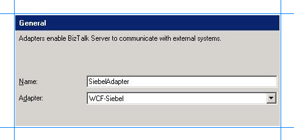

# Add the Siebel Adapter to BizTalk Server Administration Console
The [!INCLUDE[adaptersiebel_short](../../includes/adaptersiebel-short-md.md)] can be used in BizTalk either as a WCF-Custom port or a WCF-Siebel port. If you want to use the [!INCLUDE[adaptersiebel_short](../../includes/adaptersiebel-short-md.md)] through a WCF-Custom port, you do not need to add the WCF-Custom port to the [!INCLUDE[btsBizTalkServerNoVersion](../../includes/btsbiztalkservernoversion-md.md)] Administration console because the WCF-Custom port is added to the [!INCLUDE[btsBizTalkServerNoVersion](../../includes/btsbiztalkservernoversion-md.md)] Administration console by default. However, if you want to use the [!INCLUDE[adaptersiebel_short](../../includes/adaptersiebel-short-md.md)] through a WCF-Siebel port, you must first add the WCF-Siebel adapter to the [!INCLUDE[btsBizTalkServerNoVersion](../../includes/btsbiztalkservernoversion-md.md)] Administration console.  
  
 This topic provides instructions on how to add the WCF-Siebel adapter to the [!INCLUDE[btsBizTalkServerNoVersion](../../includes/btsbiztalkservernoversion-md.md)] Administration console.  
  
> [!IMPORTANT]
>  You need not perform these tasks if you want to configure a WCF-Custom port for the [!INCLUDE[adaptersiebel_short](../../includes/adaptersiebel-short-md.md)].  
  
## Add the Siebel adapter  
  
1. Start the [!INCLUDE[btsBizTalkServerNoVersion](../../includes/btsbiztalkservernoversion-md.md)] Administration console.  
  
2. In the console tree, expand the **BizTalk Group**, expand **Platform Settings**, and then click **Adapters**.  
  
3. Right-click **Adapters**, point to **New**, and click **Adapter**.  
  
      
  
4. In the **Adapter Properties** dialog box, specify a name for the adapter and from the **Adapter** list, select **WCF-Siebel**.  
  
      
  
5. Click **OK**.  
  
## See Also  
[Building blocks to create BizTalk applications with the Siebel adapter](../../adapters-and-accelerators/adapter-siebel/building-blocks-to-create-biztalk-applications-with-the-siebel-adapter.md)