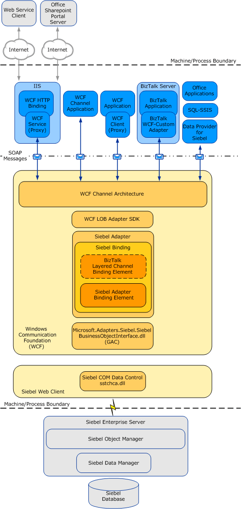
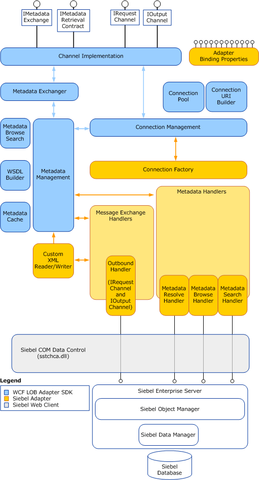

# Architecture overview of the BizTalk Adapter for Siebel eBusiness Applications
Describes the architecture of end-to-end solutions that use the [!INCLUDE[adaptersiebel_short](../../includes/adaptersiebel-short-md.md)] to operate on a Siebel system, and also the internal architecture of the [!INCLUDE[adaptersiebel_short](../../includes/adaptersiebel-short-md.md)].  
  
 An understanding of the [!INCLUDE[adaptersiebel_short](../../includes/adaptersiebel-short-md.md)] architecture can help you:  
  
- Understand the relationship between the [!INCLUDE[adaptersiebel_short](../../includes/adaptersiebel-short-md.md)] and the [!INCLUDE[afproductnamelong](../../includes/afproductnamelong-md.md)].  
  
- Understand security boundaries, so that you can improve data security in your solution.  
  
- Understand the [!INCLUDE[adaptersiebel_short](../../includes/adaptersiebel-short-md.md)] binding properties.  
  
- Troubleshoot installation issues.  

## Adapter architecture overview
The [!INCLUDE[adaptersiebel](../../includes/adaptersiebel-md.md)] is built on top of the [!INCLUDE[afproductnamelong](../../includes/afproductnamelong-md.md)] and runs on top of the [!INCLUDE[afproductnameshort](../../includes/afproductnameshort-md.md)] run time. The [!INCLUDE[afproductnameshort](../../includes/afproductnameshort-md.md)] provides a software framework and tooling infrastructure that the [!INCLUDE[adaptersiebel_short](../../includes/adaptersiebel-short-md.md)] employs to provide a rich set of features to users and adapter clients.  
  
 The [!INCLUDE[adaptersiebel_short](../../includes/adaptersiebel-short-md.md)] is a WCF custom binding. This binding contains a single custom transport binding element that enables communication with a Siebel system. The [!INCLUDE[adaptersiebel_short](../../includes/adaptersiebel-short-md.md)] is wrapped by the [!INCLUDE[afproductnameshort](../../includes/afproductnameshort-md.md)] run time and is exposed to applications through the [!INCLUDE[nextref_btsWinCommFoundation](../../includes/nextref-btswincommfoundation-md.md)] channel architecture.  
  
## Siebel COM data control  
 The [!INCLUDE[adaptersiebel_short](../../includes/adaptersiebel-short-md.md)] connects with the Siebel system through the Siebel COM Data Control library (sstchca.dll) and the Microsoft.Adapters.Siebel.SiebelBusinessObjectInterface.dll library. The Siebel COM Data Control is a component of the Siebel Web Client. 
  
 The Siebel COM Data Control interfaces enable an external client like the [!INCLUDE[adaptersiebel_short](../../includes/adaptersiebel-short-md.md)] to connect and communicate with a Siebel Application Object Manager on a Siebel Enterprise Server. The Siebel Object Manager and Siebel Enterprise Server as well as other connection parameters are specified in the [!INCLUDE[adaptersiebel_short](../../includes/adaptersiebel-short-md.md)] connection URI. For more information about the connection URI, see [Create the Siebel System Connection URI](../../adapters-and-accelerators/adapter-siebel/create-the-siebel-system-connection-uri.md).  
  
 The following figure shows the end-to-end architecture for solutions that are developed by using the [!INCLUDE[adaptersiebel_short](../../includes/adaptersiebel-short-md.md)].  
  
   
  
## Consuming the adapter  
 The [!INCLUDE[adaptersiebel_short](../../includes/adaptersiebel-short-md.md)] exposes the Siebel system as a [!INCLUDE[nextref_btsWinCommFoundation](../../includes/nextref-btswincommfoundation-md.md)] service to client applications. To perform operations and access data on the Siebel system, client applications exchange SOAP messages with the [!INCLUDE[adaptersiebel_short](../../includes/adaptersiebel-short-md.md)] through [!INCLUDE[nextref_btsWinCommFoundation](../../includes/nextref-btswincommfoundation-md.md)] channels. The preceding figure shows four ways in which the [!INCLUDE[adaptersiebel_short](../../includes/adaptersiebel-short-md.md)] can be consumed.  
  
- Through a [!INCLUDE[nextref_btsWinCommFoundation](../../includes/nextref-btswincommfoundation-md.md)]channel model application. A [!INCLUDE[nextref_btsWinCommFoundation](../../includes/nextref-btswincommfoundation-md.md)] channel model application performs operations on the Siebel system by using the [!INCLUDE[nextref_btsWinCommFoundation](../../includes/nextref-btswincommfoundation-md.md)] channel model to exchange SOAP messages directly with the [!INCLUDE[adaptersiebel_short](../../includes/adaptersiebel-short-md.md)]. For more information about developing solutions for the [!INCLUDE[adaptersiebel_short](../../includes/adaptersiebel-short-md.md)] by using the [!INCLUDE[nextref_btsWinCommFoundation](../../includes/nextref-btswincommfoundation-md.md)] channel model, see [Develop SQL applications using the WCF Channel Model](../../adapters-and-accelerators/adapter-sql/develop-sql-applications-using-the-wcf-channel-model.md).  
  
- Through a [!INCLUDE[nextref_btsWinCommFoundation](../../includes/nextref-btswincommfoundation-md.md)] service model application. A [!INCLUDE[nextref_btsWinCommFoundation](../../includes/nextref-btswincommfoundation-md.md)] service model application calls methods on a [!INCLUDE[nextref_btsWinCommFoundation](../../includes/nextref-btswincommfoundation-md.md)] client to perform operations on the Siebel system. A [!INCLUDE[nextref_btsWinCommFoundation](../../includes/nextref-btswincommfoundation-md.md)] client models the operations exposed by the [!INCLUDE[adaptersiebel_short](../../includes/adaptersiebel-short-md.md)] as .NET methods. You can use the [!INCLUDE[afproductnameshort](../../includes/afproductnameshort-md.md)] or the ServiceModel Metadata Utility Tool (svcutil.exe) to create a [!INCLUDE[nextref_btsWinCommFoundation](../../includes/nextref-btswincommfoundation-md.md)] client class from metadata exposed by the [!INCLUDE[adaptersiebel_short](../../includes/adaptersiebel-short-md.md)]. For more information about the [!INCLUDE[nextref_btsWinCommFoundation](../../includes/nextref-btswincommfoundation-md.md)] service model and the [!INCLUDE[adaptersiebel_short](../../includes/adaptersiebel-short-md.md)], see [Develop SQL applications using the WCF Service model](../../adapters-and-accelerators/adapter-sql/develop-sql-applications-using-the-wcf-service-model.md).  
  
- Through a BizTalk receive location or send port that is configured to use the Microsoft BizTalk WCF-Custom adapter. The WCF-Custom adapter enables the use of [!INCLUDE[nextref_btsWinCommFoundation](../../includes/nextref-btswincommfoundation-md.md)] extensibility features. By using the WCF-Custom adapter you can select and configure the Siebel Binding and the behavior for the receive location or send port. BizTalk transactions are supported by the BizTalk Layered Channel Binding Element, which can be loaded by setting a binding property on the Siebel Binding. For more information about how to use the [!INCLUDE[adaptersiebel_short](../../includes/adaptersiebel-short-md.md)] in [!INCLUDE[btsBizTalkServerNoVersion](../../includes/btsbiztalkservernoversion-md.md)] solutions, see [Develop your BizTalk Applications](../../core/develop-your-biztalk-applications.md).
  
- Through an IIS-hosted Web service. In this scenario, a WCF service proxy generated by using the adapter is hosted in IIS using the standard WCF Http Binding. This exposes the service contract as a Web service to external users. IIS automatically hosts the adapter at run time, which, in turn, communicates with the Siebel system.  
  
  The [!INCLUDE[adaptersiebel_short](../../includes/adaptersiebel-short-md.md)] and the Siebel COM Data Control library are always hosted in-process with the application or service that consumes the adapter.  
  
## Siebel adapter and WCF  
 [!INCLUDE[nextref_btsWinCommFoundation](../../includes/nextref-btswincommfoundation-md.md)] presents a programming model based on the exchange of SOAP messages over channels between clients and services. These messages are sent between endpoints exposed by a communicating client and service. An endpoint consists of:  
  
- An *endpoint address*, which specifies the location at which messages are received.  
  
- A *binding*, which specifies the communication protocols that are used to exchange messages.  
  
- A *contract*,which specifies the operations and data types that are exposed by the endpoint.  
  
  A binding consists of one or more binding elements that stack on top of each other to define how messages are exchanged with the endpoint. At a minimum, a binding must specify the transport and encoding that are used to exchange messages with the endpoint. Message exchange between endpoints occurs over a channel stack that is composed of one or more channels. Each channel is a concrete implementation of one of the binding elements in the binding that is configured for the endpoint. The [WCF documentation](http://go.microsoft.com/fwlink/?LinkID=196850) includes more details about [!INCLUDE[nextref_btsWinCommFoundation](../../includes/nextref-btswincommfoundation-md.md)], and the [!INCLUDE[nextref_btsWinCommFoundation](../../includes/nextref-btswincommfoundation-md.md)] programming model.  
  
  The [!INCLUDE[adaptersiebel](../../includes/adaptersiebel-md.md)] exposes a [!INCLUDE[nextref_btsWinCommFoundation](../../includes/nextref-btswincommfoundation-md.md)] custom binding, the Siebel Binding (**Microsoft.Adapters.Siebel.SiebelBinding**). By default, this binding contains a single custom transport binding element, the Siebel Adapter Binding Element (**Microsoft.Adapters.Siebel.SiebelAdapter**), which enables operations on a Siebel system. When using the [!INCLUDE[adaptersiebel_short](../../includes/adaptersiebel-short-md.md)] with [!INCLUDE[btsBizTalkServerNoVersion](../../includes/btsbiztalkservernoversion-md.md)], you can set the **EnableBizTalkCompatibilityMode** binding property to load a custom binding element—the BizTalk Layered Channel Binding Element—on top of the Siebel Adapter Binding Element. The BizTalk Layered Channel Binding Element is implemented internally by the [!INCLUDE[adaptersiebel_short](../../includes/adaptersiebel-short-md.md)] and is not exposed outside the Siebel Binding.  
  
  **Microsoft.Adapters.Siebel.SiebelBinding** (the Siebel Binding) and **Microsoft.Adapters.Siebel.SiebelAdapter** (the Siebel Adapter Binding Element) are public classes and are also exposed to the configuration system. Because the Siebel Adapter Binding Element is exposed publicly, you can build your own custom [!INCLUDE[nextref_btsWinCommFoundation](../../includes/nextref-btswincommfoundation-md.md)] bindings capable of extending the functionality of the [!INCLUDE[adaptersiebel_short](../../includes/adaptersiebel-short-md.md)]. For example, you could implement a custom binding to support Enterprise Single Sign-on (SSO) in [!INCLUDE[nextref_btsWinCommFoundation](../../includes/nextref-btswincommfoundation-md.md)] channel or service model programming. The reasons for doing this are to either:  
  
- Aggregate database operations into a single multifunction operation.  
  
- Perform schema transformation between operations that are implemented by a custom application and operations on the Siebel system.  

## Siebel adapter and WCF LOB Adapter SDK

The [!INCLUDE[adaptersiebel](../../includes/adaptersiebel-md.md)] implements a set of core components that:  
  
- Leverage functionality provided by the [!INCLUDE[afproductnamelong](../../includes/afproductnamelong-md.md)].  
  
- Provide connectivity to the Siebel system through the Siebel COM Data Control library (sstchca.dll).  
  
  The [!INCLUDE[afproductnameshort](../../includes/afproductnameshort-md.md)] is the software layer through which the [!INCLUDE[adaptersiebel_short](../../includes/adaptersiebel-short-md.md)] interfaces with WCF; Siebel COM Data Control is the layer through which the [!INCLUDE[adaptersiebel_short](../../includes/adaptersiebel-short-md.md)] interfaces with the Siebel system. The following figure shows the relationships between the internal components of the [!INCLUDE[adaptersiebel_short](../../includes/adaptersiebel-short-md.md)] and between these components and the Siebel COM Data Control.  
  
  
   
## See Also  
 [Secure your Siebel applications](../../adapters-and-accelerators/adapter-siebel/secure-your-siebel-applications.md)  
 [Understand BizTalk Adapter for Siebel eBusiness Applications](../../adapters-and-accelerators/adapter-siebel/understand-biztalk-adapter-for-siebel-ebusiness-applications.md)