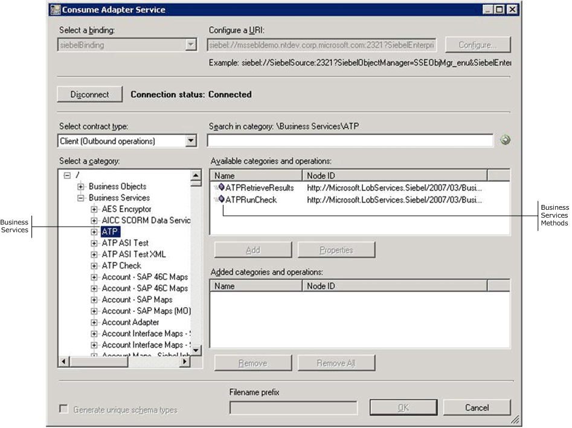
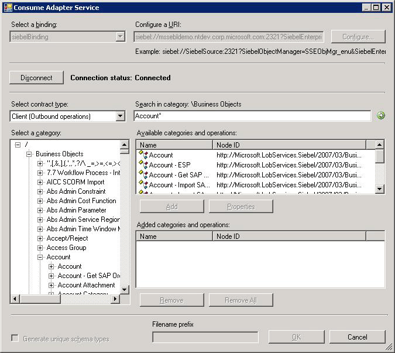
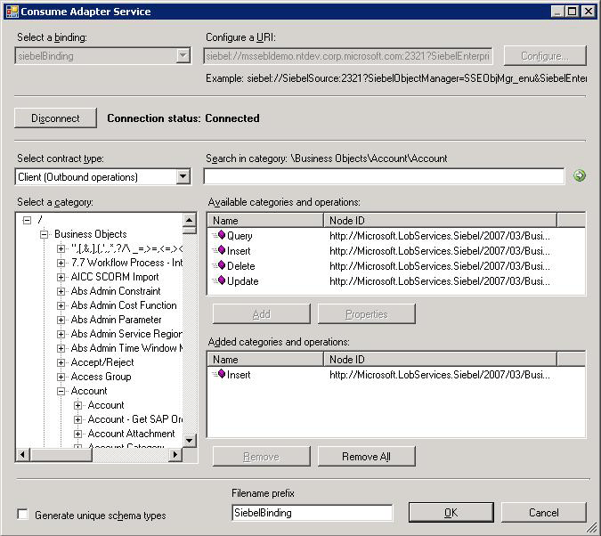

# Browse, search, and get metadata for Siebel operations
This section provides information about how to use the [!INCLUDE[consumeadapterservlong](../../includes/consumeadapterservlong-md.md)], the [!INCLUDE[addadapterwiz](../../includes/addadapterwiz-md.md)], and the [!INCLUDE[addadapterservreflong](../../includes/addadapterservreflong-md.md)]. By using these [!INCLUDE[btsVStudioNoVersion](../../includes/btsvstudionoversion-md.md)] components, you can:  
  
- Browse for operations for which to retrieve metadata.  
  
- Search for operations for which to retrieve metadata.  
  
- Add message schemas for selected operations and port binding configuration files to a [!INCLUDE[btsBizTalkServerNoVersion](../../includes/btsbiztalkservernoversion-md.md)] project when using the [!INCLUDE[consumeadapterservshort](../../includes/consumeadapterservshort-md.md)].  
  
- Add a WCF client class or a WCF service contract (interface) for selected operations and a configuration file (app.config) to a non-BizTalk programming project when using the [!INCLUDE[addadapterservrefshort](../../includes/addadapterservrefshort-md.md)].  
  
> [!NOTE]
>  The [!INCLUDE[consumeadapterservshort](../../includes/consumeadapterservshort-md.md)], the [!INCLUDE[addadapterwiz](../../includes/addadapterwiz-md.md)], and the [!INCLUDE[addadapterservrefshort](../../includes/addadapterservrefshort-md.md)] present essentially the same interface when you browse and search for operations, so all three components are covered in the same topics.  
  
## Prerequisites  
 You must connect to a Siebel system before you can browse, search, or retrieve metadata for target operations. For information about how to connect to a Siebel system when you use the [!INCLUDE[consumeadapterservshort](../../includes/consumeadapterservshort-md.md)], the [!INCLUDE[addadapterwiz](../../includes/addadapterwiz-md.md)], or the [!INCLUDE[addadapterservrefshort](../../includes/addadapterservrefshort-md.md)], see [Connect to the Siebel System in Visual Studio](../../adapters-and-accelerators/adapter-siebel/connect-to-the-siebel-system-in-visual-studio.md).  
  
## Browsing Metadata  
 While browsing metadata using the [!INCLUDE[consumeadapterservshort](../../includes/consumeadapterservshort-md.md)], the [!INCLUDE[addadapterwiz](../../includes/addadapterwiz-md.md)], or [!INCLUDE[addadapterservrefshort](../../includes/addadapterservrefshort-md.md)], the [!INCLUDE[adaptersiebel_short](../../includes/adaptersiebel-short-md.md)] surfaces:  
  
-   Operations that can be performed on Siebel business components such as Insert, Query, Update, and Delete.  
  
-   Business service methods that can be invoked by the adapter clients.  
  
> [!NOTE]
>  By using the [!INCLUDE[consumeadapterservshort](../../includes/consumeadapterservshort-md.md)], the [!INCLUDE[addadapterwiz](../../includes/addadapterwiz-md.md)], or [!INCLUDE[addadapterservrefshort](../../includes/addadapterservrefshort-md.md)], you can browse category and operation nodes using a Windows interface.  
  
 For more information about browsing Siebel metadata, see [Browse, search, and get Siebel metadata](../../adapters-and-accelerators/adapter-siebel/browse-search-and-get-siebel-metadata.md) 
  
 Perform the following steps to browse metadata of a Siebel system using the [!INCLUDE[consumeadapterservshort](../../includes/consumeadapterservshort-md.md)] or [!INCLUDE[addadapterservrefshort](../../includes/addadapterservrefshort-md.md)].  
  
#### To browse metadata in a Siebel system  
  
1. Connect to a Siebel system using the [!INCLUDE[consumeadapterservshort](../../includes/consumeadapterservshort-md.md)], [!INCLUDE[addadapterwiz](../../includes/addadapterwiz-md.md)], or [!INCLUDE[addadapterservrefshort](../../includes/addadapterservrefshort-md.md)]. See [Connect to the Siebel System in Visual Studio](../../adapters-and-accelerators/adapter-siebel/connect-to-the-siebel-system-in-visual-studio.md) for instructions.  
  
2. From the **Select contract type** drop-down list, select the type of contract based on whether you will be performing inbound or outbound operations using the adapter.  
  
3. The **Select a category** box lists the **Business Objects** and **Business Services** nodes. Click the **Business Objects** node to see a list of business objects in the **Available categories and operations** box. Alternatively, you can see the list of business objects by expanding the **Business Objects** node.  
  
   > [!TIP]
   >  You can directly go to the “immediate” category node or subcategory nodes in the tree, by typing the name of the artifact in while the focus is on the tree view in the **Select a category** box. For example, to jump to the **Account** business object, keep the focus on the **Business Objects** node, and then type `Account`.  
  
4. Click the business objects to see the list of business components for a particular business object. Alternatively, you can see the list of business components by expanding a business object.  
  
5. Click the business components to see the list of operations supported for the particular business component.  
  
    The following figure shows the [!INCLUDE[consumeadapterservshort](../../includes/consumeadapterservshort-md.md)], which lists the business object, the business components, and the supported operations.  
  
      
  
6. Click the **Business Services** node to see a list of business services in the **Available categories and operations** box. Alternatively, you can see the list of tables by expanding the **Business Services** node.  
  
7. Click the business services to see the list of corresponding business service methods.  
  
    The following figure shows the [!INCLUDE[consumeadapterservshort](../../includes/consumeadapterservshort-md.md)], which lists the business services and the corresponding business service methods.  
  
      
  
## Searching Metadata  
 While searching Siebel metadata using [!INCLUDE[addadapterservrefshort](../../includes/addadapterservrefshort-md.md)], [!INCLUDE[addadapterwiz](../../includes/addadapterwiz-md.md)], or [!INCLUDE[consumeadapterservshort](../../includes/consumeadapterservshort-md.md)], the [!INCLUDE[adaptersiebel_short](../../includes/adaptersiebel-short-md.md)]:  
  
- Supports wildcard and escape characters.  
  
- Enables search immediately under the node at which the search operation is performed. For example, to search for a business service, you must be searching under \Business Services.  
  
  The following table lists the special characters that can be used for search and their interpretation by the [!INCLUDE[adaptersiebel_short](../../includes/adaptersiebel-short-md.md)].  
  
|Special character|Interpretation|  
|-----------------------|--------------------|  
|? (question mark)|Matches exactly one character   For example, A? matches AB, AC, AD.|  
|* (asterisk)|Matches zero or more characters.   For example, A* matches A, AB, ABC.|  
  
 Perform the following steps to search metadata in a Siebel system using the [!INCLUDE[consumeadapterservshort](../../includes/consumeadapterservshort-md.md)] or [!INCLUDE[addadapterservrefshort](../../includes/addadapterservrefshort-md.md)].  
  
#### To search metadata in a Siebel system  
  
1. Connect to a Siebel system using the [!INCLUDE[consumeadapterservshort](../../includes/consumeadapterservshort-md.md)], [!INCLUDE[addadapterwiz](../../includes/addadapterwiz-md.md)], or [!INCLUDE[addadapterservrefshort](../../includes/addadapterservrefshort-md.md)]. See [Connect to the Siebel System in Visual Studio](../../adapters-and-accelerators/adapter-siebel/connect-to-the-siebel-system-in-visual-studio.md) for instructions.  
  
2. From the **Select contract type** drop-down list, select the **Client (Outbound operations)** contract.  
  
3. In the **Select a category** box, click the **Business Object** node.  
  
4. To search for a particular business object, click the **Business Objects** node in the **Search in category** text box and enter a search expression. For example, to search for business objects that have names beginning with "Account", type **Account\\*** in the text box.  
  
5. Click the button with the right-arrow icon to start the search. After the search is complete, the **Available categories and operations** box lists the business objects that satisfy the search criteria.  
  
6. To search for a particular business component under a business object, click a business object and in the **Search in category** text box enter a search expression. For example, to search for business components that have names beginning with "Account", type **Account\\*** in the text box.  
  
7. Click the button with the right-arrow icon to start the search. After the search is complete, the **Available categories and operations** box lists the business components that satisfy the search criteria.  
  
8. To search particular operations for a business component, click a business component and in the **Search in category** text box enter a search expression. For example, to search for operations having names starting with "Query", type **Query\\*** in the text box.  
  
9. Click the button with the right-arrow icon to start the search. After the search is complete, the **Available categories and operations** box lists the business components that satisfy the search criteria.  
  
     The following figure shows the [!INCLUDE[consumeadapterservshort](../../includes/consumeadapterservshort-md.md)], which lists the search result.  
  
       
  
     Perform a similar procedure to search under the **Business Service** node.  
  
## Generating Schema for BizTalk projects  
 You can use the [!INCLUDE[consumeadapterservshort](../../includes/consumeadapterservshort-md.md)] or the [!INCLUDE[addadapterwiz](../../includes/addadapterwiz-md.md)] to generate schema for selected Siebel artifacts. Once you have browsed and searched for the artifacts you want to invoke, you can generate schema for those artifacts and send messages, conforming to the schema, to Siebel.  
  
> [!NOTE]
>  You can select category nodes to return all the operations in that category's sub-tree—for example, you can select a business component (to generate schema for all the operations in the business component) or a select specific operations on a business component (for example, Insert and Delete) to generate schema for only those operations. For more information about the nodes, see [Metadata Node IDs](../../adapters-and-accelerators/adapter-siebel/metadata-node-ids1.md).  
  
#### To generate schema for Siebel artifacts  
  
1. Connect to a Siebel system using the [!INCLUDE[consumeadapterservshort](../../includes/consumeadapterservshort-md.md)] or the [!INCLUDE[addadapterwiz](../../includes/addadapterwiz-md.md)]. See [Connect to the Siebel System in Visual Studio](../../adapters-and-accelerators/adapter-siebel/connect-to-the-siebel-system-in-visual-studio.md) for instructions.  
  
2. From the **Select contract type** drop-down list, select the **Client (Outbound operations)** contract.  
  
3. In the **Select a category** box, expand the business object or business service node.  
  
4. In the **Available categories and operations** box, select the business components or business services or the corresponding operations for which you want to generate metadata, and then click **Add**. The selected functional areas or operations are listed in the **Added categories and operations** box.  
  
    The following figure shows the [!INCLUDE[consumeadapterservshort](../../includes/consumeadapterservshort-md.md)], which lists the selected operations.  
  
      
  
    If you want to generate schema for multiple operations, there may be some duplicate element definitions among these schema that may cause failure in compiling the BizTalk project. For example, consider a scenario where you generate schema for an operation “Op1”. The schema for “Op1” contains a parameter of complex data type “CT1”. After generating the schema for “Op1” you close the [!INCLUDE[consumeadapterservshort](../../includes/consumeadapterservshort-md.md)] and re-open it to generate schema for another operation “Op2”. Assume that “Op2” also contains a parameter of complex data type “CT1”. After you exit the [!INCLUDE[consumeadapterservshort](../../includes/consumeadapterservshort-md.md)] and compile the project, you will get compilation errors because the complex data type “CT1” is defined twice in different XSD files. In such situations, we recommend the following:  
  
   - Generate schema for all the operations in a single run of [!INCLUDE[consumeadapterservshort](../../includes/consumeadapterservshort-md.md)]. This ensures that the [!INCLUDE[consumeadapterservshort](../../includes/consumeadapterservshort-md.md)] generates only one definition for the complex data type “CT1”.  
  
   - If you want to generate schema for multiple operations across different runs of [!INCLUDE[consumeadapterservshort](../../includes/consumeadapterservshort-md.md)], make sure you select the **Generate unique schema types** check box so that the generated XSD files contain unique namespaces for the complex data type “CT1”.  
  
5. Click **OK**. The schema file is saved with an .xsd extension at the same location as the BizTalk project.  
  
    By default, the files are created with the naming convention "SiebelBindingSchema\<n\>.xsd", where 'n' can be 1, 2, and so on, depending on the number of schema files created. Alternatively, you can provide a custom name to the schema files by entering a name in the **Filename prefix** text box. The [!INCLUDE[consumeadapterservshort](../../includes/consumeadapterservshort-md.md)] now creates schema files with the naming convention \<file name prefix\>Schema\<n\>.xsd.  
  
   > [!NOTE]
   >  The [!INCLUDE[consumeadapterservshort](../../includes/consumeadapterservshort-md.md)] also creates a binding file (an XML file) containing the binding properties that you specified when generating the schema for an operation and the SOAP action to invoke the operation. You can import this binding file in the BizTalk Server Administration console to create a WCF-Custom port with the connection URI, binding properties, and the SOAP action set. For more information, see [Configure a physical port binding using a port binding file to Siebel](../../adapters-and-accelerators/adapter-siebel/configure-a-physical-port-binding-using-a-port-binding-file-to-siebel.md).  
  
6. On the **File** menu, click **Save All**.  
  
## Generating a WCF Client Using the Add Adapter Service Reference Plug-in  
 You can use the [!INCLUDE[addadapterservrefshort](../../includes/addadapterservrefshort-md.md)] to generate WCF client code for outbound operations on a Siebel system.  
  
#### To generate a WCF client  
  
1. In the [!INCLUDE[addadapterservrefshort](../../includes/addadapterservrefshort-md.md)], from the **Select contract type** drop-down list, select **Client (Outbound operations)**.  
  
2. In the **Select a category** box, expand the business object or business service node.  
  
3. In the **Available categories and operations** box, select the business components, business services, or the corresponding operations for which you want to generate a WCF client, and then click **Add**. The selected functional areas or operations are listed in the **Added categories and operations** box. You can select any node that is listed in the **Available categories and operations** box. If you select a category node, then all of the operations available under that node and its sub-nodes will be selected.  
  
   > [!IMPORTANT]
   >  Depending on the categories and operations that you select, more than one WCF client class may be generated. For more information, see [Generate a WCF client or a WCF service contract for Siebel solution artifacts](../../adapters-and-accelerators/adapter-siebel/generate-a-wcf-client-or-a-wcf-service-contract-for-siebel-solution-artifacts.md).  
  
4. For most scenarios the default serialization options are sufficient; however, if needed, you can control several aspects about the code that is generated and the type of serializer that is used. To set these options:  
  
   1. To open the **Advanced Options** box, click **Advanced Options**.  
  
   2. In the **Advanced Options** box under **Choose options for generated proxy**, select the options that you want. For example, you can select whether asynchronous methods are generated for the WCF client, or you can disable the generation of a configuration file.  
  
   3. Under **Serializer**, select the serializer that should be used.  
  
      The following figure shows the **Advanced Options** box with the default selections (**Auto** is selected for the serializer and no other options are selected).  
  
        
  
      The options that you can configure in the **Advanced Options** box are equivalent to some of the options available when you use the ServiceModel Metadata Utility Tool (svcutil.exe). For more information about these options, see [ServiceModel Metadata Utility Tool (Svcutil.exe)](https://msdn.microsoft.com/library/aa347733.aspx).
  
5. Click **OK**. The [!INCLUDE[addadapterservrefshort](../../includes/addadapterservrefshort-md.md)] saves the WCF client class and helper code for the operations and categories that you have selected in your project directory. By default, a configuration file is also saved. For more information, see [Generate a WCF client or a WCF service contract for Siebel solution artifacts](../../adapters-and-accelerators/adapter-siebel/generate-a-wcf-client-or-a-wcf-service-contract-for-siebel-solution-artifacts.md).  
  
## See Also  
 [Get Metadata for Siebel Operations in Visual Studio](../../adapters-and-accelerators/adapter-siebel/get-metadata-for-siebel-operations-in-visual-studio.md)