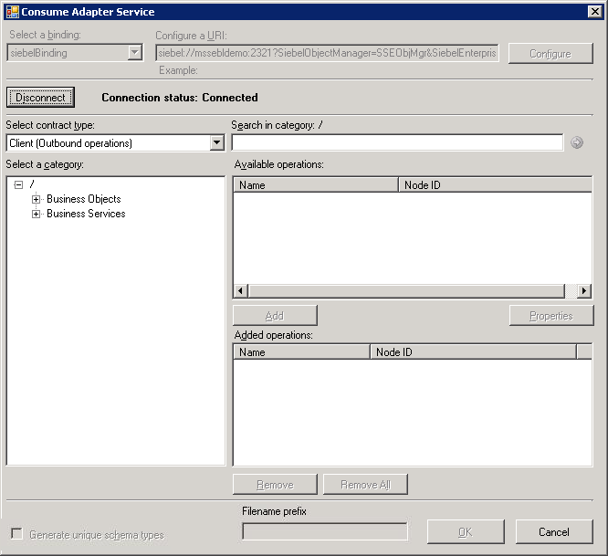

# Connect to the Siebel System in Visual Studio Using Add Adapter Service Reference Plug-in
To connect to a Siebel system using the [!INCLUDE[adaptersiebel_short](../../includes/adaptersiebel-short-md.md)] in a .NET programming solution, you must use the [!INCLUDE[addadapterservreflong](../../includes/addadapterservreflong-md.md)]. This topic provides instructions on how to use the [!INCLUDE[addadapterservrefshort](../../includes/addadapterservrefshort-md.md)].  
  
## Connecting to a Siebel System Using Add Adapter Service Reference Plug-in  
 Perform the following steps to connect to a Siebel system using the [!INCLUDE[addadapterservrefshort](../../includes/addadapterservrefshort-md.md)].  
  
#### To connect to a Siebel system  
  
1. To connect using the [!INCLUDE[consumeadapterservshort](../../includes/consumeadapterservshort-md.md)] in a BizTalk solution:  
  
   1. Create a BizTalk project using [!INCLUDE[btsVStudioNoVersion](../../includes/btsvstudionoversion-md.md)].  
  
   2. Right-click the project in Solution Explorer, and then click **Add Adapter Service Reference**. The [!INCLUDE[addadapterservrefshort](../../includes/addadapterservrefshort-md.md)] opens.  
  
2. From the **Select a binding** drop-down list, select **siebelBinding**, and then click **Configure**.  
  
3. In the **Configure Adapter** dialog box, click the **Security** tab, and from the **Client credential type** drop-down list box, select **Username**.  
  
4. Specify the user name and password to connect to the Siebel system.  
  
5. Click the **URI Properties** tab, and specify values for the connection parameters. For more information about the connection URI for the [!INCLUDE[adaptersiebel_short](../../includes/adaptersiebel-short-md.md)], see [Create the Siebel system connection URI](../../adapters-and-accelerators/adapter-siebel/create-the-siebel-system-connection-uri.md).  
  
   > [!NOTE]
   >  If the connection parameters contain any reserved characters, you must specify them as-is in the **URI Properties** tab, that is, without using any escape characters. However, if you specify the URI directly in the **Configure a URI** field and the connection parameters contain reserved characters, you must specify the connection parameters using proper escape characters.  
  
6. Click the **Binding Properties** tab, and then specify values for the binding properties, if any, required by the operations you want to target. For more information about binding properties, see [Read about BizTalk Adapter for Siebel Binding Properties](../../adapters-and-accelerators/adapter-siebel/read-about-biztalk-adapter-for-siebel-binding-properties.md).  
  
7. Click **OK**.  
  
8. Click **Connect**. Once the connection is established, the connection status is shown as **Connected**.  
  
    The following figure shows the [!INCLUDE[consumeadapterservshort](../../includes/consumeadapterservshort-md.md)] immediately after the connection is established. The graphical user interface is same for the [!INCLUDE[addadapterservrefshort](../../includes/addadapterservrefshort-md.md)].  
  
      
  
    The [!INCLUDE[addadapterservrefshort](../../includes/addadapterservrefshort-md.md)] displays different nodes containing various operations that can be performed on the Siebel system. For example, the **Business Objects** node contains all the business objects and business components that can be invoked on the Siebel system. Similarly, the **Business Services**  node contains all the business services in the Siebel system you connected to. For more information about these nodes, see [Metadata Node IDs](../../adapters-and-accelerators/adapter-siebel/metadata-node-ids1.md).