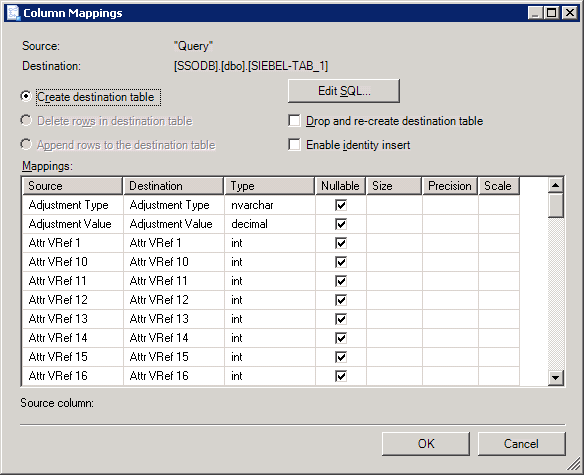

# Import Siebel Data Using SQL Server Management Studio
This section provides information about how to use SQL Server Management Studio to import data from a Siebel system into a SQL Server database. It also provides instructions on how to create and execute an SSIS package to import this data.  
  
## Prerequisites  
 Before performing the procedures provided in this topic, make sure:  
  
- The [!INCLUDE[adoprovidersiebelshort](../../includes/adoprovidersiebelshort-md.md)] is installed on the computer.  
  
- SQL Server Business Intelligence Development Studio is installed on the computer.  
  
## Importing Data by Using SQL Server Management Studio  
 Perform the following steps to import data from Siebel system using [!INCLUDE[adoprovidersiebelshort](../../includes/adoprovidersiebelshort-md.md)] with SQL Server Management Studio.  
  
#### To import data by using SQL Server Management Studio  
  
1. Start the SQL Server Management Studio.  
  
2. In the **Connect to Server** dialog box, specify the values to connect to a SQL Server database, and then click **Connect**. Microsoft SQL Server Management Studio opens.  
  
3. In Object Explorer, expand the SQL Server name, expand **Databases**, and right-click the database into which you will be exporting the tables from the Siebel system. From the context menu, point to **Tasks**, and then click **Import Data**. This starts the SQL Server Import and Export Wizard.  
  
4. Read the information on the Welcome screen, and then click **Next**.  
  
5. In the **Choose a Data Source** dialog box, from the **Data Source** drop-down list, select **.NET Framework Data Provider for Siebel eBusiness Applications**. Specify values for the different connection properties for the [!INCLUDE[adoprovidersiebelshort](../../includes/adoprovidersiebelshort-md.md)] connection string. For more information about the connection string properties, see [Data provider properties for the Siebel connection string](../../adapters-and-accelerators/adapter-siebel/data-provider-properties-for-the-siebel-connection-string.md).  
  
    Click **Next**.  
  
6. In the **Choose a Destination** dialog box:  
  
   1.  From the **Destination** drop-down list, select **SQL Native Client**.  
  
   2.  From the **Server name** drop-down list, select a SQL Server name.  
  
   3.  Select an authentication mode.  
  
   4.  From the **Database** drop-down list, select the database to which you want to import the Siebel table.  
  
   5.  Click **Next**.  
  
7. In the **Specify Table Copy or Query** dialog box, choose the **Write a query to specify the data to transfer** option.  
  
8. In the **Provide a Source Query** dialog box, specify a SELECT query to filter the data to be imported into the SQL Server. For more information about the grammar for a SELECT query for the [!INCLUDE[adoprovidersiebelshort](../../includes/adoprovidersiebelshort-md.md)], see [Syntax for a SELECT Statement in Siebel](../../adapters-and-accelerators/adapter-siebel/syntax-for-a-select-statement-in-siebel.md).  
  
    Click the **Parse** button to validate the query, click **OK** in the pop-up dialog box, and then click **Next**.  
  
9. In the **Select Source Tables and Views** dialog box, select the check box against the source and destination tables. The source is the query you specified to retrieve data from Siebel. The destination is the table that will be created in the SQL Server database.  
  
10. The wizard creates a default mapping between the source and destination table fields. However, you can change the mappings according to your requirement. To change the field mappings, click **Edit Mappings**.  
  
       
  
11. In the **Column Mappings** dialog box, you can:  
  
    -   Change the names of columns in the destination table.  
  
    -   Ignore certain columns in the destination table.  
  
    -   Change the data type for fields in destination table.  
  
    -   Change other field attributes such as nullable, size, precision, and scale.  
  
         When you are finished, click **OK**.  
  
12. In the **Select Source Tables and Views** dialog box, click **Next**.  
  
13. In the **Save and Execute Package** dialog box:  
  
    - Select the **Execute immediately** check box to execute the query.  
  
    - Select the **Save SSIS Package** check box to save the query as a package and execute it later. If you chose to save the package, you must also specify whether you want to save the package in the SQL Server or the file system.  
  
    - From the **Package protection level** drop-down list, select a protection level for the package and specify credentials where required.  
  
    - Click **Next**.  
  
      If you chose to save the package, proceed to the next step. Otherwise, skip to step 15.  
  
14. In the **Save SSIS Package** dialog box, specify the following:  
  
    -   The name for the package  
  
    -   The description for the package  
  
    -   If you chose to save the package to a SQL Server, select a SQL Server from the **Server name** drop-down list.  
  
    -   If you chose to save the package to the file system, specify the name and location of the file in the **File name** text box.  
  
         When you are finished, click **Next**.  
  
15. In the **Complete the Wizard** dialog box, review the summary of actions that the wizard will perform, and then click **Finish**.  
  
16. In the **Performing Operations** dialog box, the wizard starts executing tasks to import the information from Siebel into a SQL Server database table. The status for each task is displayed in the wizard.  
  
17. After all the tasks are successfully executed, click **Close**. If a task fails, see the corresponding error message, fix the issue, and rerun the wizard.  
  
## Running the SSIS Package  
 If you chose to save the SSIS package, you can run it to retrieve the most recent information from the Siebel system. This section provides information about how to run the package if you chose to save it to the file system.  
  
#### To run the package from Windows Explorer  
  
1. From **Windows Explorer**, navigate to the location where you saved the package, and double-click the package.  
  
2. In the **Execute Package Utility** dialog box, click **Execute**. The **Package Execution Progress** dialog box displays the progress of the different tasks.  
  
3. After all the tasks are successfully executed, click **Close**.  
  
4. In the **Execute Package Utility** dialog box, click **Close**.  
  
   For more information about running packages, see "Running Packages" at [http://go.microsoft.com/fwlink/?LinkId=94972](http://go.microsoft.com/fwlink/?LinkId=94972). For any other information related to SSIS packages, see "Package How-to Topics (SSIS)" at [http://go.microsoft.com/fwlink/?LinkId=94973](http://go.microsoft.com/fwlink/?LinkId=94973).  
  
## Verifying the Results  
 After executing the package, you must verify the results by going to the SQL Server database to which the Siebel data is imported. Executing the package should have created a table in the destination database. This table should be populated with the values from the Siebel table.  
  
## See Also  
 [Use the Data Provider for Siebel with SSIS](../../adapters-and-accelerators/adapter-siebel/use-the-data-provider-for-siebel-with-ssis.md)