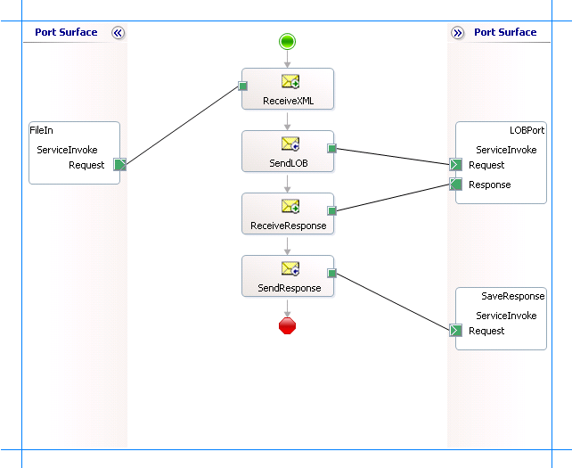

# Invoke Business Service Methods Using BizTalk Server and the Siebel adapter
A Siebel business service is a collection of business methods that can be directly invoked in Siebel. For more information about how the [!INCLUDE[adaptersiebel_short](../../includes/adaptersiebel-short-md.md)] supports invoking business services in a Siebel system, see [Operations on Business Services in Siebel](../../adapters-and-accelerators/adapter-siebel/operations-on-business-services-in-siebel.md). For more information about the structure of SOAP messages for performing business service operations, see [Message Schemas for Business Service Operations](../../adapters-and-accelerators/adapter-siebel/message-schemas-for-business-service-operations.md).  
  
## How to Invoke Business Services?  
 Performing an operation on a Siebel system using the [!INCLUDE[adaptersiebel_short](../../includes/adaptersiebel-short-md.md)] with [!INCLUDE[btsBizTalkServerNoVersion](../../includes/btsbiztalkservernoversion-md.md)] involves procedural tasks described in [Building blocks to create BizTalk applications with the Siebel adapter](../../adapters-and-accelerators/adapter-siebel/building-blocks-to-create-biztalk-applications-with-the-siebel-adapter.md). To invoke a business service, these tasks are:  
  
1. Create a BizTalk project and generate schema for the business service method you want to invoke.  
  
2. Create messages in the BizTalk project for sending and receiving messages from the Siebel system.  
  
3. Create orchestration to invoke a business service method in the Siebel system.  
  
4. Build and deploy the BizTalk project.  
  
5. Configure the BizTalk application by creating physical send and receive ports.  
  
6. Start the BizTalk application.  
  
   This topic provides instructions to perform these tasks.  
  
## Sample Based On This Topic  
 A sample, BusinessService, based on this topic is also provided with the [!INCLUDE[adapterpacknoversion](../../includes/adapterpacknoversion-md.md)]. For more information, see [Samples for the Siebel adapter](../../adapters-and-accelerators/adapter-siebel/samples-for-the-siebel-adapter.md).  
  
## Generating Schema  
 In this topic, to demonstrate how to invoke a business service method, we will generate schema for the **Execute** method exposed by the **TimeStamp** business service. See [Retrieving Metadata for Siebel Operations in Visual Studio](../../adapters-and-accelerators/adapter-siebel/get-metadata-for-siebel-operations-in-visual-studio.md) for more information about how to generate schema.  
  
## Defining Messages and Message Types  
 The schema that you generated earlier describes the "types" required for the messages in the orchestration. A message is typically a variable, the type for which is defined by the corresponding schema. You must link the schema you generated in the first step to the messages from the Orchestration view of the BizTalk project.  
  
 For this topic, you must create two messages—one to send a request to the Siebel system and the other to receive a response.  
  
 Perform the following steps to create messages and link them to the schema:  
  
#### To create messages and link to schema  
  
1.  Open the orchestration view the BizTalk project, if not already open. Click **View**, point to **Other Windows**, and click **Orchestration View**.  
  
2.  In the **Orchestration View**, right-click **Messages**, and then click **New Message**.  
  
3.  Right-click the newly create message and select **Properties Window**.  
  
4.  In the **Properties** pane for **Message_1**, do the following:  
  
    |Use this|To do this|  
    |--------------|----------------|  
    |Identifier|Type **Request**.|  
    |Message Type|From the drop-down list, expand **Schemas**, and select *BusinessService.SiebelBindingSchema.Execute*, where *BusinessService* is the name of your BizTalk project. *SiebelBindingSchema* is the schema generated for invoking the *Execute* business service method.|  
  
5.  Repeat the previous step to create a new message. In the **Properties** pane for the new message, do the following:  
  
    |Use this|To do this|  
    |--------------|----------------|  
    |Identifier|Type **Response**.|  
    |Message Type|From the drop-down list, expand **Schemas**, and select *BusinessService.SiebelBindingSchema.ExecuteResponse*.|  
  
## Setting up the Orchestration  
 You must create a BizTalk orchestration to use [!INCLUDE[btsBizTalkServerNoVersion](../../includes/btsbiztalkservernoversion-md.md)] for invoking a business service. In this orchestration, you drop a request message at a defined receive location. The [!INCLUDE[adaptersiebel_short](../../includes/adaptersiebel-short-md.md)] consumes this message and passes it on to the Siebel system. The response from the Siebel system is saved to another location. A typical orchestration for invoking Business Service methods would contain:  
  
- Send and receive shapes to send messages to Siebel and receive responses.  
  
- A one-way receive port to receive request messages to send to Siebel.  
  
- A two-way send port to send request messages to Siebel and receive responses.  
  
- A one-way send port to send the responses from Siebel to a folder.  
  
  A sample orchestration for calling the *Execute* method for the *TimeStamp* business service resembles the following:  
  
    
  
### Adding Message Shapes  
 Make sure you specify the following properties for each of the message shapes. The names listed in the *Shape* column are the names of the message shapes as displayed in the orchestration above.  
  
|Shape|Shape Type|Properties|  
|-----------|----------------|----------------|  
|ReceiveXML|Receive|-   Set **Name** to *ReceiveXML*<br />-   Set **Activate** to *True*|  
|SendToLOB|Send|-   Set **Name** to *SendToLOB*|  
|ReceiveResponse|Receive|-   Set **Name** to *ReceiveResponse*<br />-   Set **Activate** to *False*|  
|SendResponse|Send|-   Set **Name** to *SendResponse*|  
  
### Adding Ports  
 Make sure you specify the following properties for each of the logical ports. The names listed in the *Port* column are the names of the ports as displayed in the orchestration.  
  
|Port|Properties|  
|----------|----------------|  
|FileIn|-   Set **Identifier** to *FileIn*<br />-   Set **Type** to *FileInType*<br />-   Set **Communication Pattern** to *One-Way*<br />-   Set **Communication Direction** to *Receive*|  
|LOBPort|-   Set **Identifier** to *LOBPort*<br />-   Set **Type** to *LOBPortType*<br />-   Set **Communication Pattern** to *Request-Response*<br />-   Set **Communication Direction** to *Send-Receive*|  
|SaveResponse|-   Set **Identifier** to *SaveResponse*<br />-   Set **Type** to *SaveResponseType*<br />-   Set **Communication Pattern** to *One-Way*<br />-   Set **Communication Direction** to *Send*|  
  
## Specify Messages for Action Shapes and Connect to Ports  
 The following table specifies the properties and their values to be set to specify messages for action shapes and linking them to the ports. The names listed in the *Shape* column are the names of the message shapes as displayed in the orchestration above.  
  
|Shape|Properties|  
|-----------|----------------|  
|ReceiveXML|-   Set **Message** to *Request*<br />-   Set **Operation** to *FileIn.ServiceInvoke.Request*|  
|SendToLOB|-   Set **Message** to *Request*<br />-   Set **Operation** to *LOBPort.ServiceInvoke.Request*|  
|ReceiveResponse|-   Set **Message** to *Response*<br />-   Set **Operation** to *LOBPort.ServiceInvoke.Response*|  
|SendResponse|-   Set **Message** to *Response*<br />-   Set **Operation** to *SaveResponse.ServiceInvoke.Request*|  
  
 After you have specified these properties, the message shapes and ports are connected and your orchestration is complete.  
  
 You must now build the BizTalk solution and deploy it to a [!INCLUDE[btsBizTalkServerNoVersion](../../includes/btsbiztalkservernoversion-md.md)]. For more information, see [How to Build Orchestrations](../../core/how-to-build-orchestrations.md) and [Deploying BizTalk Assemblies from Visual Studio into a BizTalk Application](../../core/deploying-biztalk-assemblies-from-visual-studio-into-a-biztalk-application.md). 
  
## Configuring the BizTalk Application  
 After you have deployed the BizTalk project, the orchestration you created earlier is listed under the **Orchestrations** pane in the BizTalk Server Administration console. You must use the BizTalk Server Administration console to configure the application. For more information about configuring an application, see [How to Create an Application](../../core/how-to-create-an-application.md).  
  
 Configuring an application involves:  
  
- Selecting a host for the application.  
  
- Mapping the ports that you created in your orchestration to physical ports in the BizTalk Server Administration console. For this orchestration you must:  
  
  - Define a location on the hard disk and a corresponding file port where you will drop a request message. The BizTalk orchestration will consume the request message and send it to the Siebel system.  
  
  - Define a location on the hard disk and a corresponding file port where the BizTalk orchestration will drop the response message containing the response from the Siebel system.  
  
  - Define a physical WCF-Custom or WCF-Siebel send port to send messages to the Siebel system. You must also specify the action in the send port. For information about how to create ports, see [Manually configure a physical port binding to the Siebel adapter](../../adapters-and-accelerators/adapter-siebel/manually-configure-a-physical-port-binding-to-the-siebel-adapter.md).
  
    > [!NOTE]
    >  Generating the schema using the [!INCLUDE[consumeadapterservlong](../../includes/consumeadapterservlong-md.md)] also creates a binding file containing information about the ports and the actions to be set for those ports. You can import this binding file from the BizTalk Administration Console to create send ports (for outbound calls). For more information, see [Configure a physical port binding using a port binding file to Siebel](../../adapters-and-accelerators/adapter-siebel/configure-a-physical-port-binding-using-a-port-binding-file-to-siebel.md).
  
## Starting the Application  
 You must start the BizTalk application for executing the *Execute* method on the *TimeStamp* business service in Siebel. For instructions on starting a BizTalk application, see [Start a BizTalk Application](../../core/how-to-start-and-stop-a-biztalk-application.md) or [Start an Orchestration](../../core/how-to-start-an-orchestration.md).
  
 At this stage, make sure:  
  
-   The FILE receive port to receive request messages for the orchestration is running.  
  
-   The FILE send port to receive the response messages from the orchestration is running.  
  
-   The WCF-Custom or WCF-Siebel send port to send messages to the Siebel system is running.  
  
-   The BizTalk orchestration for the operation is running.  
  
## Executing the Operation  
 You must drop the request message to the FILE receive location. The schema of the request message must confirm to the schema you generated earlier in this topic. See [Message Schemas for Business Service Operations](../../adapters-and-accelerators/adapter-siebel/message-schemas-for-business-service-operations.md) for more information about the schema for invoking a business service. For example, the request message to invoke the *Execute* method on the *TimeStamp* business service is:  
  
```  
<Execute xmlns="http://Microsoft.LobServices.Siebel/2007/03/BusinessServices/TimeStamp/Operation" />  
```  
  
 The orchestration consumes the request message and passes it to the Siebel system. The response from the Siebel system is saved at the FILE send location. The response for the above request message is:  
  
```  
<?xml version="1.0" encoding="utf-8"?>  
<ExecuteResponse xmlns="http://Microsoft.LobServices.Siebel/2007/03/BusinessServices/TimeStamp/Operation">  
  <ExecuteResult>  
    <Time xmlns="http://Microsoft.LobServices.Siebel/2007/03/BusinessServices/TimeStamp">2007-11-25T20:42:11.0000000</Time>  
  </ExecuteResult>  
</ExecuteResponse>  
```  
  
## Possible Exceptions  
 For information about the exceptions you might encounter while performing an operation on business service using [!INCLUDE[btsBizTalkServerNoVersion](../../includes/btsbiztalkservernoversion-md.md)], see [Exceptions and Error Handling with the Siebel adapter](../../adapters-and-accelerators/adapter-siebel/exceptions-and-error-handling-with-the-siebel-adapter.md).  
  
## Best Practices  
 After you have deployed and configured the BizTalk project, you can export configuration settings to an XML file called the bindings file. Once you generate a bindings file, you can import the configuration settings from the file so that you do not need to create the send ports, receive ports, etc. for the same orchestration. For more information about binding files, see [Reuse adapter bindings in the Siebel adapter](../../adapters-and-accelerators/adapter-siebel/reuse-adapter-bindings-in-the-siebel-adapter.md).
  
## See Also  
[Building blocks to create BizTalk Applications with the Siebel adapter](../../adapters-and-accelerators/adapter-siebel/building-blocks-to-create-biztalk-applications-with-the-siebel-adapter.md)