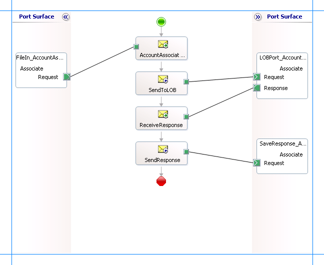

# Run Operations on Business Components with MVG Fields Using BizTalk Server and the Siebel adapter
This section provides instructions on performing operation on a business component containing multi-value fields. To demonstrate an end-to-end operation on such business components, you need to perform:  
  
- An INSERT operation on a parent business component  
  
- An INSERT operation on a child business component  
  
- An ASSOCIATE operation on the multi-value links between the parent and child business component  
  
- A Query_[MVG_Child_Business_Comp] operation on a record of parent business component  
  
  For more information about how the [!INCLUDE[adaptersiebel_short](../../includes/adaptersiebel-short-md.md)] supports operations on business components, see [Operations on business components](../../adapters-and-accelerators/adapter-siebel/operations-on-business-components-in-siebel.md). For more information about the structure of SOAP messages for performing these operations, see [Message Schemas for Business Component Operations](../../adapters-and-accelerators/adapter-siebel/message-schemas-for-business-component-operations.md).  
  
## How to Perform Operations on a Business Component with Multi-value Fields?  
 Performing an operation on a Siebel system using the [!INCLUDE[adaptersiebel_short](../../includes/adaptersiebel-short-md.md)] with [!INCLUDE[btsBizTalkServerNoVersion](../../includes/btsbiztalkservernoversion-md.md)] involves procedural tasks described in [Building blocks to create Siebel applications](../../adapters-and-accelerators/adapter-siebel/building-blocks-to-create-biztalk-applications-with-the-siebel-adapter.md). To perform an operation on a business component, these tasks are:  
  
1. Create a BizTalk project and generate schema for all the operations you want to invoke on the business component. As described earlier, to perform operations on a business component with multi-value fields, you must generate schema for Insert operation on the parent and child business components, Associate operation on the multi-value links between the parent and child business components, and a Query operation on the parent business component.  
  
2. Create messages in the BizTalk project for sending and receiving messages from the Siebel system.  
  
3. Create orchestration to invoke the different operations in the Siebel system.  
  
4. Build and deploy the BizTalk project.  
  
5. Configure the BizTalk application by creating physical send and receive ports.  
  
6. Start the BizTalk application.  
  
   This topic provides instructions to perform these tasks.  
  
## Sample Based On This Topic  
 A sample, MVLDemo, based on this topic is also provided with the [!INCLUDE[adapterpacknoversion](../../includes/adapterpacknoversion-md.md)]. For more information, see [Samples for the Siebel adapter](../../adapters-and-accelerators/adapter-siebel/samples-for-the-siebel-adapter.md).  
  
## Generating Schema  
 In this topic, to demonstrate how to associate the parent business component, **Account** to a child business component, **Contact**, we will generate the schema for the following:  
  
- INSERT operation on the **Account** business component. See [Run Operations on Business Components Using BizTalk Server and the Siebel adapter](../../adapters-and-accelerators/adapter-siebel/run-operations-on-business-components-using-the-siebel-adapter-in-biztalk.md).  
  
- INSERT operation on the **Contact** business component.  
  
- ASSOCIATE operation on the **Account** business component.  
  
- QUERY_CONTACT operation on the **Account** business component.  
  
  See [Get metadata for Siebel operations in Visual Studio](../../adapters-and-accelerators/adapter-siebel/get-metadata-for-siebel-operations-in-visual-studio.md) for more information about how to generate schema.  
  
## Defining Messages and Message Types  
 The schema that you generated earlier describes the "types" required for the messages in the orchestration. A message is typically a variable, the type for which is defined by the corresponding schema. You must link the schema you generated in the first step to the messages from the Orchestration view of the BizTalk project.  
  
 For this topic, you must create four sets of request and response messages, one for each operation you will invoke on the Siebel system. Each set must have a request message and a response message. As an example, the following procedure provides instructions to create a request and response message for the Associate operation. You must perform similar steps to create messages for other operations.  
  
 Perform the following steps to create messages and link them to the schema:  
  
### Create messages and link to schema  
  
1.  Open the orchestration view the BizTalk project, if not already open. Click **View**, point to **Other Windows**, and click **Orchestration View**.  
  
2.  In the **Orchestration View**, right-click **Messages**, and then click **New Message**.  
  
3.  Right-click the newly create message and select **Properties Window**.  
  
4.  In the **Properties** pane for **Message_1**, do the following:  
  
    |Use this|To do this|  
    |--------------|----------------|  
    |Identifier|Type **AccountAssociate_Request**.|  
    |Message Type|From the drop-down list, expand **Schemas**, and select *MVLDemo.SiebelBindingSchema.Associate*, where *MVLDemo* is the name of your BizTalk project. *SiebelBindingSchema* is the schema generated for the invoking the *Associate* operation on *Account* business component.|  
  
5.  Repeat the previous step to create a new message. In the **Properties** pane for the new message, do the following:  
  
    |Use this|To do this|  
    |--------------|----------------|  
    |Identifier|Type **AccountAssociate_Response**.|  
    |Message Type|From the drop-down list, expand **Schemas**, and select *MVLDemo.SiebelBindingSchema.AssociateResponse*.|  
  
## Set up the orchestrations  
 You must now set up orchestrations to use [!INCLUDE[btsBizTalkServerNoVersion](../../includes/btsbiztalkservernoversion-md.md)] for performing operations on the Account and Contact business components.  
  
- Set up an orchestration to perform an INSERT operation on the **Account** business component. See [Run Operations on Business Components Using BizTalk Server and the Siebel adapter](../../adapters-and-accelerators/adapter-siebel/run-operations-on-business-components-using-the-siebel-adapter-in-biztalk.md).  
  
- Set up an orchestration to perform an INSERT operation on the **Contact** business component. This is similar to the INSERT operation on the **Account** business component.  
  
- Set up an orchestration to perform an ASSOCIATE operation on the **Account** business component.  
  
- Set up an orchestration to perform a QUERY_CONTACT operation on the **Account** business component.  
  
  This topic will demonstrate how to set up an orchestration for the ASSOCIATE operation on the **Account** business component. You must perform similar tasks to set up the remaining orchestrations as well.  
  
  The orchestration for the ASSOCIATE operation on the Account business component looks like:  
  
    
  
  The following section provides information on how to set up this orchestration by dropping message shapes, ports, linking messages to schemas, etc. You must perform similar tasks to set up the other orchestrations as well.  
  
### Adding Message Shapes  
 Make sure you specify the following properties for each of the message shapes. The names listed in the *Shape* column are the names of the message shapes as displayed in the orchestration above.  
  
|Shape|Shape Type|Properties|  
|-----------|----------------|----------------|  
|AccountAssociateXML|Receive|-   Set **Name** to *AccountAssociateXML*<br />-   Set **Activate** to *True*|  
|SendToLOB|Send|-   Set **Name** to *SendToLOB*|  
|ReceiveResponse|Receive|-   Set **Name** to *ReceiveResponse*<br />-   Set **Activate** to *False*|  
|SendResponse|Send|-   Set **Name** to *SendResponse*|  
  
### Adding Ports  
 Make sure you specify the following properties for each of the logical ports. The names listed in the *Port* column are the names of the ports as displayed in the orchestration.  
  
|Port|Properties|  
|----------|----------------|  
|FileIn_AccountAssociate|-   Set **Identifier** to *FileIn_AccountAssociate*<br />-   Set **Type** to *FileInAccountAssociateType*<br />-   Set **Communication Pattern** to *One-Way*<br />-   Set **Communication Direction** to *Receive*|  
|LOBPort_AccountAssociate|-   Set **Identifier** to *LOBPort_AccountAssociate*<br />-   Set **Type** to *LOBPortAccountAssociateType*<br />-   Set **Communication Pattern** to *Request-Response*<br />-   Set **Communication Direction** to *Send-Receive*|  
|SaveResponse_AccountAssociate|-   Set **Identifier** to *SaveResponse_AccountAssociate*<br />-   Set **Type** to *SaveResponseAccountAssociateType*<br />-   Set **Communication Pattern** to *One-Way*<br />-   Set **Communication Direction** to *Send*|  
  
## Specify Messages for Action Shapes and Connect to Ports  
 The following table specifies the properties and their values to be set to specify messages for action shapes and linking them to the ports. The names listed in the *Shape* column are the names of the message shapes as displayed in the orchestration above.  
  
|Shape|Properties|  
|-----------|----------------|  
|AccountAssociateXML|-   Set **Message** to *AccountAssociate_Request*<br />-   Set **Operation** to *FileIn_AccountAssociate.Associate.Request*|  
|SendToLOB|-   Set **Message** to *AccountAssociate_Request*<br />-   Set **Operation** to *LOBPort_AccountAssociate.Associate.Request*|  
|ReceiveResponse|-   Set **Message** to *AccountAssociate_Response*<br />-   Set **Operation** to *LOBPort_AccountAssociate.Associate.Response*|  
|SendResponse|-   Set **Message** to *Response*<br />-   Set **Operation** to *SaveResponse_AccountAssociate.Associate.Request*|  
  
 After you have specified these properties, the message shapes and ports are connected and your orchestration is complete.  
  
 You must now build the BizTalk solution and deploy it to a [!INCLUDE[btsBizTalkServerNoVersion](../../includes/btsbiztalkservernoversion-md.md)]. For more information, see [How to Build Orchestrations](../../core/how-to-build-orchestrations.md) and [Deploying BizTalk Assemblies from Visual Studio into a BizTalk Application](../../core/deploying-biztalk-assemblies-from-visual-studio-into-a-biztalk-application.md).  
  
## Configuring the BizTalk Application  
 After you have deployed the BizTalk project, the orchestration you created earlier is listed under the **Orchestrations** pane in the BizTalk Server Administration console. You must use the BizTalk Server Administration console to configure the application. For more information about configuring an application, see [How to Create an Application](../../core/how-to-create-an-application.md).  
  
 Configuring an application involves:  
  
- Selecting a host for the application.  
  
- Mapping the ports that you created in your orchestration to physical ports in the BizTalk Server Administration console. For this orchestration you must:  
  
  - Define a location on the hard disk and a corresponding file port where you will drop a request message. The BizTalk orchestration will consume the request message and send it to the Siebel system. You can have the same port for all the four orchestrations.  
  
  - Define a location on the hard disk and a corresponding file port where the BizTalk orchestration will drop the response message containing the response from the Siebel system. You can have the same port for all the four orchestrations.  
  
  - Define physical WCF-Custom or WCF-Siebel send ports to send messages to the Siebel system. You must also specify the action in the send port. For information about how to create ports, see [Manually configure a physical port binding to the Siebel adapter](../../adapters-and-accelerators/adapter-siebel/manually-configure-a-physical-port-binding-to-the-siebel-adapter.md). You must have different ports for all the four orchestrations.  
  
    > [!NOTE]
    >  Generating the schema using the [!INCLUDE[consumeadapterservlong](../../includes/consumeadapterservlong-md.md)] also creates a binding file containing information about the ports and the actions to be set for those ports. You can import this binding file from the BizTalk Administration Console to create send ports (for outbound calls). For more information, see [Configure a physical port binding using a port binding file to Siebel](../../adapters-and-accelerators/adapter-siebel/configure-a-physical-port-binding-using-a-port-binding-file-to-siebel.md).
  
## Starting the Application  
 You must start the BizTalk application for associating a parent business component to the child business component. For instructions on starting a BizTalk application, see [Start a BizTalk Application](../../core/how-to-start-and-stop-a-biztalk-application.md) or [Start an Orchestration](../../core/how-to-start-an-orchestration.md).  
  
 At this stage, make sure:  
  
-   The FILE receive port to receive request messages for the orchestration is running.  
  
-   The FILE send port to receive the response messages from the orchestration is running.  
  
-   The four WCF-Custom or WCF-Siebel send ports, one each for sending messages to the Siebel system, are running  
  
-   The four BizTalk orchestrations for the different operations are running  
  
## Executing the Operation  
 You must drop the request messages to the FILE receive port. The schema for the request messages must conform to the schema you generated earlier in the topic. See [Message Schemas for Business Component Operations](../../adapters-and-accelerators/adapter-siebel/message-schemas-for-business-component-operations.md) for more information about the schema for the request message for different operations. You must drop the request messages in the following order:  
  
- Drop a request message to insert a record into the **Account** business component. The request message will be similar to the one dropped for inserting a record in the Account business component in the topic [Run Operations on Business Components Using BizTalk Server and the Siebel adapter](../../adapters-and-accelerators/adapter-siebel/run-operations-on-business-components-using-the-siebel-adapter-in-biztalk.md). The orchestration consumes the message and sends it to the Siebel system. The response from the Siebel system is saved at the other FILE location defined as part of the orchestration.  
  
- Drop a request message to insert a record into the **Contact** business component. The request message will be similar to the one dropped for inserting a record in the Account business component in the topic [Run Operations on Business Components Using BizTalk Server and the Siebel adapter](../../adapters-and-accelerators/adapter-siebel/run-operations-on-business-components-using-the-siebel-adapter-in-biztalk.md). The orchestration consumes the message and sends it to the Siebel system. The response from the Siebel system is saved at the other FILE location defined as part of the orchestration.  
  
- Drop a request message to perform an ASSOCIATE operation on the **Account** business component. This will associate the parent and child business components based on the search expression and the name of the multi-valued field you specify in the input XML. Note that:  
  
  - The parent search expression in the ASSOCIATE operation must match a unique record in the parent table.  
  
  - The child search expression in the ASSOCIATE operation must match a unique record in the child table.  
  
    For example, the request message to perform an Associate operation on the Account business component is:  
  
  ```  
  <Associate xmlns="http://Microsoft.LobServices.Siebel/2007/03/BusinessObjects/Account/Account/Operation">  
    <ViewMode>3</ViewMode>  
    <ParentSearchExpr>[Name] LIKE "SampleName1"</ns0:ParentSearchExpr>   
    <ParentMVGField>Bill To First Name</ns0:ParentMVGField>   
    <ChildSearchExpr>[First Name] LIKE "SampleName2"</ns0:ChildSearchExpr>   
  </Associate>  
  ```  
  
   The orchestration consumes the message and sends it to the Siebel system. The response from the Siebel system is saved at the other FILE location defined as part of the orchestration. For example, the response for the above request message is:  
  
  ```  
  <?xml version="1.0" encoding="utf-8"?>  
  <AssociateResponse xmlns="http://Microsoft.LobServices.Siebel/2007/03/BusinessObjects/Account/Account/Operation">  
    <AssociateResult>  
      <ChildID xmlns="http://Microsoft.LobServices.Siebel/2007/03/BusinessObjects">1-8AO09</ChildID>  
      <ParentID xmlns="http://Microsoft.LobServices.Siebel/2007/03/BusinessObjects">1-8ANZ5</ParentID>  
    </AssociateResult>  
  </AssociateResponse>  
  ```  
  
- Drop a request message to perform a QUERY_CONTACT operation on the **Account** business component. For example, the request message for a QUERY_CONTACT operation is:  
  
  ```  
  <Query_Contact xmlns ="http://Microsoft.LobServices.Siebel/2007/03/BusinessObjects/Account/Account/Operation">  
    <ViewMode>3</ViewMode>   
    <ParentSearchExpr>[Name] LIKE "SampleName1"</ParentSearchExpr>   
    <ParentMVGField>Bill To First Name</ParentMVGField>   
    <ContactQueryInputRecord>  
      <SearchExpr xmlns:ns1="http://Microsoft.LobServices.Siebel/2007/03/BusinessObjects">[Id] LIKE '*'</SearchExpr>   
    </ContactQueryInputRecord>  
  </Query_Contact>  
  ```  
  
   The orchestration consumes the message and sends it to the Siebel system. The response from the Siebel system is saved at the other FILE location defined as part of the orchestration.  
  
  See [Message Schemas for Business Component Operations](../../adapters-and-accelerators/adapter-siebel/message-schemas-for-business-component-operations.md) for more information about the schema for the request message.  
  
## Possible Exceptions  
 For information about the exceptions you might encounter while performing an operation on business component with multivalued fields using [!INCLUDE[btsBizTalkServerNoVersion](../../includes/btsbiztalkservernoversion-md.md)], see [Exceptions and Error Handling](../../adapters-and-accelerators/adapter-siebel/exceptions-and-error-handling-with-the-siebel-adapter.md).  
  
## Best Practices  
 After you have deployed and configured the BizTalk project, you can export configuration settings to an XML file called the bindings file. Once you generate a bindings file, you can import the configuration settings from the file so that you do not need to create the send ports, receive ports, etc. for the same orchestration. For more information about binding files, see [Reuse adapter bindings](../../adapters-and-accelerators/adapter-siebel/reuse-adapter-bindings-in-the-siebel-adapter.md).  
  
## See Also  
[Develop BizTalk applications](../../adapters-and-accelerators/adapter-siebel/develop-biztalk-applications-using-the-siebel-adapter.md)