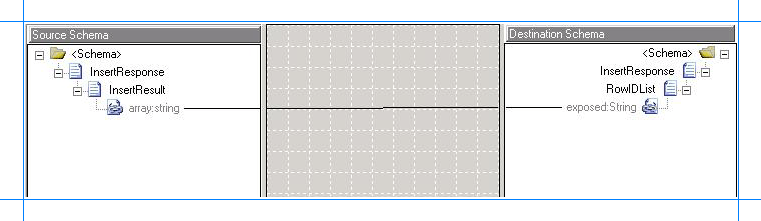

# Step 1: Modify the vPrev BizTalk Project with the Siebel adapter
  
  
 **Time to complete:** 10 minutes  
  
 **Objective:** In this step, you make the following changes to the existing vPrev BizTalk project:  
  
- Generate metadata for the Insert operation on the Account business component using the WCF-based [!INCLUDE[adaptersiebel_short](../../includes/adaptersiebel-short-md.md)].  
  
- Map the request message for performing an Insert operation using the vPrev Siebel adapter to a request message for performing an Insert operation using the WCF-based [!INCLUDE[adaptersiebel_short](../../includes/adaptersiebel-short-md.md)].  
  
- Map the response message received using the WCF-based [!INCLUDE[adaptersiebel_short](../../includes/adaptersiebel-short-md.md)] to the response message for the vPrev Siebel adapter.  
  
## Prerequisite  
  
-   You must have a vPrev BizTalk project to perform an Insert operation on the Account business component in the Siebel system.  
  
### To modify the vPrev BizTalk project  
  
1. Generate metadata for the Insert operation on the Account business component using the WCF-based [!INCLUDE[adaptersiebel_short](../../includes/adaptersiebel-short-md.md)]. You can use the [!INCLUDE[consumeadapterservlong](../../includes/consumeadapterservlong-md.md)] to generate metadata.  
  
    For instructions on how to generate metadata, see [Get Metadata for Siebel Operations in Visual Studio](../../adapters-and-accelerators/adapter-siebel/get-metadata-for-siebel-operations-in-visual-studio.md). After the schema is generated, a file with the name similar to *SiebelBindingSchema.xsd* is added to the BizTalk project. This file contains the schema for sending a message to perform the Insert operation on the Account business component using the WCF-based [!INCLUDE[adaptersiebel_short](../../includes/adaptersiebel-short-md.md)].  
  
2. Generating the metadata for the Insert operation also creates a port binding file. In the next step, this binding file will be used to create a WCF-Custom send port to send messages to the Siebel system. The SOAP action for the operation is also set to the operation for which you generated metadata. For example, if you generate metadata for the Insert operation, the operation name in the SOAP action on the send port will be “Insert”. However, the operation name on the logical send port that you create as part of the orchestration could be different, for example, “Operation_1”. As a result, when you send messages to the Siebel system using the send port, you get an error. To prevent this, make sure the operation name on the logical send port in your orchestration is the same as the operation name for which you generated metadata.  
  
    So, in case of this tutorial, because you generate metadata for the Insert operation, change the name of the logical send port operation to “Insert”.  
  
3. For the request message, map the schema generated using vPrev Siebel adapter to the schema generated using the WCF-based [!INCLUDE[adaptersiebel_short](../../includes/adaptersiebel-short-md.md)].  
  
   1. Add a BizTalk mapper to the BizTalk project. Right-click the BizTalk project, point to **Add**, and click **New Item**.  
  
       In the **Add New Item** dialog box, from the left pane, select **Map Files**. From the right pane, select **Map**. Specify a name for the map, such as **RequestMap.btm**. Click **Add**.  
  
   2. From the Source Schema pane, click **Open Source Schema**.  
  
   3. In the **BizTalk Type Picker** dialog box, expand the project name, expand **Schemas**, and select the schema for the request message for the vPrev Siebel adapter. For this tutorial, select *Siebel_BussComp_Migration.AccountService_Account_x5d*. Click **OK**.  
  
   4. In the **Root Node for Source Schema** dialog box, select *Insert*, and then click **OK**.  
  
   5. From the Destination Schema pane, click **Open Destination Schema**.  
  
   6. In the **BizTalk Type Picker** dialog box, expand the project name, expand **Schemas**, and select the schema for the request message for the WCF-based [!INCLUDE[adaptersiebel_short](../../includes/adaptersiebel-short-md.md)]. For this tutorial, select *Siebel_BussComp_Migration.SiebelDBBindingSchema*, and then click **OK**.  
  
   7. In the **Root Node for Target Schema** dialog box, select *Insert*, and then click **OK**.  
  
   8. Map the following elements in both the schemas: **Currency_Code**, **Current_Volume**, **Customer_Account_Group**, **Location**, **Main_Phone_Number**, **Name**, **Party_Name**, **Primary_Address_Id**,  
  
   9. Save the map.  
  
4. For the response message, map the schema generated using the vPrev Siebel adapter to the schema generated using the WCF-based [!INCLUDE[adaptersiebel_short](../../includes/adaptersiebel-short-md.md)].  
  
   1. Add a BizTalk mapper to the BizTalk project. Right-click the BizTalk project, point to **Add**, and click **New Item**.  
  
       In the Add New Item dialog box, from the left pane, select **Map Files**. From the right pane, select **Map**. Specify a name for the map, such as **ResponseMap.btm**. Click **Add**.  
  
   2. From the Source Schema pane, click **Open Source Schema**.  
  
   3. In the **BizTalk Type Picker** dialog box, expand the project name, expand **Schemas**, and select the schema for the response message for the WCF-based [!INCLUDE[adaptersiebel_short](../../includes/adaptersiebel-short-md.md)]. For this tutorial, select *Siebel_BussComp_Migration.SiebelDBBindingSchema*. Click **OK**.  
  
   4. In the **Root Node for Source Schema** dialog box, select *InsertResponse* and click **OK**.  
  
   5. From the Destination Schema pane, click **Open Destination Schema**.  
  
   6. In the **BizTalk Type Picker** dialog box, expand the project name, expand **Schemas**, and select the schema for the response message for the vPrev Siebel adapter. For this tutorial, select *Siebel_BussComp_Migration.AccountService_Account_x5d*. Click **OK**.  
  
   7. In the **Root Node for Target Schema** dialog box, select *InsertResponse* and click **OK**.  
  
   8. Map the **array:string** element in the source schema to the **exposed:string** element in the destination schema, as illustrated in the following figure.  
  
         
  
   9. Save the map.  
  
5. Save and build the BizTalk solution. Right-click the solution, and then click **Build Solution**.  
  
6. Deploy the solution. Right-click the solution, and then click **Deploy Solution**.  
  
## Next Steps  
 Create a WCF-custom send port and configure it to use the maps you created in this step, as described in [Step 2: Configure the Orchestration in BizTalk Server Administration Console to use the Oracle Database adapter](../../adapters-and-accelerators/adapter-oracle-database/step-2-configure-an-orchestration-to-use-the-oracle-db-adapter-in-biztalk.md).  
  
## See Also  
 [Tutorial 2: Migrating BizTalk Projects in Siebel](../../adapters-and-accelerators/adapter-siebel/tutorial-2-migrating-biztalk-projects-in-siebel.md)