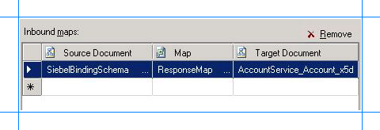
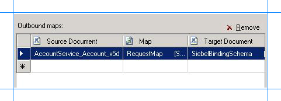

# Step 2: Configure the Orchestration in BizTalk Server Administration Console with the Siebel adapter
  
  
 **Time to complete:** 10 minutes  
  
 **Objective:** In this step, you perform the following tasks:  
  
- Create a WCF-Custom send-receive port to send and receive messages from the Siebel system using the [!INCLUDE[adaptersiebel_short](../../includes/adaptersiebel-short-md.md)]. Configure this port to use the maps you created in the previous step.  
  
- Configure the orchestration you deployed in the last step to use the WCF-Custom port.  
  
## Prerequisite  
  
-   You must have deployed the BizTalk orchestration for which you want to configure the WCF-Custom port.  
  
### To create a WCF-Custom port  
  
1. When you generate schema for an operation on the Siebel system using [!INCLUDE[consumeadapterservlong](../../includes/consumeadapterservlong-md.md)], a binding file is also added to the BizTalk project. You can import this binding file into your BizTalk application to create a WCF-Custom send-receive port. For instructions on importing a binding file, see [Importing Bindings](http://msdn.microsoft.com/library/908ab90c-2ba2-4c65-9f74-10579f06e372).  
  
2. After you import the binding file, a send port is created under the **Send Ports** folder in the BizTalk Server Administration console.  
  
3. Right-click the WCF-Custom port, and then click **Properties**.  
  
4. From the left pane of the send port properties dialog box, click the **General** tab. From the right pane, click **Configure**.  
  
5. In the **WCF-Custom Transport Properties** dialog box, click the **Credentials** tab and specify the credentials to connect to a Siebel system.  
  
6. Click **OK**.  
  
7. From the left pane of the send port properties dialog box, click **Inbound Maps**. From the right pane, click the field under the **Map** column, and from the drop-down select **ResponseMap**.  
  
      
  
8. From the left pane of the send port properties dialog box, click **Outbound Maps**. From the right pane, click the field under the **Map** column, and from the drop-down select **RequestMap**.  
  
      
  
9. Click **OK**.  
  
### To configure the BizTalk application  
  
1. In the BizTalk Server Administration console, expand **BizTalk Group**, expand **Applications**, and expand the BizTalk Application where the orchestration is deployed.  
  
2. Right-click the BizTalk application, and then select **Configure**.  
  
3. From the left pane, click the orchestration to configure. From the right pane, from the **Host** drop-down list, select a BizTalk host instance.  
  
4. Under the **Bindings** box, map the logical ports of the BizTalk orchestration to the physical ports in the BizTalk Server Administration console.  
  
   1. Select the file port where you will drop a request message. The BizTalk orchestration will consume the request message and send it to the Siebel system.  
  
   2. Select the file port where the BizTalk orchestration will drop the response message containing the response from the Siebel system.  
  
   3. Select the WCF-Custom send port you created earlier in this topic.  
  
   4. Click **OK**.  
  
      For more information about configuring an application, see "How to Configure an Application" at [http://go.microsoft.com/fwlink/?LinkId=102360](http://go.microsoft.com/fwlink/?LinkId=102360).  
  
## Next Steps  
 You have now completed migration of your vPrev BizTalk project to a BizTalk project that sends messages to the Siebel system using the WCF-based [!INCLUDE[adaptersiebel_short](../../includes/adaptersiebel-short-md.md)]. You must now test the migrated BizTalk application by sending a request message to invoke the Insert operation on the Account business component, as described in [Step 3: Test the Migrated Application with the Siebel adapter](../../adapters-and-accelerators/adapter-siebel/step-3-test-the-migrated-application-with-the-siebel-adapter.md).  
  
## See Also  
 [Tutorial 2: Migrating BizTalk Projects in Siebel](../../adapters-and-accelerators/adapter-siebel/tutorial-2-migrating-biztalk-projects-in-siebel.md)