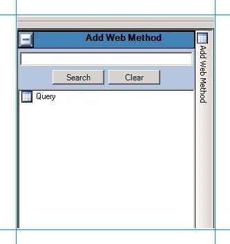
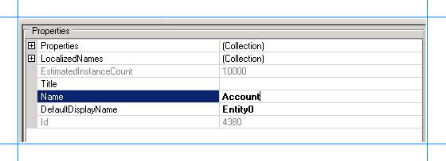
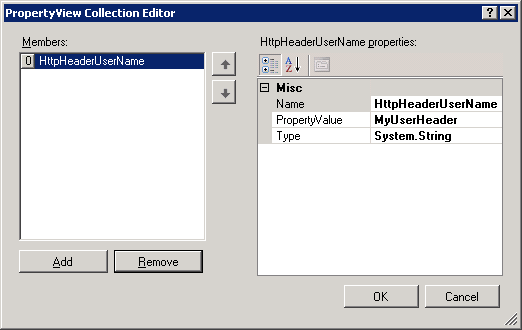
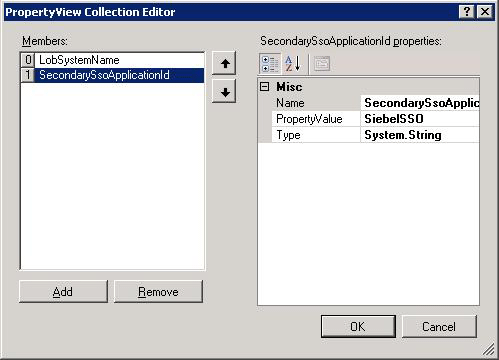
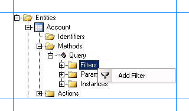
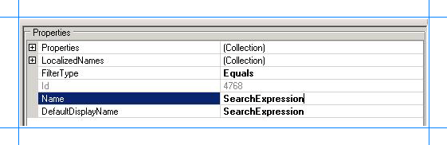
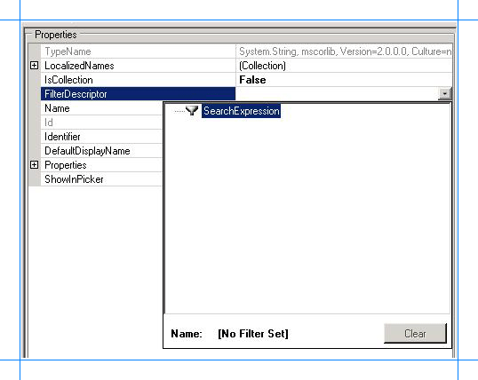
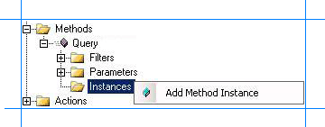
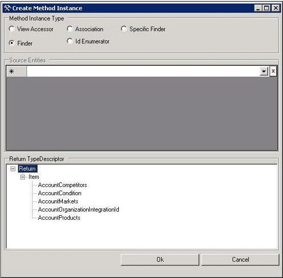
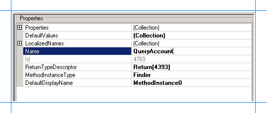

# Step 2: Create an Application Definition File for Siebel Business Component Operations
  
  
 **Time to complete:** 15 minutes  
  
 **Objective:** The Business Data Catalog exposes and incorporates data from line-of-business (LOB) applications into portals. To incorporate this data into your portal site, you must build an application definition file that Microsoft Office SharePoint Server can consume.  
  
 The Business Data Catalog Definition Editor tool enables you to create an application definition file for the Business Data Catalog. This tool automatically generates the XML for the definition file. Therefore, you do not have to manually create the file in an XML editor.  
  
 The purpose of the Microsoft Office SharePoint Server application that you are creating is to perform a Query operation on the Account business component to retrieve a list of records. To achieve this, you must complete a set of tasks in the Business Data Catalog Definition Editor. This topic provides instructions on how to perform these tasks.  
  
## Prerequisites  
  
-   You must have the Business Data Catalog Definition Editor installed as part of the Microsoft Office SharePoint Server 2007 SDK. You can download the SDK from [http://go.microsoft.com/fwlink/?LinkId=104130](http://go.microsoft.com/fwlink/?LinkId=104130).  
  
-   You should have published the WCF service, as described in [Step 1: Publish the Siebel Business Component Operations as a WCF Service](../../adapters-and-accelerators/adapter-siebel/step-1-publish-the-siebel-business-component-operations-as-a-wcf-service.md).  
  
## Creating an Application Definition File  
 This section provides step-by-step instructions to create an application definition file for the WCF service.  
  
### Connect to the WCF Service, and Create Entities  
 You must connect to the WCF service to extract the Web Services Description Language (WSDL) for the service. From the WSDL, the Business Data Catalog Definition Editor extracts the methods. These methods can be used to create entities. For this example, you must create one entity for the Query operation on the Account business component.  
  
##### To connect to the WCF service, and create entities  
  
1.  Start the Business Data Catalog Definition Editor. On the **Start** menu, click **Microsoft Business Data Catalog Definition Editor**.  
  
2.  In the tool, click **Add LOB System**.  
  
3.  In the Add LOB System window, click **Connect to Webservice**.  
  
4.  In the URL box, type the URL for the WCF service. The URL must be in the following format:  
  
    ```  
    https://<computer_name>/Siebel_Account/BusinessObjects_Account_Account_Operation.svc?wsdl  
    ```  
  
     where, BusinessObjects_Account_Account_Operation.svc is the service file created for the Siebel contract.  
  
     The URL that you must type is available when you test whether the WCF service is published successfully, as described in [Step 1: Publish the Siebel Business Component Operations as a WCF Service](../../adapters-and-accelerators/adapter-siebel/step-1-publish-the-siebel-business-component-operations-as-a-wcf-service.md).  
  
5.  Click **Connect**.  
  
6.  Click the **Add Web Method** tab to see the operations you selected in the WCF Adapter Service Development Wizard. You will see the **Query** method.  
  
       
  
7.  Drag the **Query** method to the design surface and then click **OK**.  
  
8.  In the **Enter the name for the LOB System** dialog box, type a name in the **LOB System Name** box. For this example, type `Siebel_Account`, and then click **OK**. An entity, **Entity0**, is created in the Business Data Catalog Definition Editor.  
  
    > [!IMPORTANT]
    >  The Business Data Catalog Definition Editor tool does not handle enumerated data types. So, the Business Data Catalog Definition Editor tool imports the fields till it encounters an enumerated data type and ignores the remaining fields. The Business Data Catalog Definition Editor tool also gives an error. You can ignore this error and proceed by clicking OK. You can manually add the required fields in the application definition file at a later stage.  
  
9. Change the entity names to use more friendly names. For this example, change **Entity0** to **Account**.  
  
    1.  Expand the **Siebel_Account** node, and then expand the **Entities** node.  
  
    2.  Select the **Entity0** node.  
  
    3.  In the Properties pane, type **Account** in the **Name** field.  
  
           
  
### Specify User Name and Password Headers for Methods  
 When creating a WCF service for the selected business component operations in the Siebel system, you specified user name and password headers as part of the endpoint behavior configuration ([Step 1: Publish the Siebel Business Component Operations as a WCF Service](../../adapters-and-accelerators/adapter-siebel/step-1-publish-the-siebel-business-component-operations-as-a-wcf-service.md)). You must specify the same values for the method properties.  
  
##### To specify user name and password headers for the Query method  
  
1.  In the Metadata Objects pane, expand the **Account** node, and then expand the **Methods** node.  
  
2.  Click the **Query** node, and in the Properties pane click the ellipsis (…) button against the **Properties** field.  
  
3.  In the PropertyView Collection Editor dialog box, click **Add**, and in the Properties pane, type `HttpHeaderUserName` for the **Name** field. Similarly, type `MyUserHeader` for the **PropertyValue** field. Select **System.String** for the **Type** field.  
  
       
  
4.  In the PropertyView Collection Editor window, click **Add**, and in the Properties pane, type `HttpHeaderPassword` for the **Name** field. Similarly, type `MyPassHeader` for the **PropertyValue** field. Select **System.String** for the **Type** field.  
  
5.  Click **OK**.  
  
### Set up Single Sign-On for Connecting to a Siebel System  
 After you have finished performing all the procedures in this topic, you will have created an application definition XML that can be imported into a SharePoint application. From the application, you will invoke the Siebel business component operations (exposed as Web methods) to retrieve relevant data from the Siebel system. To enable this, you must create a mapping between a user in the Siebel system and the user in the SharePoint application. You create this mapping in SharePoint Central Administration Web site after you have imported the application definition XML.  
  
 However, to create the mapping you must set a property **SecondarySsoApplicationId** in the Business Data Catalog Definition Editor.  
  
##### To set the SecondarySsoApplicationId property  
  
1.  In the Metadata Objects pane, expand the **Siebel_Account** node, and then expand the **Instances** node.  
  
2.  Click **Siebel_Account_Instance** and in the Properties pane click the ellipsis (…) button against the **Properties** field.  
  
3.  In the PropertyView Collection Editor window, click **Add**, and in the Properties pane, type **SecondarySsoApplicationId** for the **Name** field. Similarly, type **SiebelSSO** for the **PropertyValue** field. Select **System.String** for the **Type** field.  
  
       
  
4.  Click **OK**.  
  
### Requirement: Perform a Query Operation on the Account Business Component  
 The first requirement of this example is to create an application definition that can be used to perform a Query operation on the Account business component. To achieve this requirement, you must perform the following set of tasks:  
  
-   In the Query method, create a filter, and map it to the parameter on which the Query operation is performed. For the Account business component, you will perform a query using the **SearchExpr** parameter. So, you will map the filter to the **SearchExpr** parameter.  
  
-   Create a Finder method instance for the Query method. A Finder method retrieves a list of records based on a filter.  
  
##### To create a filter, and map it to the SearchExpr parameter  
  
1.  Create a filter for the Query method.  
  
    1.  In the Metadata Objects pane, expand the **Account** node, and then expand the **Methods** node.  
  
    2.  Expand the Query method, right-click **Filters**, and then click **Add Filter**.  
  
           
  
    3.  In the Properties pane, type `SearchExpression` for the **Name** field.  
  
    4.  For the **FilterType** property, select **Equals**.  
  
           
  
2.  Map the filter to the **SearchExpr** parameter in the Query method.  
  
    1.  In the Metadata Objects pane, expand the **Account** node, and then expand the **Methods** node.  
  
    2.  Expand the Query method, and then expand the **Parameters** node.  
  
    3.  Expand the **AccountQueryInputRecord** node, and then expand the second **AccountQueryInputRecord** node.  
  
    4.  Click the **SearchExpr** node and in the Properties pane, select **SearchExpression** from the **FilterDescriptor**list.  
  
           
  
        > [!IMPORTANT]
        >  The **AccountQueryInputRecord** also contains a **QueryFields** node, which in turn contains an **Item** node. You must delete the **Item** node, otherwise the Query operation on the Account business component might not give the desired results. To delete the **Item** node, right-click the node, and then select **Delete**.  
  
##### To create a Finder method instance for Query method  
  
1.  In the Metadata Objects pane, expand the **Account** node, and then expand the **Methods** node.  
  
2.  Expand the **Query** node, right-click **Instances**, and then click **Add Method Instance** to open the Create Method Instance window.  
  
       
  
3.  In the Create Method Instance window, click **Finder** for the **Method Instance Type**.  
  
4.  Click **Return** from **Return TypeDescriptor** section.  
  
       
  
5.  Click **OK**.  
  
6.  In the Properties pane, type `QueryAccount` for the **Name** field.  
  
       
  
### Remove the Parameters of System.Nullable Type  
 The return parameters for Query function may contain parameters that are of System.Nullable type. Due to the presence of these parameters in the application definition, you might get an error while presenting Siebel data on a SharePoint portal. So, you must remove the parameters of System.Nullable type from the application definition.  
  
 Also, for each parameter of System.Nullable type, the Business Data Catalog Definition Editor creates another parameter of System.Boolean type, and appends “Specified” to the parameter name. For example, the parameter AccountRole is of System.Nullable type. So, the Business Data Catalog Definition Editor adds an AccountRoleSpecified parameter to the list of parameters. You must remove such parameters as well.  
  
> [!NOTE]
>  You can see the parameter type by selecting the parameter in the Business Data Catalog Definition Editor, and looking at the value for the **TypeName** property in the Properties pane.  
  
> [!NOTE]
>  You can skip this step if the application does not contain any parameters of System.Nullable type.  
  
##### To remove the parameters of System.Nullable type for the Query method  
  
1.  In the Metadata Objects pane, expand the **Account** node, and then expand the **Methods** node.  
  
2.  Expand the **Query** node, and then expand the **Parameters** node.  
  
3.  Expand the **Return** node, and then expand the second **Return** node.  
  
4.  Right-click the parameter you want to delete, and then select **Delete**.  
  
5.  In the dialog box, click **OK**.  
  
### Export the Application Definition to a File  
 You have now created an application definition that contains the Siebel system instance metadata. You must export this definition to an XML file, which can be imported into Microsoft Office SharePoint Server.  
  
##### To export the application definition to a file  
  
1.  Right-click the **Siebel_Account** node in the Metadata Objects pane, and then click **Export**.  
  
2.  Save the file as Siebel_Account.xml.  
  
### Modify the Application Definition File to Include Specific Parameters  
 As mentioned earlier in this topic, the Business Data Catalog Definition Editor tool does not handle enumerated data types. The Business Data Catalog Definition Editor tool imports the fields till it encounters an enumerated data type and ignores the remaining fields. So, certain fields that you want in your application might be omitted. You can manually edit the application definition file to include those fields.  
  
> [!NOTE]
>  You must make sure the parameters you are adding are present in the .cs file generated by the WCF Adapter Service Development Wizard in [Step 1: Publish the Siebel Business Component Operations as a WCF Service](../../adapters-and-accelerators/adapter-siebel/step-1-publish-the-siebel-business-component-operations-as-a-wcf-service.md).  
  
 In this application definition file, you will add or remove return parameters for the **QueryAccount** method.  
  
##### To modify the application definition file  
  
1. Open the application definition file, Siebel_Account.xml, by using [!INCLUDE[btsVStudioNoVersion](../../includes/btsvstudionoversion-md.md)] or any other editor.  
  
2. Modify the application definition file to replace the parameters for the **QueryAccount** method.  
  
   1.  Within the application definition file, search for the following:  
  
       ```  
       <TypeDescriptor TypeName="BDC.AccountQueryRecord,Siebel_Account" Name="Item">  
       ```  
  
   2.  Within the `<TypeDescriptors>` tag, replace the existing `<TypeDescriptor>` elements with the following:  
  
       ```  
  
       <TypeDescriptor TypeName="System.String, mscorlib, Version=2.0.0.0, Culture=neutral, PublicKeyToken=<token>" Name="Id" />  
       <TypeDescriptor TypeName="System.String, mscorlib, Version=2.0.0.0, Culture=neutral, PublicKeyToken=<token>" Name="Country" />  
       <TypeDescriptor TypeName="System.String, mscorlib, Version=2.0.0.0, Culture=neutral, PublicKeyToken=<token>" Name="Name" />  
       <TypeDescriptor TypeName="System.String, mscorlib, Version=2.0.0.0, Culture=neutral, PublicKeyToken=<token>" Name="Location" />  
       ```  
  
   3.  Save and close the file.  
  
   > [!TIP]
   >  You can import the updated application definition file back in the Business Data Catalog Definition Editor tool to see the newly added fields. However, before importing you will have to remove the existing “Siebel_Account” application from the Business Data Catalog Definition Editor tool.  
  
## Next Steps  
 You must now create a SharePoint application to retrieve data from a Siebel system. See [Step 3: Create a SharePoint Application to Retrieve Data from Siebel](../../adapters-and-accelerators/adapter-siebel/step-3-create-a-sharepoint-application-to-retrieve-data-from-siebel.md) for instructions.  
  
## See Also  
 [Tutorial 1: Presenting Data From a Siebel System on a SharePoint Site](../../adapters-and-accelerators/adapter-siebel/tutorial-1-presenting-data-from-a-siebel-system-on-a-sharepoint-site.md)