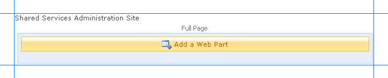
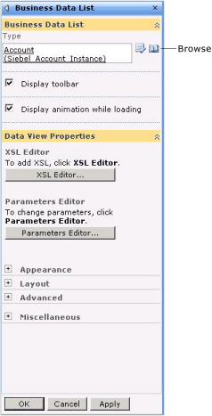
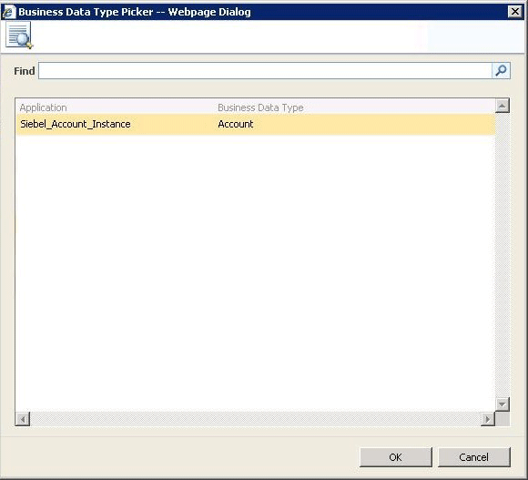

# Step 3: Create a SharePoint Application to Retrieve Data from Siebel
  
  
 **Time to complete:** 15 minutes.  
  
 **Objective:** You must now take the application definition file you created by using the Business Data Catalog Definition Editor, and import it into Office SharePoint Server.  
  
## Prerequisites  
  
-   You should have created an application definition file, as described in [Step 2: Create an Application Definition File for Siebel Business Component Operations](../../adapters-and-accelerators/adapter-siebel/step-2-create-an-application-definition-file-for-siebel-business-component.md).  
  
-   The Microsoft Single Sign-on service must be running.  
  
## How to Create a SharePoint Application  
 Creating a SharePoint application involves the following steps:  
  
-   Create a single sign-on (SSO) application in SharePoint  
  
-   Create a Shared Services Provider (SSP)  
  
-   Import the application definition file  
  
-   Create a Web Part page, and add Web Parts  
  
## Creating an SSO Application in SharePoint  
 To access the data in a Siebel system from a SharePoint application, you must set up an SSO application that maps a SharePoint user to a Siebel user. Creating an SSO application in SharePoint involves the following steps:  
  
1.  **Manage server settings for single sign-on**. In this step, you specify a user account that can manage and set up the single sign-on service. You can do so from the Manage Server Settings page. This option is available from the SharePoint Central Administration console. For more information about this step, refer to the “Configure Single Sign-On for Office SharePoint Server 2007” section at [http://go.microsoft.com/fwlink/?LinkId=105291](http://go.microsoft.com/fwlink/?LinkId=105291).  
  
2.  **Manage settings for enterprise application definitions**. In this step, you configure the settings for the enterprise application definition. You can do so from the Manage Settings for Enterprise Application Definitions page. This option is available from the SharePoint Central Administration console.  
  
    1.  On Central Administration, on the top navigation bar, click **Operations**.  
  
    2.  On the Operations page, in the **Security Configuration** section, click  **Manage settings for single sign-on**.  
  
    3.  On the Manage Settings for Single Sign-On page, in the **Enterprise Application Definition Settings** section, click **Manage settings for enterprise application definitions**.  
  
    4.  On the Manage Enterprise Application Definitions page, provide values for the **Display name**, **Application name**, and the **Contact e-mail address** fields.  
  
        > [!IMPORTANT]
        >  For the **Application name** field, make sure you specify the same SSO application name that you specified for the **SecondarySsoApplicationId** variable while creating the application definition file, as described in [Step 2: Create an Application Definition File for Siebel Business Component Operations](../../adapters-and-accelerators/adapter-siebel/step-2-create-an-application-definition-file-for-siebel-business-component.md).  
  
    5.  Leave the other fields as default, and click **OK**.  
  
3.  **Manage account information for enterprise application definitions**. In this step, you enable individual users or groups to connect to an enterprise application from SharePoint. Essentially, in this step you map an individual user or group to a user in the LOB system. You also specify the credentials to connect to the LOB system. You can do so from Manage Account Information for Enterprise Application Definitions page. This option is available from the SharePoint Central Administration console. For more information about this step, refer to the “Manage account information for an enterprise application definition” section at [http://go.microsoft.com/fwlink/?LinkId=105291](http://go.microsoft.com/fwlink/?LinkId=105291).  
  
## Creating a Shared Services Provider  
 An SSP is a logical grouping of shared services and their supporting resources. You can create an SSP using the SharePoint Central Administration console.  
  
 You must define a Web site while creating an SSP. Remember the port number and the site address you create. You will import the Business Data Catalog application definition to this site.  
  
 For more information about creating an SSP, see "Chapter overview: Create and configure Shared Services Providers" at [http://go.microsoft.com/fwlink/?LinkId=105119](http://go.microsoft.com/fwlink/?LinkId=105119).  
  
## Importing the Application Definition File  
 You must now import the application definition file into the SSP.  
  
#### To import the application definition file  
  
1. Start SharePoint 3.0 Central Administration. Click **Start**, point to **All Programs**, point to **Microsoft Office Server**, and then click **SharePoint 3.0 Central Administration**.  
  
2. In the left navigation pane, click the name of the SSP to which you want to import the application definition.  
  
3. In the **Business Data Catalog** section, click **Import application definition**.  
  
4. On the Import Application Definition page that opens, browse to Siebel_Account.xml, select the file, and then click **Open**.  
  
5. Click **Import**.  
  
6. Click **OK**.  
  
   After importing the application, you can see your application by going to the **View Applications** link. Click the application name to see the entities in the application.  
  
## Creating Web Parts  
 You must now create Web Parts in your SharePoint site to view and manage the business data that will be extracted from the Siebel system. Web Parts are reusable components that can contain any kind of Web-based information, including analytical, collaborative, and database information.  
  
 In this tutorial, Web Parts are created for the method instances that were created in Business Data Catalog Definition Editor. Office SharePoint Server provides different kinds of Web Parts for specific use. For the Finder method instance, we will use the **Business Data List** Web Part. This Web Part enables you to specify a search expression to perform a query on the Account business component. For this tutorial, we call this the **Query Accounts** Web Part.  
  
 This section provides instructions to create these Web Parts. For more information about creating Web Parts, see the Microsoft Office SharePoint Server 2007 document ("Customize business data lists, Web Parts, and sites") at [http://go.microsoft.com/fwlink/?LinkId=104131](http://go.microsoft.com/fwlink/?LinkId=104131).  
  
 The Web Parts will be added to a single Web Part page. You must create a Web Part page before adding the Web Parts. For this tutorial, the Web Part page is called **Siebel Account**.  
  
### Creating a Web Part Page  
 This section provides instructions to create a Web Part page.  
  
##### To create a web part page  
  
1. Start SharePoint 3.0 Central Administration. Click **Start**, point to **All Programs**, point to **Microsoft Office Server**, and click **SharePoint 3.0 Central Administration**.  
  
2. In the left navigation pane, click the name of the SSP to which you want to import the application definition.  
  
3. On the Shared Services Administration page, from the top right-hand corner, click **Site Actions**, and then click **Create**.  
  
      
  
4. On the Create page, under the **Web Pages** section, click **Web Part Page**.  
  
5. In the New Web Part page, do the following:  
  
   1. In the **Name** field, specify a name for the page. For this tutorial, specify the name as `Siebel Account`.  
  
   2. Select the **Overwrite if file already exists** check box, if you want to overwrite old pages with the same name as the page you create.  
  
   3. In the **Layout** section, from the **Choose a Layout Template** box, select a layout for the Web Part page. For this tutorial, select **Full Page, Vertical**.  
  
   4. In **the Save Location** section, in the **Document Library** list, select **Form Templates**.  
  
   5. Click **Create**. The following figure shows a Web Part page after it is just created.  
  
         
  
      You must now add the different Web Parts to this page.  
  
### Adding a Business Data List Web Part  
 You must now add a Business Data List Web Part to the Web Part page. Using this Web Part, you will query the Account business component using a search expression. This Web Part corresponds to the Finder method instance (QueryAccount) you created in the Business Data Catalog Definition Editor.  
  
##### To add a Business Data List Web Part  
  
1.  In the **Siebel Account** page, in the **Header** section, click **Add a Web Part**.  
  
2.  In the **Add Web Parts** dialog box, in the **Business Data** section, select the **Business Data List** check box, and then click **Add**.  
  
       
  
3.  In the newly added Business Data List Web Part, click the **Open the tool pane** link.  
  
       
  
4.  The Business Data List tool pane opens in the right pane. In the **Business Data List** section, for the **Type** field, click the **Browse** button.  
  
       
  
5.  In the **Business Data Type Picker** dialog box, select the **Siebel_Account_Instance** application, and then click **OK**.  
  
       
  
6.  Expand the **Appearance** node, and in the **Title** field, specify a title for the Web Part. For this Web Part, specify **Account List**.  
  
7.  In the Business Data List tool pane, click **Apply**, and then click **OK**. The Business Data List Web Part now looks like the following:  
  
       
  
    > [!NOTE]
    >  You can also change the order in which the parameter columns appear. You can do so by clicking the **Edit View** link towards the right corner of the Web Part.  
  
8.  Click **Exit Edit Mode** from the top right corner of the page.  
  
## Next Steps  
 Test the SharePoint application by retrieving data from a Siebel system. See [Step 4: Test Your SharePoint Application](../../adapters-and-accelerators/adapter-oracle-ebs/step-4-test-your-sharepoint-application.md).  
  
## See Also  
 [Tutorial 1: Presenting Data From a Siebel System on a SharePoint Site](../../adapters-and-accelerators/adapter-siebel/tutorial-1-presenting-data-from-a-siebel-system-on-a-sharepoint-site.md)