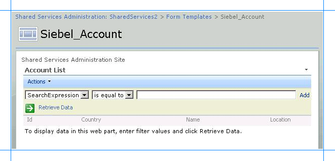

# Step 4: Test Your SharePoint Application with the Siebel adapter
  
  
 **Time to complete:** 5 minutes.  
  
 **Objective:** After you have added Web Parts in the SharePoint site and created an application, you must test the application by retrieving some data from the Siebel system. This section provides instructions on how to use the application to retrieve the data from the Siebel system.  
  
## Prerequisites  
 You should have created the Web Part page containing the appropriate Web Parts to retrieve business data. See [Step 3: Create a SharePoint Application to Retrieve Data from Siebel](../../adapters-and-accelerators/adapter-siebel/step-3-create-a-sharepoint-application-to-retrieve-data-from-siebel.md).  
  
### To test the SharePoint application  
  
1.  Start SharePoint 3.0 Central Administration. Click **Start**, point to **All Programs**, point to **Microsoft Office Server**, and then click **SharePoint 3.0 Central Administration**.  
  
2.  In the left navigation pane, click the name of the SSP under which you created the application.  
  
3.  In the left pane, click **View All Site Content**. From the right pane, click **Form Templates**.  
  
4.  In the **Form Category** list, click **Siebel Account**. You specified this name while creating the Web Part page. The following figure shows the Web Part page that you created.  
  
       
  
5.  Query the Account business component based on a search string. For example, specify the search expression `[Name] LIKE ‘W*’`. To do so:  
  
    1.  In the **Account List** section, from the first list, select **SearchExpression**, and then select **is equal to**.  
  
    2.  In the text field, type `[Name] LIKE ‘W*’`.  
  
    3.  Click **Retrieve Data** link, or press ENTER. The following figure shows the records retrieved from the Siebel system that satisfy the search criteria.  
  
           
  
## See Also  
 [Tutorial 1: Presenting Data From a Siebel System on a SharePoint Site](../../adapters-and-accelerators/adapter-siebel/tutorial-1-presenting-data-from-a-siebel-system-on-a-sharepoint-site.md)