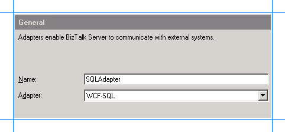

# Adding the SQL Adapter to BizTalk Server Administration Console
The [!INCLUDE[adaptersqlshort](../../includes/adaptersqlshort-md.md)] can be used in BizTalk either as a WCF-Custom port or a WCF-SQL port. If you want to use the [!INCLUDE[adaptersqlshort](../../includes/adaptersqlshort-md.md)] through a WCF-Custom port, you do not need to add the WCF-Custom port to the [!INCLUDE[btsBizTalkServerNoVersion](../../includes/btsbiztalkservernoversion-md.md)] Administration console because the WCF-Custom port is added to the [!INCLUDE[btsBizTalkServerNoVersion](../../includes/btsbiztalkservernoversion-md.md)] Administration console by default. However, if you want to use the [!INCLUDE[adaptersqlshort](../../includes/adaptersqlshort-md.md)] through a WCF-SQL port, you must first add the WCF-SQL adapter to the [!INCLUDE[btsBizTalkServerNoVersion](../../includes/btsbiztalkservernoversion-md.md)] Administration console.  
  
 This topic shows you how to add the WCF-SQL adapter to the [!INCLUDE[btsBizTalkServerNoVersion](../../includes/btsbiztalkservernoversion-md.md)] Administration console.  
  
> [!IMPORTANT]
>  You do not need to follow these steps if you want to configure a WCF-Custom port for the [!INCLUDE[adaptersqlshort](../../includes/adaptersqlshort-md.md)].  
  
## Add the SQL Adapter  
  
1. Open the [!INCLUDE[btsBizTalkServerNoVersion](../../includes/btsbiztalkservernoversion-md.md)] Administration console.  
  
2. Expand the **BizTalk Group**, expand **Platform Settings**, and then select **Adapters**.  
  
3. Right-click **Adapters**, point to **New**, and select **Adapter**.  
  
      
  
4. In the **Adapter Properties** dialog box, enter a name for the adapter, and from the **Adapter** list, select **WCF-SQL**.  
  
      
  
5. Select **OK**.  
  
## See Also  
 [Building blocks to develop BizTalk applications with the SQL adapter](../../adapters-and-accelerators/adapter-sql/building-blocks-to-develop-biztalk-applications-with-the-sql-adapter.md)