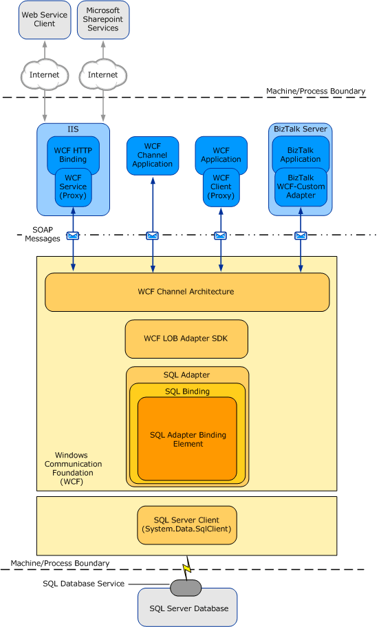
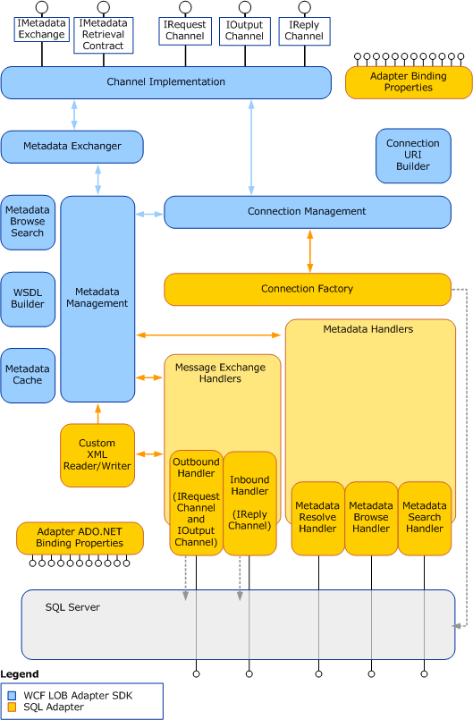

# Architecture overview of BizTalk Adapter for SQL Server
The [!INCLUDE[adaptersql](../../includes/adaptersql-md.md)] is a [!INCLUDE[firstref_btsWinCommFoundation](../../includes/firstref-btswincommfoundation-md.md)] custom binding. This binding contains a single custom transport binding element that enables communication with a SQL Server database. The [!INCLUDE[adaptersqlshort](../../includes/adaptersqlshort-md.md)] is wrapped by the [!INCLUDE[afproductnamelong](../../includes/afproductnamelong-md.md)] run time and is exposed to applications through the [!INCLUDE[nextref_btsWinCommFoundation](../../includes/nextref-btswincommfoundation-md.md)] channel architecture. The [!INCLUDE[adaptersqlshort](../../includes/adaptersqlshort-md.md)] communicates with the SQL Server database through ADO.NET.  

 The following figure shows the end-to-end architecture for solutions that are developed by using the [!INCLUDE[adaptersqlshort](../../includes/adaptersqlshort-md.md)].  
  
   

  
## Consuming the Adapter  
 The [!INCLUDE[adaptersqlshort](../../includes/adaptersqlshort-md.md)] exposes the SQL Server database as a [!INCLUDE[nextref_btsWinCommFoundation](../../includes/nextref-btswincommfoundation-md.md)] service to client applications. To perform operations and access data on the SQL Server database, client applications exchange SOAP messages with the [!INCLUDE[adaptersqlshort](../../includes/adaptersqlshort-md.md)] through [!INCLUDE[nextref_btsWinCommFoundation](../../includes/nextref-btswincommfoundation-md.md)] channels. The preceding figure shows four ways in which the [!INCLUDE[adaptersqlshort](../../includes/adaptersqlshort-md.md)] can be consumed.  
  
- **Through a [!INCLUDE[nextref_btsWinCommFoundation](../../includes/nextref-btswincommfoundation-md.md)] channel model application**. A [!INCLUDE[nextref_btsWinCommFoundation](../../includes/nextref-btswincommfoundation-md.md)] channel model application performs operations on the SQL Server database by using the [!INCLUDE[nextref_btsWinCommFoundation](../../includes/nextref-btswincommfoundation-md.md)] channel model to exchange SOAP messages directly with the [!INCLUDE[adaptersqlshort](../../includes/adaptersqlshort-md.md)]. See [Develop SQL applications using the WCF Channel Model](../../adapters-and-accelerators/adapter-sql/develop-sql-applications-using-the-wcf-channel-model.md).
  
- **Through a [!INCLUDE[nextref_btsWinCommFoundation](../../includes/nextref-btswincommfoundation-md.md)] service model application**. A [!INCLUDE[nextref_btsWinCommFoundation](../../includes/nextref-btswincommfoundation-md.md)] service model application calls methods on a [!INCLUDE[nextref_btsWinCommFoundation](../../includes/nextref-btswincommfoundation-md.md)] client to perform operations on the SQL Server database. A [!INCLUDE[nextref_btsWinCommFoundation](../../includes/nextref-btswincommfoundation-md.md)] client models the operations exposed by the [!INCLUDE[adaptersqlshort](../../includes/adaptersqlshort-md.md)] as .NET methods. You can use the [!INCLUDE[afproductnamelong](../../includes/afproductnamelong-md.md)] or the WCF ServiceModel Metadata Utility Tool (svcutil.exe) to create a [!INCLUDE[nextref_btsWinCommFoundation](../../includes/nextref-btswincommfoundation-md.md)] client class from metadata exposed by the [!INCLUDE[adaptersqlshort](../../includes/adaptersqlshort-md.md)].  See [Develop SQL applications using the WCF Service model](../../adapters-and-accelerators/adapter-sql/develop-sql-applications-using-the-wcf-service-model.md).
  
- **Through a BizTalk receive location or send port that is configured to use the Microsoft BizTalk WCF-Custom adapter**. The WCF-Custom adapter enables the use of [!INCLUDE[nextref_btsWinCommFoundation](../../includes/nextref-btswincommfoundation-md.md)] extensibility features. By using the WCF-Custom adapter you can select and configure the SQL DB Binding and the behavior for the receive location or send port. For more information about how to use the [!INCLUDE[adaptersqlshort](../../includes/adaptersqlshort-md.md)] in [!INCLUDE[btsBizTalkServerNoVersion](../../includes/btsbiztalkservernoversion-md.md)] solutions, see [Developing BizTalk Server Applications](../../core/developing-biztalk-server-applications.md). 
  
- **Through an IIS-hosted Web service**. In this scenario, a WCF service proxy generated by using the adapter is hosted in IIS using the standard WCF Http Binding. This exposes the service contract as a Web service to external users. IIS automatically hosts the adapter at run time, which, in turn, communicates with the SQL Server database.  
  
## The SQL Adapter and WCF  
 [!INCLUDE[nextref_btsWinCommFoundation](../../includes/nextref-btswincommfoundation-md.md)] presents a programming model based on the exchange of SOAP messages over channels between clients and services. These messages are sent between endpoints exposed by a communicating client and service. An endpoint consists of:  
  
- An *endpoint address*, which specifies the location at which messages are received.  
  
- A *binding*, which specifies the communication protocols used to exchange messages.  
  
- A *contract*, which specifies the operations and data types exposed by the endpoint.  
  
  A binding consists of one or more binding elements that stack on top of each other to define how messages are exchanged with the endpoint. At a minimum, a binding must specify the transport and encoding that are used to exchange messages with the endpoint. Message exchange between endpoints occurs over a channel stack that is composed of one or more channels. Each channel is a concrete implementation of one of the binding elements in the binding configured for the endpoint. 

The [WCF documentation](http://go.microsoft.com/fwlink/?LinkID=196850) includes more details about [!INCLUDE[nextref_btsWinCommFoundation](../../includes/nextref-btswincommfoundation-md.md)], and the [!INCLUDE[nextref_btsWinCommFoundation](../../includes/nextref-btswincommfoundation-md.md)] programming model.  
  
 The [!INCLUDE[adaptersql](../../includes/adaptersql-md.md)] exposes a [!INCLUDE[nextref_btsWinCommFoundation](../../includes/nextref-btswincommfoundation-md.md)] custom binding, the SQL DB Binding (**Microsoft.Adapters.SQLDB.SQLDBBinding**). By default, this binding contains a single custom transport binding element, the SQL DB Adapter Binding Element (**Microsoft.Adapters.SQLDB.SQLDBAdapter**), which enables operations on a SQL Server database.  
  
 **Microsoft.Adapters.SQLDB.SQLDBBinding** (the SQL DB Binding) and **Microsoft.Adapters.SQLDB.SQLDBAdapter** (the SQL DB Adapter Binding Element) are public classes and are also exposed to the configuration system. Because the SQL DB Adapter Binding Element is exposed publicly, you can build your own custom [!INCLUDE[nextref_btsWinCommFoundation](../../includes/nextref-btswincommfoundation-md.md)] bindings capable of extending the functionality of the [!INCLUDE[adaptersqlshort](../../includes/adaptersqlshort-md.md)]. For example, you could implement a custom binding to support Enterprise Single Sign-on (SSO) in a [!INCLUDE[nextref_btsWinCommFoundation](../../includes/nextref-btswincommfoundation-md.md)] channel or service model solution. The reasons for doing this would be to aggregate database operations into a single multifunction operation or to perform schema transformation between operations implemented by a custom application and operations on the SQL Server database.  
  
 The [!INCLUDE[adaptersqlshort](../../includes/adaptersqlshort-md.md)] is built on top of the [!INCLUDE[afproductnamelong](../../includes/afproductnamelong-md.md)], and runs on top of the [!INCLUDE[afproductnameshort](../../includes/afproductnameshort-md.md)] run time. The [!INCLUDE[afproductnameshort](../../includes/afproductnameshort-md.md)] provides a software framework and tooling infrastructure that the [!INCLUDE[adaptersqlshort](../../includes/adaptersqlshort-md.md)] uses to provide a rich set of features to users and adapter clients.  

## SQL adapter and the WCF LOB Adapter SDK
The [!INCLUDE[adaptersql](../../includes/adaptersql-md.md)] implements a set of core components that leverage functionality provided by the [!INCLUDE[afproductnamelong](../../includes/afproductnamelong-md.md)] and provide connectivity to the SQL Server database through ADO.NET.  
  
 The [!INCLUDE[afproductnameshort](../../includes/afproductnameshort-md.md)] serves as the software layer through which the [!INCLUDE[adaptersqlshort](../../includes/adaptersqlshort-md.md)] interfaces with the [!INCLUDE[firstref_btsWinCommFoundation](../../includes/firstref-btswincommfoundation-md.md)]; ADO.NET serves as the layer through which the [!INCLUDE[adaptersqlshort](../../includes/adaptersqlshort-md.md)] interfaces with the SQL Server database. The following figure shows the relationships between the internal components of the [!INCLUDE[adaptersqlshort](../../includes/adaptersqlshort-md.md)] and between these components and ADO.NET.  
  
   
 
   
## ADO.NET  
 The [!INCLUDE[adaptersqlshort](../../includes/adaptersqlshort-md.md)] connects with the SQL Server database through ADO.NET. ADO.NET provides consistent access to data sources such as SQL Server, and facilitates retrieval, handling, and modification of the data in the data sources. Read more about [ADO.NET](https://msdn.microsoft.com/library/e80y5yhx.aspx).
  
 The SQL client provides connectivity to the SQL Server database. You establish a connection to a SQL Server database by providing a connection URI to the [!INCLUDE[adaptersqlshort](../../includes/adaptersqlshort-md.md)]. This connection URI contains the name of the computer on which the SQL Server is installed and the name of the database. For more information about the connection URI, see [Create a connection to SQL Server](../../adapters-and-accelerators/adapter-sql/create-a-connection-to-sql-server.md).  
  
## See Also  

 [Understand BizTalk Adapter for SQL Server](../../adapters-and-accelerators/adapter-sql/understand-biztalk-adapter-for-sql-server.md)