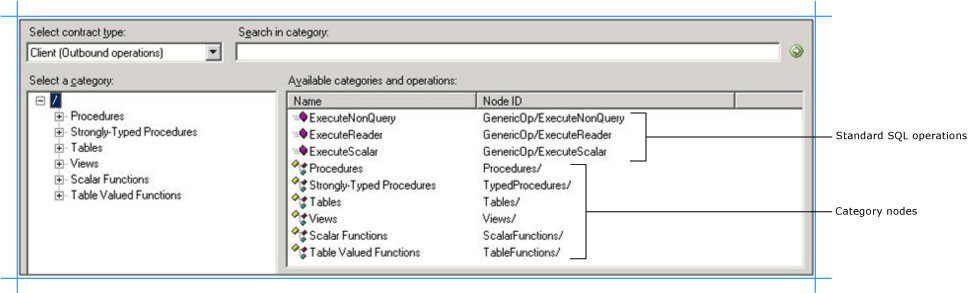
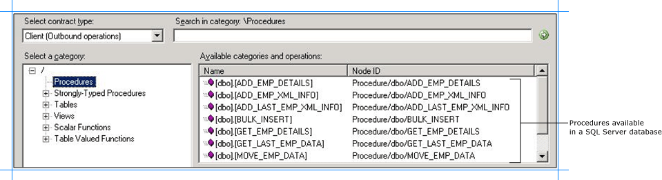
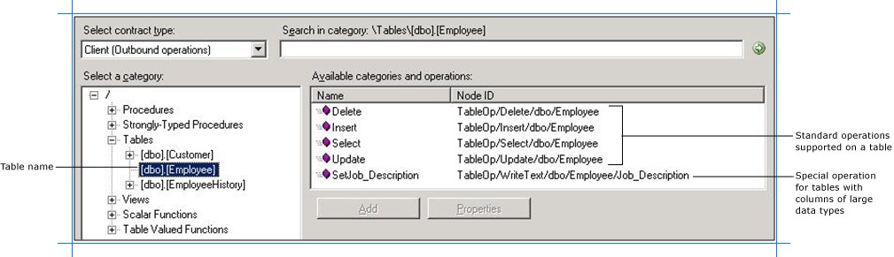
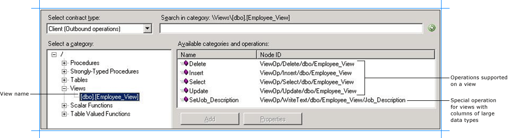
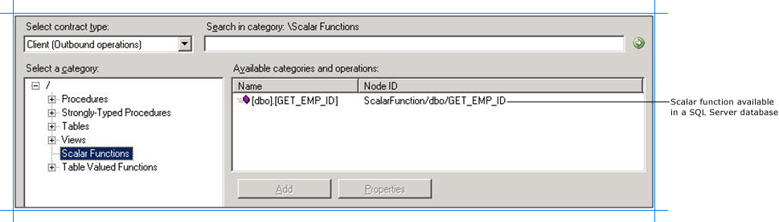
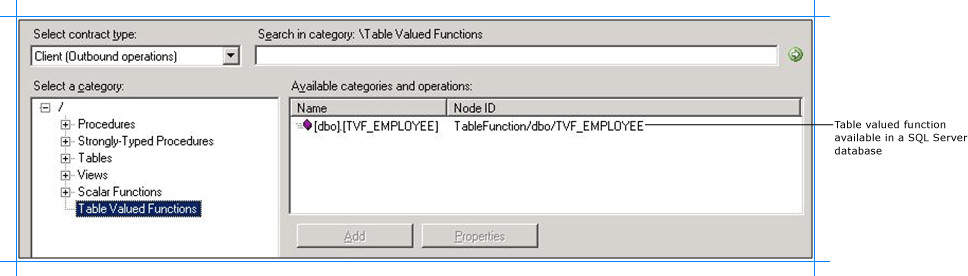
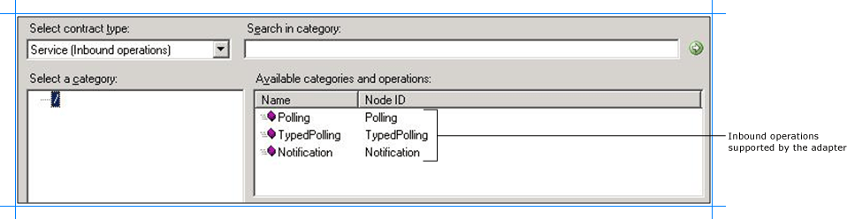
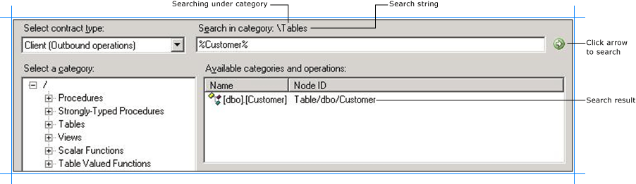
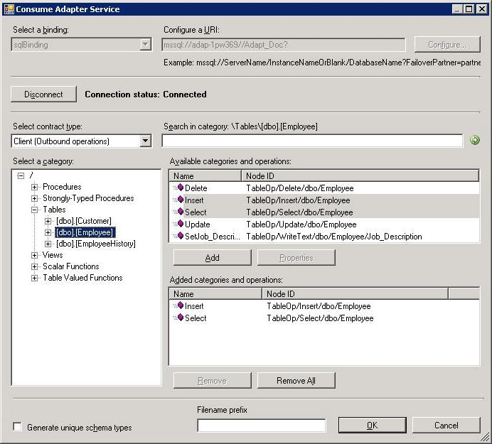
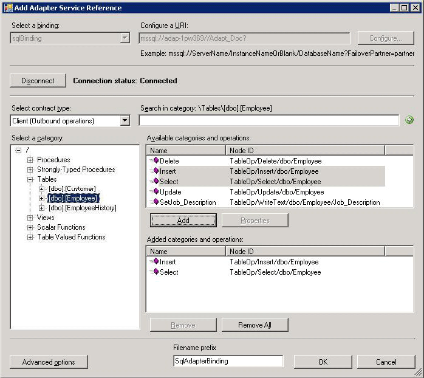

# Browse, search, and get metadata for SQL operations using the SQL adapter
This section provides information about how to use the [!INCLUDE[consumeadapterservlong](../../includes/consumeadapterservlong-md.md)], the [!INCLUDE[addadapterwiz](../../includes/addadapterwiz-md.md)], and the [!INCLUDE[addadapterservreflong](../../includes/addadapterservreflong-md.md)]. By using these [!INCLUDE[btsVStudioNoVersion](../../includes/btsvstudionoversion-md.md)] components, you can:  
  
- Browse for operations for which to retrieve metadata.  
  
- Search for operations for which to retrieve metadata.  
  
- Add message schemas for selected operations and port binding configuration files to a [!INCLUDE[btsBizTalkServerNoVersion](../../includes/btsbiztalkservernoversion-md.md)] project when using the [!INCLUDE[consumeadapterservshort](../../includes/consumeadapterservshort-md.md)].  
  
- Add a WCF client class or a WCF service contract (interface) for selected operations and a configuration file (app.config) to a non-BizTalk programming project when using the [!INCLUDE[addadapterservrefshort](../../includes/addadapterservrefshort-md.md)].  
  
> [!NOTE]
>  The [!INCLUDE[consumeadapterservshort](../../includes/consumeadapterservshort-md.md)], the [!INCLUDE[addadapterwiz](../../includes/addadapterwiz-md.md)], and the [!INCLUDE[addadapterservrefshort](../../includes/addadapterservrefshort-md.md)] present essentially the same interface when you browse and search for operations, so all three components are covered in the same topics.  
  
## Prerequisites  
 You must connect to SQL Server before you can browse, search, or retrieve metadata for target operations. For information about how to connect to SQL Server when you use the [!INCLUDE[consumeadapterservshort](../../includes/consumeadapterservshort-md.md)], the [!INCLUDE[addadapterwiz](../../includes/addadapterwiz-md.md)], or the [!INCLUDE[addadapterservrefshort](../../includes/addadapterservrefshort-md.md)], see [Connect to SQL Server in Visual Studio using the Consume Adapter Service Add-in](../../adapters-and-accelerators/adapter-sql/connect-to-sql-server-in-visual-studio-using-the-consume-adapter-service-add-in.md).  
  
## Browsing for Operations  
 You can use the [!INCLUDE[consumeadapterservshort](../../includes/consumeadapterservshort-md.md)], the [!INCLUDE[addadapterwiz](../../includes/addadapterwiz-md.md)], or the [!INCLUDE[addadapterservrefshort](../../includes/addadapterservrefshort-md.md)] to browse for outbound and inbound operations that can be performed on SQL Server using the [!INCLUDE[adaptersqlshort](../../includes/adaptersqlshort-md.md)].  
  
### Outbound Operations  
 The [!INCLUDE[adaptersqlshort](../../includes/adaptersqlshort-md.md)] enables clients to perform the following outbound operations.  
  
- Insert, Select, Update, and Delete operations on tables and views.  
  
- Set<column_name> operations on tables and views. This operation is exposed on tables that have columns of varchar(max), nvarchar(max), or varbinary(max). Such operations enable streaming of large objects.  
  
- Stored procedures, both weakly and strongly-typed as operations.  
  
- Scalar and table valued functions as operations.  
  
  The adapter also exposes the generic outbound operations such as **ExecuteReader**, **ExecuteScalar**, and **ExecuteNonQuery** at the root level.  
  
### Inbound Operations  
 The [!INCLUDE[adaptersqlshort](../../includes/adaptersqlshort-md.md)] enables clients to perform the following inbound operations.  
  
-   **Polling** operation to receive polling-based data-change messages from SQL Server. The messages received for this operation are not strongly typed.  
  
-   **TypedPolling** operation to receive polling-based data-change messages from SQL Server. The messages received for this operation are strongly typed.  
  
-   **Notification** operation to receive query notifications from SQL Server.  
  
> [!NOTE]
>  The adapter also supports an **XmlPolling** inbound operation to enable polling on SQL Server database using SELECT statements and stored procedures that contain a FOR XML clause. However, the adapter does not expose a specific inbound operation for this. For more information about XmlPolling, see [Receive polling messages using SELECT statements with FOR XML Clause from SQL using BizTalk Server](../../adapters-and-accelerators/adapter-sql/receive-polling-messages-using-select-with-for-xml-clause-with-the-sql-adapter.md).  
  
 For more information about these operations, see [Connect to an SAP system using the adapter](../../adapters-and-accelerators/adapter-sap/connect-to-an-sap-system-using-the-adapter.md).  
  
> [!NOTE]
>  By using the [!INCLUDE[consumeadapterservshort](../../includes/consumeadapterservshort-md.md)] or the [!INCLUDE[addadapterservrefshort](../../includes/addadapterservrefshort-md.md)], you can browse category and operation nodes using a Windows interface.  
  
 For more information about browsing metadata, see [Get metadata for SQL Server operations in Visual Studio using the SQL adapter](../../adapters-and-accelerators/adapter-sql/get-metadata-for-sql-server-operations-in-visual-studio-using-the-sql-adapter.md).  
  
##### To browse outbound operations on SQL Server  
  
1. Connect to SQL Server using the [!INCLUDE[consumeadapterservshort](../../includes/consumeadapterservshort-md.md)], [!INCLUDE[addadapterwiz](../../includes/addadapterwiz-md.md)], or the [!INCLUDE[addadapterservrefshort](../../includes/addadapterservrefshort-md.md)]. See [Connect to SQL Server in Visual Studio using the Consume Adapter Service Add-in](../../adapters-and-accelerators/adapter-sql/connect-to-sql-server-in-visual-studio-using-the-consume-adapter-service-add-in.md) for instructions.  
  
2. From the **Select contract type** list, for outbound operations select **Client (Outbound operations)**.  
  
3. The **Select a category** box lists the artifacts available in the SQL Server database you connect to. Click an artifact to view the operations available for that artifact in the **Available categories and operations** box.  
  
   > [!TIP]
   >  You can directly go to the “immediate” category node or subcategory nodes in the tree, by typing the name of the artifact, while the focus is on the tree view in the **Select a category** box. For example, to jump to the **Employee** table node, keep the focus on the **Tables** node, and then type `Employee`.  
  
    The following figure shows the [!INCLUDE[consumeadapterservshort](../../includes/consumeadapterservshort-md.md)]. The root node (/) is selected, and the general category nodes available under the root node are listed in the **Available categories and operations** box.  
  
      
  
   > [!NOTE]
   >  The standard SQL Server operations such as ExecuteReader, ExecuteScalar, and ExecuteNonQuery are also available at the root level. For more information about these operations, see [Support for ExecuteNonQuery, ExecuteReader, and ExecuteScalar Operations](../../adapters-and-accelerators/adapter-oracle-ebs/support-for-executenonquery-executereader-and-executescalar-operations.md).  
  
4. To see the procedures available in the SQL Server database, click the **Procedures** node. In the following figure, the **Procedures** node is selected in the **Select a category** box, and the corresponding procedures are listed in the **Available categories and operations box**.  
  
      
  
   > [!NOTE]
   >  The same set of procedures that are listed under the **Procedures** node are also available under the **Strongly-Typed Procedures** node. The difference is in the way schema is generated. For a procedure under the **Procedure** node, the schema is weakly typed. However, for a procedure under the **Strongly-Typed Procedure** node, the schema is strongly typed. Strongly-typed schema is useful if you want to map schema of one operation to another operation using BizTalk mapper because the schema is available to you at design-time while creating the BizTalk project. For weakly-typed procedures, the schema for the procedure is received at run time as part of the response message.  
  
5. To see the tables in the SQL Server database, click the **Tables** node. Alternatively, expand the **Tables** node.  
  
6. To see the operations supported on the table, click a table name.  
  
    The following figure shows a list of tables in the **Select a category** box. The **Available categories and operations** box lists the operations supported for a selected table.  
  
      
  
   > [!NOTE]
   >  If a SQL Server table contains columns of type varchar(max), nvarchar(max), and varbinary(max), the adapter also exposes a specific operation to update data in that column. The name of this operation is Set<column_name>. For example, if the table has a column “Job_Description” of type varchar(MAX), the name of the operation is “SetJob_Description”.  
  
7. To see the views in the SQL Server database, click the **Views** node. Alternatively, expand the **Views** node.  
  
8. To see the operations supported on the view, click a view name.  
  
    The following figure shows a list of views in the **Select a category** box. The **Available categories and operations** box lists the operations supported for a selected view.  
  
      
  
   > [!NOTE]
   >  If a view contains columns of type varchar(max), nvarchar(max), and varbinary(max), the adapter also exposes a specific operation to update data in that column. The name of this operation is Set<column_name>. For example, if the table has a column “Job_Description” of type varchar(max), the name of the operation is “SetJob_Description”.  
  
9. To see the list of scalar functions defined in the SQL Server database in the **Available categories and operations** box, click the **Scalar Functions** node.  
  
     In the following figure, the **Scalar Functions** node is selected in the **Select a category** box, and the corresponding functions are listed in the **Available categories and operations** box.  
  
       
  
10. To see the list of table valued functions defined in the SQL Server database in the **Available categories and operations** box, click the **Table Valued Functions** node.  
  
     In the following figure, the **Table Valued Functions** node is selected in the **Select a category** box, and the corresponding functions are listed in the **Available categories and operations** box.  
  
       
  
##### To browse inbound operations on SQL Server  
  
1. Connect to SQL Server using the [!INCLUDE[consumeadapterservshort](../../includes/consumeadapterservshort-md.md)], the [!INCLUDE[addadapterwiz](../../includes/addadapterwiz-md.md)], or the [!INCLUDE[addadapterservrefshort](../../includes/addadapterservrefshort-md.md)]. See [Connect to SQL Server in Visual Studio using the Consume Adapter Service Add-in](../../adapters-and-accelerators/adapter-sql/connect-to-sql-server-in-visual-studio-using-the-consume-adapter-service-add-in.md) for instructions.  
  
2. From the **Select contract type** list, for inbound operations, select **Service (Inbound operations)**.  
  
3. All the inbound operations supported by the [!INCLUDE[adaptersqlshort](../../includes/adaptersqlshort-md.md)] are available at the root node. Click the root node (/) to view the available inbound operations.  
  
      
  
## Searching for Operations  
 You can use the [!INCLUDE[consumeadapterservshort](../../includes/consumeadapterservshort-md.md)], the [!INCLUDE[addadapterwiz](../../includes/addadapterwiz-md.md)], or the [!INCLUDE[addadapterservrefshort](../../includes/addadapterservrefshort-md.md)] to search for specific artifacts in the SQL Server database. When searching SQL Server metadata, the [!INCLUDE[adaptersqlshort](../../includes/adaptersqlshort-md.md)]:  
  
- Supports wildcard and escape characters in the search expression.  
  
- Enables search immediately under the node at which the search operation is performed. For example, to search for a table, you must be searching under \Table. Multi-level search is not supported.  
  
  The following table lists the special characters that can be used for searching artifacts and their interpretation by the [!INCLUDE[adaptersqlshort](../../includes/adaptersqlshort-md.md)].  
  
|Special character|Interpretation|Example|  
|-----------------------|--------------------|-------------|  
|_ (underscore)|Matches exactly one character|“A_” matches AB, AC, AD.|  
|%|Matches zero or more characters|“A%” matches A, AB, AC.|  
|[ ]|-   Escapes the special meaning of % and _ -   Specifies a range or set of characters to be present|-   %[%]% matches all names that include a % symbol. -   [a-f] matches all names that have characters between (and including) ‘a’ and ‘f’. -   [abc] matches all names that have characters ‘a’, ‘b’, and ‘c’.|  
|[^]|Specifies a range or set of characters not to be present|-   [^a-f] matches all names that do not have characters between (and including) ‘a’ and ‘f’. -   [^abc] matches all names that do not have characters ‘a’, ‘b’, and ‘c’.|  
  
> [!NOTE]
>  Escape character is a character that is put in front of a wildcard character to indicate that the wildcard should be interpreted as a regular character and not as a wildcard.  
  
 For more information, see [Get metadata for SQL Server operations in Visual Studio using the SQL adapter](../../adapters-and-accelerators/adapter-sql/get-metadata-for-sql-server-operations-in-visual-studio-using-the-sql-adapter.md).  
  
 To search metadata in SQL Server using the [!INCLUDE[consumeadapterservshort](../../includes/consumeadapterservshort-md.md)], perform the following steps.  
  
#### To search metadata in SQL Server  
  
1. Connect to SQL Server using the [!INCLUDE[consumeadapterservshort](../../includes/consumeadapterservshort-md.md)], the [!INCLUDE[addadapterwiz](../../includes/addadapterwiz-md.md)], or the [!INCLUDE[addadapterservrefshort](../../includes/addadapterservrefshort-md.md)]. See [Connect to SQL Server in Visual Studio using the Consume Adapter Service Add-in](../../adapters-and-accelerators/adapter-sql/connect-to-sql-server-in-visual-studio-using-the-consume-adapter-service-add-in.md) for instructions.  
  
2. From the **Select contract type** list, select the type of contract based on whether you are searching for inbound or outbound operations.  
  
3. In the **Select a category** box, click the category node under which you want to search for a specific artifact. For example, to search for a table, click the **Tables** node.  
  
4. In the **Search in category** box, type a search expression to search for a specific artifact. For example, to search for tables that have "Customer" in their name, type `%Customer%`.  
  
   > [!NOTE]
   >  The search string is case-sensitive.  
  
5. To start the search, click the button with the right-arrow icon. After the search is complete, the **Available categories and operations** box lists the artifacts that satisfy the search criteria.  
  
    The following figure shows the SQL Server tables that contain “Customer” in their name.  
  
      
  
## Generating Schema for BizTalk Projects  
 You can use the [!INCLUDE[consumeadapterservshort](../../includes/consumeadapterservshort-md.md)] or the [!INCLUDE[addadapterwiz](../../includes/addadapterwiz-md.md)] to generate schema for selected SQL Server artifacts. Once you have browsed and searched for the artifacts you want to invoke, you can generate schema for those artifacts and send messages, conforming to the schema, to SQL Server.  
  
> [!NOTE]
>  You can select category nodes to return all the operations in that category's sub-tree—for example, you can select an entire table (to generate schema for all the operations in the table) or a select specific operations on a table (for example, Insert and Delete) to generate schema for only those operations on a table. For more information about the nodes, see [Metadata Node IDs](../../adapters-and-accelerators/adapter-sql/metadata-node-ids2.md).  
  
#### To generate schema for SQL Server artifacts  
  
1. Connect to SQL Server using the [!INCLUDE[consumeadapterservshort](../../includes/consumeadapterservshort-md.md)] or the [!INCLUDE[addadapterwiz](../../includes/addadapterwiz-md.md)]. See [Connect to SQL Server in Visual Studio using the Consume Adapter Service Add-in](../../adapters-and-accelerators/adapter-sql/connect-to-sql-server-in-visual-studio-using-the-consume-adapter-service-add-in.md) for instructions.  
  
   > [!IMPORTANT]
   >  To generate schema for performing operations using [!INCLUDE[btsBizTalkServerNoVersion](../../includes/btsbiztalkservernoversion-md.md)] you must set the **EnableBizTalkCompatibilityMode** binding property to **True**. You must set this binding property while establishing a connection to the SQL Server database.  
  
2. From the **Select contract type** list, select the type of contract based on whether you are generating schema for inbound or outbound operations.  
  
3. Click the category node for which you want to generate metadata. For example, if you want to generate metadata for a table, click **Tables**.  
  
4. Expand the category node, and select the specific item within that node for which you want to generate metadata. For example, to generate metadata for operations on the “CustomerTable” table, expand the **Tables** node, and then click **CustomerTable**.  
  
5. In the **Available categories and operations** box, select the operations that you want to perform on SQL Server, and then click **Add**. The selected operations are listed in the **Added categories and operations** box. For example, to perform Insert and Select operations on the “CustomerTable” table, click the operation names, and then click **Add**.  
  
    The following figure shows the [!INCLUDE[consumeadapterservshort](../../includes/consumeadapterservshort-md.md)], which lists the selected operations.  
  
      
  
    If you want to generate schema for multiple operations, there may be some duplicate element definitions among these schema that may cause failure in compiling the BizTalk project. For example, consider a scenario where you generate schema for an operation “Op1”. The schema for “Op1” contains a parameter of data type “CT1”. After generating the schema for “Op1” you close the [!INCLUDE[consumeadapterservshort](../../includes/consumeadapterservshort-md.md)] and re-open it to generate schema for another operation “Op2”. Assume that “Op2” also contains a parameter of data type “CT1”. After you exit the [!INCLUDE[consumeadapterservshort](../../includes/consumeadapterservshort-md.md)] and compile the project, you will get compilation errors because the complex data type “CT1” is defined twice in different XSD files. In such situations, we recommend the following:  
  
   - Generate schema for all the operations in a single run of [!INCLUDE[consumeadapterservshort](../../includes/consumeadapterservshort-md.md)]. This ensures that the [!INCLUDE[consumeadapterservshort](../../includes/consumeadapterservshort-md.md)] generates only one definition for the complex data type “CT1”.  
  
   - If you want to generate schema for multiple operations across different runs of [!INCLUDE[consumeadapterservshort](../../includes/consumeadapterservshort-md.md)], make sure you select the **Generate unique schema types** check box, so that the generated XSD files contain unique namespaces for the complex data type “CT1”.  
  
6. Click **OK**. The schema file is saved with an .xsd extension at the same location as the BizTalk project.  
  
   > [!NOTE]
   >  If you are using the [!INCLUDE[consumeadapterservshort](../../includes/consumeadapterservshort-md.md)] to generate metadata for SQL Server artifacts, by default the files are created with a specific naming convention. The generated WSDL contains a **fileNameHint** annotation tag that includes the name that should be assigned to the XSD file. For example, a file name hint for a schema file for table operation follows the convention TableOperation.\<schema\>.\<tablename\>. If you want to customize the name of the generated XSD file, you can provide a prefix in the **Filename prefix** box. Finally, the name of an XSD file is arrived upon as Filename prefix + fileNameHint + unique integer (if required, to ensure that the filename is unique).  
   > 
   > [!NOTE]
   >  The [!INCLUDE[consumeadapterservshort](../../includes/consumeadapterservshort-md.md)] also creates a binding file (an XML file) containing the binding properties that you specified when generating the schema for an operation and the SOAP action to invoke the operation. You can import this binding file in the [!INCLUDE[btsBizTalkServerNoVersion](../../includes/btsbiztalkservernoversion-md.md)] Administration console to create a WCF-Custom port or a BizTalk SQL adapter port with the connection URI, binding properties, and the SOAP action set. For more information, see [Configure a physical port binding using a port binding file to use the SQL adapter](../../adapters-and-accelerators/adapter-sql/configure-a-physical-port-binding-using-a-port-binding-file-to-sql-adapter.md).
  
    You have successfully generated metadata for SQL Server artifacts. You can use the metadata to send messages to SQL Server to perform specific operations. See [Develop BizTalk applications using the SQL adapter](../../adapters-and-accelerators/adapter-sql/develop-biztalk-applications-using-the-sql-adapter.md) for more information about how to perform these operations.  
  
## Generating a WCF Client or WCF Service Contract Using the Add Adapter Service Reference Plug-in  
 You can use the [!INCLUDE[addadapterservrefshort](../../includes/addadapterservrefshort-md.md)] to generate either WCF client code for outbound operations or WCF service code for the inbound operations.  
  
#### To generate WCF client class or service contract for SQL Server operations  
  
1. In the [!INCLUDE[addadapterservrefshort](../../includes/addadapterservrefshort-md.md)], from the **Select contract type** drop-down list, select the type of contract based on whether you will be performing inbound or outbound operations.  
  
2. Browse or search for categories (such as a database table) or for the specific operations for which you want to generate a WCF client (or WCF service contract).   
   For example, to browse for the operations in the Employee table, in the **Select a category** box:  
  
   1.  Expand the root node (**/**) to see the categories under which the operations are surfaced for a SQL Server database.  
  
   2.  Under the root node, expand the **Tables** node to see the available tables.  
  
3. Click the **Employee** table node, and in the **Available categories and operations** box, select the operations or categories for which you want to generate a WCF client (or WCF service contract), and then click **Add**. The selected operations are listed in the **Added categories and operations** box.  
  
    The following figure shows the [!INCLUDE[addadapterservrefshort](../../includes/addadapterservrefshort-md.md)] with the Insert and Select operations for the Employee table selected.  
  
      
  
   > [!IMPORTANT]
   >  Depending on the outbound operations (or categories) that you select, more than one WCF client class may be generated. For more details, see [Generate a WCF Client or WCF Service Contract for SQL Server Artifacts](../../adapters-and-accelerators/adapter-sql/generate-a-wcf-client-or-wcf-service-contract-for-sql-server-artifacts.md).  
  
4. For most scenarios the default serialization options are sufficient; however, if needed, you can control several aspects about the code that is generated and the type of serializer that is used. To set these options:  
  
   1. Click **Advanced Options** to open the **Advanced Options** box.  
  
   2. In the **Advanced Options** box under **Choose options for generated proxy**, select the options that you want. For example, you can select whether asynchronous methods are generated for the WCF client or disable the generation of a configuration file.  
  
   3. Under **Serializer** select the serializer that should be used.  
  
      The following figure shows the **Advanced Options** box with the default selections (**Auto** is selected for the serializer and no other options are selected).  
  
        
  
      The options that you can configure in the **Advanced Options** box are equivalent to some of the options available when you use the ServiceModel Metadata Utility Tool (svcutil.exe). For more information about these options, see [ServiceModel Metadata Utility Tool (Svcutil.exe)](https://msdn.microsoft.com/library/aa347733.aspx). 
  
5. Click **OK**. The [!INCLUDE[addadapterservrefshort](../../includes/addadapterservrefshort-md.md)] saves the WCF client class (or WCF service interface) and helper code for the operations and categories that you have selected in your project directory. By default, a configuration file is also saved. Slightly different files are generated for inbound and outbound operations; for more information, see [Generate a WCF Client or WCF Service Contract for SQL Server Artifacts](../../adapters-and-accelerators/adapter-sql/generate-a-wcf-client-or-wcf-service-contract-for-sql-server-artifacts.md).  
  
   You can select any node that is listed in the **Available categories and operations** box. If you select a category node then all of the operations available under that node and its sub-nodes will be selected. For example, to generate a WCF client for all of the operations surfaced for the Employee table, you can select the Employee node.  
  
## See Also  
 [Get metadata for SQL Server operations in Visual Studio using the SQL adapter](../../adapters-and-accelerators/adapter-sql/get-metadata-for-sql-server-operations-in-visual-studio-using-the-sql-adapter.md)