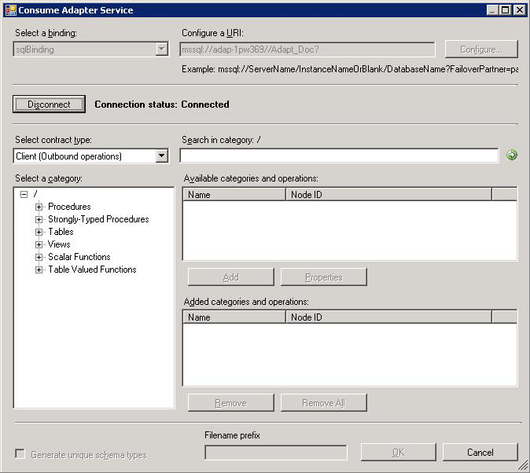

# Connect to SQL Server in Visual Studio Using Add Adapter Service Reference Plug-in
To connect to SQL Server using the [!INCLUDE[adaptersqlshort](../../includes/adaptersqlshort-md.md)] in a .NET programming solution, you must use the [!INCLUDE[addadapterservreflong](../../includes/addadapterservreflong-md.md)]. This topic provides instructions on how to use the [!INCLUDE[addadapterservrefshort](../../includes/addadapterservrefshort-md.md)].  

## Connecting to SQL Server Using Add Adapter Service Reference Plug-in  
 Perform the following steps to connect to SQL Server using the [!INCLUDE[addadapterservrefshort](../../includes/addadapterservrefshort-md.md)].  

#### To connect to SQL Server  

1. To connect using the [!INCLUDE[addadapterservrefshort](../../includes/addadapterservrefshort-md.md)] in a programming solution:  

   1. Create a project in [!INCLUDE[btsVStudioNoVersion](../../includes/btsvstudionoversion-md.md)].  

   2. Right-click the project in Solution Explorer, and then click **Add Adapter Service Reference**. The [!INCLUDE[addadapterservrefshort](../../includes/addadapterservrefshort-md.md)] opens.  

2. From the **Select a binding** drop-down list, select **sqlBinding**, and then click **Configure**.  

3. In the **Configure Adapter** dialog box, click the **Security** tab, and from the **Client credential  type** drop-down list, do one of the following:  

   > [!NOTE]
   >  If you are connecting to SQL Server using Windows Authentication, the Windows user with which you are logged in must be added to SQL Server as described in [Connect to SQL Server using Windows Authentication with the SQL adapter](../../adapters-and-accelerators/adapter-sql/connect-to-sql-server-using-windows-authentication-with-the-sql-adapter.md).  

   |  Click this  |                                                                                                                                                               To do this                                                                                                                                                               |
   |--------------|----------------------------------------------------------------------------------------------------------------------------------------------------------------------------------------------------------------------------------------------------------------------------------------------------------------------------------------|
   |   **None**   |                                                                                                                                         Connect to SQL Server by using Windows authentication.                                                                                                                                         |
   | **Windows**  |                                                                                                                                         Connect to SQL Server by using Windows authentication.                                                                                                                                         |
   | **Username** | Specify the user name and password to connect to SQL Server by specifying credentials for a user defined in SQL Server database. Note that the user name and password are case-sensitive. **Note:**  If you leave the **User name** and **Password** fields as blank, the adapter connects to SQL Server using Windows authentication. |

4. Click the **URI Properties** tab, and then specify values for the connection parameters. For more information about the connection URI for the [!INCLUDE[adaptersqlshort](../../includes/adaptersqlshort-md.md)], see [Create the SQL Server connection URI](../../adapters-and-accelerators/adapter-sql/create-the-sql-server-connection-uri.md).  

   > [!NOTE]
   >  If the connection parameters contain any reserved characters, you must specify them as-is in the **URI Properties** tab, that is, without using any escape characters. However, if you specify the URI directly in the **Configure a URI** field and the connection parameters contain reserved characters, you must specify the connection parameters using proper escape characters.  
   > 
   > [!NOTE]
   >  If you do not specify any values in the URI property tab, the [!INCLUDE[consumeadapterservshort](../../includes/consumeadapterservshort-md.md)] puts the URI as `mssql://.//`. In such a case, the adapter connects to the default database and the default database instance on the local computer.  

5. Click the **Binding Properties** tab, and then specify values for the binding properties, if any, required by the operations you want to target.  

6. Click **OK**.  

7. Click **Connect**. After the connection is established, the connection status is shown as **Connected**.  

    The following figure shows the [!INCLUDE[consumeadapterservshort](../../includes/consumeadapterservshort-md.md)] immediately after the connection is established. The graphical user interface is same for the [!INCLUDE[addadapterservrefshort](../../includes/addadapterservrefshort-md.md)].  

      

    The [!INCLUDE[addadapterservrefshort](../../includes/addadapterservrefshort-md.md)] displays different nodes containing various operations that can be performed on SQL Server. For example, the **Procedures** node contains all the procedures available for the database you connected to. Similarly, the **Tables** node contains all the tables in the database you connected to, and the operations that can be performed on a table. For more information about these nodes, see [Metadata Node IDs](../../adapters-and-accelerators/adapter-sql/metadata-node-ids2.md).  

## See Also  
 [Connect to SQL Server in Visual Studio using the Consume Adapter Service Add-in](../../adapters-and-accelerators/adapter-sql/connect-to-sql-server-in-visual-studio-using-the-consume-adapter-service-add-in.md)