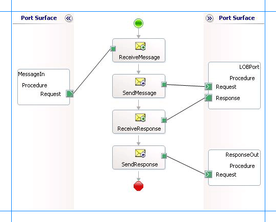

# Execute stored procedures in SQL Server using BizTalk Server
The [!INCLUDE[adaptersql](../../includes/adaptersql-md.md)] surfaces the procedures in SQL Server database as operations. Adapter clients can invoke the procedures by using the [!INCLUDE[adaptersqlshort](../../includes/adaptersqlshort-md.md)] with [!INCLUDE[btsBizTalkServerNoVersion](../../includes/btsbiztalkservernoversion-md.md)]. For more information about how the adapter supports these operations, see [Execute Stored Procedures in SQL Server using the SQL adapter](../../adapters-and-accelerators/adapter-sql/execute-stored-procedures-in-sql-server-using-the-sql-adapter.md). For information about the structure of the SOAP message for these operations, see [Message Schemas for Procedures and Functions](../../adapters-and-accelerators/adapter-sql/message-schemas-for-procedures-and-functions.md).  
  
 The [!INCLUDE[adaptersqlshort](../../includes/adaptersqlshort-md.md)] also enables adapter clients to invoke:  
  
-   Scalar functions in SQL Server database. See [Invoke Scalar Functions in SQL Server using BizTalk Server](../../adapters-and-accelerators/adapter-sql/invoke-scalar-functions-in-sql-server-using-biztalk-server.md).  
  
-   Table valued functions in SQL Server database. See [Invoke Table-Valued Functions in SQL Server using BizTalk Server](../../adapters-and-accelerators/adapter-sql/invoke-table-valued-functions-in-sql-server-using-biztalk-server.md).  
  
> [!NOTE]
>  If you are performing operation on tables that have columns of user-defined types, make sure you refer to [Operations on Tables and Views with User-Defined Types using the SQL adapter](../../adapters-and-accelerators/adapter-sql/operations-on-tables-and-views-with-user-defined-types-using-the-sql-adapter.md) before you start developing your application.  
  
## How to Invoke Procedures in SQL Server Database  
 Performing an operation on SQL Server database using the [!INCLUDE[adaptersqlshort](../../includes/adaptersqlshort-md.md)] with [!INCLUDE[btsBizTalkServerNoVersion](../../includes/btsbiztalkservernoversion-md.md)] involves procedural tasks described in [Building blocks to develop BizTalk applications with the SQL adapter](../../adapters-and-accelerators/adapter-sql/building-blocks-to-develop-biztalk-applications-with-the-sql-adapter.md). To invoke a procedure in SQL Server database, these tasks are:  
  
- Create a BizTalk project, and generate schema for the procedure you want to invoke in SQL Server database.  
  
- Create messages in the BizTalk project for sending and receiving messages to and from SQL Server database.  
  
- Create an orchestration to invoke the procedure in SQL Server database.  
  
- Build and deploy the BizTalk project.  
  
- Configure the BizTalk application by creating physical send and receive ports.  
  
- Start the BizTalk application.  
  
  This topic provides instructions to perform these tasks.  
  
## Sample Based on This Topic  
 A sample, ExecuteStoredProcedure, based on this topic is provided with the [!INCLUDE[adapterpacknoversion](../../includes/adapterpacknoversion-md.md)]. For more information, see [Samples for the SQL adapter](../../adapters-and-accelerators/adapter-sql/samples-for-the-sql-adapter.md).  
  
## Generating Schema  
 This topic demonstrates how to invoke a procedure, by invoking the ADD_EMP_DETAILS procedure. This procedure is created by running the scripts provided with the samples. The ADD_EMP_DETAILS procedure takes certain parameters, inserts a record into the EMPLOYEE table, and returns an employee ID for the inserted record. For information about the samples and the SQL scripts, see [Schema Samples](../../adapters-and-accelerators/accelerator-rosettanet/schema-samples.md).  
  
 To invoke the ADD_EMP_DETAILS procedure, it is necessary to generate schema for the same procedure. See [Retrieving Metadata for SQL Server Operations in Visual Studio using the SQL adapter](../../adapters-and-accelerators/adapter-sql/get-metadata-for-sql-server-operations-in-visual-studio-using-the-sql-adapter.md) for more information about how to generate schema.  
  
## Defining Messages and Message Types  
 The schema that you generated earlier describes the “types” required for the messages in the orchestration. A message is typically a variable, the type for which is defined by the corresponding schema. You must now create messages for the orchestration, and link them to schemas that you generated in the previous step.  
  
#### To create messages and link to schema  
  
1.  Add an orchestration to the BizTalk project. From Solution Explorer, right-click the BizTalk project name, point to **Add**, and then click **New Item**. Type a name for the BizTalk orchestration, and then click **Add**.  
  
2.  Open the Orchestration View window of the BizTalk project, if it is not already open. To do so, click **View**, point to **Other Windows**, and then click **Orchestration View**.  
  
3.  In Orchestration View, right-click **Messages**, and then click **New Message**.  
  
4.  Right-click the newly created message, and then select **Properties Window**.  
  
5.  In the **Properties** pane for the **Message_1**, do the following:  
  
    |Use this|To do this|  
    |--------------|----------------|  
    |Identifier|Type `Request`|  
    |Message Type|From the drop-down list, expand **Schemas**, and then select *ExecProcedure.Procedure_dbo.ADD_EMP_DETAILS*, where ExecProcedure is the name of your BizTalk project. Procedure_dbo is the schema generated for invoking the ADD_EMP_DETAILS procedure.|  
  
6.  Repeat step 2 to create a new message. In the **Properties** pane for the new message, do the following:  
  
    |Use this|To do this|  
    |--------------|----------------|  
    |Identifier|Type `Response`|  
    |Message Type|From the drop-down list, expand **Schemas**, and then select *ExecProcedure.Procedure_dbo.ADD_EMP_DETAILSResponse*.|  
  
## Setting up the Orchestration  
 You must create a BizTalk orchestration to use [!INCLUDE[btsBizTalkServerNoVersion](../../includes/btsbiztalkservernoversion-md.md)] for performing an operation on SQL Server. In this orchestration, you drop a request message at a defined receive location. The [!INCLUDE[adaptersqlshort](../../includes/adaptersqlshort-md.md)] consumes this message and passes it on to SQL Server. The response from SQL Server is saved to another location. You must include Send and Receive shapes to send messages to SQL Server and receive responses, respectively. A sample orchestration for invoking a procedure resembles the following:  
  
   
  
### Adding Message Shapes  
 Make sure you specify the following properties for each of the message shapes. The names listed in the Shape column are the names of the message shapes as displayed in the just-mentioned orchestration.  
  
|Shape|Shape Type|Properties|  
|-----------|----------------|----------------|  
|ReceiveMessage|Receive|-   Set **Name** to *ReceiveMessage*<br />-   Set **Activate** to *True*|  
|SendMessage|Send|-   Set **Name** to *SendMessage*|  
|ReceiveResponse|Receive|-   Set **Name** to *ReceiveResponse*<br />-   Set **Activate** to *False*|  
|SendResponse|Send|-   Set **Name** to *SendResponse*|  
  
### Adding Ports  
 Make sure you specify the following properties for each of the logical ports. The names listed in the Port column are the names of the ports as displayed in the orchestration.  
  
|Port|Properties|  
|----------|----------------|  
|MessageIn|-   Set **Identifier** to *MessageIn*<br />-   Set **Type** to *MessageInType*<br />-   Set **Communication Pattern** to *One-Way*<br />-   Set **Communication Direction** to *Receive*|  
|LOBPort|-   Set **Identifier** to *LOBPort*<br />-   Set **Type** to *LOBPortType*<br />-   Set **Communication Pattern** to *Request-Response*<br />-   Set **Communication Direction** to *Send-Receive*|  
|ResponseOut|-   Set **Identifier** to *ResponseOut*<br />-   Set **Type** to *ResponseOutType*<br />-   Set **Communication Pattern** to *One-Way*<br />-   Set **Communication Direction** to *Send*|  
  
### Specify Messages for Action Shapes, and Connect Them to Ports  
 The following table specifies the properties and their values that you should set to specify messages for action shapes and to link the messages to the ports. The names listed in the Shape column are the names of the message shapes as displayed in the orchestration mentioned earlier.  
  
|Shape|Properties|  
|-----------|----------------|  
|ReceiveMessage|-   Set **Message** to *Request*<br />-   Set **Operation** to *MessageIn.Procedure.Request*|  
|SendMessage|-   Set **Message** to *Request*<br />-   Set **Operation** to *LOBPort.Procedure.Request*|  
|ReceiveResponse|-   Set **Message** to *Response*<br />-   Set **Operation** to *LOBPort.Procedure.Response*|  
|SendResponse|-   Set **Message** to *Response*<br />-   Set **Operation** to *ResponseOut.Procedure.Request*|  
  
 After you have specified these properties, the message shapes and ports are connected and your orchestration is complete.  
  
 You must now build the BizTalk solution and deploy it to a [!INCLUDE[btsBizTalkServerNoVersion](../../includes/btsbiztalkservernoversion-md.md)]. For more information, see [Building and Running Orchestrations](../../core/building-and-running-orchestrations.md).
  
## Configuring the BizTalk Application  
 After you have deployed the BizTalk project, the orchestration you created earlier is listed under the Orchestrations pane in the [!INCLUDE[btsBizTalkServerNoVersion](../../includes/btsbiztalkservernoversion-md.md)] Administration console. You must use the [!INCLUDE[btsBizTalkServerNoVersion](../../includes/btsbiztalkservernoversion-md.md)] Administration console to configure the application. For a walkthrough, see [Walkthrough: Deploying a Basic BizTalk Application](Walkthrough:%20Deploying%20a%20Basic%20BizTalk%20Application.md).
  
 Configuring an application involves:  
  
- Selecting a host for the application.  
  
- Mapping the ports that you created in your orchestration to physical ports in the [!INCLUDE[btsBizTalkServerNoVersion](../../includes/btsbiztalkservernoversion-md.md)] Administration console. For this orchestration you must:  
  
  - Define a location on the hard disk and a corresponding file port where you will drop a request message. The BizTalk orchestration will consume the request message and send it to SQL Server database.  
  
  - Define a location on the hard disk and a corresponding file port where the BizTalk orchestration will drop the response message containing the response from SQL Server database.  
  
  - Define a physical WCF-Custom or WCF-SQL send port to send messages to SQL Server database. You must also specify the action in the send port. For information about how to create ports, see [Manually configure a physical port binding to the SQL adapter](../../adapters-and-accelerators/adapter-sql/manually-configure-a-physical-port-binding-to-the-sql-adapter.md).
  
    > [!NOTE]
    >  Generating the schema using the [!INCLUDE[consumeadapterservlong](../../includes/consumeadapterservlong-md.md)] also creates a binding file that contains information about the ports and the actions to be set for those ports. You can import this binding file from the [!INCLUDE[btsBizTalkServerNoVersion](../../includes/btsbiztalkservernoversion-md.md)] Administration console to create send ports (for outbound calls) or receive ports (for inbound calls). For more information, see [Configure a physical port binding using a port binding file to use the SQL adapter](../../adapters-and-accelerators/adapter-sql/configure-a-physical-port-binding-using-a-port-binding-file-to-sql-adapter.md).
  
## Starting the Application  
 You must start the BizTalk application for invoking procedures in SQL Server database. For instructions on starting a BizTalk application, see [How to Start an Orchestration](../../core/how-to-start-an-orchestration.md).
  
 At this stage, make sure:  
  
-   The FILE receive port to receive request messages for the orchestration is running.  
  
-   The FILE send port to receive the response messages from the orchestration is running.  
  
-   The WCF-Custom or WCF-SQL send port to send messages to SQL Server database is running.  
  
-   The BizTalk orchestration for the operation is running.  
  
## Executing the Operation  
 After you run the application, you must drop a request message to the FILE receive location. The schema for the request message must conform to the schema for the procedure you generated earlier. For example, the request message to invoke the GET_EMP_DETAILS is:  
  
```  
<ADD_EMP_DETAILS xmlns="mssql://Microsoft.LobServices.Sql/2008/01/Procedures/dbo">  
  <emp_name>John</emp_name>  
  <emp_desig>Developer</emp_desig>  
  <salary>100000</salary>  
</ADD_EMP_DETAILS>  
```  
  
 See [Message Schemas for Procedures and Functions](../../adapters-and-accelerators/adapter-sql/message-schemas-for-procedures-and-functions.md) for more information about the request message schema for invoking procedures in SQL Server database using the [!INCLUDE[adaptersqlshort](../../includes/adaptersqlshort-md.md)].  
  
 The orchestration consumes the message and sends it to SQL Server database. The response from SQL Server database is saved at the other FILE location defined as part of the orchestration. For example, the response from SQL Server database for the preceding request message is:  
  
```  
<?xml version="1.0" encoding="utf-8" ?>   
<ADD_EMP_DETAILSResponse xmlns="mssql://Microsoft.LobServices.Sql/2008/01/Procedures/dbo">  
  <ADD_EMP_DETAILSResult>  
    <DataSet xmlns="http://schemas.datacontract.org/2004/07/System.Data">  
      <xs:schema id="NewDataSet" xmlns:xs="http://www.w3.org/2001/XMLSchema" xmlns:msdata="urn:schemas-microsoft-com:xml-msdata">  
        <xs:element msdata:IsDataSet="true" name="NewDataSet">  
          <xs:complexType>  
            <xs:sequence>  
              <xs:element minOccurs="0" maxOccurs="unbounded" name="NewTable">  
                <xs:complexType>  
                  <xs:sequence>  
                    <xs:element minOccurs="0" name="Employee_ID" type="xs:int" />   
                  </xs:sequence>  
                </xs:complexType>  
              </xs:element>  
            </xs:sequence>  
          </xs:complexType>  
        </xs:element>  
      </xs:schema>  
      <diffgr:diffgram xmlns:diffgr="urn:schemas-microsoft-com:xml-diffgram-v1">  
        <NewDataSet xmlns="">  
          <NewTable>  
            <Employee_ID>10001</Employee_ID>   
          </NewTable>  
        </NewDataSet>  
      </diffgr:diffgram>  
    </DataSet>  
  </ADD_EMP_DETAILSResult>  
  <ReturnValue>0</ReturnValue>   
</ADD_EMP_DETAILSResponse>  
```  
  
 In the above response the `<Employee_ID>` element contains the employee ID for the inserted record.  
  
## Best Practices  
 After you have deployed and configured the BizTalk project, you can export configuration settings to an XML file called the binding file. Once you generate a binding file, you can import the configuration settings from the file, so that you do not need to create items such as send ports and receive ports for the same orchestration. For more information about binding files, see [Reuse adapter bindings](../../adapters-and-accelerators/adapter-sql/reuse-sql-adapter-bindings.md).
  
## See Also  
[Develop BizTalk applications using the SQL adapter](../../adapters-and-accelerators/adapter-sql/develop-biztalk-applications-using-the-sql-adapter.md)