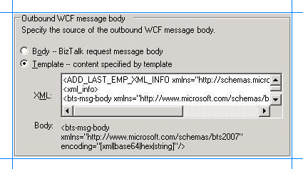

# Execute stored procedures with a single XML parameter in SQL Server using BizTalk Server
Executing a stored procedure that takes a single parameter is similar to executing any other stored procedure as described in [Execute Stored Procedures in SQL Server using BizTalk Server](execute-stored-procedures-in-sql-server-using-biztalk-server.md). However, for the approach described in the preceding link, you need to generate metadata for the stored procedure at design time and create an orchestration to invoke the procedure at run time.  
  
 Consider a scenario where you just want to pass one single value to a stored procedure without doing any processing on that value. In such cases, you don't want the overhead of generating metadata, creating an orchestration, deploying the orchestration, and executing the operation. Rather, you can configure a WCF-Custom or WCF-SQL send port to directly invoke the stored procedure. This topic demonstrates how to perform these tasks using the [!INCLUDE[btsBizTalkServerNoVersion](../../includes/btsbiztalkservernoversion-md.md)] Administration console.  
  
> [!NOTE]
>  This topic provides instructions on how to configure a WCF-Custom send port for executing stored procedure that takes a single parameter. You can perform the same steps by configuring a WCF-SQL port. For instructions on configuring WCF-SQL port, see [Configure a Port using the WCF-SQL Adapter](configure-a-port-using-the-wcf-sql-adapter.md).  
  
## Invoke stored procedures without orchestration  
 To demonstrate how to execute stored procedures with single parameters without an orchestration, this topic uses the ADD_LAST_EMP_XML_INFO stored procedure. This procedure takes an XML value as a parameter and inserts it into the **Address** column of the **Employee** table. You must have the XML value that you will pass to the stored procedure. However, to execute the stored procedure using the adapter, you must send a request message conforming to the schema of the procedure, and containing the XML value for the **Address** field, to the SQL Server. So, you must create that request message by:  
  
- Using the **Template** option in the send port configuration using which you can create a request message using a message template.  
  
- Putting the XML value for the **Address** field into the message.  
  
  All these steps are described in detail in this topic. You must perform the following set of tasks:  
  
1. Create a FILE receive port where you will drop the XML file that will be inserted into the **Address** XML field of the **Employee** table. Suppose this port is called **MessageIn** port.  
  
2. Create a WCF-Custom one-way send port that picks the XML file from the FILE receive port, constructs the message using the message template, and sends it to SQL Server to execute the stored procedure.  
  
   This part of the topic provides instructions on configuring a WCF-Custom send port with the message template.  
  
> [!NOTE]
>  Even though the information in this topic demonstrates how to execute a stored procedure with a single XML parameter, you can perform the tasks to perform any operation that takes a single parameter of any data type. The only difference will be in the way you create a message template for a specific operation. You can create a message template by taking the request message you would use to execute the operation using an orchestration and replacing the value of the parameter with the BizTalk message body.  
  
##  <a name="BKMK_OneWay"></a> Configure a WCF-Custom send port  
 Before creating the WCF-Custom send port, make sure you created the FILE receive port, **MessageIn**.  
  
1. Start the [!INCLUDE[btsBizTalkServerNoVersion](../../includes/btsbiztalkservernoversion-md.md)] Administration console.  
  
2. In the console tree, expand **BizTalk Group**, and then expand **Applications**.  
  
3. Expand the application under which you want to deploy the [!INCLUDE[adaptersqlshort](../../includes/adaptersqlshort-md.md)].  
  
4. Right-click **Send Ports**, point to **New**, and then point to **Static One-way Send Port**.  
  
5. In the **Send Port Properties** dialog box, on the **General** tab, type a name for the send port.  
  
6. Configure the port to receive all messages dropped at the FILE receive port, **MessageIn**.  
  
   1.  In the **Send Port Properties** dialog box, from the left pane, click **Filters**.  
  
   2.  In the right pane, under the **Property** column, click the grid, and then select **BTS.ReceivePortName** property.  
  
   3.  For the **Operator** column, select “**==**”.  
  
   4.  For the **Value** column, specify the name of the FILE receive port, `MessageIn`.  
  
7. In the **Send Port Properties** dialog box, on the **General** tab, from the **Type** drop-down list, select **WCF-Custom**, and then click **Configure**.  
  
8. In the **WCF-Custom Transport Properties** dialog box, do the following:  
  
   1. Click the **General** tab, and in the **Address (URI)** field, specify the connection URI for SQL Server. For more information about the connection URI, see [Create the SQL Server Connection URI](../../adapters-and-accelerators/adapter-sql/create-the-sql-server-connection-uri.md).  
  
   2. On the **General** tab, in the **Action** text box, type the action for the operation. See [Messages and message schemas](messages-and-message-schemas-for-biztalk-adapter-for-sql-server.md) for a list of actions for each operation. For example, the action to invoke the ADD_LAST_EMP_XML_INFO is:  
  
      ```  
      Procedure/dbo/ADD_LAST_EMP_XML_INFO  
      ```  
  
   3. Click the **Binding** tab, and from the **Binding Type** list, select **sqlBinding**. You can specify the different binding properties exposed by the [!INCLUDE[adaptersqlshort](../../includes/adaptersqlshort-md.md)]. For more information about binding properties, see [Read about the BizTalk Adapter for SQL Server adapter Binding Properties](../../adapters-and-accelerators/adapter-sql/read-about-the-biztalk-adapter-for-sql-server-adapter-binding-properties.md).  
  
   4. Click the **Credentials** tab, and then do one of the following:  
  
      -   Select the **Do not use Single Sign-On** option, and the specify the user name and password to connect to SQL Server. Note that the user name and password are case-sensitive.  
  
          > [!NOTE]
          >  If you want to connect to SQL Server using Windows authentication, specify a blank user name and password.  
  
      -   Select the **Use Single Sign-On** option, and then specify an affiliate Enterprise Single Sign-on (SSO) application.  
  
           For more information about security with respect to BizTalk Server, see [Security with the SQL adapter and BizTalk Server](../../adapters-and-accelerators/adapter-sql/security-with-the-sql-adapter-and-biztalk-server.md).
  
   5. Click the **Messages** tab, and in the **Outbound WCF message body** section, choose the **Template** option.  
  
   6. In the **XML** text box, specify the template that will be used to construct the WCF message. By doing so, you create a message that conforms to the ADD_LAST_EMP_XML_INFO operation for the WCF-based [!INCLUDE[adaptersqlshort](../../includes/adaptersqlshort-md.md)].  
  
         
  
       For the ADD_LAST_EMP_XML_INFO stored procedure, you must specify the following template:  
  
      ```  
      <ADD_LAST_EMP_XML_INFO xmlns="http://schemas.microsoft.com/Sql/2008/05/Procedures/dbo">  
      <xml_info>  
      <bts-msg-body xmlns="http://www.microsoft.com/schemas/bts2007" encoding="string"/>  
      </xml_info>  
      </ADD_LAST_EMP_XML_INFO>  
      ```  
  
      > [!IMPORTANT]
      >  The encoding in the message template must always be “string” irrespective of the type of the parameter for the operation that will be invoked using the send port. For example, the ADD_LAST_EMP_XML_INFO takes a parameter of type XML, but the encoding in the message template is string.  
      > 
      > [!NOTE]
      >  You can create this message template by copying the request message for the stored procedure and replacing the value within the <xml_info> tags with the BizTalk message body. You can get the request message for the stored procedure by generating the schema for the procedure using the [!INCLUDE[consumeadapterservshort](../../includes/consumeadapterservshort-md.md)], and then generating an instance of the schema to get the request XML.  
  
   7. To return to the **Send Port Properties** dialog box, click **OK**.  
  
9. From the **Send handler** list, select **BizTalkServerApplication**.  
  
10. From the **Send pipeline** list, select the pipeline that corresponds to **PassThruTransmit**.  
  
11. Click **OK**.  
  
## Start the Application  
 To start the BizTalk application, you can start both the FILE receive location and the WCF-Custom send port individually. You must now copy an XML file to the folder mapped to the FILE receive location. The BizTalk application consumes the file, and the XML value is inserted in the Address column of the Employee table. You can verify this by using a SQL Server client and selecting records from the Employee table.  
  
## Using a Two-way WCF-Custom Send Port  
 The instructions in this topic, under the section [How to Configure a WCF-Custom Send Port](../../core/how-to-configure-a-wcf-custom-send-port.md), demonstrate how to configure a one-way WCF-Custom send port to execute a stored procedure with a single parameter without using a BizTalk orchestration. However, in such a case, to verify whether the stored procedure is executed successfully you will have to verify in the SQL Server database whether the Address column in the Employee table is updated.  
  
 Instead, you can create a two-way WCF-Custom send port that also gets the response from SQL Server if the stored procedure is executed successfully. You must perform a few additional steps if you create a two-way WCF-Custom port. Note that you will still need a FILE receive location, as mentioned in the preceding instructions.  
  
1. Create a two-way WCF-Custom send port, for example, **ExecProcedure**. The steps to configure the send port are similar to those for the one-way send port. The only difference is that for the two-way port you must also specify a receive pipeline. Make sure you select **PassThruReceive** for the receive pipeline.  
  
2. Create a FILE send port. This port will drop the response message from the SQL Server database to a folder. Using the **Filters** tab of the port properties dialog box, configure the FILE send port to receive all response messages from the WCF-Custom send port.  
  
   1.  In the **Send Port Properties** dialog box, from the left pane, click **Filters**.  
  
   2.  In the right pane, under the **Property** column, click the grid, and then select **BTS.SPName** property.  
  
   3.  For the **Operator** column, select “**==**”.  
  
   4.  For the **Value** column, specify the name of the WCF-Custom send port, `ExecProcedure`.  
  
   Start all the three ports. Copy an XML file to the folder mapped to the FILE receive location. Look for the response in the folder mapped to the FILE send port.  
  
## See Also  
[Develop BizTalk applications using the SQL adapter](../../adapters-and-accelerators/adapter-sql/develop-biztalk-applications-using-the-sql-adapter.md)