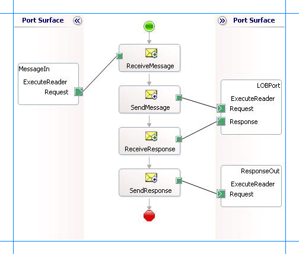

# ExecuteReader, ExecuteScalar, or ExecuteNonQuery Operations in SQL using BizTalk Server
The [!INCLUDE[adaptersqlshort](../../includes/adaptersqlshort-md.md)] exposes generic SQL Server operations such as **ExecuteNonQuery**, **ExecuteReader**, and **ExecuteScalar**. You can use these operations to execute any SQL statement on a SQL Server database. These operations differ based on the kind of response you get for the SQL statement. For more information about how the adapter supports these operations, see [Support for ExecuteNonQuery, ExecuteReader, and ExecuteScalar Operations](../../adapters-and-accelerators/adapter-oracle-ebs/support-for-executenonquery-executereader-and-executescalar-operations.md).  
  
 This topic demonstrates how to perform an **ExecuteReader** operation using the [!INCLUDE[adaptersqlshort](../../includes/adaptersqlshort-md.md)] with [!INCLUDE[btsBizTalkServerNoVersion](../../includes/btsbiztalkservernoversion-md.md)]. You can follow the same set of procedures described in this topic to perform **ExecuteNonQuery** and **ExecuteScalar** operations.  
  
## Prerequisites  
  
- Create a [strong-name key file, and learn the tools](prerequisites-to-create-sql-applications-using-the-sql-adapter.md)
  
- [Configure MSDTC](configure-msdtc-on-sql-server-and-adapter-client.md) on computers running the [!INCLUDE[adaptersqlshort](../../includes/adaptersqlshort-md.md)] and SQL Server.
  
## Invoke the ExecuteReader operation on a SQL Server Database  
 Performing an operation on a SQL Server database by using [!INCLUDE[adaptersqlshort](../../includes/adaptersqlshort-md.md)] with [!INCLUDE[btsBizTalkServerNoVersion](../../includes/btsbiztalkservernoversion-md.md)] involves procedural tasks described in [Building blocks to develop BizTalk applications with the SQL adapter](../../adapters-and-accelerators/adapter-sql/building-blocks-to-develop-biztalk-applications-with-the-sql-adapter.md). To invoke the **ExecuteReader** operation in SQL Server, these tasks are:  
  
1. Create a BizTalk project, and generate schema for the **ExecuteReader** operation.  
  
2. Create messages in the BizTalk project for sending and receiving messages from SQL Server.  
  
3. Create an orchestration to invoke the operation on SQL Server.  
  
4. Build and deploy the BizTalk project.  
  
5. Configure the BizTalk application by creating physical send and receive ports.  
  
6. Start the BizTalk application.  
  
   This topic provides instructions to perform these tasks.  
  
## Generate Schema  
 This topic demonstrates how to invoke **ExecuteReader** operation in SQL Server using the [!INCLUDE[adaptersqlshort](../../includes/adaptersqlshort-md.md)] with [!INCLUDE[btsBizTalkServerNoVersion](../../includes/btsbiztalkservernoversion-md.md)]. The **ExecuteReader** operation takes any SQL statement as a parameter and returns the result set for the operation as an array of DataSet. This topic shows how to execute the ADD_EMP_DETAILS stored procedure using the **ExecuteReader** operation. This stored procedure adds a record to the Employee table and returns the ID for the newly added employee. The tables and stored procedures used in the topic are created by running the scripts provided with the samples. For more information about the script, see [Samples for the SQL adapter](../../adapters-and-accelerators/adapter-sql/samples-for-the-sql-adapter.md).  
  
 To demonstrate how to invoke **ExecuteReader** operation, schema is generated for the **ExecuteReader** operation. You must create a BizTalk project and use the [!INCLUDE[consumeadapterservshort](../../includes/consumeadapterservshort-md.md)] to generate the schema. See [Retrieving Metadata for SQL Server Operations in Visual Studio using the SQL adapter](../../adapters-and-accelerators/adapter-sql/get-metadata-for-sql-server-operations-in-visual-studio-using-the-sql-adapter.md) for more information about how to generate schemas.  
  
## Define Messages and Message Types  
 The schema that you generated earlier describes the “types” required for the messages in the orchestration. A message is typically a variable, the type for which is defined by the corresponding schema. Now, create messages for the orchestration and link them to schemas you generated in the previous step.  
  
1.  Add an orchestration to the BizTalk project. From Solution Explorer, right-click the BizTalk project name, point to **Add**, and then click **New Item**. Type a name for the BizTalk orchestration, and then click **Add**.  
  
2.  Open the Orchestration View window of the BizTalk project, if it is not already open. To do so, click **View**, point to **Other Windows**, and then click **Orchestration View**.  
  
3.  In Orchestration View, right-click **Messages**, and then click **New Message**.  
  
4.  Right-click the newly created message, and then select **Properties Window**.  
  
5.  In the **Properties** pane for the **Message_1**, do the following:  
  
    |Use this|To do this|  
    |--------------|----------------|  
    |Identifier|Type `Request`|  
    |Message Type|From the drop-down list, expand **Schemas**, and then select *Execute_Reader.GenericOperation.ExecuteReader*, where Execute_Reader is the name of your BizTalk project. *GenericOperation* is the schema generated for the **ExecuteReader** operation.|  
  
6.  Repeat step 2 to create a new message. In the **Properties** pane for the new message, do the following:  
  
    |Use this|To do this|  
    |--------------|----------------|  
    |Identifier|Type `Response`|  
    |Message Type|From the drop-down list, expand **Schemas**, and then select *Execute_Reader.GenericOperation.ExecuteReaderResponse*.|  
  
## Set up the Orchestration  
 Create a BizTalk orchestration to use [!INCLUDE[btsBizTalkServerNoVersion](../../includes/btsbiztalkservernoversion-md.md)] for performing an operation on SQL Server. In this orchestration, you drop a request message at a defined receive location. The [!INCLUDE[adaptersqlshort](../../includes/adaptersqlshort-md.md)] consumes this message and passes it on to SQL Server. The response from SQL Server is saved to another location. You must include Send and Receive shapes to send messages to SQL Server and to receive responses, respectively. A sample orchestration for invoking an **ExecuteReader** operation resembles the following:  
  
   
  
### Add Message Shapes  
 Enter the following properties for each of the message shapes. The names listed in the Shape column are the names of the message shapes as displayed in the just-mentioned orchestration.  
  
|Shape|Shape Type|Properties|  
|-----------|----------------|----------------|  
|ReceiveMessage|Receive|-   Set **Name** to *ReceiveMessage*<br />-   Set **Activate** to *True*|  
|SendMessage|Send|-   Set **Name** to *SendMessage*|  
|ReceiveResponse|Receive|-   Set **Name** to *ReceiveResponse*<br />-   Set **Activate** to *False*|  
|SendResponse|Send|-   Set **Name** to *SendResponse*|  
  
### Add Ports  
 Make sure you specify the following properties for each of the logical ports. The names listed in the Port column are the names of the ports as displayed in the orchestration.  
  
|Port|Properties|  
|----------|----------------|  
|MessageIn|-   Set **Identifier** to *MessageIn*<br />-   Set **Type** to *MessageInType*<br />-   Set **Communication Pattern** to *One-Way*<br />-   Set **Communication Direction** to *Receive*|  
|LOBPort|-   Set **Identifier** to *LOBPort*<br />-   Set **Type** to *LOBPortType*<br />-   Set **Communication Pattern** to *Request-Response*<br />-   Set **Communication Direction** to *Send-Receive*|  
|ResponseOut|-   Set **Identifier** to *ResponseOut*<br />-   Set **Type** to *ResponseOutType*<br />-   Set **Communication Pattern** to *One-Way*<br />-   Set **Communication Direction** to *Send*|  
  
### Enter Messages for Action Shapes, and Connect Them to Ports  
 The following table specifies the properties and their values that you should set to specify messages for action shapes and to link the messages to the ports. The names listed in the Shape column are the names of the message shapes as displayed in the orchestration mentioned earlier.  
  
|Shape|Properties|  
|-----------|----------------|  
|ReceiveMessage|-   Set **Message** to *Request*<br />-   Set **Operation** to *MessageIn.ExecuteReader.Request*|  
|SendMessage|-   Set **Message** to *Request*<br />-   Set **Operation** to *LOBPort.ExecuteReader.Request*|  
|ReceiveResponse|-   Set **Message** to *Response*<br />-   Set **Operation** to *LOBPort.ExecuteReader.Response*|  
|SendResponse|-   Set **Message** to *Response*<br />-   Set **Operation** to *ResponseOut.ExecuteReader.Request*|  
  
 After you have specified these properties, the message shapes and ports are connected, and your orchestration is complete.  
  
 You must now build the BizTalk solution and deploy it to BizTalk Server. For more information, see [Building and Running Orchestrations](../../core/building-and-running-orchestrations.md).
  
## Configure the BizTalk Application  
 After you have deployed the BizTalk project, the orchestration you created earlier is listed under the Orchestrations pane in the [!INCLUDE[btsBizTalkServerNoVersion](../../includes/btsbiztalkservernoversion-md.md)] Administration console. You must use the [!INCLUDE[btsBizTalkServerNoVersion](../../includes/btsbiztalkservernoversion-md.md)] Administration console to configure the application. For more information about configuring an application, see [Walkthrough: Deploying a Basic BizTalk Application](Walkthrough:%20Deploying%20a%20Basic%20BizTalk%20Application.md).
  
 Configuring an application involves:  
  
- Selecting a host for the application.  
  
- Mapping the ports that you created in your orchestration to physical ports in the [!INCLUDE[btsBizTalkServerNoVersion](../../includes/btsbiztalkservernoversion-md.md)] Administration console. For this orchestration you must:  
  
  - Define a location on the hard disk and a corresponding file port where you will drop a request message. The BizTalk orchestration will consume the request message and send it to the SQL Server database.  
  
  - Define a location on the hard disk and a corresponding file port where the BizTalk orchestration will drop the response message containing the response from the SQL Server database.  
  
  - Define a physical WCF-Custom or WCF-SQL send port to send messages to the SQL Server database. You must also specify the action in the send port. For information about how to create ports, see [Manually configure a physical port binding to the SQL adapter](../../adapters-and-accelerators/adapter-sql/manually-configure-a-physical-port-binding-to-the-sql-adapter.md).
  
    > [!NOTE]
    >  Generating the schema using the [!INCLUDE[consumeadapterservlong](../../includes/consumeadapterservlong-md.md)] also creates a binding file that contains information about the ports and the actions to be set for those ports. You can import this binding file from the [!INCLUDE[btsBizTalkServerNoVersion](../../includes/btsbiztalkservernoversion-md.md)] Administration console to create send ports (for outbound calls) or receive ports (for inbound calls). For more information, see [Configure a physical port binding using a port binding file to use the SQL adapter](../../adapters-and-accelerators/adapter-sql/configure-a-physical-port-binding-using-a-port-binding-file-to-sql-adapter.md).
  
## Start the Application  
 Start the BizTalk application for invoking the **ExecuteReader** operation in the SQL Server database. For instructions on starting a BizTalk application, see [How to Start an Orchestration](../../core/how-to-start-an-orchestration.md).
  
 At this stage, make sure:  
  
-   The FILE receive port to receive request messages for the orchestration is running.  
  
-   The FILE send port to receive the response messages from the orchestration is running.  
  
-   The WCF-Custom or WCF-SQL send port to send messages to the SQL Server database is running.  
  
-   The BizTalk orchestration for the operation is running.  
  
## Execute the Operation  
 After you run the application, you must drop a request message to the FILE receive location. The schema for the request message must conform to the schema for the **ExecuteReader** operation you generated earlier. For example, the request message to invoke the ADD_EMP_DETAILS using an **ExecuteReader** operation is:  
  
```  
<ExecuteReader xmlns="http://schemas.microsoft.com/Sql/2008/05/GenericTableOp/">  
  <Query>EXEC ADD_EMP_DETAILS Tom,Manager,100000</Query>  
</ExecuteReader>  
```  
  
 See [Message Schemas for the ExecuteNonQuery, ExecuteReader, and ExecuteScalar Operations](../../adapters-and-accelerators/adapter-sql/executenonquery-executereader-and-executescalar-message-schemas-in-sql.md) for more information about the request message schema for invoking an **ExecuteReader** operation using the [!INCLUDE[adaptersqlshort](../../includes/adaptersqlshort-md.md)].  
  
> [!NOTE]
>  Within the `<Query>` tag, you can specify multiple SQL statements separated by a semi-colon.  
  
 The orchestration consumes the message and sends it to the SQL Server database. The response from the SQL Server database is saved at the other FILE location defined as part of the orchestration. The response for the **ExecuteReader** operation contains a result set as a DataSet array. For example, the response from the SQL Server database for the preceding request message is:  
  
```  
<?xml version="1.0" encoding="utf-8" ?>   
<ExecuteReaderResponse xmlns="http://schemas.microsoft.com/Sql/2008/05/GenericTableOp/">  
  <ExecuteReaderResult>  
    <DataSet xmlns="http://schemas.datacontract.org/2004/07/System.Data">  
      <xs:schema id="NewDataSet" xmlns:xs="http://www.w3.org/2001/XMLSchema" xmlns:msdata="urn:schemas-microsoft-com:xml-msdata">  
        <xs:element msdata:IsDataSet="true" name="NewDataSet">  
          <xs:complexType>  
            <xs:sequence>  
              <xs:element minOccurs="0" maxOccurs="unbounded" name="NewTable">  
                <xs:complexType>  
                  <xs:sequence>  
                    <xs:element minOccurs="0" name="Employee_ID" type="xs:int" />   
                  </xs:sequence>  
                </xs:complexType>  
              </xs:element>  
            </xs:sequence>  
          </xs:complexType>  
        </xs:element>  
      </xs:schema>  
      <diffgr:diffgram xmlns:diffgr="urn:schemas-microsoft-com:xml-diffgram-v1">  
        <NewDataSet xmlns="">  
          <NewTable>  
            <Employee_ID>10767</Employee_ID>   
          </NewTable>  
        </NewDataSet>  
      </diffgr:diffgram>  
    </DataSet>  
  </ExecuteReaderResult>  
</ExecuteReaderResponse>  
```  
  
 In the response, 10767 is the ID of the newly created employee.  
  
## Best Practices  
 After you have deployed and configured the BizTalk project, you can export configuration settings to an XML file called the binding file. Once you generate a binding file, you can import the configuration settings from the file, so that you do not need to create items such as the send ports and receive ports for the same orchestration. For more information about binding files, see [Reuse adapter bindings](../../adapters-and-accelerators/adapter-sql/reuse-sql-adapter-bindings.md).
  
## See Also  
[Develop BizTalk applications using the SQL adapter](../../adapters-and-accelerators/adapter-sql/develop-biztalk-applications-using-the-sql-adapter.md)